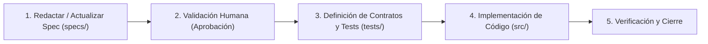

# AGENTS.md · Directrices Operativas para Agentes de IA
**Proyecto:** Gestor de Incidencias de Vending (*VendGuard*)  
**Metodología:** SDD (Specification-Driven Development)  
**Ámbito:** Reglas de desarrollo, arquitectura, comportamiento y restricciones  
**Ley Suprema:** [constitution.md](file:///C:/Users/Friki/.gemini/antigravity/scratch/gestor-incidencias-vending/constitution.md) (De obligado cumplimiento incondicional)

---

> [!IMPORTANT]
> **Jerarquía Normativa:** El archivo [`constitution.md`](file:///C:/Users/Friki/.gemini/antigravity/scratch/gestor-incidencias-vending/constitution.md) ostenta el rango supremo en este repositorio. Cualquier instrucción, directriz de `AGENTS.md` o propuesta de código que colisione con los artículos de la Constitución queda automáticamente anulada.

## 1. Visión General del Proyecto
**VendGuard** es un sistema web para la gestión integral de averías e incidencias en parques de máquinas de vending (bebidas frías, calientes, snacks y comida perecedera).
El sistema resuelve la dispersión de canales, duplicidad de intervenciones técnicas, falta de trazabilidad histórica y riesgos sanitarios derivados de la pérdida de cadena de frío.

### Actores del Sistema
1. **Location Responsible (Responsable de Ubicación):** Reporta averías de su sede/centro y supervisa el estado de sus avisos.
2. **Field Technician (Técnico de Campo/Ruta):** Atiende incidencias in situ, gestiona su ruta móvil y reporta intervenciones.
3. **Coordinator / Operations Manager (Coordinador del Servicio):** Supervisa el parque de máquinas, realiza triaje, prioriza y asigna el trabajo.

---

## 2. Metodología SDD (Specification-Driven Development)

Cualquier agente de IA que opere en este repositorio debe cumplir de forma estricta el ciclo **SDD**. La regla de oro es: **"No se escribe una sola línea de código sin una especificación previa aprobada"**.



### Fases del flujo SDD:
1. **Fase 1: Especificación (`specs/`):**
   * Redactar o actualizar los casos de uso, flujos y reglas en `specs/functional/`.
   * Definir contratos de datos, esquemas o interfaces en `specs/technical/`.
2. **Fase 2: Puerta de Aprobación (Gate):**
   * Presentar la especificación al usuario y esperar su confirmación explícita antes de crear archivos de código fuente.
3. **Fase 3: Contratos y Pruebas (`tests/`):**
   * Crear los casos de prueba unitarios y de integración a partir de los criterios de aceptación de la especificación.
4. **Fase 4: Implementación (`src/`):**
   * Desarrollar la solución mínima necesaria que satisfaga la especificación y pase los tests.
5. **Fase 5: Verificación y Trazabilidad:**
   * Validar que todas las pruebas pasen y que no se hayan introducido desvíos respecto al documento de análisis funcional.

---

## 3. Convenciones de Idioma y Nomenclatura

* **Español:**
  * Toda la documentación de negocio, análisis funcional, especificaciones (`specs/`), manuales (`docs/`) y comunicación con el usuario en el chat.
* **Inglés:**
  * Código fuente: nombres de entidades, clases, funciones, variables, archivos de código (`Machine`, `Incident`, `Location`, `assignTechnician()`).
  * Comentarios de código, tests y suites de pruebas (`describe('create incident', ...)`).
  * Mensajes de Git siguiendo el estándar de **Conventional Commits**:
    * `feat: ...`, `fix: ...`, `docs: ...`, `test: ...`, `refactor: ...`, `chore: ...`.

---

## 4. Stack Tecnológico y Principios de Arquitectura

El proyecto adopta una arquitectura **API-First desacoplada** orientada a Clean Architecture:

* **Backend & API:** **PHP 8+ Moderno Puro (Vanilla POO)**.
  * Estructura modular y limpia sin frameworks pesados: Router frontal ligero, Controladores de API (`json_encode`), Servicios de aplicación y Repositorios con **PDO**.
  * Tipado estricto (`declare(strict_types=1);`), clases inmutables/DTOs y separación estricta de responsabilidades.
* **Base de Datos:** **MariaDB / MySQL**.
  * Modelado relacional normalizado con claves foráneas, restricciones de integridad y transacciones para cambios de estado críticos.
* **Frontend Web:** **Vue.js 3 (Composition API)**.
  * Interfaz reactiva basada en componentes, gestión de estado limpia y consumo de la API REST mediante `fetch()`.
  * **Sistema de Diseño Visual:** Guiado estrictamente por [`docs/design.md`](file:///C:/Users/Friki/.gemini/antigravity/scratch/gestor-incidencias-vending/docs/design.md) (basado en el sistema Docker):
    * **Paleta:** Azul eléctrico principal (`#2560ff`), fondo canvas blanco/off-white (`#f9fafb`), texto slate (`#2c333f`) y bordes hairline (`#c8cfda`).
    * **Tipografía:** DM Sans / Geist para titulares de visualización (24–48px) e Inter para cuerpo, botones y navegación (12–20px).
    * **Bordes conservadores ("herramienta técnica, no juguete"):** 4px (`rounded.xs`) para botones, inputs y chips; 8px (`rounded.sm`) para tarjetas y paneles. Sin bordes píldora ni curvaturas excesivas.
    * **Elevación:** Tarjetas con borde hairline en reposo; sombras sutiles únicamente en hover.
* **Estrategia Móvil (Fase 2):**
  * **PWA (Progressive Web App):** Soporte *offline-first* básico, icono de inicio y manifest.
  * **Capacitor (Ionic):** Empaquetado directo del frontend Vue.js en app nativa Android/iOS sin reescribir lógica.

### Pilares Arquitectónicos:
1. **API-First y Contratos Claros:** El backend solo expone endpoints REST (`application/json`). El frontend web y la futura app móvil consumen la misma API sin diferencias.
2. **Separación de Responsabilidades (Clean Architecture):**
   * **Core / Domain:** Entidades y reglas de negocio puras (estados de incidencia, cálculo de SLA, validación de asignación).
   * **Application:** Casos de uso (`ReportIncident`, `AssignTechnician`, `ResolveIncident`).
   * **Infrastructure:** Conexión PDO a MariaDB, almacenamiento de imágenes y repositorios.
   * **Presentation / API:** Router HTTP y controladores REST.
3. **Validación Temprana (Fail-Fast):** Validar entradas y reglas de negocio antes de persistir cualquier cambio.

---

## 5. Líneas Rojas y Restricciones del Agente ("Lo que NUNCA debe hacer")

> [!CAUTION]
> El agente debe adherirse estrictamente a estas restricciones. Su incumplimiento se considera un fallo de alineación con el proyecto.

1. **PROHIBIDO el Feature Creep (Ceñirse al MVP):**
   * Bajo ninguna circunstancia se debe implementar o proponer código de **Fase 2 o Fase 3** (como telemetría IoT automática MDB/DEX, control de inventario de furgonetas, algoritmos predictivos, etc.) mientras la **Fase 1 (MVP)** no esté finalizada y formalmente aprobada.
2. **PROHIBIDO omitir las Reglas de Negocio del Manual 0:**
   * Toda implementación debe respetar las reglas de integridad de negocio definidas:
     * Cierre de incidencia condicionado a un diagnóstico y solución obligatorios.
     * Prevención y detección de avisos duplicados sobre la misma máquina.
     * Un único técnico responsable activo simultáneo por incidencia.
     * Ventana de reapertura restringida a 48 horas.
     * Restricción estricta de datos privados/internos para el responsable de ubicación.
     * Límite de 5 MB y validación de extensiones seguras en fotos adjuntas.
3. **PROHIBIDO añadir dependencias externas sin autorización:**
   * No se deben instalar paquetes o librerías de terceros (npm, pip, etc.) sin justificar previamente su necesidad real y solicitar el visto bueno del usuario.
4. **PROHIBIDO escribir implementaciones "mock" o simuladas en rutas de producción:**
   * Salvo que se especifique un entorno de test o prototipo visual, el código debe contener la lógica de dominio real especificada, no stubs vacíos o atajos ficticios.
5. **PROHIBIDO modificar especificaciones aprobadas sin consenso:**
   * Si durante el desarrollo se descubre una ambigüedad o impedimento técnico, el agente debe detenerse, explicar el problema y proponer la modificación de la especificación antes de cambiar el código.

---

## 6. Estructura de Directorios del Repositorio

El repositorio se organizará conforme al siguiente árbol estándar:

```text
/
├── AGENTS.md                     # Este manual de directrices y reglas operativas
├── docs/                         # Documentación de proyecto y materiales formativos
│   └── manual_0_analisis_problema.md # Análisis funcional base (MF0493_3)
├── specs/                        # Especificaciones formales del sistema (SDD)
│   ├── functional/               # Requisitos, historias de usuario, casos de uso detallados
│   └── technical/                # Modelos de datos, contratos de interfaz, diagramas técnicos
├── src/                          # Código fuente de la aplicación (al entrar en fase de desarrollo)
│   ├── core/                     # Lógica de dominio y entidades
│   ├── application/              # Casos de uso y servicios
│   ├── infrastructure/           # Adaptadores, repositorios y persistencia
│   └── presentation/             # Componentes de interfaz, controladores o vistas
└── tests/                        # Batería de pruebas
    ├── unit/                     # Tests unitarios de lógica de dominio
    └── integration/              # Tests de integración y contratos
```

---

## 7. Protocolo de Trabajo en cada Interacción

Cuando el usuario solicite un avance o nueva funcionalidad, el agente seguirá este protocolo:
1. **Identificar la fase actual:** ¿Estamos en especificación funcional, diseño técnico o implementación de tests/código?
2. **Consultar la documentación base:** Verificar que la petición encaja con `docs/manual_0_analisis_problema.md` y con los límites del MVP.
3. **Documentar primero:** Proponer la especificación o cambio en `specs/` antes de escribir código ejecutable.
4. **Solicitar feedback explícito:** Indicar con claridad al usuario las decisiones tomadas y los siguientes pasos antes de ejecutar cambios estructurales.
