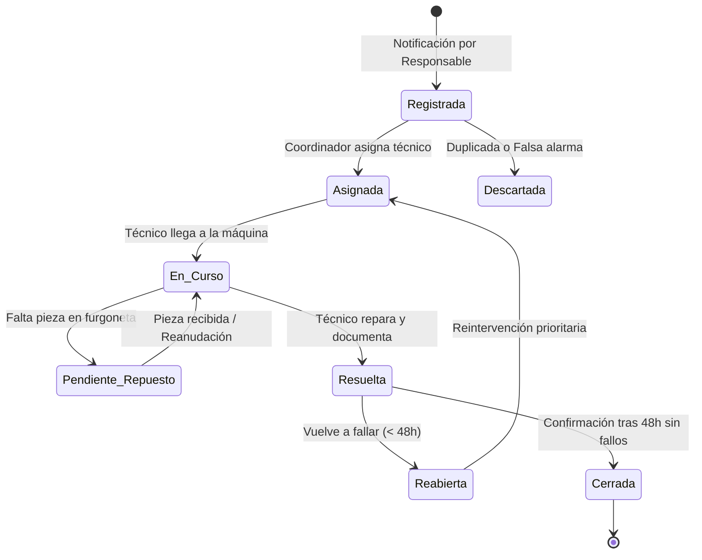

# PROYECTO FINAL · MANUAL 0
## GESTOR DE INCIDENCIAS: ANÁLISIS DEL PROBLEMA
**Módulo:** MF0493_3 · Implantación Web  
**Entorno de negocio:** Servicio técnico y mantenimiento de máquinas de Vending (*VendGuard*)  
**Metodología:** Preparatorio para SDD (Specification-Driven Development)  
**Autor:** Análisis funcional y modelado de requisitos  

---

## 1. La situación de partida

Una empresa de explotación y mantenimiento de máquinas de vending distribuye cientos de máquinas (bebidas calientes, refrescos, snacks y comida fresca) en oficinas, centros educativos, hospitales y naves industriales.

Actualmente, cuando una máquina falla (una espiral se atasca, el lector de tarjetas se desconfigura, o el refrigerador de sándwiches pierde temperatura), la comunicación es caótica:
* El conserje del centro llama por teléfono a un comercial.
* La recepcionista envía un correo electrónico general a atención al cliente.
* Algún empleado envía un mensaje de WhatsApp a un técnico que conoció en una visita anterior.

### Problemas concretos detectados:
1. **Falta de canal único y centralizado:** No hay un registro visible donde comprobar si una avería ya ha sido reportada o si alguien la está atendiendo.
2. **Duplicidad de esfuerzos:** Dos técnicos de ruta pueden acudir al mismo edificio a reparar la misma máquina sin saber que el otro ya estaba asignado o en camino.
3. **Pérdida de incidencias críticas:** Avisos urgentes (como rotura de frío en alimentos perecederos) quedan sepultados en bandejas de entrada mientras se atienden avisos menores.
4. **Falta de comunicación con el cliente/responsable:** La persona que avisó no sabe si el aviso ha sido recibido, si el técnico va en camino o si ya se ha solucionado, provocando llamadas reiteradas de seguimiento.
5. **Incapacidad de análisis histórico:** No se puede saber con certeza qué máquinas son las más problemáticas, qué modelos sufren más atascos de producto ni cuál es el tiempo medio de respuesta por zona geográfica.

---

## 2. Lo que sabemos

* **Distintas personas comunicarán incidencias:** En este modelo, los comunicadores principales serán los **responsables de ubicación** (recepción, conserjería o encargados del punto donde se ubica la máquina).
* **Alguien debe revisar, priorizar y distribuir el trabajo:** El **coordinador del servicio técnico** analiza la entrada de averías y las asigna según ruta, disponibilidad y gravedad.
* **Una incidencia es un proceso vivo:** Pasa por varios estados (desde que se detecta, se asigna al técnico, se interviene físicamente y se verifica la reparación).
* **Las partes interesadas necesitan visibilidad:** El responsable de la ubicación necesita saber el estado de su reporte sin necesidad de llamar por teléfono.
* **Se debe generar conocimiento operativo:** La empresa necesita registrar qué causó el fallo y cómo se solventó para prevenir averías repetitivas.

---

## 3. Lo que todavía no está decidido

En esta fase de análisis no se definen aún tecnologías, frameworks de programación, esquemas SQL de base de datos ni librerías de interfaz. 

El presente documento define **las necesidades reales, las reglas de negocio, los actores y el flujo de información**, garantizando que el diseño posterior responda a problemas reales y no a suposiciones técnicas prematuras.

---

## 4. El encargo: Objetivos del análisis

1. Identificar con precisión el impacto de los problemas de la situación actual.
2. Definir los perfiles de usuario, sus objetivos y sus límites de acción.
3. Determinar qué datos son indispensables para resolver la avería sin necesidad de repreguntar.
4. Trazar el ciclo de vida completo de un aviso desde su emisión hasta su cierre.
5. Diseñar la distribución funcional de pantallas y zonas de la aplicación.
6. Establecer reglas de negocio para impedir estados incoherentes o conflictos operativos.
7. Priorizar los requisitos para una primera versión útil y operativa (MVP).

---

## 5. Analizar a las personas usuarias

| Persona o perfil | Qué necesita conseguir | Qué debería poder consultar | Qué debería poder modificar |
| :--- | :--- | :--- | :--- |
| **Responsable de Ubicación** *(Conserje, recepcionista, encargado del centro)* | Notificar rápidamente una avería en una máquina de su centro y saber cuándo vendrán a solucionarlo para informar a los usuarios de su edificio. | • El listado de máquinas instaladas en su sede. • El estado de las incidencias reportadas por él/ella. • El tiempo estimado o confirmación de resolución de sus avisos. | • Crear nuevos avisos de avería. • Aportar detalles adicionales o fotos si el problema persiste. • Solicitar reapertura en las primeras 48h si la máquina sigue sin funcionar tras la visita. |
| **Técnico de Campo / Ruta** *(Técnico especialista de mantenimiento)* | Saber qué averías tiene asignadas en su jornada, dónde están las máquinas, qué repuestos o herramientas necesitará y poder cerrar los partes de trabajo desde el móvil. | • Lista de incidencias asignadas ordenadas por prioridad y proximidad. • Ficha de la máquina: modelo, ubicación exacta (planta/ala) e historial de averías recientes. • Detalles y fotos aportadas por el informador. | • Cambiar el estado de la incidencia a *En Curso* (al llegar a la máquina) o *Pausada* (a la espera de repuesto). • Registrar el diagnóstico real y la acción correctora realizada. • Marcar la avería como *Resuelta*. |
| **Coordinador / Administrador** *(Responsable de operaciones y servicio técnico)* | Asegurar que ninguna avería quede desatendida, optimizar las rutas de los técnicos, cumplir con los tiempos de respuesta y detectar máquinas defectuosas. | • Vista global de todas las máquinas y todas las incidencias (activas e históricas). • Carga de trabajo y disponibilidad de cada técnico. • Tiempos medios de resolución y tipos de avería más recurrentes. | • Validar o reclasificar la prioridad/urgencia de una avería. • Asignar o reasignar incidencias a los técnicos. • Cancelar avisos duplicados o descartar falsas alarmas. • Cerrar definitivamente expedientes o gestionar el alta/baja de máquinas. |

---

## 6. Analizar la información

Cada dato solicitado tiene un propósito concreto en la operativa de campo:

| Información propuesta | Para qué serviría | Obligatoria u opcional | Quién podría verla |
| :--- | :--- | :--- | :--- |
| **Identificador de la máquina** *(Ej: VEND-042)* | Localizar de forma inequívoca el equipo dentro del inventario del parque de máquinas. | **Obligatoria** | Todos los perfiles |
| **Ubicación descriptiva** *(Edificio, planta, pasillo o sala)* | Evitar que el técnico pierda tiempo buscando la máquina dentro de instalaciones grandes (ej. un hospital o universidad). | **Obligatoria** *(precargada del inventario)* | Todos los perfiles |
| **Tipo / Categoría de avería** *(Atasco, Pago, Frío, Eléctrico, Otro)* | Permite clasificar la gravedad inmediatamente y que el técnico prepare las herramientas o repuestos adecuados. | **Obligatoria** | Todos los perfiles |
| **Descripción del problema** | Que el informador detalle los síntomas observados (ej. *"Se encendió una luz roja y no coge monedas de 1 euro"*). | **Obligatoria** | Todos los perfiles |
| **Fotografía del problema** | Constatar visualmente el carril atascado, pantalla de error o daño físico antes de acudir. | **Opcional** | Todos los perfiles |
| **Importe retenido / tragado (€)** | Saber si algún usuario final ha perdido dinero para coordinar su posterior reintegro. | **Opcional** | Responsable de ubicación y Coordinador |
| **Nivel de Urgencia** *(Baja, Media, Alta, Crítica)* | Ordenar la cola de trabajo del equipo técnico y prevenir riesgos sanitarios o pérdidas económicas. | **Obligatoria** *(sugerida por sistema y confirmada por coordinador)* | Todos los perfiles |
| **Técnico Asignado** | Fijar un único responsable operativo del ticket en cada momento. | **Obligatoria** *(a partir de la fase de análisis)* | Todos los perfiles |
| **Estado de la incidencia** | Saber exactamente en qué fase del ciclo de vida se encuentra el problema. | **Obligatoria** | Todos los perfiles |
| **Diagnóstico real y acción realizada** | Documentar qué pieza falló realmente y cómo se arregló para el historial técnico. | **Obligatoria** *(al resolver)* | Técnico y Coordinador |
| **Repuestos utilizados** | Conocer qué piezas se han gastado (motores, espirales, sensores) para reposición de furgoneta. | **Opcional** | Técnico y Coordinador |

---

## 7. Preguntas para orientar el análisis

### 1. ¿Todas las incidencias deberían tratarse con la misma urgencia?
**No.** En el negocio de vending, la urgencia debe categorizarse según el impacto operativo y sanitario:
* **Crítica (SLA < 3h):** Pérdida de refrigeración en máquinas con productos perecederos (sándwiches, ensaladas, lácteos) por riesgo de intoxicación alimentaria o rotura de stock, o parada total de máquina en puntos de gran afluencia.
* **Alta (SLA < 8h):** Fallo total en medios de pago (billetero y datáfono fuera de servicio; la máquina no puede vender nada).
* **Media (SLA < 24-48h):** Fallo parcial (un carril o espiral concreta atascada, pero el 90% restante de selecciones funciona).
* **Baja (SLA planificado):** Cuestiones cosméticas, iluminación tenue, ruidos leves o limpieza exterior.

### 2. ¿Cómo sabríamos que dos avisos describen el mismo problema?
* Cuando un responsable intente registrar una avería para una máquina que ya cuenta con una incidencia en estado *Registrada*, *Asignada* o *En curso*, el sistema mostrará una advertencia clara:
  > *"Atención: Ya existe la incidencia abierta #INC-108 para esta máquina. ¿Deseas aportar más detalles sobre la misma avería o se trata de un problema completamente distinto?"*
* El coordinador dispondrá además de una función para **vincular o unificar tickets duplicados** bajo un único expediente matriz.

### 3. ¿Qué ocurriría si falta información para poder continuar?
* La incidencia pasará al estado **"Pendiente de información"**.
* El sistema notificará al responsable del centro con una pregunta concreta (ej: *"¿Podría indicarnos si la máquina sigue encendida o no da ninguna señal eléctrica?"*).
* El tiempo de resolución (SLA) se pausará temporalmente hasta que el informador responda para no penalizar artificialmente la métrica del equipo técnico.

### 4. ¿Quién podría decidir que un caso ya está terminado?
* **El Técnico de campo** marca la incidencia como **"Resuelta"** en cuanto termina físicamente la reparación e introduce obligatoriamente qué intervención realizó.
* **El Coordinador o el propio Responsable de ubicación** pueden dar el **"Cierre definitivo"** tras verificar que la máquina sigue funcionando correctamente.

### 5. ¿Debería poder recuperarse una incidencia que parecía cerrada?
* **Sí, pero bajo una ventana de tiempo controlada (48 horas).**
* Si el técnico marca la avería como resuelta, pero el mismo día la máquina vuelve a fallar por la misma causa, el responsable puede pulsar en **"Reabrir incidencia"**, indicando que la avería persiste.
* Esto alerta de inmediato al coordinador de una "reincidencia" (lo cual penaliza la calidad técnica y prioriza una segunda revisión). Pasadas 48 horas, cualquier aviso posterior se registra como una incidencia nueva referenciando a la anterior en su histórico.

### 6. ¿Qué información no debería mostrarse a cualquier usuario?
* El **responsable de ubicación** no debe ver notas internas entre el coordinador y el técnico (ej: *"Este técnico va lento hoy"*, costes de piezas de recambio, o datos personales de teléfono privado del técnico).
* El responsable solo debe ver: estado, fecha de creación, fecha estimada de visita, técnico asignado (solo nombre) y resumen final de la solución aplicada.

---

## 8. Imaginar el recorrido de una incidencia

### Tabla detallada del ciclo de vida:

| Momento | Qué podría suceder | Quién interviene | Qué información cambia |
| :--- | :--- | :--- | :--- |
| **Inicio (Registro)** | El responsable detecta que la máquina no da cambio y registra el aviso desde el portal seleccionando la máquina. | Responsable de ubicación | Se genera un identificador (`#INC-XXX`), estado pasa a **Registrada**, se guarda fecha/hora exacta y nivel de urgencia inicial. |
| **Primer análisis (Triaje)** | El coordinador revisa los avisos entrantes, verifica que no sea duplicada y evalúa la ruta de los técnicos disponibles. | Coordinador de servicio | Estado pasa a **Asignada**, se asocia el `Técnico ID`, y se confirma la prioridad definitiva. |
| **Trabajo (Intervención)** | El técnico acude a las instalaciones, se posiciona frente a la máquina e inicia los trabajos de diagnóstico y desmontaje. | Técnico de campo | Estado cambia a **En Curso**. Si le falta un recambio específico, puede marcar temporalmente **Pendiente de repuesto**. |
| **Comunicación (Notificación)** | El sistema informa al responsable de ubicación de que el técnico ya está interviniendo la máquina de su edificio. | Sistema automático | Se actualiza la vista de seguimiento del cliente/responsable. |
| **Final (Resolución y Cierre)** | El técnico sustituye el componente averiado, realiza una prueba de venta con éxito y documenta lo realizado. Tras 48h sin reclamación, queda archivada. | Técnico de campo / Coordinador | Estado pasa a **Resuelta** (añadiendo diagnóstico y solución). Tras el periodo de cortesía pasa automáticamente a **Cerrada**. |

---

## 9. Pensar las pantallas

| Pantalla o zona | Quién la utilizaría | Qué permitiría hacer | Elementos principales |
| :--- | :--- | :--- | :--- |
| **Zona 1: Portal de Notificación de Averías** | Responsable de Ubicación | Comunicar una incidencia de forma guiada en menos de 2 minutos. | • Selector de sede/máquina (con foto de referencia y modelo). • Selector desplegable de síntoma/avería. • Área de texto para descripción. • Selector de archivo para adjuntar foto. • Casilla de "¿Ha tragado monedas?". • Botón destacado de "Enviar aviso". |
| **Zona 2: Seguimiento de mis Avisos** | Responsable de Ubicación | Consultar el estado de las averías abiertas en sus máquinas sin tener que llamar por teléfono. | • Listado de incidencias de su centro. • Badge visual de estado (*Registrada, Asignada, En curso, Resuelta*). • Fecha estimada o confirmación de resolución. • Botón "Reabrir incidencia" (visible solo 48h tras resolución). |
| **Zona 3: Panel de Control y Triaje (Dashboard)** | Coordinador | Gestionar la operativa global en tiempo real y asignar trabajo. | • Tabla interactiva con filtros por urgencia, zona geográfica y estado. • Alertas visuales de incidencias críticas o próximas a vencer SLA. • Desplegable rápido de asignación de técnico por fila. • Botón para unificar incidencias duplicadas. |
| **Zona 4: Vista Móvil de Trabajo ("Mi Ruta")** | Técnico de Campo | Gestionar sus partes de trabajo asignados del día desde el teléfono. | • Lista de tareas pendientes ordenadas por prioridad/ruta. • Datos de acceso a la máquina (planta, contacto del conserje). • Botón "Comenzar intervención" (*cambia a En Curso*). • Botón "Finalizar y Cerrar parte" con formulario obligatorio de solución aplicada. |
| **Zona 5: Ficha Histórica de Máquina** | Coordinador y Técnico | Consultar la vida útil y salud técnica del equipo. | • Datos del equipo (número de serie, fecha de instalación, modelo). • Línea temporal de todas las averías históricas. • Tasa de fallo y repuestos más consumidos. |

---

## 10. Detectar reglas y conflictos

Para evitar acciones incoherentes y garantizar la integridad del servicio, se establecen las siguientes reglas de negocio fundamentales:

1. **Regla de asignación única y concurrencia:** Una incidencia solo puede tener un único técnico asignado como responsable activo a la vez. Si el coordinador intenta reasignar un ticket que ya está *En curso*, el sistema exige confirmación previa para no solapar técnicos en el mismo lugar físico.
2. **Regla de integridad en el cierre:** Ningún técnico ni coordinador puede cambiar el estado de una incidencia a *Resuelta* sin rellenar de forma obligatoria el campo de texto: **"Diagnóstico y solución aplicada"** (con un mínimo de caracteres descriptivos). No se admiten cierres vacíos.
3. **Regla de prevención de duplicados activos:** Si se intenta crear un ticket para una máquina que ya tiene otra incidencia abierta no resuelta, el sistema obliga al usuario a confirmar si es una avería diferente o si desea anexar su comentario a la ya existente.
4. **Regla de protección de datos y notas internas:** La información visible para el responsable de ubicación está filtrada. Los costes económicos de piezas, teléfonos privados de los técnicos y comentarios marcados como *"Nota técnica interna"* quedan restringidos exclusivamente al perfil de Técnico y Coordinador.
5. **Regla de seguridad en subida de ficheros:** Los archivos adjuntos fotográficos quedan limitados a un tamaño máximo de 5 MB y únicamente formatos de imagen estándar (`.jpg`, `.jpeg`, `.png`, `.webp`). Queda terminantemente bloqueada la subida de ejecutables, scripts o documentos comprimidos.
6. **Regla de escalado automático por inactividad (SLA):** Si una incidencia de prioridad *Crítica* permanece en estado *Registrada* más de 60 minutos sin que ningún coordinador la asigne a un técnico, el sistema emite una alerta visual destacada en el panel de control y eleva un aviso urgente de supervisión.

---

## 11. Priorizar una primera versión (Plan de entregas)

| Imprescindible para empezar (Fase 1 - MVP) | Importante para una segunda fase (Fase 2) | Idea de ampliación futura (Fase 3) |
| :--- | :--- | :--- |
| • Formulario sencillo de reporte para el responsable de ubicación (seleccionar máquina, tipo de fallo, texto y foto opcional). | • Notificaciones automáticas por correo electrónico o SMS ante cambios de estado relevantes. | • Integración telemática IoT (protocolo MDB/DEX): la máquina reporta atascos y fallos de temperatura automáticamente. |
| • Panel central del Coordinador para listar, filtrar por urgencia, asignar técnico y cambiar estados. | • Gestión y descuento de inventario de repuestos gastados en la furgoneta del técnico. | • Optimización inteligente de rutas con GPS para los técnicos de campo según el tráfico y las averías abiertas. |
| • Vista adaptada a móvil para el Técnico con su lista de tareas del día y formulario de resolución obligatoria. | • Módulo de devolución económica o saldo a los usuarios a los que la máquina les retuvo dinero. | • Portal público con código QR adhesivo en la máquina para que el consumidor final pueda reportar averías directamente. |
| • Detección básica de incidencias duplicadas para la misma máquina. | • Métricas e informes de cumplimiento de tiempos de respuesta (SLA). | • Mantenimiento predictivo basado en algoritmos que anticipen el fallo de piezas según el número de ciclos de venta. |
| • Historial básico de incidencias registradas por cada máquina. | • Opción de pausar tickets en espera de piezas (*Pendiente de repuesto*). | • Firma digital del responsable de la ubicación en la pantalla del móvil del técnico al finalizar la reparación. |

---

## 12. Decisiones y dudas

| Decisión provisional | Motivo | Duda que todavía debemos resolver |
| :--- | :--- | :--- |
| El reporte lo realiza el responsable del centro (conserje/recepción) y no cualquier usuario anónimo. | Se evitan reportes falsos, quejas no constructivas o duplicidad masiva cuando una máquina falla en una zona concurrida. | ¿Qué ocurre en centros donde no hay conserje o el personal no está pendiente de la máquina? ¿Deberíamos prever un acceso rápido de cortesía? |
| Para cerrar un caso es obligatorio redactar la solución aplicada. | Evita cierres apresurados sin justificación y alimenta la base de datos de conocimiento para averías futuras. | ¿Deberíamos estandarizar las soluciones con un desplegable de causas comunes (ej: *Moneda atascada retirada*, *Reset de placa*, *Sustitución de motor*) para facilitar estadísticas? |
| Ventana de 48 horas para reabrir una incidencia. | Ofrece una garantía de servicio razonable al cliente si la máquina vuelve a fallar tras la marcha del técnico. | Si una incidencia se reabre, ¿debe volver a asignarse obligatoriamente al mismo técnico que la atendió o debe pasar primero por el coordinador? |
| Prioridad crítica automática para incidencias de refrigeración/temperatura. | La normativa sanitaria de conservación de alimentos perecederos es estricta; cualquier fallo de frío arruina el producto y entraña riesgo para la salud. | ¿El informador puede saber con certeza si la máquina ha perdido frío o solo nota que la bebida no está suficientemente fría? |

---

## 13. Evitar soluciones automáticas (Justificación del diseño)

Este diseño no traslada sin más la estructura de un software genérico de soporte técnico (tipo Jira o Zendesk), sino que responde a las peculiaridades del **servicio de vending**:

1. **La máquina física es el centro de todo:** En un helpdesk clásico de software, el ticket se asocia a un usuario o departamento. En vending, el activo central es **el equipo físico instalado en una ubicación geográfica**. Las personas informan, pero el problema vive en la máquina.
2. **Priorización basada en salud y producto, no solo en "molestias":** En IT una avería de prioridad máxima suele ser una caída de servidor. En vending, el riesgo sanitario por pérdida de cadena de frío en alimentos frescos es un factor crítico de negocio que condiciona el diseño de las prioridades.
3. **Movilidad real en campo:** El técnico de vending no trabaja sentado frente a una pantalla de ordenador; pasa el día conduciendo una furgoneta con piezas de recambio. Por ello, su pantalla debe ser extremadamente simple, vertical (smartphone) y orientada a acciones rápidas a pie de máquina.
