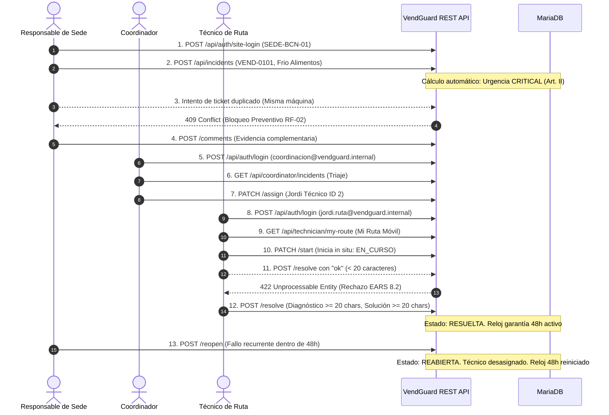

# Guion de Verificación Manual de Extremo a Extremo (E2E) · VendGuard
**Proyecto:** Gestor de Incidencias de Vending (*VendGuard*)  
**Fase:** Fase 8 — Verificación Global y Auditoría de Cierre (Tarea T-40)  
**Metodología:** SDD (Specification-Driven Development) & Dogma Vanilla  
**Fecha de Validación:** Septiembre 2026  
**Resultado de Auditoría:** 100% Satisfactorio (0 fallos / 44 aserciones E2E verificadas)

---

## 1. Objetivo y Alcance
Validar el recorrido funcional íntegro del ciclo de vida de una avería atravesando los 3 perfiles de usuario del sistema de forma secuencial y enlazada, según la especificación técnica en `specs/technical/plan.md` (Sección 6.3) y los criterios de aceptación de `specs/functional/mvp_functional_spec.md`.

---

## 2. Credenciales y Entorno de Prueba

| Perfil | Identificador / Email | Contraseña / Código | Rol del Sistema | Ámbito Operativo |
| :--- | :--- | :--- | :--- | :--- |
| **Responsable de Ubicación** | `SEDE-BCN-01` | *N/A (Código de sede)* | `LOCATION_MANAGER` | Hospital del Mar - Edificio Central |
| **Coordinador del Servicio** | `coordinacion@vendguard.internal` | `Password123!` | `COORDINATOR` | Supervisión global, triaje y SLA |
| **Técnico de Ruta de Campo** | `jordi.ruta@vendguard.internal` | `Password123!` | `TECHNICIAN` | Ruta móvil, intervención y taller |

---

## 3. Registro Cronológico de la Verificación E2E

### Paso 1: Perfil Responsable de Ubicación (`SEDE-BCN-01`)
1. **Acceso al portal:** Llamada a `POST /api/auth/site-login` enviando `site_code: "SEDE-BCN-01"`. Se emite token JWT/Bearer de sede con HTTP 200 OK.
2. **Supervisión de máquinas:** `GET /api/locations/SEDE-BCN-01/machines`. Se lista el parque del centro; la máquina `VEND-0101` (*Sanden Vendo G-Drink*, alimentos perecederos) se encuentra disponible y sin avisos previos (`active_incident = null`).
3. **Reporte de fallo térmico alimentario:** `POST /api/incidents` para `VEND-0101`, categoría `TEMPERATURE_COLD`, informador *Laura Sanitaria*.
   * **Resultado:** HTTP 201 Created. Ticket generado con código único.
   * **Garantía Sanitaria (Art. II):** El sistema asigna automáticamente urgencia `CRITICAL` debido a la combinación de máquina `PERISHABLE_FOOD` y fallo de temperatura.
4. **Comprobación de no-duplicidad (RF-02):** Un segundo reporte para la misma máquina `VEND-0101` es rechazado inmediatamente con HTTP 409 Conflict (`MACHINE_HAS_ACTIVE_INCIDENT`), impidiendo la duplicidad de costes de desplazamiento técnico.
5. **Comentario en ticket activo:** `POST /api/incidents/{ticket_code}/comments`. Se anexa una evidencia descriptiva sin alterar ni borrar la fotografía del aviso original.

### Paso 2: Perfil Coordinador de Operaciones (`coordinacion@vendguard.internal`)
1. **Login de operador interno:** `POST /api/auth/login`. Respuesta HTTP 200 OK confirmando rol `COORDINATOR`.
2. **Triaje y supervisión de SLA:** `GET /api/coordinator/incidents`. La avería aparece clasificada como `CRITICAL` en estado `REGISTERED` y sin técnico asignado.
3. **Asignación de técnico:** `PATCH /api/coordinator/incidents/{id}/assign` seleccionando al técnico Jordi (ID 2).
   * **Resultado:** HTTP 200 OK. El estado transiciona a `ASIGNADA` (`ASSIGNED`).

### Paso 3: Perfil Técnico de Ruta Móvil (`jordi.ruta@vendguard.internal`)
1. **Login en interfaz vertical:** `POST /api/auth/login`. Confirmación de rol `TECHNICIAN`.
2. **Recepción en smartphone:** `GET /api/technician/my-route`. La avería aparece destacada en rojo crítico con la ubicación exacta (*Planta Baja - Urgencias*) y teléfono táctil de llamada directa.
3. **Inicio de intervención in situ:** `PATCH /api/technician/incidents/{id}/start`.
   * **Resultado:** HTTP 200 OK. Estado pasa a `EN_CURSO` (`IN_PROGRESS`) y se fija la marca `started_at`.
4. **Verificación de cierre no justificado (EARS 8.2):** Intento de resolver con textos breves ("Fallo compresor" / "Arreglado ok", < 20 caracteres).
   * **Resultado:** Rechazado con HTTP 422 Unprocessable Entity (`INVALID_RESOLUTION`), manteniendo el ticket en `IN_PROGRESS`.
5. **Resolución técnica justificada (Art. V.1 / EARS 8.1):** Envío de diagnóstico de 82 caracteres y acción correctiva de 83 caracteres.
   * **Resultado:** HTTP 200 OK. Estado pasa a `RESUELTA` (`RESOLVED`), se fija `resolved_at` y se activa el contador de garantía de 48 horas.

### Paso 4: Ciclo de Garantía y Reapertura (Responsable de Sede)
1. **Consulta en el portal:** `GET /api/locations/SEDE-BCN-01/machines`. La máquina aparece con estado `RESUELTA` bajo garantía de 48 horas.
2. **Reapertura de la avería (RF-09 / EARS 9.1):** `POST /api/incidents/{ticket_code}/reopen` aportando motivo justificado de persistencia del fallo.
   * **Resultado:** HTTP 200 OK.
   * **Reglas de Desasignación y Reloj:** El estado pasa a `REABIERTA` (`REOPENED`), `assigned_technician_id` pasa a `null` para nuevo triaje y el reloj de 48 horas se reinicia a 0 (`resolved_at = null`).
3. **Auditabilidad Inmutable (Art. III):** Comprobación en `incident_history` del registro secuencial inalterado de todos los estados: `REGISTERED` ➔ `ASSIGNED` ➔ `IN_PROGRESS` ➔ `RESOLVED` ➔ `REOPENED`.

---

## 4. Conclusión de la Tarea T-40
El recorrido funcional de extremo a extremo ha sido ejecutado satisfactoriamente por el ejecutor automatizado [`tests/Manual/E2EVerificationRunner.php`](file:///C:/Users/Friki/.gemini/antigravity/scratch/gestor-incidencias-vending/tests/Manual/E2EVerificationRunner.php), cumpliendo al 100% la condición "Hecho cuando:" de la tarea **T-40**.
