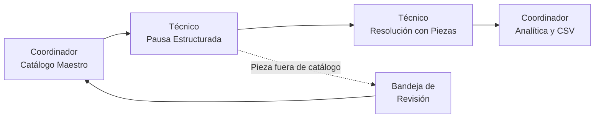

# MANUAL DE USUARIO · MÓDULO M2: CATÁLOGO DE REPUESTOS Y TRAZABILIDAD DE PIEZAS
**Proyecto:** Gestor de Incidencias de Vending (*VendGuard*)  
**Módulo:** `06-spare-parts` — Control Operativo y Taller (Opción B)  
**Documento:** `docs/manual_modulo_m2_repuestos.md`  
**Referencia Funcional:** [`specs/functional/spare_parts_spec.md`](../specs/functional/spare_parts_spec.md) (RF-REP-01 a RF-REP-10)  
**Sistema de Diseño Visual:** [`docs/design.md`](design.md) (Inspiración Docker: azul eléctrico `#2560ff`, radio conservador 4px/8px)  
**Fecha:** Septiembre 2026

---

## 1. Objetivo y Alcance

Este manual explica, para los dos perfiles operativos del módulo, cómo gestionar el **catálogo maestro de repuestos**, solicitar piezas al pausar una avería, registrar los componentes sustituidos al resolver, y consultar la **analítica de fallos y costes**.

Con este módulo se sustituye la anotación en texto libre por una selección estructurada de piezas homologadas, se congela el coste de cada pieza en el instante exacto de la intervención (*snapshot inmutable*, Artículo III de la Constitución) y se garantiza que los Responsables de Sede **jamás** accedan a datos de piezas, destinos de taller ni costes económicos (Artículo V.4).

---

## 2. Credenciales y Acceso al Módulo

| Perfil | Identificador / Email | Contraseña | Acceso al módulo |
| :--- | :--- | :--- | :--- |
| **Coordinador del Servicio** | `coordinacion@vendguard.internal` | `Password123!` | Pestañas `Repuestos` y `Analítica Repuestos` del panel de coordinación |
| **Técnico de Ruta** | `jordi.ruta@vendguard.internal` | `Password123!` | Botones de pausa y bloque de resolución en la vista móvil "Mi Ruta" |
| **Responsable de Sede** | `SEDE-BCN-01` (código de sede) | *N/A* | **Sin acceso a este módulo** (Art. V.4): su portal jamás muestra piezas, códigos, destinos ni costes |

---

## 3. Guía del Coordinador: Catálogo Maestro de Repuestos

Se accede desde el panel de coordinación, pestaña **"Repuestos"** (`activeTab = 'repuestos'`).

### 3.1 Buscar y filtrar piezas
La barra superior de la pestaña ofrece tres controles combinables:

1. **Buscador en tiempo real:** filtra por código (`VALV-SOL-01`), denominación o fabricante mientras se escribe. Placeholder: *"Buscar por código (ej: VALV-SOL-01), denominación o fabricante..."*
2. **Filtro por categoría técnica:** `Hidráulica y Presión`, `Térmico y Refrigeración`, `Electrónica y Control`, `Mecánica y Extracción`, `Sistemas de Pago`, `Consumibles y Juntas` y `Otros Componentes`.
3. **Filtro por modelo de máquina:** muestra únicamente las piezas compatibles con el modelo seleccionado (p. ej. *Bianchi Gaia Espresso*).
4. **Filtro por estado operativo:** Todas / Activas / Inactivas (baja lógica).

Si ningún resultado coincide con los filtros, la tabla muestra el aviso: *"No hay piezas que coincidan con los filtros aplicados o el término de búsqueda."*

### 3.2 Tabla del catálogo
Cada fila muestra: **código**, **denominación**, **fabricante**, **coste de referencia** (formato monetario español, ej. `28,50 €`), los **modelos compatibles** en distintivos (*badges*), el **estado operativo** y el botón de acción:

* **🚫 Desactivar** — *baja lógica* (`is_active = 0`). La pieza desaparece de los selectores de nuevas averías, pero su histórico y sus consumos registrados permanecen intactos (Art. III: nunca se borra físicamente). Mensaje de confirmación: *"Repuesto VALV-SOL-01 desactivado temporalmente (baja lógica)."*
* **▶️ Reactivar** — devuelve la pieza al catálogo activo: *"Repuesto VALV-SOL-01 reactivado con éxito en el catálogo."*

### 3.3 Alta de un nuevo repuesto
Pulse **"➕ Alta de Nuevo Repuesto en Catálogo"** y complete el formulario modal:

| Campo | Regla | Mensaje del sistema si falla |
| :--- | :--- | :--- |
| Código de pieza (`part_code`) | Alfanumérico único, 3–50 caracteres. **Inmutable tras el alta** para preservar la trazabilidad. | *"El código de repuesto es obligatorio (ej: VALV-SOL-01)."* / HTTP 409 si ya existe |
| Denominación técnica | 3–150 caracteres. | *"La denominación técnica del repuesto es obligatoria."* |
| Categoría técnica | Una de las 7 categorías del catálogo. | *"Debe seleccionar una categoría técnica válida."* |
| Fabricante | 2–100 caracteres. | Validación en servidor (capa de aplicación). |
| Coste de referencia (€) | Numérico, ≥ 0,00 €, con 2 decimales. | *"El coste de referencia debe ser un valor numérico mayor o igual a 0."* |
| Modelos compatibles | Al menos uno; selección múltiple precargada desde el parque + campo libre *"Añadir otro modelo no listado..."*. | *"Debe asociar al menos un modelo de máquina compatible."* |
| Observaciones | Opcional: tolerancias, números de serie alternativos, notas de instalación. | — |

Al guardar: *"Repuesto VALV-SOL-01 registrado en el catálogo maestro con éxito."*

### 3.4 Edición de un repuesto existente
El modal de edición permite modificar denominación, categoría, fabricante, coste de referencia, modelos compatibles y observaciones. El **código de pieza se muestra bloqueado** con la nota: *"El código es inmutable para preservar trazabilidad."* Al guardar: *"Repuesto {código} actualizado con éxito."*

> **Importante (RF-REP-02):** si una avería ya pausada tenía solicitada una pieza que después se desactiva, el técnico **podrá** seleccionarla al resolver esa avería concreta. La desactivación solo oculta la pieza para solicitudes nuevas.

---

## 4. Guía del Coordinador: Panel Analítico y Revisión de Piezas

Se accede desde la pestaña **"Analítica Repuestos"** (`activeTab = 'analitica-repuestos'`) o desde el botón **"Ir al panel analítico de consumos y averías crónicas"** dentro del catálogo.

### 4.1 Tarjetas KPI del período
Selector de período disponible: **30 días / 90 días / 180 días**.

| KPI | Qué mide |
| :--- | :--- |
| **Piezas Sustituidas** | Volumen total de unidades instaladas en el período (correctivos + preventivos). |
| **Coste Acumulado Piezas** | Gasto total en repuestos, calculado sobre los costes congelados (*snapshots*) de cada intervención. |
| **Alertas Fallos Crónicos** | Número de combinaciones máquina + pieza que superan 3 sustituciones en 90 días. |
| **Pendientes Revisión** | Piezas fuera de catálogo usadas en campo que esperan homologación. |

### 4.2 Alertas de fallo recurrente y crónico (RF-REP-08)
Cuando una misma **pieza** se sustituye **más de 3 veces en la misma máquina** dentro de una ventana móvil de 90 días, el panel muestra un banner de advertencia (ámbar `#f8b60f`; rojo en severidad crítica a partir de 5 sustituciones) con la máquina, el modelo, la sede, la pieza y el conteo: *"Componente con Fallo Recurrente (N sustituciones en X días)"*. Use esta alerta para negociar con el fabricante, adelantar la revisión preventiva de esa máquina o valorar el cambio de modelo.

### 4.3 Ranking de piezas más sustituidas
Tabla ordenable por volumen o por coste acumulado, con el **Desglose Destino Logístico** de cada pieza: unidades enviadas a **DESGUACE** (desecho) frente a **TALLER** (reacondicionamiento).

### 4.4 Bandeja de piezas fuera de catálogo pendientes de revisión
Listado de incidencias en las que el técnico utilizó una pieza no homologada (coste provisional 0,00 €), mostrando la justificación técnica redactada en campo, el técnico de campo y la máquina. Desde aquí pulse **"Dar de alta esta pieza en el catálogo maestro e iniciar homologación"** para crear el repuesto formal con su coste real; las futuras intervenciones ya lo ofertarán de forma estructurada.

### 4.5 Exportación a CSV (RF-REP-09)
El botón **"📥 Exportar Consumos (CSV)"** descarga el informe consolidado del período en formato plano (`text/csv; charset=utf-8`) con: fecha de intervención, código de ticket/orden, código y modelo de máquina, código de pieza, unidades, coste unitario congelado, coste total y destino del componente retirado.

---

## 5. Guía del Técnico: Pausa Estructurada por Repuesto (Móvil)

### 5.1 Cuándo usar la pausa
Cuando en una avería *En Curso*, pulse el botón **"⏸ Pausar repuesto"** (junto a "✓ Resolver avería"). Se abre el modal táctil de pausa, con el catálogo de piezas compatibles precargadas desde `/api/technician/spare-parts/catalog?machine_id={id}` (optimizado para responder en menos de 250 ms).

### 5.2 Modo "Pieza de catálogo"
1. El sistema muestra **solo las piezas activas y compatibles con el modelo específico de la máquina intervenida** (las incompatibles jamás aparecen).
2. Seleccione cada pieza y ajuste la **Cantidad** con los botones táctiles `+` / `−` (mínimo 44px de altura, operable a una mano).
3. Confirme la pausa. La avería pasa al estado **`PENDING_PARTS`** ("Pendiente de repuestos") y queda visible para el coordinador.

Mensajes de bloqueo posibles (HTTP 422): *"Debe seleccionar al menos un repuesto compatible del catálogo o indicar una pieza fuera de catálogo."* / *"El repuesto con código '{código}' no es compatible con el modelo de máquina '{modelo}'."* / *"La cantidad de unidades debe ser un número entero entre 1 y 50."*

### 5.3 Modo "Pieza fuera de catálogo"
Si el componente necesario no existe en el catálogo, active el conmutador **"Pieza fuera de catálogo"** y redacte la justificación técnica obligatoria (mínimo **20 caracteres**) describiendo el componente y su función. El contador de caracteres mantiene el botón de confirmación desactivado hasta alcanzar el mínimo reglamentario (*"Mínimo reglamentario: 20 caracteres"*).

> **Consecuencia:** la avería queda marcada para el Coordinador con la etiqueta de *"Revisión de Repuesto Requerida"* y aparecerá en su bandeja de homologación. Al resolver, la pieza no catalogada se registrará con coste provisional de **0,00 €**.

### 5.4 Reanudar y resolver con declaración de piezas
Al recibir la pieza, reanude la intervención (**Iniciar**) y resuelva:

1. **Pregunta obligatoria:** *"¿Durante esta intervención se instaló o reemplazó algún componente técnico en la máquina?"* con dos botones táctiles grandes:
   * **✅ Sí, hubo sustitución** → se despliega la lista dinámica de líneas de pieza.
   * **❎ No se cambiaron piezas** → la resolución sigue el flujo convencional (diagnóstico + acción de ≥ 20 caracteres).
2. **Por cada pieza instalada** declare: repuesto compatible del desplegable (o denominación técnica si es fuera de catálogo), cantidad (1–50), **destino del componente retirado** — `[ DESGUACE ]` o `[ TALLER ]` — y observaciones opcionales.
3. **Al confirmar** la resolución, el sistema congela el coste de referencia vigente de cada pieza como *snapshot* inmutable: aunque el coordinador actualice después los precios del catálogo, el histórico de su intervención **no cambia jamás** (Art. III).

Validaciones de bloqueo (HTTP 422): *"Debe responder obligatoriamente si la intervención conllevó sustitución física de componentes (campo Sí / No)."* / *"Ha indicado que hubo sustitución de componentes: debe registrar al menos una pieza instalada."* / *"El destino debe ser DESGUACE o TALLER."*

### 5.5 Sustitución de piezas en mantenimiento preventivo
Al completar una inspección preventiva (`TechnicianChecklistModal`), tras el checklist normativo aparece la misma sección de sustitución de componentes (juntas tóricas, filtros, sondas…). Responda a la pregunta Sí/No y registre las piezas con las mismas reglas de catálogo, cantidad y destino. **Los preventivos no se pausan por repuestos**: el consumo se registra exclusivamente al completar la orden. Además, si la máquina está en cuarentena sanitaria, registrar piezas **no levanta** la cuarentena: solo un certificado sanitario conforme la desbloquea (Art. II).

---

## 6. Seguridad y Límites de Datos por Perfil (Art. V.4)

| Dato | Coordinador | Técnico | Responsable de Sede |
| :--- | :---: | :---: | :---: |
| Catálogo de repuestos y costes de referencia | ✔ | Solo piezas compatibles (sin costes) | ✘ |
| Piezas solicitadas en pausa | ✔ | ✔ (propias) | ✘ |
| Piezas sustituidas y destino DESGUACE/TALLER | ✔ | ✔ (propias) | ✘ |
| Costes congelados (*snapshots*) y analítica | ✔ | ✘ | ✘ |
| Notas internas de taller / teléfonos de técnicos | ✔ | ✔ (propios) | ✘ |

Los endpoints del portal de sede (`/api/locations/*`, `/api/incidents/*`, `/api/site/*`) **no contienen** ninguna clave de repuestos ni costes: el sistema sanitiza las respuestas (`replaced_parts`, `spare_parts`, `unit_cost_snapshot`, `total_cost_snapshot`, `reference_cost`, `old_part_destination`…) y el catálogo de repuestos exige rol `COORDINATOR` (403 para cualquier otro perfil). La certificación automática de este blindaje es ejecutada por `tests/integration/SiteManagerPartsDataSegregationTest.php` (T-SPARE-20).

---

## 7. Casos Límite Operativos (Resumen para el Usuario)

| Situación | Comportamiento del sistema |
| :--- | :--- |
| El técnico pidió una pieza y al resolver instala otra distinta | Se registran las piezas realmente instaladas; la solicitud original queda archivada como completada con discrepancia justificada en el log de auditoría. |
| Se resuelve la avería sin instalar ninguna pieza | Las solicitudes pendientes pasan automáticamente a estado `CANCELLED` y **no computan** coste ni fiabilidad. |
| Se cancela una avería pausada por repuesto | Las solicitudes pasan a `CANCELLED`, sin impacto económico en los informes. |
| El coordinador desactiva una pieza solicitada por una avería en curso | El técnico puede seleccionarla al resolver esa avería concreta; queda inaccesible para averías nuevas. |
| Una máquina no tiene piezas compatibles asociadas | El flujo de "Pieza fuera de catálogo" con justificación queda habilitado para no bloquear la operativa de campo. |
| La avería se reabre dentro de las 48 horas | Las piezas del primer cierre permanecen congeladas; las nuevas piezas se añaden como líneas de consumo independientes. |
| El técnico usa una pieza fuera de catálogo | Se registra con coste provisional 0,00 € y notificación informativa al coordinador para su homologación posterior. |

---

## 8. Glosario Técnico

| Término | Definición |
| :--- | :--- |
| **Catálogo Maestro** | Inventario oficial de repuestos homologados con código único, categoría, fabricante, coste de referencia y modelos compatibles. |
| **Snapshot de coste** | Copia congelada del coste unitario de la pieza en el instante exacto de la intervención; base de toda la analítica histórica. |
| **Baja lógica** | Desactivación de una pieza (`is_active = 0`) sin borrado físico, preservando su histórico (Art. III). |
| **DESGUACE / TALLER** | Clasificación cerrada del destino de la pieza retirada: desecho definitivo o recuperación para reacondicionamiento. |
| **Pendiente de Repuestos (`PENDING_PARTS`)** | Estado de la avería pausada a la espera de componentes solicitados de forma estructurada. |
| **PENDING / ATTENDED / CANCELLED** | Ciclo de vida de una solicitud de repuesto: pendiente de entrega, atendida al resolver con piezas, o cancelada. |
| **Fallo crónico** | Más de 3 sustituciones de la misma pieza en la misma máquina en menos de 90 días (alerta crítica a partir de 5). |
| **Pieza fuera de catálogo** | Componente imprevisto usado con justificación ≥ 20 caracteres y coste provisional 0,00 €, sujeto a homologación posterior. |

---

## 9. Referencias Cruzadas

* Especificación funcional: [`specs/functional/spare_parts_spec.md`](../specs/functional/spare_parts_spec.md)
* Contratos técnicos y DDL: [`specs/technical/spare_parts_contracts.md`](../specs/technical/spare_parts_contracts.md)
* Plan de implementación y decisiones de diseño: [`specs/06-spare-parts/plan.md`](../specs/06-spare-parts/plan.md)
* Tareas y trazabilidad SDD: [`specs/06-spare-parts/tasks.md`](../specs/06-spare-parts/tasks.md) (T-SPARE-01 a T-SPARE-21, módulo cerrado al 100%)
* Guion de verificación E2E general: [`docs/manual_e2e_verification.md`](manual_e2e_verification.md)
