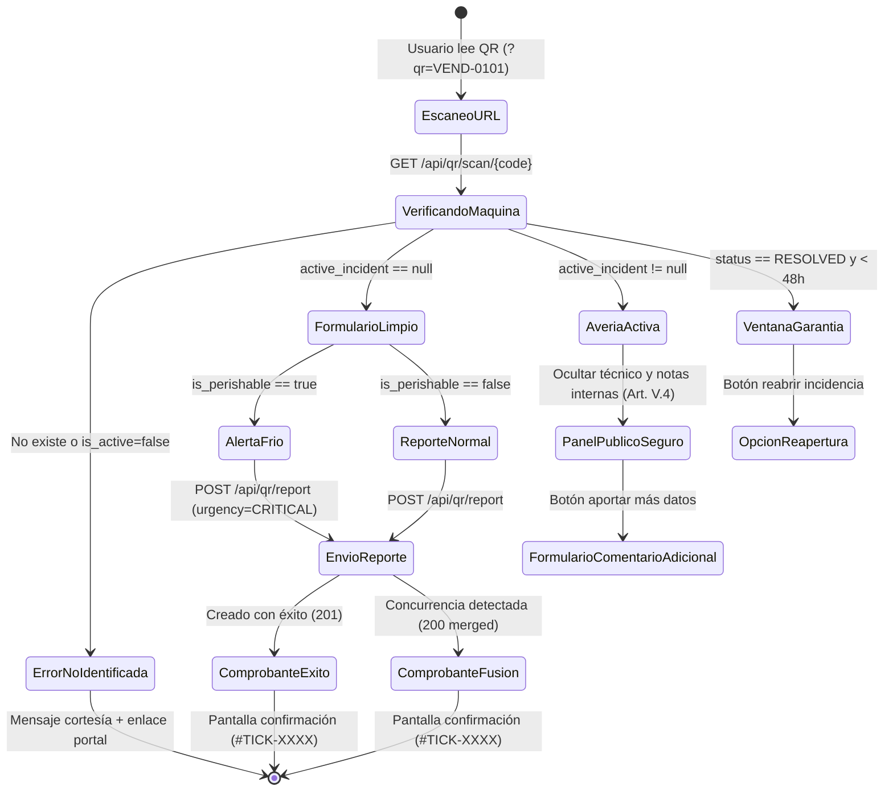

# PLAN DE IMPLEMENTACIÓN TÉCNICA · GENERADOR Y LECTOR DE CÓDIGOS QR
**Proyecto:** Gestor de Incidencias de Vending (*VendGuard*)  
**Módulo:** `02-qr-codes`  
**Documento:** `specs/02-qr-codes/plan.md`  
**Referencia Funcional:** [`specs/functional/qr_codes_spec.md`](../functional/qr_codes_spec.md) (RF-01 a RF-05, RNF-01 a RNF-04)  
**Contratos Técnicos:** [`specs/technical/qr_codes_contracts.md`](../technical/qr_codes_contracts.md)  
**Normativa Suprema:** [constitution.md](../../constitution.md) (Artículos I al VII)  
**Directrices Operativas:** [AGENTS.md](../../AGENTS.md) (SDD, Dogma Vanilla, Dualismo Lingüístico)  

---

## 1. Estructura de Módulos y Ficheros

Siguiendo Clean Architecture, el Dogma Vanilla (cero dependencias externas en PHP y JS) y el Dualismo Lingüístico (código en inglés camelCase, comentarios en castellano):

```text
gestor-incidencias-vending/
├── src/
│   ├── Core/
│   │   └── Domain/
│   │       ├── Model/
│   │       │   ├── QrCodeData.php            # DTO inmutable con metadatos del código QR
│   │       │   └── QrLabelConfig.php         # DTO con opciones de etiqueta (teléfono, layout)
│   │       └── Service/
│   │           └── QrMatrixGenerator.php     # Algoritmo matemático nativo de matriz QR (Vanilla)
│   ├── Application/
│   │   └── Service/
│   │       ├── QrScanService.php             # Caso de uso: resolución de escaneo y privacidad
│   │       ├── QrReportService.php           # Caso de uso: reporte efímero y merge concurrente
│   │       └── QrLabelService.php            # Caso de uso: composición vectorial SVG de etiqueta
│   ├── Infrastructure/
│   │   └── Qr/
│   │       └── NativeSvgQrRenderer.php       # Renderizador de matriz a SVG vectorial puro
│   └── Presentation/
│       ├── Controller/
│       │   ├── QrScanController.php          # GET /api/qr/scan/{code}, POST /api/qr/report
│       │   └── QrLabelController.php         # GET /api/coordinator/machines/{id}/qr-label, batch
│       └── Routing/
│           └── AppRouter.php                 # Registro de nuevas rutas QR
├── public/
│   └── assets/
│       ├── css/
│       │   └── qr-print.css                  # Estilos de impresión A4 (@media print, sin recortes)
│       └── js/
│           ├── components/
│           │   ├── QrLabelModal.js           # Modal de previsualización, teléfono y descarga SVG
│           │   └── QrBatchPrintView.js       # Componente de hoja A4 para lote de sede
│           ├── views/
│           │   └── QrReportView.js           # Vista móvil al escanear (banner frío, confirmación)
│           └── app.js                        # Detección de ?qr=... en URL y enrutamiento visual
└── tests/
    ├── unit/
    │   ├── QrMatrixGeneratorTest.php         # Test del algoritmo matemático de QR en PHP puro
    │   ├── NativeSvgQrRendererTest.php       # Test de generación vectorial SVG válida
    │   ├── QrScanServiceTest.php             # Test de resolución de estados y privacidad Art. V.4
    │   └── QrReportViewTest.mjs              # Test frontend (Node ESM) de la vista de escaneo
    └── integration/
        ├── QrScanEndpointTest.php            # Test de integración HTTP GET /api/qr/scan/{code}
        ├── QrReportEndpointTest.php          # Test de concurrencia HTTP POST /api/qr/report
        └── QrLabelEndpointTest.php           # Test de generación de etiqueta y lote de sede
```

---

## 2. Modelo de Datos JSON y Contratos de API REST

Implementa estrictamente los contratos aprobados en [`specs/technical/qr_codes_contracts.md`](../technical/qr_codes_contracts.md):

### 2.1 `GET /api/qr/scan/{code}` (Público)
* **Finalidad:** Resuelve la máquina y determina el modo visual sin requerir autenticación (`RF-03`).
* **Códigos HTTP:**
  * `200 OK`: Devuelve `status_mode`:
    * `"CAN_REPORT"`: Máquina limpia. Incluye `is_perishable: true/false` para activar la alerta de frío (`Art. II`).
    * `"ACTIVE_INCIDENT"`: Incidencia abierta. Solo expone datos públicos (`Art. V.4`).
    * `"UNDER_WARRANTY"`: Resuelta en < 48h con datos para reapertura.
  * `404 Not Found`: Código erróneo o máquina inactiva (`RF-05, EARS 5.2`).

### 2.2 `POST /api/qr/report` (Público - Efímero)
* **Finalidad:** Creación de ticket desde escaneo con resolución atómica de duplicados (`RF-03`, `RF-04`).
* **Códigos HTTP:**
  * `201 Created`: Nuevo ticket registrado (`merged: false`).
  * `200 OK`: Conflicto resuelto amigablemente (`merged: true`) si otro usuario reportó segundos antes (`EARS 4.5`).
  * `422 Unprocessable`: Datos obligatorios incompletos o inválidos.

### 2.3 `GET /api/coordinator/machines/{id}/qr-label` (Coordinador)
* **Finalidad:** Previsualización y descarga vectorial SVG de etiqueta individual (`RF-01`, `RF-02`).
* **Parámetros:** `phone` (opcional), `update_location_phone` (`true`/`false`), `format` (`json` o `svg`).
* **Códigos HTTP:** `200 OK` (JSON con SVG embebido o descarga `image/svg+xml`), `401 Unauthorized`, `404 Not Found`.

### 2.4 `GET /api/coordinator/locations/{id}/qr-batch` (Coordinador)
* **Finalidad:** Lote completo de máquinas de una sede para cuadrícula A4 (`RF-02, EARS 2.2`).
* **Códigos HTTP:** `200 OK` (Array de máquinas con sus SVGs y URLs), `401 Unauthorized`.

---

## 3. Algoritmos Clave en Pseudocódigo y Máquinas de Estado

### 3.1 Máquina de Estados del Escaneo QR


### 3.2 Algoritmo de Resolución Atómica de Concurrencia (Pseudocódigo)
```text
FUNCTION handleQrReport(payload):
    machine = findActiveMachineByCode(payload.machine_code)
    IF machine IS NULL:
        THROW MachineNotFoundException()

    // Comprobación atómica previa
    activeIncident = incidentRepo.findActiveByMachineId(machine.id)
    IF activeIncident IS NOT NULL:
        // Caso de concurrencia amigable (EARS 4.5)
        commentText = "Aviso adicional recibido mediante código QR: " + payload.description
        incidentRepo.addComment(activeIncident.id, authorType='REPORTER', commentText, payload.reporter_name)
        RETURN Result(ticket_code=activeIncident.ticket_code, merged=true, status=activeIncident.status)

    TRY:
        // Intentar inserción normal (protegida por el índice único condicional de BD)
        newIncident = createIncidentEntity(machine, payload)
        savedIncident = incidentRepo.save(newIncident)
        RETURN Result(ticket_code=savedIncident.ticket_code, merged=false, status=savedIncident.status)
    CATCH DuplicateActiveIncidentException:
        // Carrera ganada por otro usuario milisegundos antes
        latestActive = incidentRepo.findActiveByMachineId(machine.id)
        incidentRepo.addComment(latestActive.id, authorType='REPORTER', payload.description, payload.reporter_name)
        RETURN Result(ticket_code=latestActive.ticket_code, merged=true, status=latestActive.status)
```

### 3.3 Generación Nativa de Matriz QR en SVG Puro (Dogma Vanilla - Art. IV)
* El componente `QrMatrixGenerator` codifica los datos en formato ISO/IEC 18004 (versión 2 a 4 según longitud, máscara óptima y corrección Reed-Solomon nivel M).
* El componente `NativeSvgQrRenderer` transforma la cuadrícula de bits (`true/false`) en un único elemento SVG con trazado vectorial optimizado `<path d="M..."/>` o rectángulos `<rect>`, garantizando:
  - Cero dependencias de Composer ni extensiones gráficas pesadas (GD / Imagick).
  - Peso ultra ligero (< 4 KB de SVG generado).
  - Escalabilidad perfecta para imprenta a cualquier tamaño.

---

## 4. Arquitectura de Eventos y Componentes Frontend Vanilla

### 4.1 Enrutamiento Contextual en `app.js`
* Al cargar la aplicación en `public/index.html`:
  - Se inspeccionan los parámetros de URL: `const urlParams = new URLSearchParams(window.location.search);`
  - Si existe `urlParams.get('qr')`, la vista activa conmuta automáticamente a `currentView = 'qr-report'`, pasando el código de máquina.
  - La barra de navegación de administración y conmutadores rápidos se ocultan automáticamente para ofrecer la vista de usuario final limpia y sin distracciones.

### 4.2 Componente `QrReportView.js`
* **Estados reactivos:**
  - `loading`: cargando resolución de la máquina (`GET /api/qr/scan/{code}`).
  - `statusMode`: `'CAN_REPORT'` | `'ACTIVE_INCIDENT'` | `'UNDER_WARRANTY'` | `'NOT_FOUND'`.
  - `submitted`: `true` tras enviar el reporte, mostrando la tarjeta de confirmación de ticket.
* **Comportamiento en Alimentos Perecederos:**
  - Si `machine.is_perishable === true`, renderiza el banner de alerta sanitaria en color rojo/ámbar advirtiendo sobre rotura de frío.
* **Bloqueo de Máquina:**
  - El selector de máquina se muestra bloqueado con un chip visual fijo: `[VEND-0101] Sanden Vendo G-Drink (Planta Baja)`.

### 4.3 Componentes de Coordinación: `QrLabelModal.js` y `QrBatchPrintView.js`
* En `CoordinatorDashboardView`:
  - Botón *"🏷️ Imprimir QR"* en cada tarjeta de máquina. Abre `QrLabelModal.js` con previsualización SVG, edición del teléfono y opciones *"Imprimir"* / *"Descargar SVG"*.
  - Botón *"📄 Etiquetas de Sede (A4)"* en la cabecera de la sede. Abre `QrBatchPrintView.js` que renderiza la cuadrícula A4 de todas las máquinas activas y lanza `window.print()`.

---

## 5. Decisiones Técnicas Justificadas y Alternativas Descartadas

| Decisión Técnica Adoptada | Justificación | Alternativa Descartada y Motivo del Descarte |
| :--- | :--- | :--- |
| **SVG Vectorial Puro en PHP** | Cumple estrictamente el Artículo IV (Dogma Vanilla). No requiere GD, Imagick ni paquetes externos. Escala con nitidez infinita a cualquier DPI. | **Librería externa Composer (ej: `endroid/qr-code`):** Descartada por violar el Artículo IV.1 y IV.3 (cero paquetes externos en runtime). |
| **Impresión A4 con CSS `@media print`** | La maquetación en el navegador permite previsualización WYSIWYG, saltos de página con `break-inside: avoid` y soporte universal en cualquier sistema operativo. | **Generador de PDF en backend (ej: Dompdf / mPDF):** Descartado por consumo excesivo de memoria en tiers gratuitos y dependencias complejas de fuentes. |
| **Descarga gráfica individual en SVG** | Un archivo `.svg` se abre de forma nativa en cualquier navegador, se edita en Illustrator/Inkscape y se manda directamente a imprenta con calidad vectorial. | **Exportación Raster PNG/JPEG:** Descartada porque pierde nitidez si se imprime a gran escala y requeriría rasterización en el servidor. |
| **Deep Link con Query Params (`?qr=VEND-0101`)** | Compatible con el servidor web embebido y cualquier PaaS (Render, Nginx, Apache) sin requerir reescrituras complejas de URLs tipo `.htaccess`. | **Ruta HTML5 History API (`/qr/VEND-0101`):** Descartada porque requiere configurar soporte de fallback en servidores web de producción para no dar 404 al recargar. |

---

## 6. Estrategia de Pruebas

### 6.1 Pruebas Unitarias PHP (Backend)
1. `QrMatrixGeneratorTest.php`:
   - Verifica que cadenas de texto de prueba generen matrices binarias con patrones de búsqueda (*finder patterns*) correctos y dimensiones estándar.
2. `NativeSvgQrRendererTest.php`:
   - Valida que el SVG resultante sea sintácticamente válido, contenga las dimensiones 400x600 px y el código QR de al menos 40x40 mm.
3. `QrScanServiceTest.php`:
   - Simula máquinas limpias, máquinas con avería activa y máquinas resueltas en garantía.
   - **Auditoría de Privacidad (Art. V.4):** Valida que el array devuelto ante avería activa **nunca contenga** `assigned_technician`, notas internas ni datos privados.

### 6.2 Pruebas de Integración (MariaDB + HTTP)
1. `QrScanEndpointTest.php`:
   - Llamadas reales cURL / mock HTTP a `GET /api/qr/scan/VEND-0101`.
   - Comprueba respuestas `200 OK` (limpia y activa) y `404 Not Found` ante máquinas ficticias.
2. `QrReportEndpointTest.php`:
   - Valida creación de ticket (`201 Created`).
   - Simula dos envíos casi simultáneos verificando que el segundo devuelva `200 OK` con `merged: true` y no un error `409 Conflict` abrupto (`EARS 4.5`).
3. `QrLabelEndpointTest.php`:
   - Valida `GET /api/coordinator/machines/{id}/qr-label` con token de coordinador (200 OK) y sin token (401 Unauthorized).
   - Valida `GET /api/coordinator/locations/{id}/qr-batch` devolviendo el array de máquinas de la sede.

### 6.3 Pruebas Frontend (Node ESM)
1. `QrReportViewTest.mjs`:
   - Verifica el montaje reactivo de la vista de escaneo, la renderización del banner sanitario en `PERISHABLE_FOOD` y la visualización de la confirmación tras el reporte.

---

## 7. Mapeo de Trazabilidad con Requisitos (Traceability Matrix)

| Requisito | Descripción | Componente / Archivo de Producción | Suite de Verificación |
| :--- | :--- | :--- | :--- |
| **RF-01 (EARS 1.1–1.4)** | Generación, personalización y maqueta de etiqueta QR | `NativeSvgQrRenderer.php`, `QrLabelService.php`, `QrLabelModal.js` | `QrMatrixGeneratorTest.php`, `QrLabelEndpointTest.php` |
| **RF-02 (EARS 2.1–2.3)** | Impresión individual, lote A4 y descarga SVG | `QrLabelController.php`, `QrBatchPrintView.js`, `qr-print.css` | `NativeSvgQrRendererTest.php`, `QrLabelEndpointTest.php` |
| **RF-03 (EARS 3.1–3.4)** | Escaneo móvil, máquina fija, alerta de frío y confirmación | `QrScanController.php`, `QrReportView.js`, `AppRouter.php` | `QrScanEndpointTest.php`, `QrReportViewTest.mjs` |
| **RF-04 (EARS 4.1–4.5)** | Anti-duplicados, privacidad Art. V.4 y concurrencia | `QrScanService.php`, `QrReportService.php` | `QrScanServiceTest.php`, `QrReportEndpointTest.php` |
| **RF-05 (EARS 5.1–5.3)** | Máquinas reubicadas, inactivas o parámetros incompletos | `QrScanService.php`, `QrScanController.php` | `QrScanEndpointTest.php` |
| **RNF-01 a RNF-04** | Corrección error M/Q, velocidad <2s, proporciones, Dogma Vanilla | `NativeSvgQrRenderer.php`, `QrMatrixGenerator.php` | `NativeSvgQrRendererTest.php`, `ConstitutionalAuditTest.php` |

---

## 8. Garantía de Dogma Vanilla y Dualismo Lingüístico

* **Backend:** PHP 8.2+ puro con `declare(strict_types=1);`, tipado estricto en todos los métodos y argumentos, cero paquetes Composer en `vendor/`.
* **Frontend:** Vue 3 Composition API cargado localmente desde el bundle propio (`public/assets/js/vendor/`), cero dependencias npm ni pasos de transpilación.
* **Dualismo Lingüístico:**
  * Nombres de clases, métodos, variables y rutas en **inglés técnico camelCase** (`QrScanController`, `resolveScan()`, `renderSvg()`).
  * Comentarios de código, contratos de API, especificaciones y mensajes de negocio al usuario en **castellano formal**.
