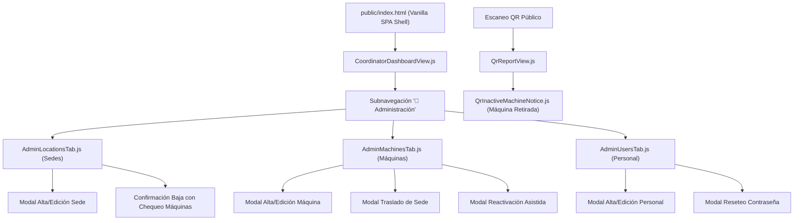

# PLAN DE IMPLEMENTACIÓN TÉCNICA · MÓDULO 04: PANEL CRUD DE ADMINISTRACIÓN INTEGRAL (SEDES, MÁQUINAS Y PERSONAL)
**Proyecto:** Gestor de Incidencias de Vending (*VendGuard*)  
**Módulo:** `04-admin-crud`  
**Documento:** `specs/04-admin-crud/plan.md`  
**Referencia Funcional:** [`specs/functional/admin_crud_spec.md`](../functional/admin_crud_spec.md) (RF-01 a RF-05, RNF-01 a RNF-05)  
**Contratos Técnicos:** [`specs/technical/admin_crud_contracts.md`](../technical/admin_crud_contracts.md)  
**Normativa Suprema:** [`constitution.md`](../../constitution.md) (Artículos I al VII)  
**Directrices Operativas:** [`AGENTS.md`](../../AGENTS.md) (SDD, Dogma Vanilla, Dualismo Lingüístico)  

---

## 1. Estructura de Módulos y Ficheros

El módulo se estructura respetando los principios de **Clean Architecture**, el **Dogma Vanilla** (PHP 8.2+ POO puro, sin frameworks pesados ni dependencias Composer en runtime; Vue 3 en ES Modules nativos sin herramientas de empaquetado/Node.js en producción) y el **Dualismo Lingüístico** (código, nombres de clases, métodos y variables en inglés técnico; documentación, comentarios y textos de interfaz en castellano):

```text
gestor-incidencias-vending/
├── database/
│   ├── cloud_init.sql                                   # Inicialización de esquema en la nube con migración 004
│   └── migrations/
│       └── 004_admin_crud_audit_and_snapshot.sql        # Migración DDL idempotente (USER en audit_log y machine_type_snapshot)
├── src/
│   ├── Core/
│   │   └── Domain/
│   │       ├── Exception/
│   │       │   ├── CannotDeactivateSelfException.php     # Intento de auto-baja de coordinador en sesión (403)
│   │       │   ├── MinimumActiveStaffException.php       # Infracción de guardia mínima activa (409)
│   │       │   ├── PendingIncidentsBlockedException.php  # Baja de técnico con tickets pendientes (409)
│   │       │   ├── ActiveMachinesBlockedException.php    # Baja de sede con máquinas activas (409)
│   │       │   ├── MachineTransferBlockedException.php   # Traslado de máquina con avería activa/garantía (409)
│   │       │   ├── MachineTypeChangeBlockedException.php # Modificación de tipo con avería activa/garantía (409)
│   │       │   └── InactiveRecordCollisionException.php  # Colisión con código/email inactivo (409 con can_reactivate)
│   │       └── Repository/
│   │           ├── LocationRepositoryInterface.php       # Contrato de repositorio de Sedes
│   │           ├── MachineRepositoryInterface.php        # Contrato de repositorio de Máquinas
│   │           └── UserRepositoryInterface.php           # Contrato de repositorio de Personal Interno
│   ├── Application/
│   │   └── Service/
│   │       ├── AdminLocationService.php                  # Reglas de negocio, colisiones y auditoría de Sedes
│   │       ├── AdminMachineService.php                   # Reglas sanitarias, traslados y auditoría de Máquinas
│   │       └── AdminUserService.php                      # Reglas de claves, guardias y auditoría de Personal
│   ├── Infrastructure/
│   │   └── Repository/
│   │       ├── PdoLocationRepository.php                 # Implementación PDO con soporte CRUD, bajas y filtros
│   │       ├── PdoMachineRepository.php                  # Implementación PDO con soporte CRUD, traslados y garantías
│   │       └── PdoUserRepository.php                     # Implementación PDO con soporte CRUD, contraseñas y guardias
│   └── Presentation/
│       ├── Controller/
│       │   ├── CoordinatorAdminController.php            # Endpoints REST para sedes, máquinas y usuarios
│       │   └── QrScanController.php                      # Actualización de respuesta para máquinas inactivas
│       └── Routing/
│           └── AppRouter.php                             # Registro centralizado de endpoints protegidos
├── public/
│   └── assets/
│       └── js/
│           ├── components/
│           │   ├── AdminLocationsTab.js                  # Pestaña interactiva y modales para Sedes
│           │   ├── AdminMachinesTab.js                   # Pestaña interactiva, modales y traslados de Máquinas
│           │   ├── AdminUsersTab.js                      # Pestaña interactiva, modales y reseteo de Técnicos
│           │   └── QrInactiveMachineNotice.js            # Componente informativo público para QR retiradas
│           └── views/
│               ├── CoordinatorDashboardView.js           # Subpestaña "🏢 Administración" integrada
│               └── QrReportView.js                       # Renderizado condicional ante máquina inactiva
└── tests/
    ├── unit/
    │   ├── AdminValidationExceptionsTest.php             # Test unitario de excepciones y códigos de error
    │   ├── AdminLocationServiceTest.php                  # Test de reglas de negocio y auditoría de Sedes
    │   ├── AdminMachineServiceTest.php                   # Test de traslados, tipología sanitaria y garantías
    │   ├── AdminUserServiceTest.php                      # Test de auto-baja, guardias mínimas y contraseñas
    │   └── AdminTabsTest.mjs                             # Test unitario frontend ESM para componentes
    └── integration/
        ├── AdminLocationsEndpointTest.php                # Test de integración HTTP endpoints de sedes
        ├── AdminMachinesEndpointTest.php                 # Test de integración HTTP endpoints de máquinas
        ├── AdminUsersEndpointTest.php                    # Test de integración HTTP endpoints de usuarios
        └── QrInactiveMachineScanTest.php                 # Test de escaneo QR sobre máquinas dadas de baja
```

---

## 2. Modelo de Datos Relacional y Contratos de API REST

### 2.1 Modelo de Datos y Migración DDL (`004_admin_crud_audit_and_snapshot.sql`)

Dando estricto cumplimiento al **Artículo II** (Seguridad alimentaria y preservación analítica) y **Artículo III** (Inviolabilidad de datos y auditoría inmutable):

```sql
-- 1. Ampliación del enum en audit_log para registrar mutaciones sobre Personal Interno (USER)
ALTER TABLE `audit_log` 
MODIFY COLUMN `entity_type` ENUM('TICKET', 'MACHINE', 'LOCATION', 'USER') NOT NULL;

-- 2. Preservación histórica de tipología de máquina en tickets (Artículo II)
-- Garantiza que cambiar el tipo o modelo de una máquina en el futuro no altere
-- retroactivamente las métricas de MTTR de perecederos pasadas.
ALTER TABLE `incidents`
ADD COLUMN `machine_type_snapshot` ENUM('HOT_DRINKS', 'COLD_DRINKS', 'SNACKS', 'PERISHABLE_FOOD', 'COMBO') NULL AFTER `machine_id`;

-- 3. Backfill idempotente para incidencias históricas
UPDATE `incidents` i
INNER JOIN `machines` m ON i.`machine_id` = m.`id`
SET i.`machine_type_snapshot` = m.`machine_type`
WHERE i.`machine_type_snapshot` IS NULL;
```

### 2.2 Resumen de Contratos de API REST

Todos los endpoints administrativos requieren cabecera `Authorization: Bearer <token>` de un usuario con rol `COORDINATOR` mediante `InternalAuthMiddleware(COORDINATOR)`.

#### 2.2.1 Sedes (Locations)

| Método | Endpoint | Payload Entrada | Códigos HTTP | Propósito |
| :--- | :--- | :--- | :--- | :--- |
| `GET` | `/api/coordinator/locations` | Query: `status` (`active\|inactive\|all`), `search` | `200` | Listado con conteo de máquinas activas |
| `POST` | `/api/coordinator/locations` | `{site_code, name, address, contact_name, contact_phone}` | `201`, `400`, `409` | Alta de sede (`site_code` inmutable) |
| `PATCH` | `/api/coordinator/locations/{id}` | `{name, address, contact_name, contact_phone}` | `200`, `400`, `404` | Edición de datos descriptivos |
| `PATCH` | `/api/coordinator/locations/{id}/deactivate`| `{}` | `200`, `404`, `409` | Baja lógica (bloqueo si tiene máquinas activas) |
| `PATCH` | `/api/coordinator/locations/{id}/reactivate`| `{}` | `200`, `404` | Reactivación selectiva de sede |

#### 2.2.2 Máquinas (Machines)

| Método | Endpoint | Payload Entrada | Códigos HTTP | Propósito |
| :--- | :--- | :--- | :--- | :--- |
| `GET` | `/api/coordinator/machines` | Query: `status`, `location_id`, `machine_type`, `search` | `200` | Listado integral con badges de ticket y garantía |
| `POST` | `/api/coordinator/machines` | `{code, model, machine_type, location_id, floor_wing, notes}` | `201`, `400`, `404`, `409` | Alta de máquina en sede activa |
| `PATCH` | `/api/coordinator/machines/{id}` | `{model, machine_type, floor_wing, notes}` | `200`, `400`, `404`, `409` | Edición (tipo bloqueado si hay avería/garantía) |
| `PATCH` | `/api/coordinator/machines/{id}/transfer` | `{target_location_id, floor_wing, notes}` | `200`, `400`, `404`, `409` | Traslado (bloqueado si hay avería/garantía) |
| `PATCH` | `/api/coordinator/machines/{id}/deactivate`| `{}` | `200`, `404`, `409` | Baja lógica (bloqueada si hay avería/garantía) |
| `PATCH` | `/api/coordinator/machines/{id}/reactivate`| `{target_location_id?, floor_wing?}` | `200`, `404`, `422` | Reactivación (exige nueva sede si la original está baja) |

#### 2.2.3 Personal Interno (Users)

| Método | Endpoint | Payload Entrada | Códigos HTTP | Propósito |
| :--- | :--- | :--- | :--- | :--- |
| `GET` | `/api/coordinator/users` | Query: `role` (`TECHNICIAN\|COORDINATOR\|all`), `status`, `search` | `200` | Listado con conteo de averías activas |
| `POST` | `/api/coordinator/users` | `{name, email, role, phone, password}` | `201`, `400`, `409` | Alta de técnico/coordinador (Bcrypt, mín 8 chars) |
| `PATCH` | `/api/coordinator/users/{id}` | `{name, phone}` | `200`, `400`, `404` | Edición de datos de contacto |
| `PATCH` | `/api/coordinator/users/{id}/reset-password`| `{new_password}` | `200`, `400`, `404` | Reseteo seguro de credenciales |
| `PATCH` | `/api/coordinator/users/{id}/deactivate`| `{}` | `200`, `403`, `404`, `409` | Baja lógica (bloqueo auto-baja, guardia o tickets) |
| `PATCH` | `/api/coordinator/users/{id}/reactivate`| `{}` | `200`, `404` | Reactivación de usuario |

#### 2.2.4 Escaneo QR Ciudadano de Máquinas Inactivas

| Método | Endpoint | Payload Salida (`200 OK`) | Propósito |
| :--- | :--- | :--- | :--- |
| `GET` | `/api/qr/scan/{code}` | `{status: "INACTIVE", is_active: false, allow_reporting: false, message: "..."}` | Vista informativa de máquina retirada bloqueando reporte |

---

## 3. Algoritmos Clave en Pseudocódigo y Reglas de Bloqueo

### 3.1 Verificación Previa a la Baja o Traslado de Máquina (Decisión QA 1 y Art. V.6)

```text
ALGORITMO ValidarDisponibilidadMaquinaParaCambio(machineId)
    // 1. Comprobar tickets activos
    activeTicket = BD.QueryFirst(
        "SELECT id, ticket_code, status FROM incidents 
         WHERE machine_id = :id AND is_active_ticket = 1 LIMIT 1",
        {id: machineId}
    )
    IF activeTicket IS NOT NULL THEN
        THROW MachineTransferBlockedException(
            "La máquina tiene un ticket activo (" + activeTicket.ticket_code + 
            ") en estado " + activeTicket.status
        )
    END IF

    // 2. Comprobar ventana de garantía de 48h (Artículo V.6)
    warrantyTicket = BD.QueryFirst(
        "SELECT id, ticket_code, resolved_at FROM incidents 
         WHERE machine_id = :id AND status = 'RESOLVED' 
           AND resolved_at >= DATE_SUB(NOW(), INTERVAL 48 HOUR) LIMIT 1",
        {id: machineId}
    )
    IF warrantyTicket IS NOT NULL THEN
        THROW MachineTransferBlockedException(
            "La máquina se encuentra en periodo de garantía de 48h (ticket " + 
            warrantyTicket.ticket_code + ")"
        )
    END IF

    RETURN TRUE
FIN ALGORITMO
```

### 3.2 Baja Lógica de Personal Interno y Guardia Mínima (Decisión QA 2, Casos Límite 8 y 9)

```text
ALGORITMO ProcesarBajaUsuario(currentCoordinatorId, targetUserId)
    // 1. Prohibición de auto-desactivación (Caso Límite 8)
    IF currentCoordinatorId == targetUserId THEN
        THROW CannotDeactivateSelfException(
            "No puede dar de baja su propia cuenta de usuario en sesión activa."
        )
    END IF

    targetUser = BD.FindUserById(targetUserId)
    IF targetUser IS NULL THEN
        THROW UserNotFoundException("Usuario no encontrado.")
    END IF

    // 2. Protección de guardia mínima operativa (Caso Límite 9)
    activeRoleCount = BD.QueryScalar(
        "SELECT COUNT(*) FROM users WHERE role = :role AND is_active = 1 AND deleted_at IS NULL",
        {role: targetUser.role}
    )
    IF activeRoleCount <= 1 THEN
        THROW MinimumActiveStaffException(
            "Debe existir al menos un " + targetUser.role + " activo en el sistema."
        )
    END IF

    // 3. Bloqueo por averías asignadas pendientes (Decisión QA 2)
    IF targetUser.role == 'TECHNICIAN' THEN
        pendingTickets = BD.QueryScalar(
            "SELECT COUNT(*) FROM incidents 
             WHERE assigned_technician_id = :id 
               AND status IN ('ASSIGNED', 'IN_PROGRESS', 'PENDING_PARTS')",
            {id: targetUserId}
        )
        IF pendingTickets > 0 THEN
            THROW PendingIncidentsBlockedException(
                "El técnico tiene " + pendingTickets + " averías asignadas pendientes. " +
                "Reasígnelas desde el panel de triaje antes de darlo de baja."
            )
        END IF
    END IF

    // 4. Ejecución atómica de baja y auditoría
    BD.BeginTransaction()
    BD.Execute("UPDATE users SET is_active = 0, deleted_at = NOW() WHERE id = :id", {id: targetUserId})
    AuditLogger.Log(
        entityType: 'USER',
        entityId: targetUserId,
        action: 'USER_DEACTIVATED',
        previousState: {is_active: true},
        newState: {is_active: false},
        metadata: {role: targetUser.role}
    )
    BD.Commit()
FIN ALGORITMO
```

### 3.3 Detección de Colisiones de Unicidad y Reactivación Directa (Decisión QA 5)

```text
ALGORITMO RegistrarEntidadConDeteccionInactiva(tabla, campoCodigo, valorCodigo, datosAlta)
    // 1. Comprobar si existe registro con dicho código
    registroExistente = BD.QueryFirst(
        "SELECT id, is_active FROM " + tabla + " WHERE " + campoCodigo + " = :codigo",
        {codigo: valorCodigo}
    )

    IF registroExistente IS NOT NULL THEN
        IF registroExistente.is_active == 1 THEN
            THROW InactiveRecordCollisionException(
                code: tabla.toUpperCase() + "_ALREADY_EXISTS_ACTIVE",
                message: "El código ya se encuentra registrado y activo.",
                canReactivate: FALSE
            )
        ELSE
            THROW InactiveRecordCollisionException(
                code: tabla.toUpperCase() + "_ALREADY_EXISTS_INACTIVE",
                message: "El código pertenece a un registro dado de baja.",
                entityId: registroExistente.id,
                canReactivate: TRUE
            )
        END IF
    END IF

    // 2. Si no colisiona, proceder con el alta normal
    nuevoId = BD.Insert(tabla, datosAlta)
    AuditLogger.LogAlta(tabla, nuevoId, datosAlta)
    RETURN nuevoId
FIN ALGORITMO
```

### 3.4 Reactivación de Máquina con Sede Original Inactiva (Decisión QA 5)

```text
ALGORITMO ReactivarMaquina(machineId, targetLocationIdOpcional, newFloorWingOpcional)
    maquina = BD.FindMachineById(machineId)
    sedeOriginal = BD.FindLocationById(maquina.location_id)

    IF sedeOriginal.is_active == 0 THEN
        IF targetLocationIdOpcional IS NULL OR newFloorWingOpcional IS NULL THEN
            THROW ValidationException(
                "MACHINE_REACTIVATION_REQUIRES_NEW_LOCATION",
                "La sede original de la máquina está dada de baja. Debe especificar una sede activa de destino y la nueva planta/ala."
            )
        END IF

        nuevaSede = BD.FindLocationById(targetLocationIdOpcional)
        IF nuevaSede IS NULL OR nuevaSede.is_active == 0 THEN
            THROW ValidationException("TARGET_LOCATION_NOT_ACTIVE", "La sede de destino seleccionada no está activa.")
        END IF

        BD.BeginTransaction()
        BD.Execute(
            "UPDATE machines SET is_active = 1, deleted_at = NULL, location_id = :loc, floor_wing = :floor WHERE id = :id",
            {loc: targetLocationIdOpcional, floor: newFloorWingOpcional, id: machineId}
        )
        AuditLogger.Log(
            entityType: 'MACHINE',
            entityId: machineId,
            action: 'MACHINE_REACTIVATED',
            previousState: {is_active: false, location_id: maquina.location_id},
            newState: {is_active: true, location_id: targetLocationIdOpcional},
            metadata: {transferred_on_reactivation: true}
        )
        BD.Commit()
    ELSE
        BD.BeginTransaction()
        BD.Execute("UPDATE machines SET is_active = 1, deleted_at = NULL WHERE id = :id", {id: machineId})
        AuditLogger.Log(
            entityType: 'MACHINE',
            entityId: machineId,
            action: 'MACHINE_REACTIVATED',
            previousState: {is_active: false},
            newState: {is_active: true},
            metadata: {transferred_on_reactivation: false}
        )
        BD.Commit()
    END IF
FIN ALGORITMO
```

---

## 4. Arquitectura de Eventos de Auditoría Inmutable y Frontend Vanilla

### 4.1 Registro Sincrónico Append-Only en `audit_log` (Art. III.3 y Art. V.1)

Cada operación administrativa invocará directamente al servicio inmutable `AuditLogger`:
1. `LOCATION_CREATED`, `LOCATION_UPDATED`, `LOCATION_DEACTIVATED`, `LOCATION_REACTIVATED`
2. `MACHINE_CREATED`, `MACHINE_UPDATED`, `MACHINE_TRANSFERRED`, `MACHINE_DEACTIVATED`, `MACHINE_REACTIVATED`
3. `USER_CREATED`, `USER_UPDATED`, `USER_PASSWORD_RESET`, `USER_DEACTIVATED`, `USER_REACTIVATED`

*Garantía Criptográfica:* Los eventos de `USER_CREATED` y `USER_PASSWORD_RESET` omiten terminantemente tanto la contraseña en texto plano como su hash Bcrypt, registrando únicamente metadatos de confirmación técnica.

### 4.2 Arquitectura de Componentes Frontend (Dogma Vanilla Vue 3 en ESM)



* **Sistema de Diseño:** Adherencia estricta a `docs/design.md` (azul `#2560ff`, fondo `#f9fafb`, bordes 4px `rounded.xs` en inputs/botones, tarjetas con borde hairline 8px `rounded.sm`, sin estilos píldora).
* **Gestión de Errores Reactiva:** Al recibir error `409` con `can_reactivate: true`, el formulario muestra un botón destacado para reactivar el registro con un clic sin tener que volver a teclear los datos.

---

## 5. Decisiones Técnicas Justificadas y Alternativas Descartadas

| Decisión Técnica Adoptada | Justificación Arquitectónica y Constitucional | Alternativas Descartadas y Motivo del Rechazo |
| :--- | :--- | :--- |
| **Borrado Lógico Unificado (`is_active` + `deleted_at`)** | Cumple con el **Artículo III.1** de la Constitución (prohibición total de `DELETE FROM`) y permite indexar eficientemente con `idx_active`. | **Borrado Físico (`DELETE FROM`):** Descartado por violar la Constitución y destruir la trazabilidad de incidencias pasadas. |
| **Congelación de Tipología Sanitaria (`machine_type_snapshot`)** | Cumple con el **Artículo II**: si una máquina pasa de `SNACKS` a `PERISHABLE_FOOD` o viceversa, las incidencias pasadas preservan su categoría original impidiendo alterar retroactivamente el cálculo del MTTR. | **Cálculo siempre mediante JOIN en tiempo real:** Descartado porque cambiar la tipología de una máquina hoy desvirtuaría los informes y auditorías de meses anteriores. |
| **Reactivación Selectiva de Sedes (Sin Cascada Automática)** | Si una sede reabre, sus máquinas no se reactivan en masa automáticamente; requieren inspección y reactivación deliberada individual por parte del Coordinador. | **Reactivación automática en cascada (`UPDATE machines SET is_active=1 WHERE location_id=X`):** Descartada por riesgo de activar máquinas que fueron retiradas, desguazadas o averiadas. |
| **Bloqueo Estricto de Bajas y Traslados por 48h de Garantía** | Respeto al **Artículo V.6**: una máquina resuelta recientemente puede ser reabierta por el cliente durante 48h. Si se traslada o da de baja, la reapertura generaría un estado inconsistente en ruta. | **Permitir traslado forzando el cierre prematuro del ticket:** Descartado por cercenar el derecho de reapertura del cliente (Art. V.6). |
| **Auto-Baja Bloqueada y Guardia Mínima en Backend** | Evita condiciones de carrera y deadlocks donde un coordinador accidentalmente se desactive a sí mismo o el sistema quede huérfano sin ningún técnico en activo. | **Validación únicamente en frontend:** Descartada por insegura ante peticiones API directas (Curl/Postman). |

---

## 6. Estrategia de Pruebas y Certificación

### 6.1 Pruebas Unitarias Backend (PHP 8.2+ Puro)
1. `AdminValidationExceptionsTest.php`: Verifica que todas las excepciones de dominio arrojen el código HTTP y formato de error JSON exigido por contrato.
2. `AdminLocationServiceTest.php`: Valida alta, edición, validación de regex de código, colisiones y bloqueo de baja con máquinas activas.
3. `AdminMachineServiceTest.php`: Valida inmutabilidad de código, traslados entre sedes activas, bloqueo ante tickets abiertos o en garantía, y reactivación condicionada a nueva sede.
4. `AdminUserServiceTest.php`: Valida requisitos de contraseña, prevención de auto-baja del coordinador en sesión, guardia mínima por rol y bloqueo de baja de técnicos con averías.

### 6.2 Pruebas de Integración HTTP (MariaDB + Transacciones)
1. `AdminLocationsEndpointTest.php`: Prueba ciclo de vida completo de sedes mediante `GET`, `POST`, `PATCH` y llamadas de desactivación/reactivación verificando eventos en `audit_log`.
2. `AdminMachinesEndpointTest.php`: Prueba ciclo de vida de máquinas, traslados entre sedes y verificación del bloqueo de cambio de tipología sanitaria.
3. `AdminUsersEndpointTest.php`: Prueba alta de usuarios con hash Bcrypt, reseteo de claves y rechazo `403` al intentar auto-desactivar la sesión activa.
4. `QrInactiveMachineScanTest.php`: Prueba que el escaneo de una máquina con `is_active = 0` devuelva estado inactivo y bloquee el reporte público.

### 6.3 Pruebas Frontend Unitarias (Node.js ESM)
1. `AdminTabsTest.mjs`: Verifica el renderizado de tablas, filtros de estado (`active`/`inactive`/`all`), modales de confirmación y presentación de la alerta pública para QR inactivas.

### 6.4 Verificación de Regresiones y Dogma Vanilla
- Ejecución completa de `php tests/run_all.php` (deben pasar las 64 suites preexistentes + las nuevas suites del módulo 04 al 100% en verde).
- Auditoría estricta de cero sentencias `DELETE FROM` en `src/`.

---

## 7. Mapeo de Trazabilidad (Requirements Traceability Matrix)

| Requisito Funcional | Criterios EARS Clave | Componente Backend / Servicio | Endpoint REST / UI Frontend | Suite de Pruebas Asociada |
| :--- | :--- | :--- | :--- | :--- |
| **RF-01: Gestión de Sedes** | 1.1, 1.2, 1.3, 1.4, 1.5, 1.6 | `AdminLocationService.php`, `PdoLocationRepository.php` | `GET/POST/PATCH /api/coordinator/locations*`, `AdminLocationsTab.js` | `AdminLocationServiceTest.php`, `AdminLocationsEndpointTest.php` |
| **RF-02: Gestión de Máquinas** | 2.1, 2.2, 2.3, 2.4, 2.5, 2.6 | `AdminMachineService.php`, `PdoMachineRepository.php` | `GET/POST/PATCH /api/coordinator/machines*`, `AdminMachinesTab.js` | `AdminMachineServiceTest.php`, `AdminMachinesEndpointTest.php` |
| **RF-03: Gestión de Personal** | 3.1, 3.2, 3.3, 3.4, 3.5, 3.6 | `AdminUserService.php`, `PdoUserRepository.php` | `GET/POST/PATCH /api/coordinator/users*`, `AdminUsersTab.js` | `AdminUserServiceTest.php`, `AdminUsersEndpointTest.php` |
| **RF-04: Respuesta QR Inactivas**| 4.1, 4.2 | `QrScanController.php`, `QrScanService.php` | `GET /api/qr/scan/{code}`, `QrInactiveMachineNotice.js` | `QrInactiveMachineScanTest.php` |
| **RF-05: Auditoría Inmutable** | 5.1, 5.2, 5.3, 5.4 | `AuditLogger.php`, `PdoAuditLogRepository.php` | Inserción append-only en `audit_log` para `LOCATION`, `MACHINE`, `USER` | Todas las suites de integración verifican la persistencia en `audit_log` |
| **RNF-01: Integridad y Tipado** | Tipado estricto PHP 8.2 | `declare(strict_types=1);` | Todas las clases de `src/` | `tests/run_all.php` |
| **RNF-02: Rendimiento Operativo**| Respuestas < 200 ms | Índices en `is_active`, `site_code`, `code` | Controladores y repositorios optimizados | Verificación de tiempo en integración |
| **RNF-03: Auditoría y Borrado Lógico**| Cero `DELETE FROM` | Soft delete con `is_active` y `deleted_at` | Todos los métodos de baja | `ConstitutionalAuditTest.php` |
| **RNF-04: Seguridad y Autorización**| RBAC Coordinador | `InternalAuthMiddleware(COORDINATOR)` | Rutas protegidas en `AppRouter.php` | `AuthControllerTest.php`, endpoints tests |
| **RNF-05: Usabilidad e Interfaz** | Dogma Vanilla y WCAG AA | Vue 3 ESM nativo | `AdminLocationsTab.js`, `AdminMachinesTab.js`, `AdminUsersTab.js` | `AdminTabsTest.mjs` |

---

## 8. Garantía de Dogma Vanilla y Dualismo Lingüístico

1. **Dogma Vanilla Absoluto:**
   - Cero dependencias npm o Composer agregadas al proyecto.
   - Acceso a base de datos mediante sentencias preparadas nativas de `PDO`.
   - Hasheo seguro de contraseñas con la función nativa `password_hash($pass, PASSWORD_BCRYPT, ['cost' => 12])`.
   - Componentes frontend escritos en ES Modules puros (`export default { ... }`) usando `Vue.defineComponent` o sintaxis modular estándar nativa.
2. **Dualismo Lingüístico Inquebrantable:**
   - **Inglés:** Clases (`AdminLocationService`), métodos (`deactivateMachine`), variables (`targetLocationId`), tablas (`locations`, `machines`, `users`, `audit_log`) y commits Git (`feat: ...`).
   - **Castellano:** Comentarios en el código fuente, especificaciones (`specs/`), mensajes de error de la API orientados al usuario y textos de la interfaz visual.
