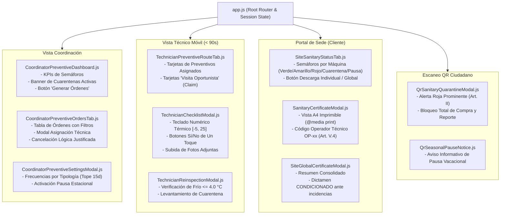

# PLAN DE IMPLEMENTACIÓN TÉCNICA · MÓDULO 05: MANTENIMIENTO PREVENTIVO Y CHECKLISTS SANITARIOS (M1)

**Proyecto:** Gestor de Incidencias de Vending (*VendGuard*)  
**Módulo:** `05-preventive-maintenance`  
**Documento:** `specs/05-preventive-maintenance/plan.md`  
**Referencia Funcional:** [`specs/functional/preventive_maintenance_spec.md`](../functional/preventive_maintenance_spec.md) (RF-PREV-01 a RF-PREV-08, RNF-01 a RNF-06)  
**Contratos Técnicos y DDL:** [`specs/technical/preventive_maintenance_contracts.md`](../technical/preventive_maintenance_contracts.md)  
**Normativa Suprema:** [`constitution.md`](../../constitution.md) (Artículos I al VII)  
**Directrices Operativas:** [`AGENTS.md`](../../AGENTS.md) (SDD, Dogma Vanilla, Dualismo Lingüístico)  
**Sistema de Diseño Visual:** [`docs/design.md`](../../docs/design.md) (Inspiración Docker: Azul eléctrico `#2560ff`, fondo canvas `#f9fafb`, bordes 4px/8px, estilo A4 `@media print`)  

---

## 1. Estructura de Módulos y Ficheros

El módulo implementa una arquitectura desacoplada **Clean Architecture / MVC Ligero** en el backend y componentes reactivos modulares en el frontend mediante **Vanilla ES Modules**, preservando el **Dogma Vanilla** (cero dependencias externas npm/Composer en runtime, cero bundlers de compilación) y el **Dualismo Lingüístico** (código, nombres de clases, entidades, métodos y esquemas en inglés técnico; interfaz de usuario, mensajes, certificados y documentación en español).

```text
gestor-incidencias-vending/
├── database/
│   ├── cloud_init.sql                                          # Esquema integral para despliegue en nube (incluye migración 005)
│   └── migrations/
│       └── 005_preventive_maintenance.sql                      # Migración DDL idempotente para tablas y extensiones preventivas
├── src/
│   ├── Core/
│   │   └── Domain/
│   │       ├── Exception/
│   │       │   ├── PerishableFrequencyLimitException.php        # Excepción al intentar configurar > 15 días en perecederos (Art. II, 422)
│   │       │   ├── InvalidTemperatureRangeException.php        # Excepción si temperatura está fuera de [-5.0, 25.0] °C (422)
│   │       │   ├── ChecklistIncompleteException.php             # Excepción por ítems obligatorios o temperatura omitida (422)
│   │       │   ├── PreventiveOrderAlreadyAssignedException.php  # Colisión en claim de visita oportunista (409)
│   │       │   ├── PreventiveOrderNotInInspectionException.php  # Remisión sobre orden en estado inadecuado (409)
│   │       │   ├── ReinspectionTemperatureExceededException.php # Reinspección > 4.0 °C en frío (422)
│   │       │   ├── CannotIssueNonConformCertificateException.php# Intento de emitir certificado en no apta o vencida (400)
│   │       │   └── SeasonalPauseMissingReasonException.php      # Pausa estacional sin motivo justificado (422)
│   │       └── Repository/
│   │           ├── PreventiveOrderRepositoryInterface.php       # Contrato de repositorio para órdenes preventivas
│   │           ├── PreventiveItemRepositoryInterface.php        # Contrato de repositorio para ítems del checklist
│   │           ├── SanitaryCertificateRepositoryInterface.php   # Contrato de repositorio para certificados sanitarios
│   │           └── PreventiveSettingsRepositoryInterface.php    # Contrato para configuración de frecuencias y pausas
│   ├── Application/
│   │   └── Service/
│   │       ├── PreventiveOrderSchedulerService.php              # Generador anticipado de órdenes (ventana 5 días) y cálculo de vigencias
│   │       ├── PreventiveChecklistEvaluationService.php         # Evaluación de dictamen (CONFORME, WARN, NO_CONFORME), severidades y cuarentenas
│   │       ├── PreventiveCoexistenceBridgeService.php           # Puente constitucional correctivo: apertura o bitácora sin duplicar (Art. V.1/V.2)
│   │       ├── SanitaryCertificateService.php                   # Emisión, consolidación por sede y suspensión cautelar de certificados (Art. V.4)
│   │       └── PreventiveSettingsService.php                    # Gestión de frecuencias, blindaje Art. II y pausas estacionales
│   ├── Infrastructure/
│   │   └── Repository/
│   │       ├── PdoPreventiveOrderRepository.php                 # Persistencia PDO de órdenes con transacciones y borrado lógico (Art. III)
│   │       ├── PdoPreventiveItemRepository.php                  # Persistencia PDO de ítems inspeccionados y fotos adjuntas
│   │       ├── PdoSanitaryCertificateRepository.php             # Persistencia PDO de certificados emitidos y estados de suspensión
│   │       └── PdoPreventiveSettingsRepository.php              # Persistencia PDO de configuración por tipología y máquina
│   └── Presentation/
│       ├── Controller/
│       │   ├── CoordinatorPreventiveController.php              # Endpoints REST para coordinación (dashboard, órdenes, settings, pausas)
│       │   ├── TechnicianPreventiveController.php               # Endpoints REST para técnicos (ruta, claim oportunista, checklist, reinspección)
│       │   ├── SiteSanitaryController.php                       # Endpoints REST para responsable de sede (semáforos y certificados A4)
│       │   └── QrScanController.php                             # Extensión de controlador QR para modos Cuarentena y Pausa Estacional
│       └── Routing/
│           └── AppRouter.php                                    # Registro de rutas de API preventivas con control de middlewares
├── public/
│   └── assets/
│       └── js/
│           ├── components/
│           │   ├── CoordinatorPreventiveDashboard.js            # Panel de KPIs preventivos, semáforos y accesos rápidos
│           │   ├── CoordinatorPreventiveOrdersTab.js            # Pestaña de listado de órdenes, filtros, modal de asignación y cancelación
│           │   ├── CoordinatorPreventiveSettingsModal.js        # Modal de configuración de frecuencias y pausas estacionales
│           │   ├── TechnicianPreventiveRouteTab.js              # Pestaña de ruta del técnico con filtros y tarjetas de visita oportunista
│           │   ├── TechnicianChecklistModal.js                  # Modal interactivo de checklist móvil (< 90s, teclado térmico estricto)
│           │   ├── TechnicianReinspectionModal.js               # Modal para reinspección térmica tras subsanación de correctivo
│           │   ├── SiteSanitaryStatusTab.js                     # Portal de sede con semáforos individuales, última desinfección y temperatura
│           │   ├── SanitaryCertificateModal.js                  # Visor de certificado oficial individual con estilos de impresión A4
│           │   ├── SiteGlobalCertificateModal.js                # Visor de certificado consolidado de sede (dictamen CONDICIONADO)
│           │   ├── QrSanitaryQuarantineModal.js                 # Vista pública QR para máquinas en cuarentena (alerta roja y bloqueo)
│           │   └── QrSeasonalPauseNotice.js                     # Vista pública QR informativa para máquinas en pausa estacional
│           └── app.js                                           # Inyección de pestañas preventivas según rol autenticado
└── tests/
    ├── Unit/
    │   ├── PreventiveSchedulerTest.php                          # Pruebas unitarias de cálculo de frecuencias y tope 15 días (Art. II)
    │   ├── PreventiveEvaluationTest.php                         # Pruebas unitarias de evaluación de severidades, rangos térmicos y cuarentenas
    │   └── PreventiveCoexistenceTest.php                        # Pruebas unitarias de puente con averías (Art. V.1 y Art. V.2)
    └── Integration/
        ├── CoordinatorPreventiveApiTest.php                     # Pruebas de integración de endpoints de coordinación
        ├── TechnicianPreventiveApiTest.php                      # Pruebas de integración de visita oportunista, checklist y reinspección
        ├── SiteSanitaryApiTest.php                              # Pruebas de integración de semáforos y emisión/suspensión de certificados
        └── QrSanitaryModeApiTest.php                            # Pruebas de integración de respuestas del escaneo QR
```

---

## 2. Modelo de Datos JSON y Contratos de API REST

### 2.1 Resumen de Endpoints y Roles de Acceso

| Método | Endpoint | Rol Mínimo | Propósito Operativo |
| :--- | :--- | :--- | :--- |
| **Coordinador** | | | |
| `GET` | `/api/coordinator/preventive/dashboard` | `COORDINATOR` | KPIs de cumplimiento, máquinas en cuarentena y vencimientos inminentes |
| `GET` | `/api/coordinator/preventive/orders` | `COORDINATOR` | Listado integral con filtros (`status`, `location_id`, `machine_id`, `technician_id`, `search`) |
| `POST` | `/api/coordinator/preventive/orders` | `COORDINATOR` | Creación manual o extraordinaria de una orden preventiva |
| `POST` | `/api/coordinator/preventive/generate-due` | `COORDINATOR` | Motor de generación anticipada automática (máquinas a $\le 5$ días de vencer) |
| `PATCH`| `/api/coordinator/preventive/orders/{id}/assign` | `COORDINATOR` | Asignación o reasignación a técnico de ruta |
| `PATCH`| `/api/coordinator/preventive/orders/{id}/cancel` | `COORDINATOR` | Cancelación lógica justificada (traslados/bajas, Art. III) |
| `GET` | `/api/coordinator/preventive/settings` | `COORDINATOR` | Consulta de frecuencias estándar por tipología |
| `PATCH`| `/api/coordinator/preventive/settings` | `COORDINATOR` | Modificación de frecuencias estándar (blindaje Art. II) |
| `PATCH`| `/api/coordinator/machines/{id}/preventive-config` | `COORDINATOR` | Frecuencia individual de máquina o activación de Pausa Estacional |
| **Técnico** | | | |
| `GET` | `/api/technician/preventive/route` | `TECHNICIAN` | Ruta móvil: órdenes asignadas + pendientes en sedes visitadas |
| `POST`| `/api/technician/preventive/orders/{id}/claim` | `TECHNICIAN` | **Visita Oportunista:** Autoasignación inmediata in situ (EARS 2.3) |
| `GET` | `/api/technician/preventive/orders/{id}/checklist` | `TECHNICIAN` | Obtiene catálogo normativo según tipología y límites térmicos |
| `POST`| `/api/technician/preventive/orders/{id}/start` | `TECHNICIAN` | Inicia la inspección in situ (`EN_INSPECCION`) |
| `POST`| `/api/technician/preventive/orders/{id}/complete` | `TECHNICIAN` | Envío y evaluación del checklist con validación térmica (Art. II, V.1, V.2) |
| `POST`| `/api/technician/preventive/orders/{id}/reinspect` | `TECHNICIAN` | Reinspección tras subsanación de avería de frío ($\le 4.0\text{ }^\circ\text{C}$) |
| **Sede / Cliente** | | | |
| `GET` | `/api/site/sanitary-status` | `SiteAuth` | Semáforos de máquinas de la sede, última desinfección y temperatura |
| `GET` | `/api/site/certificates/machine/{code}` | `SiteAuth` | Descarga/visualización de Certificado Sanitario Oficial A4 (Art. V.4) |
| `GET` | `/api/site/certificates/global` | `SiteAuth` | Certificado Global Consolidado de Sede (dictamen `CONDICIONADO`) |
| **Público QR** | | | |
| `GET` | `/api/qr/scan/{code}` | Público | Extendido para devolver `SANITARY_QUARANTINE` o `SEASONAL_PAUSE` |

---

## 3. Algoritmos Clave en Pseudocódigo y Máquinas de Estado

### 3.1 Algoritmo de Evaluación de Checklist y Salvaguarda Sanitaria (Art. II)

```text
ALGORITHM CompletePreventiveChecklist(order_id, technician_id, input_data):
    BEGIN TRANSACTION
    order = LockPreventiveOrder(order_id)
    IF order.status != 'IN_INSPECTION':
        THROW PreventiveOrderNotInInspectionException()

    machine = GetMachine(order.machine_id)
    settings = GetPreventiveSettings(machine.machine_type)

    // 1. Validación de Temperatura si la máquina procesa refrigeración
    is_refrigerated = (machine.machine_type IN ['PERISHABLE_FOOD', 'COLD_DRINKS', 'COMBO'])
    temperature = input_data.temperature_measured

    IF is_refrigerated:
        IF temperature IS NULL OR NOT MatchesRegex(temperature, "^-?\d+(\.\d)?$"):
            THROW InvalidTemperatureRangeException("Formato decimal obligatorio")
        IF temperature < -5.0 OR temperature > 25.0:
            THROW InvalidTemperatureRangeException("Temperatura fuera de límites físicos [-5.0, 25.0]")

    // 2. Evaluación de Ítems del Checklist
    verdict = 'CONFORME'
    has_critical_failure = FALSE
    has_secondary_warning = FALSE

    FOREACH item_input IN input_data.items:
        template_item = GetTemplateItem(item_input.item_code)
        RecordOrderItem(order.id, template_item, item_input.status, item_input.observations, item_input.photo_path)

        IF item_input.status == 'FAIL' AND template_item.is_critical:
            has_critical_failure = TRUE
        ELSE IF item_input.status IN ['WARN', 'FAIL']:
            has_secondary_warning = TRUE

    // Regla de frío para perecederos (Art. II)
    IF machine.machine_type IN ['PERISHABLE_FOOD', 'COMBO'] AND temperature > 4.0:
        has_critical_failure = TRUE

    IF has_critical_failure:
        verdict = 'NO_CONFORME'
    ELSE IF has_secondary_warning:
        verdict = 'CONFORME_CON_OBSERVACIONES'

    // 3. Consecuencias Operativas
    IF verdict == 'NO_CONFORME':
        order.result = 'NO_CONFORME'
        order.is_quarantine_triggered = TRUE
        machine.sanitary_status = 'QUARANTINE'
        UpdateMachine(machine)

        // Puente Coexistencia con Averías (Art. V.1 y Art. V.2)
        corrective_action = ExecuteCoexistenceBridge(machine, technician_id, order, temperature)
    ELSE:
        order.result = verdict
        order.is_quarantine_triggered = FALSE
        machine.sanitary_status = 'OK'
        machine.last_sanitary_inspection_at = NOW()
        machine.next_sanitary_inspection_due = AddDays(NOW(), machine.sanitary_frequency_days ?? settings.default_frequency_days)
        UpdateMachine(machine)

        // Emisión de Certificado Sanitario Oficial (Art. V.4)
        certificate = IssueSanitaryCertificate(order, machine, technician_id, verdict, temperature)

    order.status = 'COMPLETED'
    order.completed_at = NOW()
    order.temperature_measured = temperature
    UpdatePreventiveOrder(order)

    RecordAuditLog('PREVENTIVE_ORDER', order.id, 'COMPLETED', technician_id, {verdict: verdict})
    COMMIT TRANSACTION
    RETURN {order, verdict, machine_sanitary_status: machine.sanitary_status}
```

### 3.2 Algoritmo del Puente Constitucional de Coexistencia (Art. V.1 y Art. V.2)

```text
ALGORITHM ExecuteCoexistenceBridge(machine, technician_id, order, temperature):
    // Art. V.2: Comprobación estricta de unicidad de ticket activo
    active_incident = FindActiveIncidentByMachine(machine.id)

    IF active_incident IS NULL:
        // Caso A: No hay ticket activo -> Crear incidencia vinculada (Art. V.1)
        urgency = (temperature > 4.0) ? 'CRITICAL' : 'HIGH'
        category = (temperature > 4.0) ? 'TEMPERATURE_COLD' : 'OTHER'
        description = "Avería detectada durante la inspección preventiva " + order.order_code + ". Temperatura: " + temperature + " °C."

        new_incident = CreateIncident({
            machine_id: machine.id,
            location_id: machine.location_id,
            preventive_order_id: order.id,
            assigned_technician_id: technician_id,
            category: category,
            urgency: urgency,
            status: 'IN_PROGRESS',
            description: description,
            reporter_name: "Sistema Preventivo (VendGuard)",
            reporter_phone: "000000000"
        })
        order.linked_incident_id = new_incident.id
        RecordAuditLog('TICKET', new_incident.id, 'PREVENTIVE_TRIGGERED_INCIDENT', technician_id)
        RETURN {mode: 'CREATED_NEW_INCIDENT', ticket_code: new_incident.ticket_code}

    ELSE:
        // Caso B: Ya existe un ticket activo -> CERO DUPLICADOS (Art. V.2)
        comment = "ALERTA PREVENTIVA: En la revisión " + order.order_code + " se constató fallo crítico. Temperatura: " + temperature + " °C."
        AddIncidentComment(active_incident.id, technician_id, comment)

        IF temperature > 4.0 AND active_incident.urgency != 'CRITICAL':
            active_incident.urgency = 'CRITICAL'
            UpdateIncident(active_incident)
            RecordAuditLog('TICKET', active_incident.id, 'URGENCY_ESCALATED_CRITICAL_BY_PREVENTIVE', technician_id)

        order.linked_incident_id = active_incident.id
        RETURN {mode: 'APPENDED_TO_EXISTING_INCIDENT', ticket_code: active_incident.ticket_code}
```

### 3.3 Algoritmo de Generación Anticipada de Órdenes (Ventana 5 Días)

```text
ALGORITHM GenerateUpcomingPreventiveOrders(horizon_days = 5):
    target_date = AddDays(CURRENT_DATE(), horizon_days)
    candidate_machines = QueryMachinesRequiringInspection(target_date)
    generated_orders = []

    FOREACH machine IN candidate_machines:
        // Excluir si la máquina está inactiva o en Pausa Estacional
        IF NOT machine.is_active OR machine.is_seasonal_pause:
            CONTINUE

        // Evitar duplicidad si ya existe orden pendiente, programada o en inspección
        IF HasPendingOrActivePreventiveOrder(machine.id):
            CONTINUE

        order_code = GenerateUniqueCode("PREV-", Year(), SequenceNext("preventive_order_seq"))
        new_order = CreatePreventiveOrder({
            order_code: order_code,
            machine_id: machine.id,
            location_id: machine.location_id,
            status: 'PENDING_ASSIGNMENT',
            order_type: 'ROUTINE',
            scheduled_date: machine.next_sanitary_inspection_due,
            due_date: machine.next_sanitary_inspection_due
        })
        generated_orders.Append(new_order)
        RecordAuditLog('PREVENTIVE_ORDER', new_order.id, 'AUTO_GENERATED', SYSTEM_USER_ID)

    RETURN generated_orders
```

---

## 4. Arquitectura de Eventos y Componentes Frontend Vanilla

Siguiendo el sistema de diseño de [`docs/design.md`](../../docs/design.md), los componentes frontend se implementan en **Vue 3 Composition API** sin pasos de compilación (cargados dinámicamente mediante `import()`), adoptando la paleta oficial (azul eléctrico `#2560ff`, fondo canvas `#f9fafb`, borde hairline `#c8cfda`, textos slate `#2c333f` y bordes técnicos 4px/8px):



### 4.1 Componentes Clave y Flujo de Interacción

1. **`TechnicianChecklistModal.js` (Cumplimiento RNF-01):**  
   Diseñado específicamente para pantalla táctil móvil:
   * Control de temperatura numérico con validación en tiempo real: resalta en verde si $\le 4.0\text{ }^\circ\text{C}$, amarillo si está entre $4.1$ y $8.0\text{ }^\circ\text{C}$ en bebidas, y rojo con aviso sonoro/visual si excede $4.0\text{ }^\circ\text{C}$ en perecederos.
   * Botones de estado tipo chip con radio de 4px (`rounded.xs`), permitiendo completar los 6 ítems normativos en menos de 90 segundos.
2. **`SanitaryCertificateModal.js` (Cumplimiento RNF-03 y Art. V.4):**  
   Estructurado con hoja de estilos `@media print`:
   * Cabecera oficial con logotipo de VendGuard y número de registro de certificación.
   * Ocultación estricta de datos personales privados: muestra únicamente `Código Operador Técnico: OP-03` y nombre profesional.
   * Desglose de mediciones y fecha de validez reglamentaria.
3. **`QrSanitaryQuarantineModal.js` (Cumplimiento Art. II):**  
   Al escanear el QR físico de una máquina con `sanitary_status = 'QUARANTINE'`:
   * Despliega una alerta en rojo vivo (`#ff5757` sobre fondo `#fddfdf`) indicando la prohibición expresa de consumir productos por control sanitario.
   * Bloquea el botón de apertura de nuevas incidencias para no saturar al sistema con reportes redundantes.

---

## 5. Decisiones Técnicas Justificadas y Alternativas Descartadas

### 5.1 Separación de Dominios: `preventive_orders` vs. Monolito en `incidents`
* **Decisión:** Modelar las órdenes de inspección preventiva en una tabla independiente (`preventive_orders`) con ciclo de vida y llaves foráneas diferenciadas, conectándose a `incidents` únicamente mediante el puente de coexistencia (`preventive_order_id`).
* **Justificación:** Una revisión preventiva no es un defecto; es un acto normativo periódico programado. Sobrecargar la tabla `incidents` con preventivos obligaría a eludir la restricción constitucional de unicidad de ticket activo (Art. V.2) o generaría estados híbridos inmanejables.
* **Alternativa Descartada:** Tratar las preventivas como incidencias de tipo `PREVENTIVE_INSPECTION`. Descartada por vulnerar el Art. V.2 y distorsionar los SLAs y tiempos medios de resolución de correctivos.

### 5.2 Identificación mediante `operator_code` (Art. V.4)
* **Decisión:** Crear la columna `users.operator_code` (ej: `OP-01`, `OP-02`) con restricción de unicidad y exponer exclusivamente este identificador en los certificados sanitarios visibles para clientes y autoridades.
* **Justificación:** Garantiza la plena trazabilidad jurídica e inspectora requerida por Sanidad sin violar la privacidad del trabajador (prohibición de exhibir DNI o teléfono personal, Art. V.4).
* **Alternativa Descartada:** Utilizar el `id` numérico de base de datos (`Técnico #3`). Descartada por carecer de formato formal normativo para certificados sanitarios.

### 5.3 Límite Físico de Temperatura en Validación Frontend y Backend
* **Decisión:** Restringir la temperatura obligatoriamente al rango `[-5.0, 25.0]` con 1 decimal en todas las capas.
* **Justificación:** Previene errores de mecanografía habituales en pantallas mojadas o con guantes in situ (ej: teclear `35` por `3.5` dispararía una falsa alarma de cuarentena).
* **Alternativa Descartada:** Permitir entrada libre de texto o decimal sin límites. Descartada por riesgo inaceptable de falsos positivos o falsos negativos sanitarios.

### 5.4 Exclusión Total de Telemetría IoT en Tiempo Real (Art. VI)
* **Decisión:** No incluir suscripciones MQTT ni integraciones directas con placas telemáticas.
* **Justificación:** El Artículo VI (Anti-Feature Creep) prohíbe el desarrollo de telemetría compleja en esta fase. Toda lectura proviene de la verificación física in situ del técnico con instrumental homologado.

---

## 6. Estrategia de Pruebas

### 6.1 Pruebas Unitarias (`tests/Unit/`)
1. **`PreventiveSchedulerTest.php`:**
   * Valida el cómputo de la próxima fecha de inspección sumando los días configurados.
   * Verifica que cualquier intento de fijar $> 15$ días en perecederos arroja `PerishableFrequencyLimitException` (Art. II).
   * Comprueba que las máquinas en Pausa Estacional no generan órdenes en la ventana de anticipación.
2. **`PreventiveEvaluationTest.php`:**
   * Valida la asignación de `CONFORME`, `CONFORME_CON_OBSERVACIONES` y `NO_CONFORME`.
   * Verifica que una temperatura de $4.1\text{ }^\circ\text{C}$ en perecederos evalúa unívocamente `NO_CONFORME` y activa cuarentena.
   * Verifica que una temperatura de $4.0\text{ }^\circ\text{C}$ exacta es evaluada como `CONFORME`.
   * Verifica el rechazo de valores fuera de `[-5.0, 25.0]`.
3. **`PreventiveCoexistenceTest.php`:**
   * Simula no conformidad sin ticket activo previo: confirma apertura de incidencia vinculada con urgencia `CRITICAL`.
   * Simula no conformidad con ticket activo previo: confirma que **no se crea un nuevo ticket** (Art. V.2), se añade comentario en bitácora y se eleva la urgencia a `CRITICAL`.

### 6.2 Pruebas de Integración de API (`tests/Integration/`)
1. **`CoordinatorPreventiveApiTest.php`:**
   * `POST /api/coordinator/preventive/generate-due`: Comprueba la generación de órdenes en masa para máquinas a $\le 5$ días.
   * `PATCH /api/coordinator/preventive/orders/{id}/assign`: Comprueba asignación y registro en `audit_log`.
   * `PATCH /api/coordinator/preventive/orders/{id}/cancel`: Comprueba cancelación puramente lógica (Art. III).
2. **`TechnicianPreventiveApiTest.php`:**
   * `POST /api/technician/preventive/orders/{id}/claim`: Comprueba autoasignación in situ (Visita Oportunista) y rechazo ante colisión de asignación concurrente.
   * `POST /api/technician/preventive/orders/{id}/complete`: Comprueba el flujo completo de evaluación, emisión de certificado o bloqueo sanitario.
   * `POST /api/technician/preventive/orders/{id}/reinspect`: Comprueba levantamiento condicionado de cuarentena.
3. **`SiteSanitaryApiTest.php`:**
   * `GET /api/site/sanitary-status`: Comprueba el filtrado estricto por sede del token cliente.
   * `GET /api/site/certificates/machine/{code}`: Comprueba la presencia del `operator_code` y ausencia de datos sensibles (Art. V.4).
   * `GET /api/site/certificates/global`: Comprueba que dictamina `CONDICIONADO` si alguna máquina está en cuarentena.

---

## 7. Mapeo Estricto de Trazabilidad (Matriz de Cobertura)

| Requisito Funcional / No Funcional | Archivos de Backend Responsables | Componentes Frontend / UI | Pruebas Automatizadas |
| :--- | :--- | :--- | :--- |
| **RF-PREV-01:** Ciclos, Frecuencias y Pausas | `PreventiveSettingsService.php`, `PdoPreventiveSettingsRepository.php` | `CoordinatorPreventiveSettingsModal.js` | `PreventiveSchedulerTest.php` |
| **RF-PREV-02:** Programación, Claim, Traslados y Reasignación Justificada (EARS 2.6) | `PreventiveOrderSchedulerService.php`, `PdoPreventiveOrderRepository.php`, `CoordinatorPreventiveController.php` | `CoordinatorPreventiveOrdersTab.js`, `TechnicianPreventiveRouteTab.js` | `CoordinatorPreventiveApiTest.php`, `CoordinatorPreventiveComponentsTest.mjs`, `TechnicianPreventiveApiTest.php` |
| **RF-PREV-03:** Checklist y Rango Térmico | `PreventiveChecklistEvaluationService.php`, `PdoPreventiveItemRepository.php` | `TechnicianChecklistModal.js` | `PreventiveEvaluationTest.php` |
| **RF-PREV-04:** Evaluación y Cuarentena (Art. II) | `PreventiveChecklistEvaluationService.php`, `QrScanController.php` | `QrSanitaryQuarantineModal.js`, `CoordinatorPreventiveDashboard.js` | `PreventiveEvaluationTest.php`, `QrSanitaryModeApiTest.php` |
| **RF-PREV-05:** Coexistencia y Duplicados (Art. V.1/V.2) | `PreventiveCoexistenceBridgeService.php`, `CoordinatorAdminController.php` | `TechnicianChecklistModal.js`, `AdminTicketsTab.js` | `PreventiveCoexistenceTest.php` |
| **RF-PREV-06:** Semáforos Sanitarios | `SiteSanitaryController.php`, `CoordinatorPreventiveController.php` | `SiteSanitaryStatusTab.js`, `CoordinatorPreventiveDashboard.js` | `SiteSanitaryApiTest.php` |
| **RF-PREV-07:** Certificados A4 y Privacidad (Art. V.4) | `SanitaryCertificateService.php`, `PdoSanitaryCertificateRepository.php` | `SanitaryCertificateModal.js`, `SiteGlobalCertificateModal.js` | `SiteSanitaryApiTest.php` |
| **RF-PREV-08:** Reinspección tras Subsanación | `TechnicianPreventiveController.php`, `PreventiveChecklistEvaluationService.php` | `TechnicianReinspectionModal.js` | `TechnicianPreventiveApiTest.php` |
| **RNF-01:** Agilidad Móvil (< 90s) | N/A (Diseño de Interfaz Frontend) | `TechnicianChecklistModal.js` (Teclado numérico, chips 4px) | Inspección visual / UX |
| **RNF-02:** Trazabilidad e Inmutabilidad (Art. III) | Todos los `PdoRepository` (`deleted_at`, sin `DELETE FROM`) | Modales sin botón de borrado destructivo | `PreventiveCoexistenceTest.php` |
| **RNF-03:** Certificado A4 Imprimible | `SiteSanitaryController.php` | `@media print` en `SanitaryCertificateModal.js` | Verificación en navegador |
| **RNF-04:** Consistencia Horaria UTC | Todos los servicios (almacenamiento UTC con `CURRENT_TIMESTAMP`) | Formateadores de fecha cliente | Pruebas de integración |
| **RNF-05:** Privacidad del Técnico (Art. V.4) | `SanitaryCertificateService.php` | `SanitaryCertificateModal.js` (muestra `OP-xx`) | `SiteSanitaryApiTest.php` |
| **RNF-06:** Validación Térmica `[-5.0, 25.0]` | `PreventiveChecklistEvaluationService.php` | Input numérico con filtro regex en `TechnicianChecklistModal.js` | `PreventiveEvaluationTest.php` |

---

## 8. Garantía de Dogma Vanilla y Dualismo Lingüístico

* **Lenguaje de Programación:** PHP 8.2+ moderno puro con tipado estricto obligatorio (`declare(strict_types=1);`), inyección de dependencias por constructor e interfaces desacopladas. Sin dependencias externas Composer ni frameworks en tiempo de ejecución.
* **Capa Cliente:** Vue.js 3 estándar (Composition API) consumido vía ES Modules nativos directamente en el navegador, sin npm, Webpack ni Vite.
* **Dualismo Lingüístico:**
  * **Inglés:** Clases (`PreventiveOrderSchedulerService`), métodos (`claimOrderOpportunistically`), propiedades (`temperatureMeasured`), tablas y columnas SQL (`preventive_orders`, `sanitary_status`), endpoints HTTP (`/api/technician/preventive/orders/{id}/claim`) y suites de prueba (`describe('complete checklist', ...)`).
  * **Castellano:** Documentación técnica, comentarios de código, mensajes de error y advertencia devueltos por la API, etiquetas de interfaz de usuario y textos legales de los Certificados Oficiales de Inspección Sanitaria.
* **Prohibición del Borrado Físico (Art. III):** Toda la lógica de persistencia utiliza exclusivamente transiciones de estado y marcas de tiempo lógicas (`status = 'CANCELLED'`, `deleted_at = NOW()`), garantizando cero sentencias destructivas (`DELETE FROM`) en todo el ciclo de vida del módulo preventivo.
