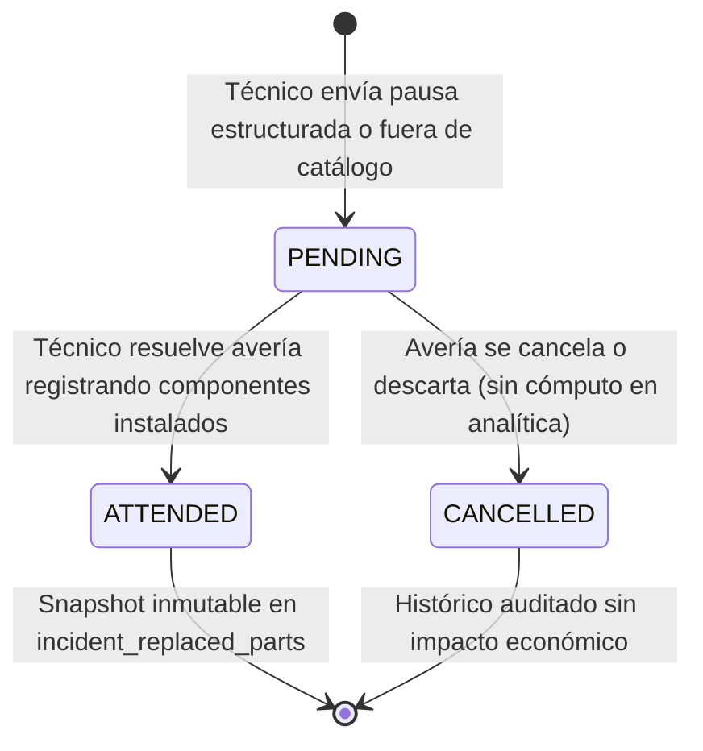

# PLAN DE IMPLEMENTACIÓN TÉCNICA · MÓDULO M2: CATÁLOGO DE REPUESTOS Y TRAZABILIDAD DE PIEZAS EN INTERVENCIÓN

**Proyecto:** Gestor de Incidencias de Vending (*VendGuard*)  
**Módulo:** `06-spare-parts` (Opción B: Control Operativo y Taller)  
**Documento:** `specs/06-spare-parts/plan.md`  
**Referencia Funcional:** [`specs/functional/spare_parts_spec.md`](../functional/spare_parts_spec.md) (RF-REP-01 a RF-REP-10, RNF-REP-01 a RNF-REP-05)  
**Contratos Técnicos y DDL:** [`specs/technical/spare_parts_contracts.md`](../technical/spare_parts_contracts.md)  
**Normativa Suprema:** [`constitution.md`](../../constitution.md) (Artículos I al VII)  
**Directrices Operativas:** [`AGENTS.md`](../../AGENTS.md) (SDD, Dogma Vanilla, Dualismo Lingüístico)  
**Sistema de Diseño Visual:** [`docs/design.md`](../../docs/design.md) (Inspiración Docker: Azul eléctrico `#2560ff`, fondo canvas `#f9fafb`, superficie `#ffffff`, bordes `#c8cfda`, radio binario conservador 4px/8px, texto `#2c333f`, acentos de alerta `#f8b60f`)  

---

## 1. Estructura de Módulos y Ficheros

El módulo implementa una arquitectura desacoplada **Clean Architecture / MVC Ligero** en el backend y componentes modulares en el frontend mediante **Vanilla ES Modules (Vue 3 Composition API)**, preservando el **Dogma Vanilla** (cero dependencias externas npm/Composer en runtime, cero bundlers de compilación) y el **Dualismo Lingüístico** (código, clases, entidades, métodos y esquemas en inglés técnico; interfaz de usuario, mensajes de error y documentación en castellano).

```text
gestor-incidencias-vending/
├── database/
│   ├── cloud_init.sql                                          # Esquema integral para despliegue en la nube (incluye migración 006)
│   └── migrations/
│       └── 006_spare_parts_catalog_and_traceability.sql        # Migración DDL idempotente (spare_parts, compatibilidades, solicitudes, consumos)
├── src/
│   ├── Core/
│   │   └── Domain/
│   │       ├── Model/
│   │       │   ├── SparePartCategory.php                       # Enum: HYDRAULIC, THERMAL, ELECTRONIC, MECHANICAL, PAYMENT_SYSTEM, CONSUMABLE, OTHER
│   │       │   ├── OldPartDestination.php                      # Enum: DESGUACE, TALLER (Art. VI: clasificación cerrada)
│   │       │   ├── SparePartRequestStatus.php                  # Enum: PENDING, ATTENDED, CANCELLED
│   │       │   ├── SparePart.php                               # Entidad maestro de repuesto (part_code, name, reference_cost, is_active)
│   │       │   ├── SparePartRequest.php                        # Entidad de solicitud estructurada en pausa técnica (incident_id, part, qty)
│   │       │   └── IncidentReplacedPart.php                    # Entidad de componente sustituido con snapshot inmutable de coste
│   │       ├── Exception/
│   │       │   ├── SparePartCodeExistsException.php            # Conflicto 409 por part_code duplicado
│   │       │   ├── IncompatibleSparePartException.php          # 422 si pieza no es compatible con el modelo de la máquina
│   │       │   ├── InvalidOutOfCatalogJustificationException.php # 422 si justificación de pieza fuera de catálogo < 20 caracteres
│   │       │   ├── InvalidPartQuantityException.php            # 422 si cantidad fuera del rango [1, 50]
│   │       │   └── SitePartsDataForbiddenException.php         # 403 si responsable de sede intenta acceder a piezas o costes (Art. V.4)
│   │       └── Repository/
│   │           ├── SparePartRepositoryInterface.php            # Contrato de persistencia del catálogo maestro y compatibilidades
│   │           ├── SparePartRequestRepositoryInterface.php     # Contrato de persistencia de solicitudes en pausa
│   │           └── IncidentReplacedPartRepositoryInterface.php # Contrato de persistencia de piezas sustituidas y analítica
│   ├── Application/
│   │   ├── DTO/
│   │   │   ├── ReplacedPartItemDTO.php                         # DTO de entrada para líneas de repuestos sustituidos (resolución/preventivo)
│   │   │   └── SparePartRequestItemDTO.php                     # DTO de entrada para líneas de repuestos solicitados en pausa
│   │   └── Service/
│   │       ├── SparePartCatalogService.php                     # Gestión CRUD catálogo, asociación de modelos, búsqueda y baja lógica (Art. III)
│   │       ├── SparePartTraceabilityService.php                # Pausa técnica estructurada, snapshot de costes en resolución y preventivos
│   │       └── SparePartAnalyticsService.php                   # Agregación analítica de costes, ranking de fallos, alertas crónicas y CSV
│   ├── Infrastructure/
│   │   └── Repository/
│   │       ├── PdoSparePartRepository.php                      # Implementación PDO de catálogo maestro y tabla de compatibilidades
│   │       ├── PdoSparePartRequestRepository.php               # Implementación PDO de solicitudes de repuesto en pausas
│   │       └── PdoIncidentReplacedPartRepository.php           # Implementación PDO de consumos con snapshot y agregaciones analíticas
│   └── Presentation/
│       ├── Controller/
│       │   ├── CoordinatorSparePartsController.php             # Endpoints REST catálogo, compatibilidades, analítica, CSV y revisión
│       │   ├── TechnicianSparePartsController.php              # Endpoints REST catálogo compatible en movilidad (< 250ms)
│       │   ├── TechnicianController.php                        # Modificación: pausa estructurada y resolución con snapshot de piezas
│       │   ├── TechnicianPreventiveController.php              # Modificación: completeInspection enriquecida con sustitución de piezas
│       │   └── LocationPortalController.php                    # Verificación/blindaje: proyección estricta excluyendo piezas y costes (Art. V.4)
│       └── Routing/
│           └── AppRouter.php                                   # Registro de rutas /api/coordinator/spare-parts/* y /api/technician/spare-parts/*
├── public/
│   └── assets/
│       └── js/
│           ├── components/
│           │   ├── CoordinatorSparePartsTab.js                 # Pestaña de Catálogo Maestro: CRUD, compatibilidad por modelo, activación
│           │   ├── CoordinatorSparePartsAnalyticsTab.js        # Pestaña Analítica: Ranking de piezas, costes por modelo/sede, alertas, CSV
│           │   ├── TechnicianSparePartsPauseModal.js           # Modal táctil de pausa técnica por repuesto estructurado o fuera de catálogo
│           │   └── TechnicianResolutionPartsBlock.js           # Bloque reactivo en modal de resolución: Sí/No, selector compatible, destino
│           └── app.js                                          # Inyección de pestañas 'repuestos' y 'analitica-repuestos' en barra de coordinador
└── tests/
    ├── unit/
    │   ├── SparePartCatalogServiceTest.php                     # Pruebas unitarias de gestión del catálogo maestro y modelos
    │   ├── SparePartTraceabilityServiceTest.php                # Pruebas unitarias de congelación de costes y solicitudes
    │   ├── SparePartAnalyticsServiceTest.php                   # Pruebas unitarias de cálculo de costes y alerta crónica (>3 en 90 días)
    │   ├── SparePartExceptionsTest.php                         # Pruebas unitarias de excepciones de dominio y validaciones
    │   ├── CoordinatorSparePartsTabTest.mjs                    # Pruebas frontend Node ESM del catálogo y cuadro analítico
    │   └── TechnicianSparePartsModalsTest.mjs                  # Pruebas frontend Node ESM de selectores táctiles de pausa y resolución
    └── integration/
        ├── CoordinatorSparePartsApiTest.php                    # Integración API catálogo, analítica, exportación CSV y transacciones
        ├── TechnicianSparePartsApiTest.php                     # Integración API catálogo compatible, pausa estructurada y cierre con snapshot
        └── SiteManagerPartsDataSegregationTest.php             # Blindaje constitucional Art. V.4: verificación de no exposición de repuestos/costes
```

---

## 2. Modelo de Datos Relacional y Contratos de API REST

### 2.1 Resumen de Endpoints y Roles de Acceso

| Método | Endpoint | Rol Mínimo | Propósito Operativo |
| :--- | :--- | :--- | :--- |
| **Coordinador** | | | |
| `GET` | `/api/coordinator/spare-parts` | `COORDINATOR` | Listado paginado/filtrado de piezas del catálogo maestro |
| `POST` | `/api/coordinator/spare-parts` | `COORDINATOR` | Creación de nuevo repuesto con asignación de modelos de máquina compatibles |
| `GET` | `/api/coordinator/spare-parts/{id}` | `COORDINATOR` | Detalle de repuesto, modelos compatibles y unidades instaladas |
| `PUT` | `/api/coordinator/spare-parts/{id}` | `COORDINATOR` | Edición de nombre, coste de referencia, fabricante y modelos compatibles |
| `PATCH` | `/api/coordinator/spare-parts/{id}/status` | `COORDINATOR` | Baja lógica (`is_active = 0`) o reactivación sin borrado físico (Art. III) |
| `GET` | `/api/coordinator/spare-parts/models` | `COORDINATOR` | Lista única de modelos de máquina existentes en el parque para selectores |
| `GET` | `/api/coordinator/spare-parts/analytics` | `COORDINATOR` | Panel analítico: Top piezas, costes por modelo/sede y alertas de fallos recurrentes |
| `GET` | `/api/coordinator/spare-parts/export` | `COORDINATOR` | Descarga de informe consolidado en formato CSV (`text/csv; charset=utf-8`) |
| `GET` | `/api/coordinator/spare-parts/requests/pending-review` | `COORDINATOR` | Bandeja de incidencias con piezas fuera de catálogo pendientes de revisión |
| **Técnico de Ruta** | | | |
| `GET` | `/api/technician/spare-parts/catalog` | `TECHNICIAN` | Catálogo de piezas compatibles con la máquina intervenida ($< 250\text{ ms}$) |
| `PATCH` | `/api/technician/incidents/{id}/pause` | `TECHNICIAN` | Pausa estructurada (`PENDING_PARTS`) por repuesto compatible o fuera de catálogo |
| `POST` | `/api/technician/incidents/{id}/resolve` | `TECHNICIAN` | Resolución de correctivo declarando piezas, destino (`DESGUACE`/`TALLER`) y snapshot |
| `POST` | `/api/technician/preventive/orders/{id}/complete` | `TECHNICIAN` | Cierre preventivo M05 con registro opcional de repuestos sustituidos y snapshot |
| **Responsable de Sede** | | | |
| * | `/api/location/*` | `LOCATION_MANAGER` | **Segregación Art. V.4:** Respuestas JSON sin tablas de repuestos ni costes |

---

## 3. Algoritmos Clave en Pseudocódigo y Máquinas de Estado

### 3.1 Algoritmo de Snapshot Inmutable de Costes al Resolver (RF-REP-06, Art. III)
Garantiza que el coste unitario del repuesto quede congelado en el momento exacto de la intervención, blindándolo frente a posteriores fluctuaciones de precio en el catálogo maestro.

```text
ALGORITMO resolveIncidentWithParts(incidentId, technicianId, diagnosis, action, replacedPartsDeclared, replacedPartsList):
    INICIAR TRANSACCIÓN PDO
    
    1. Validar que la incidencia existe y pertenece a technicianId.
    2. Validar que la incidencia está en estado IN_PROGRESS.
    3. Validar longitud de diagnosis >= 20 y action >= 20 (Constitución Art. V.1).
    
    SI replacedPartsDeclared ES VERDADERO:
        SI longitud(replacedPartsList) == 0:
            LANZAR Excepción EMPTY_REPLACED_PARTS_LIST ("Debe registrar al menos un repuesto").
            
        totalPartsCost = 0.00
        
        PARA CADA item EN replacedPartsList:
            Validar 1 <= item.quantity <= 50.
            Validar item.oldPartDestination EN ['DESGUACE', 'TALLER'].
            
            SI item.isOutOfCatalog ES FALSO:
                sparePart = sparePartRepo.findById(item.sparePartId)
                SI sparePart ES NULO:
                    LANZAR Excepción SPARE_PART_NOT_FOUND.
                
                // Obtener coste de referencia vigente para congelar el snapshot
                unitCostSnapshot = sparePart.referenceCost
                customName = NULO
                partId = sparePart.id
            SINO:
                Validar longitud(item.customPartName) >= 3.
                unitCostSnapshot = 0.00  // Coste provisional no valorado
                customName = item.customPartName
                partId = NULO
            
            // Insertar línea de consumo congelada
            incidentReplacedPartRepo.insert({
                interventionType: 'INCIDENT',
                incidentId: incidentId,
                preventiveOrderId: NULO,
                machineId: incident.machineId,
                locationId: incident.locationId,
                technicianId: technicianId,
                sparePartId: partId,
                isOutOfCatalog: item.isOutOfCatalog,
                customPartName: customName,
                quantity: item.quantity,
                unitCostSnapshot: unitCostSnapshot,
                oldPartDestination: item.oldPartDestination,
                notes: item.notes,
                installedAt: AHORA()
            })
            
            totalPartsCost += (item.quantity * unitCostSnapshot)
        FIN PARA
        
        // Marcar solicitudes previas de repuestos pendientes como atendidas
        sparePartRequestRepo.markAttendedByIncident(incidentId)
    FIN SI
    
    4. Actualizar estado de incidencia a RESOLVED con diagnosis, action y resolvedAt = AHORA().
    5. Registrar en incident_history y audit_log.
    
    CONFIRMAR TRANSACCIÓN PDO
    RETORNAR éxito con totalPartsCost consolidado.
FIN ALGORITMO
```

### 3.2 Algoritmo de Detección de Fallos Recurrentes / Crónicos (RF-REP-08)
Identifica máquinas con más de 3 sustituciones del mismo componente en un intervalo móvil de 90 días naturales:

```text
ALGORITMO detectChronicFailures(windowDays = 90, threshold = 3):
    sinceDate = FECHA_ACTUAL() - windowDays DÍAS
    
    alerts = []
    records = incidentReplacedPartRepo.findReplacementsGroupedByMachineAndPart(sinceDate)
    
    PARA CADA group EN records:
        SI group.replacementCount > threshold:
            daysElapsed = DIAS_ENTRE(group.firstReplacementAt, group.lastReplacementAt)
            
            alert = {
                machineId: group.machineId,
                machineCode: group.machineCode,
                machineModel: group.machineModel,
                locationName: group.locationName,
                partCode: group.partCode,
                partName: group.partName,
                replacementsCount: group.replacementCount,
                threshold: threshold,
                firstReplacementAt: group.firstReplacementAt,
                lastReplacementAt: group.lastReplacementAt,
                severity: (group.replacementCount >= 5) ? 'CRITICAL' : 'WARNING',
                warningMessage: "Componente con Fallo Recurrente (" + group.replacementCount + 
                                " sustituciones en " + daysElapsed + " días)"
            }
            alerts.AGREGAR(alert)
        FIN SI
    FIN PARA
    
    RETORNAR alerts
FIN ALGORITMO
```

### 3.3 Ciclo de Vida de Solicitudes de Repuesto



---

## 4. Arquitectura de Componentes Frontend (Vanilla ES Modules / Vue 3)

### 4.1 Componentes de Coordinación
1. **`CoordinatorSparePartsTab.js`**:
   - Barra superior con buscador en tiempo real, filtro por categoría de repuesto y filtro por modelo de máquina.
   - Tabla reactiva con código, denominación, fabricante, coste de referencia (con formato monetario `28,50 €`), modelos compatibles en *badges* y estado operativo (conmutador *toggle* para baja lógica).
   - Modal de Alta / Edición de Repuesto: formulario con selector múltiple de modelos compatibles poblado dinámicamente desde `/api/coordinator/spare-parts/models`.

2. **`CoordinatorSparePartsAnalyticsTab.js`**:
   - Tarjetas KPI: Total piezas sustituidas en período, Gasto total en repuestos (€) y Máquinas con fallos recurrentes detectados.
   - Bloque de Alertas Crónicas: Banners destacados en amarillo/rojo indicando la máquina, modelo, pieza y tasa de sustitución con enlace directo a la máquina.
   - Tabla de Clasificación (*Top Replaced Parts*): Ranking de piezas ordenado por volumen o coste acumulado, con desglose de destino (`DESGUACE` vs `TALLER`).
   - Botón de Acción Principal: **"Exportar Consumos a CSV"** con descarga directa en el navegador.
   - Pestaña secundaria de "Revisiones Pendientes": Lista incidencias que usaron piezas fuera de catálogo con la justificación del técnico y botón para crear el repuesto formalmente en el catálogo maestro.

### 4.2 Componentes de Técnico de Campo (Mobile-First $< 360\text{ px}$)
1. **`TechnicianSparePartsPauseModal.js`**:
   - Se abre al pulsar el botón "Pausar por Repuesto" en la tarjeta de intervención.
   - Conmutador inicial: *Pieza de catálogo* vs *Pieza fuera de catálogo*.
   - Modo Catálogo: Desplegable con repuestos compatibles con la máquina cargados dinámicamente desde `/api/technician/spare-parts/catalog?machine_id={id}`. Selector de unidades con botones grandes `+` y `-` (1 a 50).
   - Modo Fuera de Catálogo: Textarea obligatoria con contador dinámico de caracteres ($\ge 20$) que desactiva el botón de confirmación hasta alcanzar el mínimo reglamentario.

2. **`TechnicianResolutionPartsBlock.js`**:
   - Insertado en el modal de resolución técnica de averías (`TechnicianIncidentModal.js`).
   - Pregunta obligatoria con botones táctiles grandes: **"¿Se sustituyeron componentes físicos?"** [ Sí ] / [ No ].
   - Si se pulsa [ Sí ]: Despliega lista dinámica donde añadir líneas. Cada línea incluye:
     - Selector de pieza compatible.
     - Selector de cantidad.
     - Conmutador de destino táctil: `[ DESGUACE ]` | `[ TALLER ]`.
     - Campo opcional de observaciones.
   - Si se pulsa [ No ]: Oculta el bloque y permite el cierre convencional con diagnóstico y acción.

3. **Integración en `TechnicianChecklistModal.js` (Módulo 05)**:
   - Al final del checklist normativo de inspección preventiva, se incorpora la sección opcional de sustitución de componentes periódicos (juntas tóricas, filtros, etc.) bajo la misma interfaz intuitiva.

### 4.3 Conformidad con el Sistema de Diseño Visual (`docs/design.md`)
Todos los componentes frontend nuevos y modificados respetan estrictamente la guía de estilo corporativa:
* **Paleta Cromática Docker:**
  - **Voltaje Primario:** Azul eléctrico `#2560ff` (hover: `#0d4df2`, active: `#003db5`) para botones de acción principal (guardar repuesto, exportar CSV, confirmar pausa/resolución), enlaces y anillos de foco.
  - **Superficies y Fondos:** Lienzo neutro `#f9fafb`, tarjetas y modales en blanco puro `#ffffff` con borde hairline `#c8cfda`.
  - **Tipografía y Tinta:** Inter en pesos 400 y 500 sobre texto dark slate `#2c333f`, texto atenuado en `#6c7e9d`.
  - **Estados Semánticos:** Advertencia amarilla `#f8b60f` para alertas de fallos recurrentes / crónicos (> 3 en 90 días); éxito verde `#38bd7d` para piezas operativas y guardados conformes; peligro rojo `#ff5757` (fondo `#fddfdf`) para descartes y bajas lógicas.
* **Escala Binaria Conservadora de Bordes Redondeados:**
  - **4px (`rounded.xs`):** Botones (`.btn`), campos de texto (`input`, `textarea`, `select`), chips y *badges* de compatibilidad/categoría.
  - **8px (`rounded.sm`):** Tarjetas contenedoras (`.card`), paneles analíticos y cuadros modales flotantes. (Sin píldoras exageradas de 16/24px).
* **Diseño Táctil y Mobile-First:**
  - Áreas interactivas con altura mínima de 44px en selectores móviles de técnico (botones `+` y `-` para cantidades y conmutadores `[ DESGUACE ]` / `[ TALLER ]`).
  - Totalmente operable a una mano sin necesidad de zoom ni scroll horizontal en pantallas de 360px de ancho.

---

## 5. Blindaje Constitucional y Decisiones de Diseño Justificadas

### 5.1 Segregación Total de Datos (Constitución Art. V.4)
* **Precepto:** *"Los usuarios informadores (responsables de ubicación) jamás tendrán acceso a notas internas de taller, teléfonos personales de los técnicos ni costes económicos de los repuestos."*
* **Implementación:** 
  * En la capa de base de datos y repositorios, los métodos invocados por `LocationPortalController` nunca ejecutan `JOIN` con `incident_replaced_parts` ni `spare_part_requests`.
  * La clase `LocationPortalController` pasa por una prueba de integración específica (`SiteManagerPartsDataSegregationTest.php`) que inspecciona recursivamente los payloads JSON retornados hacia el usuario de sede para certificar que no contienen las claves `replaced_parts`, `spare_parts`, `unit_cost_snapshot`, `total_cost_snapshot` ni `reference_cost`.

### 5.2 Prohibición de Borrado Físico (Constitución Art. III.1)
* **Precepto:** *"Queda terminantemente prohibido ejecutar sentencias de eliminación destructiva (DELETE FROM) sobre entidades maestras y operativas."*
* **Implementación:** 
  * La tabla `spare_parts` dispone de `is_active TINYINT(1) DEFAULT 1` y `deleted_at DATETIME NULL`.
  * Toda desactivación se realiza mediante `PATCH /api/coordinator/spare-parts/{id}/status` asignando `is_active = 0`.
  * Los selectores móviles para nuevas averías filtran por `is_active = 1`, pero las averías históricas o pausadas previamente con dicha pieza conservan intacta la integridad referencial.

### 5.3 Prevención de Feature Creep y Minimalismo (Constitución Art. IV y Art. VI)
* **Precepto:** *"Foco exclusivo en el MVP [...] Anti-Feature Creep".*
* **Decisión Técnica:** Se descartó implementar un submódulo de inventario físico de furgonetas con descuento de stock en tiempo real o albaranes de custodia nominal para taller. El destino (`DESGUACE` o `TALLER`) es un metadato tipado en la línea de intervención que alimenta la analítica de recuperación de materiales sin sobrecargar la arquitectura.

---

## 6. Estrategia de Pruebas (Unitarias, Integración y Regresión)

### 6.1 Pruebas Unitarias PHP (Backend)
1. **`SparePartCatalogServiceTest.php`**:
   - Creación de repuestos con modelos compatibles.
   - Rechazo de códigos duplicados (`SparePartCodeExistsException`).
   - Baja lógica preservando registros históricos.
2. **`SparePartTraceabilityServiceTest.php`**:
   - Pausa estructurada y rechazo de solicitudes sin piezas.
   - Validación de justificación $\ge 20$ caracteres en piezas no catalogadas.
   - Snapshot inmutable: verificación de que cambios posteriores en `reference_cost` no alteran los consumos registrados.
3. **`SparePartAnalyticsServiceTest.php`**:
   - Cálculo exacto de costes acumulados por modelo y sede.
   - Disparo de alerta crónica ante $> 3$ sustituciones en 90 días en la misma máquina.
   - Generación de contenido CSV con cabeceras y codificación correcta.

### 6.2 Pruebas Reactivas Frontend (Node.js ESM)
1. **`CoordinatorSparePartsTabTest.mjs`**:
   - Renderizado reactivo de la tabla de repuestos y filtros combinados.
   - Apertura y validación del modal de alta de repuestos.
2. **`TechnicianSparePartsModalsTest.mjs`**:
   - Comportamiento del modal de pausa: conmutación entre catálogo y pieza fuera de catálogo.
   - Bloque de resolución: obligatoriedad de la pregunta Sí/No y cálculo dinámico de subtotales.

### 6.3 Pruebas de Integración HTTP (MariaDB Real)
1. **`CoordinatorSparePartsApiTest.php`**:
   - Flujo completo de CRUD de repuestos sobre base de datos de test.
   - Endpoint de analítica y exportación CSV con autenticación de coordinador.
2. **`TechnicianSparePartsApiTest.php`**:
   - Flujo móvil: consulta de catálogo compatible $\to$ pausa técnica estructurada $\to$ resolución con congelación de snapshot de coste.
3. **`SiteManagerPartsDataSegregationTest.php`**:
   - Verificación exhaustiva de que ninguna respuesta de API del portal de sede contiene datos ni costes de repuestos (Art. V.4).

---

## 7. Matriz de Trazabilidad de Requisitos

| Requisito | Descripción | Componente Backend / Frontend | Prueba de Verificación |
| :--- | :--- | :--- | :--- |
| **RF-REP-01** | Catálogo Maestro y Compatibilidad por Modelo | `PdoSparePartRepository`, `SparePartCatalogService` | `SparePartCatalogServiceTest` |
| **RF-REP-02** | Edición, Baja Lógica y Preservación en Curso | `CoordinatorSparePartsController`, `SparePartCatalogService` | `CoordinatorSparePartsApiTest` |
| **RF-REP-03** | Solicitud Normalizada en Pausa (sin texto libre) | `TechnicianController`, `SparePartTraceabilityService` | `TechnicianSparePartsApiTest` |
| **RF-REP-04** | Pieza Fuera de Catálogo con Justificación | `TechnicianSparePartsPauseModal`, `SparePartTraceabilityService` | `SparePartTraceabilityServiceTest` |
| **RF-REP-05** | Declaración Obligatoria de Sustitución (Sí/No) | `TechnicianResolutionPartsBlock`, `TechnicianController` | `TechnicianSparePartsModalsTest` |
| **RF-REP-06** | Registro de Piezas, Destino y Snapshot de Coste | `PdoIncidentReplacedPartRepository`, `TechnicianController` | `TechnicianSparePartsApiTest` |
| **RF-REP-07** | Coexistencia con Preventivos (Módulo 05) | `TechnicianPreventiveController`, `PdoIncidentReplacedPartRepository` | `TechnicianPreventiveApiTest` |
| **RF-REP-08** | Panel Analítico y Alertas de Fallos Recurrentes | `SparePartAnalyticsService`, `CoordinatorSparePartsAnalyticsTab` | `SparePartAnalyticsServiceTest` |
| **RF-REP-09** | Exportación de Datos en Formato CSV | `SparePartAnalyticsService`, `CoordinatorSparePartsController` | `CoordinatorSparePartsApiTest` |
| **RF-REP-10** | Segregación Estricta de Datos para Sede (Art. V.4) | `LocationPortalController`, Middleware de Seguridad | `SiteManagerPartsDataSegregationTest` |
| **RNF-REP-01** | Inviolabilidad e Inmutabilidad de Trazabilidad | Tablas relacionales con soft delete y snapshot | `ConstitutionalAuditTest` |
| **RNF-REP-02** | Rendimiento en Movilidad ($< 250\text{ ms}$) | Consulta indexada por modelo de máquina | `TechnicianSparePartsApiTest` |
| **RNF-REP-03** | Usabilidad Móvil Táctil ($< 360\text{ px}$) | Componentes adaptativos con botones táctiles grandes | `TechnicianSparePartsModalsTest` |
| **RNF-REP-04** | Moneda y Precisión Decimal Inmutable | Campos `DECIMAL(10,2)` en MariaDB y PHP | `SparePartTraceabilityServiceTest` |
| **RNF-REP-05** | Minimalismo Tecnológico y Cero Bloatware | PHP 8.2+ nativo con PDO y Vue 3 ES Modules | `run_all.php` (100% verde sin dependencias) |

---

## 8. Garantía de Dogma Vanilla y Dualismo Lingüístico

* **Backend:** PHP 8.2+ con `declare(strict_types=1);`, clases POO con tipado estricto, inyección de dependencias por constructor y acceso a datos exclusivamente mediante **PDO** con sentencias preparadas.
* **Frontend:** Vue 3 Composition API cargado vía ES Modules nativos desde el navegador (`/assets/js/components/*.js`), sin compiladores (Vite, Webpack), sin npm ni dependencias de terceros.
* **Dualismo Lingüístico:**
  * **Inglés:** Clases (`SparePart`, `SparePartCatalogService`, `IncidentReplacedPart`), métodos (`getCompatiblePartsByModel`, `recordReplacedParts`), variables, nombres de ficheros y esquemas DDL.
  * **Español:** Textos de interfaz de usuario, títulos de pestañas, etiquetas de formularios, mensajes de validación y de error HTTP, comentarios explicativos de código y documentación funcional.
