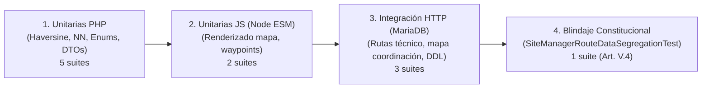

# PLAN DE IMPLEMENTACIÓN TÉCNICA · MÓDULO M4: MAPA INTERACTIVO DE RUTAS Y GEORREFERENCIACIÓN

**Proyecto:** Gestor de Incidencias de Vending (*VendGuard*)  
**Módulo:** `07-route-map` (Opción D: Logística de Campo)  
**Documento:** `specs/07-route-map/plan.md`  
**Referencia Funcional:** [`specs/functional/route_map_spec.md`](../functional/route_map_spec.md) (RF-MAP-01 a RF-MAP-10, RNF-MAP-01 a RNF-MAP-06)  
**Contratos Técnicos y DDL:** [`specs/technical/route_map_contracts.md`](../technical/route_map_contracts.md)  
**Normativa Suprema:** [`constitution.md`](../../constitution.md) (Artículos I al VII)  
**Directrices Operativas:** [`AGENTS.md`](../../AGENTS.md) (SDD, Dogma Vanilla, Dualismo Lingüístico)  
**Sistema de Diseño Visual:** [`docs/design.md`](../../docs/design.md) (Inspiración Docker: Azul eléctrico `#2560ff`, fondo canvas `#f9fafb`, superficie `#ffffff`, bordes `#c8cfda`, radio binario conservador 4px/8px, texto `#2c333f`, acentos de alerta `#f8b60f` y crítico `#e02424`)  

---

## 1. Estructura de Módulos y Ficheros

El módulo implementa una arquitectura desacoplada **Clean Architecture / MVC Ligero** en el backend y componentes modulares en el frontend mediante **Vanilla ES Modules (Vue 3 Composition API)**, preservando el **Dogma Vanilla** (cero dependencias externas npm/Composer en runtime, cero bundlers de compilación) y el **Dualismo Lingüístico** (código, clases, entidades, métodos y esquemas en inglés técnico; interfaz de usuario, mensajes de error y documentación en castellano).

```text
gestor-incidencias-vending/
├── database/
│   ├── cloud_init.sql                                          # Esquema integral para despliegue en la nube (incluye migración 007)
│   └── migrations/
│       └── 007_field_logistics_map.sql                         # Migración DDL: lat/lng en locations, tabla route_settings y semillas
├── src/
│   ├── Core/
│   │   └── Domain/
│   │       ├── Model/
│   │       │   ├── StopStatus.php                              # Enum: IN_PROGRESS, PENDING, COMPLETED
│   │       │   ├── StopPriority.php                            # Enum: CRITICAL, ORDINARY
│   │       │   ├── Location.php                                # Modificación: soporte de latitud y longitud obligatorias
│   │       │   ├── RouteStop.php                               # Entidad de parada consolidada de ruta con tareas agrupadas
│   │       │   ├── TechnicianRouteMap.php                      # Entidad raíz de ruta ordenada, origen y enlaces universales
│   │       │   └── RouteSettings.php                           # Entidad de configuración de Base Central y bounding box operativo
│   │       ├── Exception/
│   │       │   ├── InvalidCoordinatesException.php             # 422 si latitud o longitud no son numéricas o fuera de rango [-90,90]
│   │       │   ├── CoordinatesOutOfBoundsException.php         # 422 si coordenadas están fuera del territorio operativo permitido
│   │       │   └── SiteRouteDataForbiddenException.php         # 403 si responsable de sede intenta acceder a rutas o mapas (Art. V.4)
│   │       └── Repository/
│   │           ├── LocationRepositoryInterface.php             # Modificación: persistencia con latitud/longitud
│   │           └── RouteSettingsRepositoryInterface.php        # Contrato de persistencia de Base Central y parámetros de ruta
│   ├── Application/
│   │   ├── DTO/
│   │   │   ├── CoordinatesDTO.php                              # DTO inmutable de coordenadas geográficas validadas
│   │   │   └── RouteOriginDTO.php                              # DTO de punto de origen (GPS móvil o Base Central fallback)
│   │   └── Service/
│   │       ├── GeoDistanceService.php                          # Cálculo geodésico exacto en PHP puro (Haversine) y geofencing
│   │       ├── RouteOptimizationService.php                    # Algoritmo híbrido determinista de 4 fases (en curso -> SLA -> NN)
│   │       └── RouteSettingsService.php                        # Gestión administrativa de la Base Central y marco de operaciones
│   ├── Infrastructure/
│   │   ├── Database/
│   │   │   └── SeedRunner.php                                  # Modificación: coordenadas reales para SEDE-BCN-01 y SEDE-BCN-02
│   │   └── Repository/
│   │       ├── PdoLocationRepository.php                       # Modificación: lectura/escritura de latitud/longitud en MariaDB
│   │       └── PdoRouteSettingsRepository.php                  # Implementación PDO de configuración de Base Central
│   └── Presentation/
│       ├── Controller/
│       │   ├── TechnicianRouteMapController.php                # Endpoint REST: GET /api/technician/route/map
│       │   ├── CoordinatorRouteMapController.php               # Endpoints REST: mapa de averías activas y configuración de Base Central
│       │   └── AdminLocationController.php                     # Modificación: validación obligatoria de lat/lng en alta y edición
│       └── Routing/
│           └── AppRouter.php                                   # Registro de rutas de técnico y coordinación
├── public/
│   └── assets/
│       └── js/
│           ├── components/
│           │   ├── TechnicianRouteMapModal.js                  # Modal/Vista responsive móvil del mapa de ruta con marcadores numerados
│           │   ├── CoordinatorTerritorialMapTab.js             # Pestaña de Coordinación: mapa de averías territoriales y multi-técnico
│           │   └── AdminLocationsTab.js                        # Modificación: geocodificación asistida y selector de coordenadas
│           ├── views/
│           │   └── TechnicianRouteView.js                      # Modificación: integración de botón de mapa y navegación directa por parada
│           └── app.js                                          # Inyección de pestaña 'mapa-territorial' en barra de coordinación
└── tests/
    ├── unit/
    │   ├── GeoDistanceServiceTest.php                          # Pruebas unitarias de fórmula de Haversine y validación de bounding box
    │   ├── RouteOptimizationServiceTest.php                    # Pruebas unitarias del algoritmo híbrido (IN_PROGRESS, SLA crítico, NN)
    │   ├── RouteSettingsServiceTest.php                        # Pruebas unitarias de configuración de Base Central
    │   ├── RouteDomainModelsTest.php                           # Pruebas unitarias de entidades RouteStop, TechnicianRouteMap y Enums
    │   ├── RouteExceptionsTest.php                             # Pruebas unitarias de excepciones de dominio y códigos HTTP
    │   ├── TechnicianRouteMapModalTest.mjs                     # Pruebas frontend Node ESM del mapa de técnico y navegación
    │   └── CoordinatorTerritorialMapTabTest.mjs                # Pruebas frontend Node ESM del mapa de triaje y alertas multi-técnico
    └── integration/
        ├── TechnicianRouteMapApiTest.php                       # Integración HTTP de ruta del técnico con DB real (fallback GPS, SLA, NN)
        ├── CoordinatorRouteMapApiTest.php                      # Integración HTTP de mapa global de averías y settings de Base Central
        ├── PdoRouteSettingsRepositoryTest.php                  # Integración PDO de repositorio de settings
        └── SiteManagerRouteDataSegregationTest.php             # Blindaje constitucional Art. V.4: bloqueo 403 para rol LOCATION_MANAGER
```

---

## 2. Modelo de Datos Relacional (DDL) y Contratos de API REST

### 2.1 Modelo Relacional y Migración SQL (`007_field_logistics_map.sql`)

```sql
-- 1. Ampliación de tabla LOCATIONS con coordenadas geográficas obligatorias
ALTER TABLE `locations`
ADD COLUMN `latitude` DECIMAL(10, 7) NOT NULL DEFAULT 41.3850640 AFTER `address`,
ADD COLUMN `longitude` DECIMAL(11, 7) NOT NULL DEFAULT 2.1734035 AFTER `latitude`;

CREATE INDEX `idx_locations_lat_lng` ON `locations` (`latitude`, `longitude`, `is_active`);

-- 2. Tabla de Configuración Operativa de Ruta y Base Central
CREATE TABLE IF NOT EXISTS `route_settings` (
    `id` INT UNSIGNED AUTO_INCREMENT PRIMARY KEY,
    `base_name` VARCHAR(100) NOT NULL DEFAULT 'Base Central VendGuard Barcelona',
    `base_address` VARCHAR(255) NOT NULL DEFAULT 'Carrer de la Marina 100, 08018 Barcelona',
    `base_latitude` DECIMAL(10, 7) NOT NULL DEFAULT 41.3935000,
    `base_longitude` DECIMAL(11, 7) NOT NULL DEFAULT 2.1890000,
    `operational_radius_km` INT UNSIGNED NOT NULL DEFAULT 100,
    `min_latitude` DECIMAL(10, 7) NOT NULL DEFAULT 27.0000000,
    `max_latitude` DECIMAL(10, 7) NOT NULL DEFAULT 44.5000000,
    `min_longitude` DECIMAL(11, 7) NOT NULL DEFAULT -18.5000000,
    `max_longitude` DECIMAL(11, 7) NOT NULL DEFAULT 5.0000000,
    `created_at` DATETIME NOT NULL DEFAULT CURRENT_TIMESTAMP,
    `updated_at` DATETIME NOT NULL DEFAULT CURRENT_TIMESTAMP ON UPDATE CURRENT_TIMESTAMP
) ENGINE=InnoDB DEFAULT CHARSET=utf8mb4 COLLATE=utf8mb4_unicode_ci;

-- Fila singleton de configuración inicial
INSERT INTO `route_settings` (`id`, `base_name`, `base_address`, `base_latitude`, `base_longitude`)
VALUES (1, 'Base Central VendGuard Barcelona', 'Carrer de la Marina 100, 08018 Barcelona', 41.3935000, 2.1890000)
ON DUPLICATE KEY UPDATE `base_name` = VALUES(`base_name`);

-- 3. Actualización de coordenadas para sedes preexistentes (idempotente)
UPDATE `locations` SET `latitude` = 41.3853120, `longitude` = 2.1932450 WHERE `site_code` = 'SEDE-BCN-01';
UPDATE `locations` SET `latitude` = 41.4036290, `longitude` = 2.1895120 WHERE `site_code` = 'SEDE-BCN-02';
```

### 2.2 Resumen de Endpoints REST y Matriz RBAC

| Método | Endpoint | Rol Mínimo | Propósito Operativo |
| :--- | :--- | :--- | :--- |
| `GET` | `/api/technician/route/map` | `TECHNICIAN` | Obtiene paradas consolidadas, secuencia ordenada y URLs de navegación Google Maps |
| `GET` | `/api/coordinator/map/active-incidents` | `COORDINATOR` | Visualización cartográfica global de sedes con averías y preventivos activos |
| `GET` | `/api/coordinator/route/settings` | `COORDINATOR` | Consulta de parámetros y coordenadas de la Base Central |
| `PUT` | `/api/coordinator/route/settings` | `COORDINATOR` | Actualización de la Base Central y límites de cobertura |
| `POST` | `/api/coordinator/locations` | `COORDINATOR` | Creación de Sede (exige obligatoriamente `latitude` y `longitude` válidas) |
| `PUT` | `/api/coordinator/locations/{id}` | `COORDINATOR` | Edición de Sede (exige obligatoriamente `latitude` y `longitude` válidas) |
| *Cualquiera* | *Endpoints de ruta/mapa* | `LOCATION_MANAGER` | **403 Forbidden** (Segregación y privacidad laboral, Art. V.4) |

---

## 3. Algoritmos Clave en Pseudocódigo

### 3.1 Fórmula Geodésica de Haversine en PHP Puro (`GeoDistanceService`)

```php
public function calculateDistanceKm(float $lat1, float $lon1, float $lat2, float $lon2): float
{
    $earthRadiusKm = 6371.0;

    $dLat = deg2rad($lat2 - $lat1);
    $dLon = deg2rad($lon2 - $lon1);

    $a = sin($dLat / 2) * sin($dLat / 2) +
         cos(deg2rad($lat1)) * cos(deg2rad($lat2)) *
         sin($dLon / 2) * sin($dLon / 2);

    $c = 2 * atan2(sqrt($a), sqrt(1 - $a));

    return round($earthRadiusKm * $c, 2);
}
```

### 3.2 Algoritmo de Secuenciación Híbrida de 4 Fases (`RouteOptimizationService`)

```text
ALGORITMO OptimizeTechnicianRoute(technicianId, originCoordinates):
    1. Cargar todas las tareas activas asignadas a technicianId:
       - Incidencias con status IN ('ASSIGNED', 'IN_PROGRESS')  [EXCLUIR 'PENDING_PARTS']
       - Preventivos con status IN ('ASSIGNED')
    
    2. Agrupar tareas por LocationId (Sede física):
       Para cada sede:
         - Calcular totalTasks, completedTasks
         - Determinar status: Si alguna tarea está 'IN_PROGRESS' -> STOP_STATUS = 'IN_PROGRESS'
                              Si todas completadas -> STOP_STATUS = 'COMPLETED'
                              Si no -> STOP_STATUS = 'PENDING'
         - Determinar criticidad: Si alguna tarea es perecedera ('PERISHABLE_FOOD' con criticidad crítica)
                                  -> STOP_PRIORITY = 'CRITICAL'
                                  Si no -> STOP_PRIORITY = 'ORDINARY'
         - Calcular fecha límite SLA más inminente entre las tareas de la sede
    
    3. Fase 1: Identificar Parada en Curso:
       Si existe una parada con STOP_STATUS == 'IN_PROGRESS':
           Marcarla como Parada #1 inamovible de la secuencia.
           Eliminarla del conjunto de paradas pendientes por ordenar.
           puntoReferencia = coordenadas de Parada #1
       Si no:
           puntoReferencia = originCoordinates (GPS del móvil o Base Central)
    
    4. Fase 2: Paradas Críticas por SLA (Constitución Art. II):
       Filtrar paradas pendientes con STOP_PRIORITY == 'CRITICAL'.
       Ordenar las paradas críticas entre sí por 'sla_due_at' ASC (la más inminente primero).
       Para cada parada crítica ordenada:
           Añadir a la secuencia ordenada.
           Calcular distancia desde puntoReferencia.
           puntoReferencia = coordenadas de esta parada crítica.
           Eliminar de paradas pendientes.
    
    5. Fase 3: Paradas Ordinarias Restantes (Nearest Neighbor):
       Mientras queden paradas ordinarias pendientes:
           Encontrar la parada 'P' no visitada que minimice calculateDistanceKm(puntoReferencia, P.coordinates).
           Añadir 'P' a la secuencia ordenada con su orden correlativo.
           Calcular distancia parcial desde puntoReferencia.
           puntoReferencia = P.coordinates.
           Eliminar 'P' de pendientes.
    
    6. Fase 4: Generar Enlaces Universales de Google Maps:
       Para cada parada:
           navigationUrl = "https://www.google.com/maps/dir/?api=1&destination=" + lat + "," + lng + "&travelmode=driving"
       
       fullRouteUrl = ConstruirUrlConWaypoints(originCoordinates, secuenciaParadas, maxWaypoints=9)
    
    7. Retornar TechnicianRouteMap con la secuencia, resumen y URLs.
```

### 3.3 Generación de Enlace con Puntos de Paso (Waypoints)

```text
ALGORITMO ConstruirUrlConWaypoints(origin, orderedStops, maxWaypoints = 9):
    Si orderedStops está vacío:
        Retornar ""
    
    Si longitud(orderedStops) == 1:
        destino = orderedStops[0]
        Retornar "https://www.google.com/maps/dir/?api=1&origin=" + origin.lat + "," + origin.lng + 
                 "&destination=" + destino.lat + "," + destino.lng + "&travelmode=driving"
    
    puntosIntermedios = orderedStops[0 hasta MIN(longitud-2, maxWaypoints-1)]
    destinoFinal = orderedStops[MIN(longitud-1, maxWaypoints)]
    
    waypointsStr = puntosIntermedios.map(p => p.lat + "," + p.lng).join("%7C")
    
    url = "https://www.google.com/maps/dir/?api=1" +
          "&origin=" + origin.lat + "," + origin.lng +
          "&destination=" + destinoFinal.lat + "," + destinoFinal.lng +
          (waypointsStr != "" ? "&waypoints=" + waypointsStr : "") +
          "&travelmode=driving"
          
    Retornar url
```

---

## 4. Arquitectura de Componentes Frontend Vanilla (Vue.js 3 ES Modules)

El frontend no utiliza librerías npm ni empaquetadores en tiempo de compilación. Se estructura en tres componentes reactivos desacoplados:

### 4.1 Componente: `TechnicianRouteMapModal.js`
* **Ámbito:** Vista móvil vertical del Técnico (`TechnicianRouteView.js`).
* **Responsabilidades:**
  * Solicitar coordenadas del navegador mediante `navigator.geolocation.getCurrentPosition()`.
  * Si el usuario rechaza los permisos o hay error de timeout, invocar el endpoint sin parámetros para recibir el fallback de la Base Central con aviso informativo no intrusivo.
  * Renderizar el mapa de ruta táctil mediante capa ligera estándar de teselas públicas o lienzo SVG vectorial interactivo.
  * Mostrar marcadores circulares con número secuencial (1, 2, 3...) y color semántico institucional (rojo para críticos, azul para ordinarios, ámbar para en progreso, gris para completados).
  * Ficha flotante al tocar cualquier marcador con resumen de sede, contador de máquinas pendientes y botón prominente *"Navegar con GPS"*.
  * Botón general en cabecera: *"Abrir ruta completa en Google Maps"*.

### 4.2 Componente: `CoordinatorTerritorialMapTab.js`
* **Ámbito:** Panel de Supervisión y Triaje de Coordinación (`CoordinatorDashboardView.js`).
* **Responsabilidades:**
  * Renderizar mapa territorial a pantalla ancha con todas las sedes del parque que alberguen averías o preventivos abiertos.
  * Leyenda de colores: rojo (crítico/perecederos), azul (ordinario/snacks/bebidas), verde (preventivo puro).
  * Marcadores con insignia numérica indicando el total de máquinas pendientes en ese edificio.
  * Detección y destaque visual de sedes con múltiples técnicos asignados (`is_multi_technician = true`) para facilitar la reasignación unificada en un solo clic. Con lote mixto, el diálogo abierto desde la sede se rotula como reasignación/consolidación, exige motivo justificado (RF-07.3) y marca por fila las incidencias que ya tienen responsable activo; una sede multi-técnico ofrece además el flujo de consolidación aunque no tenga trabajo sin asignar.
  * Panel de filtros reactivos: por técnico asignado, averías críticas únicamente, o sedes sin asignar.

### 4.3 Componente: `AdminLocationsTab.js` (Ampliación)
* **Ámbito:** Administración de Sedes (`AdminLocationsTab.js`).
* **Responsabilidades:**
  * Campos obligatorios numéricos `latitude` y `longitude` validados antes de enviar el formulario.
  * Botón *"Geocodificar Dirección"*: invoca el servicio estándar a partir de la dirección, ciudad y código postal y rellena automáticamente los campos.
  * Mini-mapa de previsualización interactiva con pin arrastrable para ajustar visualmente la posición exacta de entrada al edificio.

---

## 5. Decisiones Técnicas Justificadas y Alternativas Descartadas

| Decisión Técnica Adoptada | Alternativas Descartadas | Justificación y Conformidad Constitucional |
| :--- | :--- | :--- |
| **Algoritmo del Vecino Más Cercano (*Nearest Neighbor*) en PHP puro** | Algoritmo TSP exacto (Branch and Bound / Programación Dinámica) o librerías externas de ruteo (OSRM / GraphHopper). | **Dogma Vanilla y Rendimiento:** El problema del viajante exacto es NP-hard y para jornadas de campo de hasta 30 paradas, el algoritmo heurístico de Vecino Más Cercano es determinista, se ejecuta en $< 2\text{ ms}$, consume cero memoria adicional y ofrece una ruta intuitiva y explicable sin requerir dependencias complejas. |
| **Capa de visualización estándar en cliente (Leaflet ESM / Teselas Abiertas)** | Google Maps JavaScript SDK con API Key de pago, o Mapbox GL con token propietario. | **Cero Costes y Cero Vendor Lock-In:** El uso de teselas públicas abiertas en ES Modules puros evita la necesidad de tarjetas de crédito o claves API propietarias que caduquen o bloqueen la aplicación, manteniendo el cumplimiento estricto del Art. IV. |
| **Tipos nativos `DECIMAL(10, 7)` en MariaDB** | Tipos espaciales `POINT / GEOMETRY` con índices `SPATIAL` en MySQL. | **Compatibilidad y Portabilidad:** Los tipos `DECIMAL(10, 7)` y `DECIMAL(11, 7)` ofrecen una precisión submétrica (~1 cm), son 100% compatibles con cualquier versión de MariaDB/MySQL sin requerir extensiones espaciales adicionales y se serializan limpiamente en JSON como números decimales estándar. |
| **Fórmula de Haversine nativa en PHP** | Funciones espaciales SQL `ST_Distance_Sphere()` en la base de datos. | **Separación de Responsabilidades y Velocidad:** Desacopla la lógica de negocio de la base de datos; la base de datos se limita a consultar las sedes con tareas activas y el servicio de dominio realiza la ordenación y cálculo en memoria de manera ultra-rápida sin sobrecargar el motor de base de datos. |
| **Lanzamiento de Google Maps mediante enlaces universales `google.com/maps/dir`** | Integración de SDK nativo de navegación paso a paso o webviews complejas. | **Experiencia de Usuario en Movilidad:** Permite al técnico utilizar la aplicación nativa que ya tiene instalada y configurada en su smartphone (con su cuenta, tráfico en tiempo real de Google, comandos por voz y soporte para Android Auto / CarPlay) sin coste alguno para VendGuard. |

---

## 6. Estrategia de Pruebas Integrales (100% Autónomas y Verdes)

En estricto cumplimiento del **Artículo I (Dogma SDD)** y **Artículo IV (Minimalismo y Autonomía)**, las pruebas se estructuran para ejecutarse de forma 100% autónoma en local (`php tests/run_all.php`), con cero llamadas de red salientes:



### 6.1 Batería de Pruebas Unitarias PHP
1. `GeoDistanceServiceTest.php`:
   - Precisión matemática de Haversine comprobada contra distancias geodésicas oficiales conocidas (ej. Hospital del Mar a Torre Glòries = 2.05 km $\pm 0.05$).
   - Distancia cero entre un punto y sí mismo.
   - Validación territorial de marco geográfico operativo (rechazo de `0.0, 0.0` y coordenadas invertidas).
2. `RouteOptimizationServiceTest.php`:
   - Priorización obligatoria de parada en curso (`IN_PROGRESS`) en posición `#1`.
   - Priorización estricta de paradas con averías perecederas (`CRITICAL`) ordenadas por vencimiento de SLA antes de paradas ordinarias.
   - Ordenación correcta por proximidad de paradas ordinarias sucesivas.
   - Exclusión de paradas que únicamente tengan incidencias en `PENDING_PARTS`.
   - Manejo de fallback a Base Central cuando no se suministran coordenadas GPS.
3. `RouteSettingsServiceTest.php`:
   - Lectura y actualización de parámetros de la Base Central.
4. `RouteDomainModelsTest.php`:
   - Modelado de `RouteStop`, cálculo de progreso parcial (`completed_tasks / total_tasks`) y herencia de prioridad.
5. `RouteExceptionsTest.php`:
   - Códigos de estado HTTP y mensajes en castellano para `InvalidCoordinatesException` y `SiteRouteDataForbiddenException`.

### 6.2 Batería de Pruebas Unitarias Reactivas Frontend (Node.js ESM)
1. `TechnicianRouteMapModalTest.mjs`:
   - Renderizado correcto de marcadores secuenciales con números (1, 2, 3...).
   - Sincronización al tocar un marcador: apertura de ficha de parada y selección en la lista.
   - Generación correcta del enlace de navegación universal de parada individual y enlace con waypoints.
   - Advertencia informativa ante fallback a Base Central si no hay GPS.
2. `CoordinatorTerritorialMapTabTest.mjs`:
   - Agrupación por sedes, renderizado de insignias de recuento de averías y filtro reactivo por técnico.
   - Detección y despliegue del badge multi-técnico cuando dos operarios coinciden en el mismo edificio.

### 6.3 Batería de Pruebas de Integración HTTP (MariaDB Real)
1. `TechnicianRouteMapApiTest.php`:
   - `401 Unauthorized` si no hay token.
   - `403 Forbidden` si un coordinador o responsable de sede invoca el endpoint de técnico.
   - Flujo de consulta con coordenadas GPS suministradas por query (`origin_lat`, `origin_lng`).
   - Flujo de fallback a Base Central cuando se omiten las coordenadas.
   - Consolidación en una sola parada de sede con múltiples máquinas asignadas.
2. `CoordinatorRouteMapApiTest.php`:
   - `GET /api/coordinator/map/active-incidents` con verificación de sedes activas, conteo de máquinas y técnicos asignados.
   - `GET /api/coordinator/route/settings` y `PUT /api/coordinator/route/settings` con persistencia real en MariaDB.
   - `POST /api/coordinator/locations` y `PUT /api/coordinator/locations/{id}`: rechazo con `422` ante coordenadas ausentes o fuera de rango geográfico.
3. `PdoRouteSettingsRepositoryTest.php`:
   - Persistencia, lectura y actualización idempotente de la fila singleton de settings.

### 6.4 Blindaje Constitucional de Segregación de Datos (`SiteManagerRouteDataSegregationTest.php`)
* Certificación formal de que ningún usuario con rol `LOCATION_MANAGER` puede acceder a:
  - `GET /api/technician/route/map` -> `403 Forbidden`.
  - `GET /api/coordinator/map/active-incidents` -> `403 Forbidden`.
  - `GET /api/coordinator/route/settings` -> `403 Forbidden`.
  - `PUT /api/coordinator/route/settings` -> `403 Forbidden`.
* Certificación de que las vistas del portal de sede no renderizan mapas de ruta ni exponen coordenadas de otros centros del cliente.

---

## 7. Mapeo de Trazabilidad de Requisitos

| Requisito | Descripción | Componente Backend / Servicio | Componente Frontend | Test Automatizado |
| :--- | :--- | :--- | :--- | :--- |
| **RF-MAP-01** | Coordenadas obligatorias y marco territorial | `PdoLocationRepository`, `AdminLocationController` | `AdminLocationsTab.js` | `AdminLocationsEndpointTest`, `RouteExceptionsTest` |
| **RF-MAP-02** | Configuración de la Base Central Operativa | `RouteSettingsService`, `PdoRouteSettingsRepository` | `CoordinatorRouteMapController` | `RouteSettingsServiceTest`, `CoordinatorRouteMapApiTest` |
| **RF-MAP-03** | Consolidación por Sede y progreso parcial | `RouteOptimizationService`, `RouteStop` | `TechnicianRouteMapModal.js` | `RouteOptimizationServiceTest`, `TechnicianRouteMapApiTest` |
| **RF-MAP-04** | Herencia de máxima criticidad | `RouteOptimizationService`, `StopPriority` | `TechnicianRouteMapModal.js` | `RouteDomainModelsTest`, `TechnicianRouteMapApiTest` |
| **RF-MAP-05** | Ordenación híbrida determinista (NN) | `RouteOptimizationService`, `GeoDistanceService` | `TechnicianRouteMapModal.js` | `RouteOptimizationServiceTest`, `TechnicianRouteMapApiTest` |
| **RF-MAP-06** | Origen dinámico (GPS con fallback Base) | `RouteOptimizationService`, `RouteOriginDTO` | `TechnicianRouteMapModal.js` | `RouteOptimizationServiceTest`, `TechnicianRouteMapApiTest` |
| **RF-MAP-07** | Mapa interactivo móvil de técnico | `TechnicianRouteMapController` | `TechnicianRouteMapModal.js`, `TechnicianRouteView.js` | `TechnicianRouteMapModalTest.mjs` |
| **RF-MAP-08** | Navegación GPS directa Google Maps | `TechnicianRouteMap.php` (Generador URLs) | `TechnicianRouteMapModal.js`, `TechnicianRouteView.js` | `TechnicianRouteMapModalTest.mjs` |
| **RF-MAP-09** | Mapa global y triaje para Coordinación | `CoordinatorRouteMapController` | `CoordinatorTerritorialMapTab.js`, `CoordinatorDashboardView.js` (MODAL 1B) | `CoordinatorTerritorialMapTabTest.mjs`, `CoordinatorDashboardViewTest.mjs`, `CoordinatorRouteMapApiTest` |
| **RF-MAP-10** | Blindaje y segregación de privacidad | `AuthMiddleware`, `SiteRouteDataForbiddenException` | `AppNavbar.js`, `LocationPortalView.js` | `SiteManagerRouteDataSegregationTest.php` |
| **RNF-MAP-01** | Latencia cálculo de ruta $< 50\text{ ms}$ | `RouteOptimizationService` (Haversine nativo) | N/A | `RouteOptimizationServiceTest` |
| **RNF-MAP-02** | Renderizado cartográfico fluido | N/A | `TechnicianRouteMapModal.js` | `TechnicianRouteMapModalTest.mjs` |
| **RNF-MAP-03** | Compatibilidad universal Google Maps | `TechnicianRouteMap` (URL cross-platform) | `TechnicianRouteMapModal.js` | `TechnicianRouteMapModalTest.mjs` |
| **RNF-MAP-04** | Autonomía ante pérdida de GPS | `RouteOptimizationService` (Fallback Base) | `TechnicianRouteMapModal.js` | `TechnicianRouteMapApiTest` |
| **RNF-MAP-05** | Autonomía de pruebas 100% offline | `SeedRunner.php` (Coordenadas sembradas) | N/A | `php tests/run_all.php` (120+ suites en verde) |
| **RNF-MAP-06** | Consistencia visual con sistema de diseño | CSS tokens institucionales | `TechnicianRouteMapModal.js`, `CoordinatorTerritorialMapTab.js` | `DesignTokensTest.php` |

---

## 8. Garantía del Dogma Vanilla y Dualismo Lingüístico

1. **Dogma Vanilla Estricto:**
   * **Backend:** Cero librerías Composer ni paquetes de terceros añadidos. Persistencia puramente relacional mediante PDO nativo. Cálculos trigonométricos geodésicos resueltos con funciones matemáticas nativas de PHP (`deg2rad`, `sin`, `cos`, `atan2`, `sqrt`).
   * **Frontend:** Vue.js 3 en modo navegador directo (`vue.esm-browser.prod.js`), cero bundlers de empaquetado (sin Vite, Webpack ni dependencias npm en tiempo de ejecución), consumo directo vía `fetch()` con async/await nativo.
2. **Dualismo Lingüístico:**
   * **Inglés:** Clases (`RouteOptimizationService`, `GeoDistanceService`), métodos (`calculateDistanceKm`, `optimizeRoute`), tablas SQL (`route_settings`, columnas `latitude`, `longitude`), endpoints (`/api/technician/route/map`), atributos JSON (`origin`, `stops`, `navigation_url`) y commits de Git siguiendo *Conventional Commits*.
   * **Castellano:** Documentación de negocio, especificaciones, interfaz gráfica de usuario, textos informativos y mensajes de excepción en respuestas JSON.
