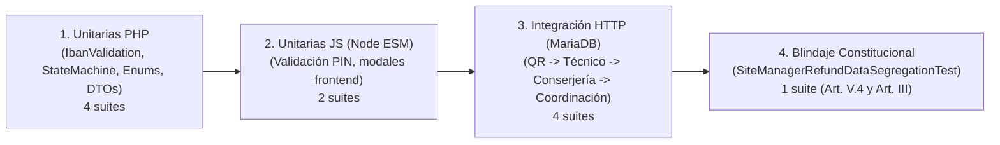

# PLAN DE IMPLEMENTACIÓN TÉCNICA · MÓDULO M5: GESTIÓN DE REINTEGROS E IMPORTE RETENIDO (DINERO TRAGADO)

**Proyecto:** Gestor de Incidencias de Vending (*VendGuard*)  
**Módulo:** `08-refunds` (Opción E: Atención al Consumidor y Gestión Económica)  
**Documento:** `specs/08-refunds/plan.md`  
**Referencia Funcional:** [`specs/functional/refunds_spec.md`](../functional/refunds_spec.md) (RF-REF-01 a RF-REF-10, RNF-REF-01 a RNF-REF-05)  
**Contratos Técnicos y DDL:** [`specs/technical/refunds_contracts.md`](../technical/refunds_contracts.md)  
**Normativa Suprema:** [`constitution.md`](../../constitution.md) (Artículos I al VII)  
**Directrices Operativas:** [`AGENTS.md`](../../AGENTS.md) (SDD, Dogma Vanilla, Dualismo Lingüístico)  
**Sistema de Diseño Visual:** [`docs/design.md`](../../docs/design.md) (Inspiración Docker: Azul eléctrico `#2560ff`, radio binario conservador 4px/8px, fondo canvas `#f9fafb`, superficie `#ffffff`, texto `#2c333f`, acentos de alerta `#f8b60f` y éxito `#38bd7d`)  

---

## 1. Estructura de Módulos y Ficheros

El módulo implementa una arquitectura desacoplada **Clean Architecture / MVC Ligero** en el backend y componentes modulares en el frontend mediante **Vanilla ES Modules (Vue 3 Composition API)**, preservando el **Dogma Vanilla** (cero dependencias externas npm/Composer en runtime, cero bundlers de compilación) y el **Dualismo Lingüístico** (código, clases, entidades, métodos y esquemas en inglés técnico; interfaz de usuario, mensajes de error y documentación en castellano).

```text
gestor-incidencias-vending/
├── database/
│   ├── cloud_init.sql                                          # Esquema integral para despliegue en la nube (incluye migración 008)
│   └── migrations/
│       └── 008_refund_management.sql                          # Migración DDL: tabla refund_requests, unclaimed_cash_findings y has_physical_reception
├── src/
│   ├── Core/
│   │   └── Domain/
│   │       ├── Model/
│   │       │   ├── CompensationMethod.php                      # Enum: EN_MANO_SEDE, BIZUM, TRANSFERENCIA_BANCARIA
│   │       │   ├── RefundStatus.php                            # Enum: PENDING_INSPECTION, DEPOSITED_AT_RECEPTION, VERIFIED_PENDING_PAYMENT, REQUIRES_COORDINATOR_APPROVAL, PENDING_CONTACT, PAID_DIGITAL, REFUNDED_IN_HAND, REJECTED
│   │       │   ├── TechnicianFinding.php                       # Enum: FOUND_PHYSICAL, CONFIRMED_NO_CASH, UNVERIFIED_NO_CASH
│   │       │   ├── CashCustodyAction.php                       # Enum: LEFT_AT_RECEPTION, HELD_FOR_CENTRAL
│   │       │   ├── RefundRequest.php                           # Entidad raíz de expediente de reintegro (cálculo de supervisión especial, anonimización, validación PIN)
│   │       │   └── UnclaimedCashFinding.php                    # Entidad de monedas atascadas recuperadas de oficio por el técnico
│   │       ├── Exception/
│   │       │   ├── InvalidRefundAmountException.php            # 422 si importe <= 0.00 o > 50.00 € (tope máximo)
│   │       │   ├── InvalidIbanFormatException.php              # 422 si IBAN falla validación Módulo 97
│   │       │   ├── InvalidBizumPhoneException.php              # 422 si teléfono Bizum no tiene exactamente 9 dígitos
│   │       │   ├── InvalidPickupPinException.php               # 422 si PIN de 4 dígitos no coincide en conserjería
│   │       │   ├── ReceptionDeliveryNotAllowedException.php    # 422 si técnico intenta dejar en recepción importe > 10 € o canal digital
│   │       │   ├── InvalidRefundStateTransitionException.php   # 409 ante transiciones no permitidas en la máquina de estados
│   │       │   └── SiteRefundDataForbiddenException.php        # 403 si rol no autorizado intenta acceder a IBAN o pagos (Art. V.4)
│   │       └── Repository/
│   │           ├── RefundRequestRepositoryInterface.php        # Contrato de persistencia de expedientes de reintegro
│   │           └── UnclaimedCashFindingRepositoryInterface.php # Contrato de persistencia de hallazgos de oficio
│   ├── Application/
│   │   ├── DTO/
│   │   │   ├── CreateRefundRequestDTO.php                      # DTO de entrada para solicitudes desde QR o Sede
│   │   │   ├── TechnicianRefundInspectionDTO.php               # DTO de entrada para dictamen técnico y custodia en resolución
│   │   │   ├── CoordinatorApprovalDTO.php                      # DTO de entrada para visto bueno y ajuste de cuantía
│   │   │   ├── CoordinatorPaymentDTO.php                       # DTO de entrada para registro de referencia bancaria/Bizum
│   │   │   └── PublicRefundTrackingDTO.php                     # DTO seguro de salida para consulta por token (sin datos sensibles ajenos)
│   │   └── Service/
│   │       ├── IbanValidationService.php                       # Algoritmo de validación ISO 7064 Módulo 97 en PHP puro
│   │       ├── RefundManagementService.php                     # Gestión del ciclo de vida, doble autorización (>10 €), pagos y PIN de recogida
│   │       └── TechnicianRefundService.php                     # Procesamiento del dictamen técnico presencial y hallazgos de oficio
│   ├── Infrastructure/
│   │   └── Repository/
│   │       ├── PdoRefundRequestRepository.php                  # Implementación PDO de persistencia de expedientes de reintegro
│   │       └── PdoUnclaimedCashFindingRepository.php           # Implementación PDO de hallazgos de monedas de oficio
│   └── Presentation/
│       ├── Controller/
│       │   ├── PublicRefundController.php                      # Endpoints públicos: GET/PATCH /api/public/refunds/track?token=...
│       │   ├── TechnicianRefundController.php                  # Endpoints técnicos: GET /api/technician/incidents/{id}/refund
│       │   ├── LocationRefundController.php                    # Endpoints de sede: GET /api/location/refunds y POST .../deliver (PIN)
│       │   ├── CoordinatorRefundController.php                 # Endpoints coordinación: listado, detalle, approve, pay, reject
│       │   ├── QrIncidentController.php                        # Modificación: captura opcional de solicitud de reintegro en reporte QR
│       │   └── TechnicianController.php                        # Modificación: resolveIncident procesa el dictamen de saldo
│       └── Routing/
│           └── AppRouter.php                                   # Registro y protección RBAC de rutas de reintegros
├── public/
│   └── assets/
│       └── js/
│           ├── components/
│           │   ├── QrRefundRequestBlock.js                     # Bloque de solicitud de reintegro en el formulario de reporte ciudadano QR
│           │   ├── TechnicianResolutionRefundBlock.js          # Bloque táctil de dictamen y custodia en modal de resolución del técnico
│           │   ├── LocationRefundsTab.js                       # Pestaña de conserjería: lista anonimizada y modal de verificación de PIN
│           │   └── CoordinatorRefundsTab.js                    # Pestaña de Coordinación: bandeja global, doble autorización y registro de pago
│           ├── views/
│           │   ├── PublicRefundTrackingView.js                 # Vista pública de seguimiento anónimo por token (?track=...)
│           │   ├── QrReportView.js                             # Modificación: integración de QrRefundRequestBlock y resguardo con PIN
│           │   ├── LocationPortalView.js                       # Modificación: inyección de pestaña 'Reintegros' en conserjería
│           │   └── CoordinatorDashboardView.js                 # Modificación: inyección de pestaña 'Reintegros' en barra de coordinador
│           └── app.js                                          # Registro de componentes y rutas frontend
└── tests/
    ├── unit/
    │   ├── IbanValidationServiceTest.php                       # Pruebas unitarias de validación Módulo 97 (válidos, erróneos, longitudes)
    │   ├── RefundStateMachineTest.php                          # Pruebas unitarias de transiciones de estados y reglas antifraude (>10 €, >50 €)
    │   ├── RefundDomainModelsTest.php                          # Pruebas unitarias de RefundRequest, Enums, DTOs y anonimización de nombres
    │   ├── RefundExceptionsTest.php                            # Pruebas unitarias de excepciones de dominio y códigos HTTP (403, 409, 422)
    │   ├── LocationRefundsTabTest.mjs                          # Pruebas frontend Node ESM del modal de PIN en conserjería
    │   └── CoordinatorRefundsTabTest.mjs                       # Pruebas frontend Node ESM de la bandeja de coordinación y pagos
    └── integration/
        ├── PublicRefundTrackingApiTest.php                     # Integración HTTP de reporte QR con reintegro y seguimiento por token
        ├── TechnicianRefundInspectionApiTest.php               # Integración HTTP de dictamen técnico en resolución con custodia forzada
        ├── LocationRefundDeliveryApiTest.php                   # Integración HTTP de entrega presencial con validación de PIN en MariaDB
        ├── CoordinatorRefundWorkflowApiTest.php                # Integración HTTP de visto bueno (>10 €), rechazo motivado y liquidación digital
        └── SiteManagerRefundDataSegregationTest.php            # Blindaje constitucional Art. V.4: bloqueo 403 y no exposición de IBAN/teléfonos
```

---

## 2. Modelo de Datos Relacional (DDL) y Contratos de API REST

### 2.1 Modelo Relacional y Migración SQL (`008_refund_management.sql`)

```sql
-- 1. Ampliación de tabla LOCATIONS con indicador de conserjería física
ALTER TABLE `locations`
ADD COLUMN `has_physical_reception` TINYINT(1) NOT NULL DEFAULT 1 AFTER `longitude`;

-- 2. Tabla principal de Expedientes de Reintegro e Importe Retenido
CREATE TABLE IF NOT EXISTS `refund_requests` (
    `id` INT UNSIGNED AUTO_INCREMENT PRIMARY KEY,
    `incident_id` INT UNSIGNED NOT NULL,
    `machine_id` INT UNSIGNED NOT NULL,
    `location_id` INT UNSIGNED NOT NULL,
    `claimant_name` VARCHAR(100) NOT NULL,
    `claimant_contact` VARCHAR(100) NOT NULL,
    `claimed_amount` DECIMAL(6, 2) NOT NULL,
    `product_attempted` VARCHAR(100) NULL,
    `compensation_method` ENUM('EN_MANO_SEDE', 'BIZUM', 'TRANSFERENCIA_BANCARIA') NOT NULL,
    `bizum_phone` VARCHAR(15) NULL,
    `iban` VARCHAR(34) NULL,
    `pickup_pin` VARCHAR(4) NULL,
    `tracking_token` VARCHAR(64) NOT NULL UNIQUE,
    `status` ENUM(
        'PENDING_INSPECTION',
        'DEPOSITED_AT_RECEPTION',
        'VERIFIED_PENDING_PAYMENT',
        'REQUIRES_COORDINATOR_APPROVAL',
        'PENDING_CONTACT',
        'PAID_DIGITAL',
        'REFUNDED_IN_HAND',
        'REJECTED'
    ) NOT NULL DEFAULT 'PENDING_INSPECTION',
    `technician_finding` ENUM('FOUND_PHYSICAL', 'CONFIRMED_NO_CASH', 'UNVERIFIED_NO_CASH') NULL,
    `recovered_amount` DECIMAL(6, 2) NULL,
    `cash_custody_action` ENUM('LEFT_AT_RECEPTION', 'HELD_FOR_CENTRAL') NULL,
    `receptionist_name` VARCHAR(100) NULL,
    `technician_justification` TEXT NULL,
    `technician_inspected_at` DATETIME NULL,
    `technician_id` INT UNSIGNED NULL,
    `coordinator_decision` ENUM('APPROVED', 'REJECTED') NULL,
    `approved_amount` DECIMAL(6, 2) NULL,
    `coordinator_justification` TEXT NULL,
    `coordinator_id` INT UNSIGNED NULL,
    `payment_reference` VARCHAR(100) NULL,
    `paid_at` DATETIME NULL,
    `hand_delivered_at` DATETIME NULL,
    `is_active` TINYINT(1) NOT NULL DEFAULT 1,
    `created_at` DATETIME NOT NULL DEFAULT CURRENT_TIMESTAMP,
    `updated_at` DATETIME NOT NULL DEFAULT CURRENT_TIMESTAMP ON UPDATE CURRENT_TIMESTAMP,
    `deleted_at` DATETIME NULL,

    CONSTRAINT `fk_refund_incident` FOREIGN KEY (`incident_id`) REFERENCES `incidents` (`id`) ON UPDATE CASCADE ON DELETE RESTRICT,
    CONSTRAINT `fk_refund_machine` FOREIGN KEY (`machine_id`) REFERENCES `machines` (`id`) ON UPDATE CASCADE ON DELETE RESTRICT,
    CONSTRAINT `fk_refund_location` FOREIGN KEY (`location_id`) REFERENCES `locations` (`id`) ON UPDATE CASCADE ON DELETE RESTRICT,
    CONSTRAINT `fk_refund_technician` FOREIGN KEY (`technician_id`) REFERENCES `users` (`id`) ON UPDATE CASCADE ON DELETE SET NULL,
    CONSTRAINT `fk_refund_coordinator` FOREIGN KEY (`coordinator_id`) REFERENCES `users` (`id`) ON UPDATE CASCADE ON DELETE SET NULL,

    INDEX `idx_refund_status_location` (`status`, `location_id`),
    INDEX `idx_refund_incident` (`incident_id`),
    INDEX `idx_refund_tracking_token` (`tracking_token`),
    INDEX `idx_refund_created_at` (`created_at`)
) ENGINE=InnoDB DEFAULT CHARSET=utf8mb4 COLLATE=utf8mb4_unicode_ci;

-- 3. Tabla para Registro de Monedas Atascadas Recuperadas de Oficio (Sin Reclamación Previa)
CREATE TABLE IF NOT EXISTS `unclaimed_cash_findings` (
    `id` INT UNSIGNED AUTO_INCREMENT PRIMARY KEY,
    `incident_id` INT UNSIGNED NOT NULL,
    `machine_id` INT UNSIGNED NOT NULL,
    `technician_id` INT UNSIGNED NOT NULL,
    `amount` DECIMAL(6, 2) NOT NULL,
    `notes` TEXT NULL,
    `created_at` DATETIME NOT NULL DEFAULT CURRENT_TIMESTAMP,

    CONSTRAINT `fk_unclaimed_incident` FOREIGN KEY (`incident_id`) REFERENCES `incidents` (`id`) ON UPDATE CASCADE ON DELETE RESTRICT,
    CONSTRAINT `fk_unclaimed_machine` FOREIGN KEY (`machine_id`) REFERENCES `machines` (`id`) ON UPDATE CASCADE ON DELETE RESTRICT,
    CONSTRAINT `fk_unclaimed_technician` FOREIGN KEY (`technician_id`) REFERENCES `users` (`id`) ON UPDATE CASCADE ON DELETE RESTRICT,

    INDEX `idx_unclaimed_incident` (`incident_id`),
    INDEX `idx_unclaimed_created_at` (`created_at`)
) ENGINE=InnoDB DEFAULT CHARSET=utf8mb4 COLLATE=utf8mb4_unicode_ci;
```

### 2.2 Resumen de Endpoints REST y Matriz RBAC

| Método | Endpoint | Rol Mínimo | Propósito Operativo |
| :--- | :--- | :--- | :--- |
| `POST` | `/api/qr/report` | *Público* | Reporte de avería con solicitud de reintegro opcional (genera PIN y token) |
| `GET` | `/api/public/refunds/track` | *Público (Token)* | Consulta pública anónima del estado en vivo del reintegro |
| `PATCH` | `/api/public/refunds/track` | *Público (Token)* | Rectificación de IBAN/Bizum cuando el estado es `PENDING_CONTACT` |
| `GET` | `/api/technician/incidents/{id}/refund` | `TECHNICIAN` | Consulta de reclamación asociada a la avería (sin datos bancarios, Art. V.4) |
| `POST` | `/api/technician/incidents/{id}/resolve` | `TECHNICIAN` | Resolución de avería con dictamen de saldo obligatorio y custodia física |
| `GET` | `/api/location/refunds` | `LOCATION_MANAGER` | Listado de reintegros de la sede con nombres anonimizados y estado |
| `POST` | `/api/location/refunds/{id}/deliver` | `LOCATION_MANAGER` | Validación de PIN de 4 dígitos para entrega de efectivo en conserjería |
| `GET` | `/api/coordinator/refunds` | `COORDINATOR` | Bandeja global de reintegros con filtros avanzados y detalle financiero |
| `POST` | `/api/coordinator/refunds/{id}/approve` | `COORDINATOR` | Visto bueno formal de cuantía ante importes $> 10\ \text{€}$ o discrepancias |
| `POST` | `/api/coordinator/refunds/{id}/pay` | `COORDINATOR` | Registro de liquidación digital con referencia bancaria/Bizum |
| `POST` | `/api/coordinator/refunds/{id}/reject` | `COORDINATOR` | Desestimación motivada con justificación obligatoria $\ge 20$ caracteres |

---

## 3. Algoritmos Clave en Pseudocódigo y Máquinas de Estado

### 3.1 Algoritmo Nativo de Validación de IBAN (Módulo 97 en PHP Puro)

```php
public function isValidIban(string $iban): bool
{
    $clean = strtoupper(preg_replace('/[^A-Z0-9]/', '', $iban) ?? '');
    
    // Validación de longitud (España ES = 24; internacional entre 15 y 34)
    $len = strlen($clean);
    if ($len < 15 || $len > 34) {
        return false;
    }
    if (str_starts_with($clean, 'ES') && $len !== 24) {
        return false;
    }

    // Reordenar los 4 primeros caracteres al final
    $reordered = substr($clean, 4) . substr($clean, 0, 4);

    // Reemplazar cada letra A-Z por su valor numérico (A=10, B=11, ..., Z=35)
    $numericString = '';
    for ($i = 0; $i < strlen($reordered); $i++) {
        $char = $reordered[$i];
        if (ctype_alpha($char)) {
            $numericString .= (string)(ord($char) - 55);
        } else {
            $numericString .= $char;
        }
    }

    // Aritmética modular módulo 97 por bloques para evitar desbordamiento de enteros de 64 bits
    $checksum = 0;
    $parts = str_split($numericString, 7);
    foreach ($parts as $part) {
        $checksum = (int)(($checksum . $part) % 97);
    }

    return $checksum === 1;
}
```

### 3.2 Generación y Verificación Criptográfica Segura de PIN y Token

```php
public function generatePickupPin(): string
{
    // PIN de 4 dígitos seguro entre 1000 y 9999
    return (string)random_int(1000, 9999);
}

public function generateTrackingToken(): string
{
    // Token criptográfico hexadecimal de 64 caracteres (256 bits)
    return bin2hex(random_bytes(32));
}

public function verifyPickupPin(string $inputPin, string $storedPin): bool
{
    // Comparación segura en tiempo constante contra ataques de temporización
    return hash_equals($storedPin, trim($inputPin));
}
```

### 3.3 Lógica de Transición de la Máquina de Estados del Reintegro

```text
FUNCION ProcessTechnicianInspection(refundRequest, inspectionDTO):
    Si refundRequest.status != 'PENDING_INSPECTION':
        Lanzar InvalidRefundStateTransitionException

    refundRequest.technicianFinding = inspectionDTO.finding
    refundRequest.recoveredAmount = inspectionDTO.recoveredAmount
    refundRequest.cashCustodyAction = inspectionDTO.cashCustodyAction

    // Regla de custodia forzada para central (RF-REF-05)
    Si inspectionDTO.finding == 'FOUND_PHYSICAL':
        Si inspectionDTO.recoveredAmount > 10.00 O refundRequest.compensationMethod != 'EN_MANO_SEDE':
            Si inspectionDTO.cashCustodyAction != 'HELD_FOR_CENTRAL':
                Lanzar ReceptionDeliveryNotAllowedException
        
        Si inspectionDTO.cashCustodyAction == 'LEFT_AT_RECEPTION':
            refundRequest.status = 'DEPOSITED_AT_RECEPTION'
            refundRequest.receptionistName = inspectionDTO.receptionistName
            Retornar
    
    // Regla de supervisión especial por importe o discrepancia
    discrepancia = (abs(refundRequest.claimedAmount - inspectionDTO.recoveredAmount) / refundRequest.claimedAmount) > 0.20
    Si refundRequest.claimedAmount > 10.00 O discrepancia O inspectionDTO.finding == 'UNVERIFIED_NO_CASH':
        refundRequest.status = 'REQUIRES_COORDINATOR_APPROVAL'
    Sino:
        refundRequest.status = 'VERIFIED_PENDING_PAYMENT'
```

---

## 4. Arquitectura de Componentes Frontend Vanilla (Vue.js 3 ES Modules)

El frontend no utiliza librerías npm ni empaquetadores en tiempo de compilación. Se estructura en cuatro componentes reactivos desacoplados:

### 4.1 Componente: `QrRefundRequestBlock.js`
* **Ámbito:** Reporte ciudadano QR (`QrReportView.js`).
* **Responsabilidades:**
  * Casilla reactiva: *"¿La máquina te ha tragado dinero o cobrado sin entregar producto?"*.
  * Despliegue de campos con validación en vivo:
    * Importe reclamado (máximo 50,00 €; aviso especial si $> 10,00\ \text{€}$).
    * Selector de método: `EN_MANO_SEDE` (solo si la sede tiene conserjería), `BIZUM` o `TRANSFERENCIA_BANCARIA`.
    * Validación en tiempo real de teléfono Bizum (9 dígitos) e IBAN (formato ES).
  * Pantalla de confirmación con localizador visual, enlace de seguimiento permanente y PIN de 4 dígitos destacado.

### 4.2 Componente: `PublicRefundTrackingView.js`
* **Ámbito:** Vista pública accesible por URL (`?track={token}`).
* **Responsabilidades:**
  * Renderizar línea de tiempo del estado de la devolución (*Registrada* $\rightarrow$ *Inspección Técnica* $\rightarrow$ *En Conserjería / Aprobada* $\rightarrow$ *Completada*).
  * Mostrar PIN de 4 dígitos si está listo en conserjería (`DEPOSITED_AT_RECEPTION`).
  * Formulario de rectificación de datos bancarios si el estado es `PENDING_CONTACT`.

### 4.3 Componente: `TechnicianResolutionRefundBlock.js`
* **Ámbito:** Modal de resolución móvil del técnico (`TechnicianResolutionModal.js`).
* **Responsabilidades:**
  * Mostrar alerta si la incidencia tiene reclamación activa con importe y producto intentado.
  * Selector cerrado de dictamen (`FOUND_PHYSICAL`, `CONFIRMED_NO_CASH`, `UNVERIFIED_NO_CASH`).
  * Si recuperó efectivo: input numérico y selector de custodia con bloqueo automático de conserjería si $> 10,00\ \text{€}$ o canal digital.
  * Campo opcional para registrar hallazgos de monedas de oficio sin reclamación previa.

### 4.4 Componente: `LocationRefundsTab.js`
* **Ámbito:** Portal de Responsable de Sede (`LocationPortalView.js`).
* **Responsabilidades:**
  * Tabla de reintegros de la sede con nombres anonimizados (ej. *"Marc R."*), importe y estado.
  * Botón *"Entregar efectivo"* en filas con estado `DEPOSITED_AT_RECEPTION`.
  * Modal interactivo con teclado numérico para teclear el PIN de 4 dígitos que muestra el usuario presencialmente.
  * Cero visibilidad de datos bancarios o teléfonos privados (Art. V.4).

### 4.5 Componente: `CoordinatorRefundsTab.js`
* **Ámbito:** Dashboard de Coordinación (`CoordinatorDashboardView.js`).
* **Responsabilidades:**
  * Bandeja global con filtros por estado, sede y alerta visual de expedientes que requieren visto bueno (`REQUIRES_COORDINATOR_APPROVAL`).
  * Modal de visto bueno para aprobar cuantía final o autorizar abono comercial.
  * Modal de liquidación digital para registrar el justificante bancario de Bizum o transferencia.
  * Modal de desestimación motivada con justificación obligatoria $\ge 20$ caracteres.

---

## 5. Decisiones Técnicas Justificadas y Alternativas Descartadas

| Decisión Técnica Adoptada | Alternativas Descartadas | Justificación y Conformidad Constitucional |
| :--- | :--- | :--- |
| **Validación nativa de IBAN con Módulo 97 en PHP puro** | Librerías Composer (`jschaedl/iban` o `pear/validate_finance`). | **Dogma Vanilla (Art. IV):** El algoritmo de Módulo 97 requiere menos de 30 líneas de código PHP nativo con aritmética modular por bloques. Introduce cero dependencias externas y se ejecuta en microsegundos sin requerir Composer en producción. |
| **Entrega presencial mediante validación de PIN de 4 dígitos** | Identificación mediante DNI físico en texto plano visible en el portal. | **Privacidad y RGPD (Art. V.4):** Dado que el portal de sede es compartido por varios conserjes y turnos, almacenar y mostrar DNIs de clientes particulares expone datos sensibles innecesarios. El PIN temporal de 4 dígitos es secreto, se verifica mediante `hash_equals()` y garantiza que solo quien reportó la incidencia retire el sobre. |
| **Custodia forzada hacia caja central para $> 10\ \text{€}$ o canal digital** | Permitir al técnico dejar cualquier importe en conserjería a su criterio. | **Control Antifraude y Coherencia:** Evita que el conserje custodie sobres con cantidades elevadas en metálico en el edificio y previene la contradicción de dejar dinero en mano a un usuario que solicitó Bizum o transferencia bancaria. |
| **Desacoplamiento operativo de la avería técnica frente al reintegro** | Bloquear el cierre de la incidencia técnica hasta que el reintegro esté pagado. | **Seguridad Alimentaria y MTTR (Art. II y V):** La máquina de vending debe volver a vender en cuanto queda reparada mecánicamente. Condicionar el estado técnico al pago bancario distorsionaría las métricas de SLA y dejaría máquinas paradas innecesariamente. |
| **Liquidación administrativa con registro de justificante bancario** | Integración telemática directa con APIs bancarias (Redsys / PSD2 / Bizum Empresas). | **Anti-Feature Creep (Art. VI):** La conexión a pasarelas bancarias exige certificados bancarios, contratos de pasarela de pago complejos y mantenimiento telemático desproporcionado para el alcance de VendGuard. El registro de la referencia de transferencia proporciona plena justificación contable y auditoría inmutable sin bloatware. |

---

## 6. Estrategia de Pruebas Integrales (100% Autónomas y Verdes)

En estricto cumplimiento del **Artículo I (Dogma SDD)** y **Artículo IV (Minimalismo y Autonomía)**, las pruebas se estructuran para ejecutarse de forma 100% autónoma en local (`php tests/run_all.php`), con cero llamadas de red salientes:



### 6.1 Batería de Pruebas Unitarias PHP
1. `IbanValidationServiceTest.php`:
   - Validación de IBANs españoles e internacionales sintácticamente válidos.
   - Detección de IBANs corruptos, longitudes erróneas y fallos de checksum Módulo 97.
   - Validación de números de teléfono para Bizum (exactamente 9 dígitos numéricos).
2. `RefundStateMachineTest.php`:
   - Transiciones legales del ciclo de vida y rechazo de transiciones prohibidas (`InvalidRefundStateTransitionException`).
   - Regla antifraude: clasificación automática como `REQUIRES_COORDINATOR_APPROVAL` ante importes $> 10,00\ \text{€}$.
   - Regla de límite máximo: rechazo con `422` ante importes $\le 0,00\ \text{€}$ o $> 50,00\ \text{€}$.
   - Regla de custodia forzada: rechazo con `422` si el técnico intenta marcar `LEFT_AT_RECEPTION` para BIZUM/IBAN o $> 10,00\ \text{€}$.
3. `RefundDomainModelsTest.php`:
   - Construcción de entidad `RefundRequest` y enums.
   - Función de anonimización de nombres de usuario (`"Laura Sanitaria" -> "Laura S."`).
   - Verificación en tiempo constante del PIN de recogida (`verifyPickupPin`).
4. `RefundExceptionsTest.php`:
   - Comprobación de códigos HTTP (`403`, `409`, `422`) y mensajes en castellano para todas las excepciones del módulo.

### 6.2 Batería de Pruebas Unitarias Reactivas Frontend (Node.js ESM)
1. `LocationRefundsTabTest.mjs`:
   - Renderizado de la lista de reintegros de sede con nombres anonimizados y badges de estado.
   - Apertura del modal de validación de PIN al pulsar "Entregar efectivo".
   - Verificación de que el componente no proyecta ni contiene campos de IBAN o teléfonos privados.
2. `CoordinatorRefundsTabTest.mjs`:
   - Renderizado de la bandeja de reintegros con destaque de expedientes pendientes de visto bueno.
   - Disparo reactivo de modales de visto bueno y liquidación digital con referencia bancaria.

### 6.3 Batería de Pruebas de Integración HTTP (MariaDB Real)
1. `PublicRefundTrackingApiTest.php`:
   - Creación de incidencia vía `POST /api/qr/report` con solicitud de reintegro (verificación de generación de PIN y token único en DB).
   - Consulta pública de estado vía `GET /api/public/refunds/track?token=...`.
   - Rectificación de datos vía `PATCH /api/public/refunds/track?token=...` cuando está en `PENDING_CONTACT`.
2. `TechnicianRefundInspectionApiTest.php`:
   - Consulta de reclamación asociada vía `GET /api/technician/incidents/{id}/refund` (comprobando ausencia de IBAN en el payload).
   - Resolución técnica vía `POST /api/technician/incidents/{id}/resolve` con dictamen `FOUND_PHYSICAL`.
   - Transición automática a `DEPOSITED_AT_RECEPTION` si $\le 10\ \text{€}$ presencial o `VERIFIED_PENDING_PAYMENT` si central.
   - Registro de hallazgo de monedas atascadas de oficio en `unclaimed_cash_findings`.
3. `LocationRefundDeliveryApiTest.php`:
   - Consulta de reintegros por sede vía `GET /api/location/refunds`.
   - Validación exitosa de PIN vía `POST /api/location/refunds/{id}/deliver` transicionando a `REFUNDED_IN_HAND`.
   - Rechazo con `422 INVALID_PICKUP_PIN` si el PIN es incorrecto.
4. `CoordinatorRefundWorkflowApiTest.php`:
   - Bandeja global vía `GET /api/coordinator/refunds` y detalle por ID.
   - Visto bueno formal vía `POST /api/coordinator/refunds/{id}/approve`.
   - Liquidación digital vía `POST /api/coordinator/refunds/{id}/pay` con `payment_reference`.
   - Desestimación motivada vía `POST /api/coordinator/refunds/{id}/reject`.

### 6.4 Blindaje Constitucional de Segregación y Privacidad (`SiteManagerRefundDataSegregationTest.php`)
* Certificación formal de que ningún usuario con rol `LOCATION_MANAGER` o `TECHNICIAN` puede acceder a:
  - `GET /api/coordinator/refunds` -> `403 Forbidden`.
  - `POST /api/coordinator/refunds/{id}/approve` -> `403 Forbidden`.
  - `POST /api/coordinator/refunds/{id}/pay` -> `403 Forbidden`.
  - `POST /api/coordinator/refunds/{id}/reject` -> `403 Forbidden`.
* Certificación formal de que las respuestas JSON de conserjería (`GET /api/location/refunds`) y del técnico (`GET /api/technician/incidents/{id}/refund`) omiten en su proyección SQL y serialización JSON las columnas `iban`, `bizum_phone` y teléfonos privados (Art. V.4).
* Certificación de Inviolabilidad de Datos (Art. III): verificación de que la tabla `refund_requests` prohíbe el borrado físico (`DELETE FROM`) y conserva todas las solicitudes rechazadas para auditoría.

---

## 7. Mapeo de Trazabilidad de Requisitos

| Requisito | Descripción | Componente Backend / Servicio | Componente Frontend | Test Automatizado |
| :--- | :--- | :--- | :--- | :--- |
| **RF-REF-01** | Captura de reclamación en QR y Sede | `QrIncidentController`, `CreateRefundRequestDTO` | `QrRefundRequestBlock.js` | `PublicRefundTrackingApiTest.php` |
| **RF-REF-02** | PIN de recogida y URL pública de tracking | `RefundManagementService` | `PublicRefundTrackingView.js` | `PublicRefundTrackingApiTest.php` |
| **RF-REF-03** | Límites cuantitativos y doble visto bueno | `RefundManagementService`, `RefundStateMachine` | `CoordinatorRefundsTab.js` | `RefundStateMachineTest.php`, `CoordinatorRefundWorkflowApiTest.php` |
| **RF-REF-04** | Dictamen técnico y hallazgo de oficio | `TechnicianRefundService`, `TechnicianController` | `TechnicianResolutionRefundBlock.js` | `TechnicianRefundInspectionApiTest.php` |
| **RF-REF-05** | Reglas de custodia coherente | `TechnicianRefundService` | `TechnicianResolutionRefundBlock.js` | `TechnicianRefundInspectionApiTest.php`, `RefundStateMachineTest.php` |
| **RF-REF-06** | Entrega presencial con PIN en conserjería | `LocationRefundController`, `PdoRefundRequestRepository` | `LocationRefundsTab.js` | `LocationRefundDeliveryApiTest.php`, `LocationRefundsTabTest.mjs` |
| **RF-REF-07** | Ciclo formal de estados y liquidación digital | `RefundManagementService`, `CoordinatorRefundController` | `CoordinatorRefundsTab.js` | `CoordinatorRefundWorkflowApiTest.php`, `RefundStateMachineTest.php` |
| **RF-REF-08** | Gestión de discrepancias y multireclamación | `RefundManagementService` | `CoordinatorRefundsTab.js` | `CoordinatorRefundWorkflowApiTest.php` |
| **RF-REF-09** | Desacoplamiento operativo e inmutabilidad | `TechnicianController`, `IncidentStateMachine` | N/A | `TechnicianRefundInspectionApiTest.php`, `ConstitutionalAuditTest.php` |
| **RF-REF-10** | Segregación de IBAN y blindaje Art. V.4 | `AuthMiddleware`, `PdoRefundRequestRepository` | `LocationRefundsTab.js` | `SiteManagerRefundDataSegregationTest.php` |
| **RF-REF-11** | Una sola reclamación viva por avería y consumidor | `RefundManagementService::assertNoDuplicateClaim()`, `QrScanController` | N/A | `PublicRefundTrackingApiTest.php`, `RefundStateMachineTest.php` |
| **RNF-REF-01** | Trazabilidad inmutable en `audit_log` | `AuditLogger`, `RefundManagementService` | `AuditLogViewer.js` | `CoordinatorRefundWorkflowApiTest.php` |
| **RNF-REF-02** | Rendimiento $< 150\text{ ms}$ en servidor | `PdoRefundRequestRepository` (índices SQL) | N/A | `CoordinatorRefundWorkflowApiTest.php` |
| **RNF-REF-03** | Confidencialidad y DTOs seguros de IBAN | `PublicRefundTrackingDTO`, DTOs de salida | N/A | `SiteManagerRefundDataSegregationTest.php` |
| **RNF-REF-04** | Usabilidad táctil en movilidad $< 20\text{ s}$ | N/A | `TechnicianResolutionRefundBlock.js` | `TechnicianResolutionRefundBlockTest.mjs` |
| **RNF-REF-05** | Consistencia visual con sistema de diseño | CSS tokens institucionales | Todos los componentes y vistas de reintegros | `DesignTokensTest.php`, `RefundsModuleClosureTest.php` |

---

## 8. Garantía del Dogma Vanilla y Dualismo Lingüístico

1. **Dogma Vanilla Estricto:**
   * **Backend:** Cero dependencias de Composer añadidas. Validación matemática de IBAN mediante el algoritmo de Módulo 97 implementado de forma nativa en PHP 8.2+. Persistencia puramente relacional mediante PDO con transacciones ACID.
   * **Frontend:** Vue.js 3 en modo navegador directo (`vue.esm-browser.prod.js`), cero bundlers de empaquetado (sin Vite, Webpack ni dependencias npm en tiempo de ejecución), consumo directo vía `fetch()` con async/await nativo.
2. **Dualismo Lingüístico:**
   * **Inglés:** Clases (`RefundManagementService`, `IbanValidationService`), métodos (`isValidIban`, `verifyPickupPin`), tablas SQL (`refund_requests`, `unclaimed_cash_findings`), endpoints (`/api/location/refunds`), atributos JSON (`claimed_amount`, `pickup_pin`, `tracking_token`) y commits de Git siguiendo *Conventional Commits*.
   * **Castellano:** Documentación de negocio, especificaciones, interfaz gráfica de usuario, textos informativos, razones de rechazo y mensajes de excepción en respuestas JSON.
