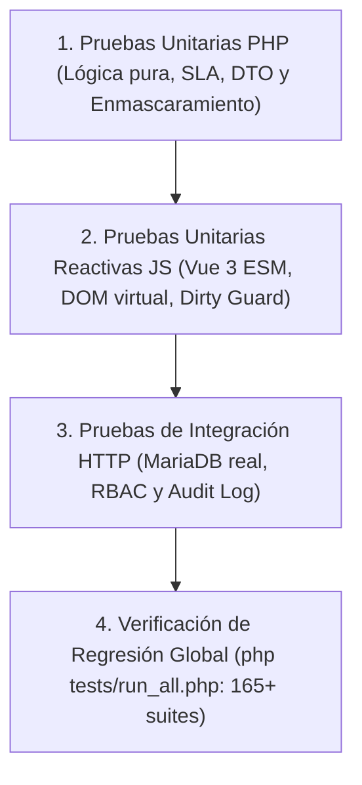

# PLAN TÉCNICO DE IMPLEMENTACIÓN · MÓDULO 09: MODAL DE DETALLE INTEGRAL DE INCIDENCIAS EN TRIAJE (PLAN.MD)

**Proyecto:** Gestor de Incidencias de Vending (*VendGuard*)  
**Módulo:** `09-incident-detail-modal`  
**Documento:** `specs/09-incident-detail-modal/plan.md`  
**Referencia Funcional:** [`specs/functional/incident_detail_modal_spec.md`](../functional/incident_detail_modal_spec.md) (RF-01 a RF-08, RNF-01 a RNF-06)  
**Normativa Suprema:** [`constitution.md`](../../constitution.md) (Artículos I al VII)  
**Directrices Operativas:** [`AGENTS.md`](../../AGENTS.md) (SDD, Dogma Vanilla, Dualismo Lingüístico)  
**Sistema de Diseño Visual:** [`docs/design.md`](../../docs/design.md) (Tokens Docker: Azul eléctrico `#2560ff`, radio binario 4px/8px, fondo canvas `#f9fafb`, alertas `#f8b60f` y crítico `#e02424`)  

---

## 1. Estructura de Módulos y Ficheros

El módulo sigue estrictamente la arquitectura desacoplada de VendGuard sin introducir dependencias externas ni compiladores en runtime (*Dogma Vanilla*).

```text
gestor-incidencias-vending/
├── specs/
│   ├── functional/
│   │   └── incident_detail_modal_spec.md     # Especificación funcional aprobada
│   └── 09-incident-detail-modal/
│       ├── spec.md                           # Copia/enlace de la especificación de módulo
│       ├── plan.md                           # Este documento técnico de arquitectura
│       └── tasks.md                          # Plan atómico de tareas secuenciales (siguiente fase)
├── src/
│   ├── Application/
│   │   ├── DTO/
│   │   │   └── CoordinatorIncidentDetailDto.php  # DTO consolidado inmutable para el modal
│   │   └── Service/
│   │       └── CoordinatorIncidentDetailService.php # Servicio agregador de detalle enriquecido
│   └── Presentation/
│       ├── Controller/
│       │   └── CoordinatorController.php     # Endpoint GET /api/coordinator/incidents/{id}/detail
│       │                                     # Endpoint POST /api/coordinator/incidents/{id}/comments
│       └── Routing/
│           └── AppRouter.php                 # Registro de rutas protegidas con $coordinatorAuth
├── public/
│   └── assets/
│       ├── css/
│       │   └── design-tokens.css             # Tokens visuales y clases para el modal de detalle
│       └── js/
│           ├── components/
│           │   └── CoordinatorIncidentDetailModal.js # Componente modal Vue 3 ESM con scroll y paneles en línea
│           └── views/
│               └── CoordinatorDashboardView.js       # Integración del botón 'Ver detalle' y montaje del modal
└── tests/
    ├── unit/
    │   ├── CoordinatorIncidentDetailServiceTest.php   # Pruebas unitarias de agregación y enmascaramiento
    │   └── CoordinatorIncidentDetailModalTest.mjs    # Pruebas unitarias reactivas frontend (Node.js ESM)
    └── integration/
        ├── CoordinatorIncidentDetailApiTest.php       # Integración HTTP contra MariaDB real
        └── CoordinatorIncidentDetailConstitutionalTest.php # Blindaje constitucional (Art. III, V.1, V.4)
```

---

## 2. Modelo de Datos JSON y Contratos de API REST

Para optimizar el rendimiento y cumplir la exigencia de carga en $< 300\text{ ms}$ (RNF-01), se diseña un endpoint consolidado enriquecido que agrega la totalidad de los datos en una única transacción de lectura, evitando peticiones HTTP fragmentadas en cascada (*waterfall*).

### 2.1. Endpoint Principal: Consulta de Detalle Enriquecido

* **Ruta:** `GET /api/coordinator/incidents/{id}/detail`
* **Seguridad:** Bearer Token de usuario interno con rol `COORDINATOR` (HTTP 401 si falta token, HTTP 403 si el rol no es coordinador).
* **Parámetros de Ruta:** `id` (entero positivo o código de ticket `#TICK-...`).

#### Respuestas HTTP:
* `200 OK`: Ficha completa enriquecida del expediente.
* `401 Unauthorized`: Petición no autenticada.
* `403 Forbidden`: Acceso denegado (p. ej. intento de consulta por rol técnico o responsable de sede).
* `404 Not Found`: Incidencia inexistente.

#### Contrato de Salida (`200 OK` JSON Payload):
```json
{
  "success": true,
  "data": {
    "incident": {
      "id": 142,
      "ticket_code": "TICK-2026-00142",
      "status": "PENDING_PARTS",
      "status_label": "Pendiente de Repuestos",
      "urgency": "CRITICAL",
      "urgency_label": "Crítica",
      "is_reopened": true,
      "reopened_at": "2026-10-02 11:30:00",
      "reopened_reason": "La máquina volvió a fallar 2 horas después de la reparación del técnico.",
      "description": "El compresor no arranca y los sándwiches superan los 9°C.",
      "report_channel": "QR_CODE",
      "photo_url": "/uploads/evidence/evidence_142.jpg",
      "created_at": "2026-10-01 08:15:00",
      "updated_at": "2026-10-02 12:00:00"
    },
    "location": {
      "id": 1,
      "name": "Hospital del Mar",
      "code": "SEDE-BCN-01",
      "address": "Passeig Marítim 25-29, Barcelona",
      "floor_zone": "Planta 1 - Urgencias Sala de Espera",
      "has_physical_reception": true
    },
    "machine": {
      "id": 10,
      "code": "VEND-0101",
      "model": "FAS Perla Fast Cold",
      "manufacturer": "FAS International",
      "type": "PERISHABLE_FOOD",
      "type_label": "Alimentos Perecederos",
      "has_perishables": true
    },
    "technician": {
      "assigned": true,
      "technician_id": 4,
      "name": "Jordi Cruz",
      "operator_code": "OP-BCN-04",
      "assigned_at": "2026-10-01 08:30:00",
      "assigned_by_name": "Coordinación Central",
      "reassignment_reason": null
    },
    "timeline": {
      "created_at": "2026-10-01 08:15:00",
      "assigned_at": "2026-10-01 08:30:00",
      "started_at": "2026-10-01 09:10:00",
      "paused_at": "2026-10-01 09:45:00",
      "resolved_at": null,
      "closed_at": null,
      "time_to_assign_minutes": 15,
      "time_to_first_response_minutes": 55,
      "total_elapsed_minutes": 1665
    },
    "sla": {
      "has_sla_limit": true,
      "sla_limit_hours": 4.0,
      "is_active_countdown": true,
      "is_breached": true,
      "minutes_remaining": -65,
      "historical_balance": "Incumplido por 1 h 5 min",
      "sla_target_at": "2026-10-01 12:15:00"
    },
    "technical_intervention": {
      "pause": {
        "is_paused": true,
        "reason": "Fallo en condensador de arranque y relé térmico del compresor.",
        "requested_parts": [
          {
            "spare_part_id": 12,
            "part_code": "SP-FAS-RELAY-01",
            "description": "Relé Térmico Compresor 230V",
            "quantity": 1,
            "is_out_of_catalog": false,
            "justification": null
          },
          {
            "spare_part_id": null,
            "part_code": "OUT_OF_CATALOG",
            "description": "Abrazadera reforzada antivibración para circuito de cobre",
            "quantity": 1,
            "is_out_of_catalog": true,
            "justification": "Tubería de cobre suelta genera resonancia y fatiga de material en soporte."
          }
        ]
      },
      "resolution": {
        "is_resolved": false,
        "diagnosis": null,
        "corrective_action": null,
        "replaced_parts_declared": false,
        "replaced_parts": [],
        "total_parts_cost": 0.00
      },
      "cancellation": {
        "is_cancelled": false,
        "cancelled_at": null,
        "cancelled_by_name": null,
        "reason": null
      }
    },
    "comments": [
      {
        "id": 85,
        "author_type": "REPORTER",
        "author_name": "Conserjería Hospital",
        "comment_text": "El agua gotea por debajo de la máquina.",
        "is_internal": false,
        "created_at": "2026-10-01 08:20:00"
      },
      {
        "id": 86,
        "author_type": "TECHNICIAN",
        "author_name": "Jordi Cruz",
        "comment_text": "Comprobada fuga en bandeja de desescarche. Pauso aviso esperando recambio.",
        "is_internal": true,
        "created_at": "2026-10-01 09:46:00"
      }
    ],
    "refund": {
      "has_refund": true,
      "refund_id": 5,
      "claim_code": "REF-2026-00005",
      "amount": 2.50,
      "compensation_method": "BIZUM",
      "compensation_method_label": "Bizum",
      "status": "REQUIRES_COORDINATOR_APPROVAL",
      "status_label": "Pendiente de Visto Bueno",
      "contact_phone_masked": "6** *** 789",
      "iban_masked": null,
      "technician_finding": "FOUND_PHYSICAL",
      "cash_custody_action": "HELD_FOR_CENTRAL",
      "technician_notes": "Moneda de 2€ y 0.50€ retenidas en selector mecánico recuperadas.",
      "refund_tab_url": "#refunds?id=5"
    },
    "permissions": {
      "can_assign": true,
      "can_reassign": true,
      "can_cancel": true,
      "can_add_comment": true
    }
  }
}
```

---

### 2.2. Endpoints Operativos Directos desde el Modal

Las acciones de triaje se ejecutan contra los endpoints existentes garantizando la idempotencia y la auditoría estricta:

1. **Asignación / Reasignación Técnica:**  
   * `PATCH /api/coordinator/incidents/{id}/assign`
   * **Payload Entrada:**
     ```json
     {
       "technician_id": 4,
       "urgency": "CRITICAL",
       "reason": "Reasignación por proximidad geográfica para evitar rotura de SLA de frío (Art. II)."
     }
     ```
   * **Validación:** Si se trata de una reasignación, `reason` es obligatorio ($\ge 10$ caracteres).
   * **Auditoría:** Emisión de `INCIDENT_ASSIGNED` o `INCIDENT_REASSIGNED` en `audit_log`.

2. **Descarte Justificado (Soft Delete, Art. III.2 y V.1):**  
   * `PATCH /api/coordinator/incidents/{id}/cancel`
   * **Payload Entrada:**
     ```json
     {
       "reason": "Avería duplicada confirmada telefónicamente con la sede; ya atendida en ticket TICK-2026-00139."
     }
     ```
   * **Validación Estricta:** `strlen(trim(reason)) >= 20` (HTTP 422 si es inferior).
   * **Auditoría:** Emisión de `INCIDENT_CANCELLED` en `audit_log`.

3. **Publicación de Comentarios y Notas Técnicas:**  
   * `POST /api/coordinator/incidents/{id}/comments`
   * **Payload Entrada:**
     ```json
     {
       "comment_text": "Revisado compresor en taller; pieza en camino desde almacén central.",
       "is_internal": true
     }
     ```
   * **Validación:** `comment_text` obligatorio ($\ge 5$ caracteres). `is_internal` booleano.
   * **Auditoría:** Emisión de `INCIDENT_COMMENT_ADDED` en `audit_log`.

---

## 3. Algoritmos Clave en Pseudocódigo y Máquinas de Estado

### 3.1. Algoritmo de Evaluación de SLA Dinámico vs. Balance Histórico (RF-03)

```text
ALGORITMO computeSlaStatus(incident, machine, timeline):
  SI machine.has_perishables == FALSO:
    RETORNAR { has_sla_limit: FALSO }

  slaLimitHours = 4.0
  createdAtTimestamp = parseDate(incident.created_at)
  targetTimestamp = createdAtTimestamp + (slaLimitHours * 3600)
  
  // Caso A: Incidencia en estado terminal o resuelto (balance histórico inmutable)
  SI incident.status EN ['RESOLVED', 'CLOSED', 'CANCELLED']:
    effectiveEndTimestamp = parseDate(timeline.resolved_at O incident.updated_at)
    diffSeconds = effectiveEndTimestamp - targetTimestamp
    elapsedMinutes = round((effectiveEndTimestamp - createdAtTimestamp) / 60)
    
    SI diffSeconds <= 0:
      balanceText = "Cumplido formalmente en " + formatHoursMinutes(elapsedMinutes)
      isBreached = FALSO
    SINO:
      breachedMinutes = round(diffSeconds / 60)
      balanceText = "Incumplido formalmente por " + formatHoursMinutes(breachedMinutes)
      isBreached = VERDADERO
      
    RETORNAR {
      has_sla_limit: VERDADERO,
      sla_limit_hours: 4.0,
      is_active_countdown: FALSO,
      is_breached: isBreached,
      minutes_remaining: 0,
      historical_balance: balanceText,
      sla_target_at: formatDate(targetTimestamp)
    }

  // Caso B: Incidencia activa (cuenta atrás dinámica en caliente)
  nowTimestamp = currentServerTime()
  remainingSeconds = targetTimestamp - nowTimestamp
  remainingMinutes = round(remainingSeconds / 60)

  SI remainingSeconds >= 0:
    balanceText = "Tiempo restante: " + formatHoursMinutes(remainingMinutes)
    isBreached = FALSO
  SINO:
    breachedMinutes = abs(remainingMinutes)
    balanceText = "SLA Superado hace " + formatHoursMinutes(breachedMinutes)
    isBreached = VERDADERO

  RETORNAR {
    has_sla_limit: VERDADERO,
    sla_limit_hours: 4.0,
    is_active_countdown: VERDADERO,
    is_breached: isBreached,
    minutes_remaining: remainingMinutes,
    historical_balance: balanceText,
    sla_target_at: formatDate(targetTimestamp)
  }
```

---

### 3.2. Algoritmo de Enmascaramiento Seguro de Datos de Contacto y Pago (RF-06, Art. V.4)

```text
ALGORITMO maskFinancialAndContactData(refundRecord):
  SI refundRecord ES NULO:
    RETORNAR NULO

  maskedPhone = NULO
  maskedIban = NULO

  // Enmascaramiento telefónico: muestra primer dígito y últimos tres (ej. 6** *** 789)
  SI refundRecord.bizum_phone NO ES NULO:
    cleanPhone = trim(refundRecord.bizum_phone)
    SI length(cleanPhone) >= 9:
      prefix = substring(cleanPhone, 0, 1)
      suffix = substring(cleanPhone, length(cleanPhone) - 3, 3)
      maskedPhone = prefix + "** *** " + suffix
    SINO:
      maskedPhone = "*** *** ***"

  // Enmascaramiento de IBAN: conserva país y últimos 4 dígitos (ej. ES** **** **** **** **12 3456)
  SI refundRecord.iban NO ES NULO:
    cleanIban = removeSpaces(refundRecord.iban)
    SI length(cleanIban) >= 8:
      country = substring(cleanIban, 0, 2)
      last4 = substring(cleanIban, length(cleanIban) - 4, 4)
      maskedIban = country + "** **** **** **** **" + substring(last4, 0, 2) + " " + substring(last4, 2, 2)
    SINO:
      maskedIban = "** **** **** **** ****"

  RETORNAR {
    claim_code: refundRecord.claim_code,
    amount: refundRecord.amount,
    compensation_method: refundRecord.compensation_method,
    contact_phone_masked: maskedPhone,
    iban_masked: maskedIban,
    status: refundRecord.status,
    technician_finding: refundRecord.technician_finding,
    cash_custody_action: refundRecord.cash_custody_action
  }
```

---

### 3.3. Algoritmo de Prevención de Cierre Accidental con Formularios Sucios (*Dirty State*, RF-08)

```text
ALGORITMO handleModalCloseRequest(signalType, componentState):
  // Comprobar si existe algún borrador en edición activa
  hasUnsavedComment = trim(componentState.newCommentText).length > 0
  hasUnsavedCancelReason = componentState.isCancelPanelOpen Y trim(componentState.cancelReason).length > 0
  hasUnsavedAssignReason = componentState.isAssignPanelOpen Y componentState.isReassign Y trim(componentState.reassignReason).length > 0

  isFormDirty = hasUnsavedComment O hasUnsavedCancelReason O hasUnsavedAssignReason

  SI isFormDirty == VERDADERO:
    userConfirmed = window.confirm("Tiene cambios o comentarios sin guardar en esta incidencia. ¿Desea descartarlos y cerrar el detalle?")
    SI userConfirmed == VERDADERO:
      resetComponentDrafts(componentState)
      emit('close')
    SINO:
      // Conservar el modal abierto y mantener los campos intactos
      RETORNAR
  SINO:
    // Cierre limpio inmediato
    resetComponentDrafts(componentState)
    emit('close')
```

---

### 3.4. Matriz de Habilitación de Acciones según la Máquina de Estados (RF-07)

```text
ESTADO INCIDENCIA  | ASIGNAR / REASIGNAR | DESCARTAR (CANCEL) | AÑADIR COMENTARIO | ACTUALIZAR EN CALIENTE
-------------------|---------------------|--------------------|-------------------|------------------------
REPORTED           | SÍ (Asignar)        | SÍ (>= 20 chars)   | SÍ                | SÍ
ASSIGNED           | SÍ (Reasignar)      | SÍ (>= 20 chars)   | SÍ                | SÍ
IN_PROGRESS        | SÍ (Reasignar)      | SÍ (>= 20 chars)   | SÍ                | SÍ
PENDING_PARTS      | SÍ (Reasignar)      | SÍ (>= 20 chars)   | SÍ                | SÍ
RESOLVED           | NO (Inhabilitado)   | NO (Inhabilitado)  | SÍ (Garantía 48h) | SÍ (Solo lectura)
CLOSED             | NO (Inhabilitado)   | NO (Inhabilitado)  | NO (Sellado)      | SÍ (Solo lectura)
CANCELLED          | NO (Inhabilitado)   | NO (Inhabilitado)  | NO (Sellado)      | SÍ (Solo lectura)
```

---

## 4. Arquitectura de Eventos y Componentes Frontend Vanilla/Vue.js 3

### 4.1. Componente `CoordinatorIncidentDetailModal.js`
Construido como componente Vanilla ES Module puro (sin empaquetadores ni Node.js en cliente), utiliza la Composition API estándar:

* **Props:**
  * `incidentId` (`Number|String`): Identificador del ticket a inspeccionar.
  * `isOpen` (`Boolean`): Visibilidad del modal.
* **Emits:**
  * `close`: Notifica al padre el cierre del modal.
  * `incident-updated`: Notifica al padre que se ha producido una asignación, descarte o comentario para refrescar la fila en la tabla de triaje.

#### Estructura Interna del Template (Ergonomía Docker):
```html
<div class="vg-modal-backdrop" @click.self="handleBackdropClick">
  <div class="vg-modal-container incident-detail-modal" role="dialog" aria-modal="true">
    
    <!-- CABECERA FIJA -->
    <header class="modal-header">
      <div class="header-left">
        <h2 class="incident-code">#{{ detail.incident.ticket_code }}</h2>
        <span class="badge" :class="'badge-' + detail.incident.status.toLowerCase()">{{ detail.incident.status_label }}</span>
        <span class="badge" :class="'badge-' + detail.incident.urgency.toLowerCase()">{{ detail.incident.urgency_label }}</span>
        <span v-if="detail.incident.is_reopened" class="badge badge-reopened">⚠️ Reabierta en Garantía</span>
      </div>
      <div class="header-right">
        <button type="button" class="vg-btn vg-btn-ghost btn-refresh" @click="fetchDetail" :disabled="isLoading">🔄 Actualizar</button>
        <button type="button" class="vg-btn vg-btn-ghost btn-close" @click="requestClose">✕</button>
      </div>
    </header>

    <!-- CUERPO CON SCROLL VERTICAL INDEPENDIENTE -->
    <main class="modal-body-scrollable">
      
      <!-- 1. Aviso de Reapertura en Garantía (Condicional) -->
      <section v-if="detail.incident.is_reopened" class="reopened-banner">
        <strong>Motivo de Reapertura por la Sede:</strong> {{ detail.incident.reopened_reason }}
      </section>

      <!-- 2. Información de Sede y Máquina -->
      <section class="section-grid-2">
        <div class="info-card">
          <h3>🏢 Ubicación y Centro</h3>
          <p><strong>Sede:</strong> {{ detail.location.name }} ({{ detail.location.code }})</p>
          <p><strong>Ubicación:</strong> {{ detail.location.floor_zone }}</p>
          <p><strong>Dirección:</strong> {{ detail.location.address }}</p>
        </div>
        <div class="info-card">
          <h3>🎰 Máquina</h3>
          <p><strong>Código:</strong> {{ detail.machine.code }} · {{ detail.machine.model }}</p>
          <p><strong>Tipo:</strong> {{ detail.machine.type_label }}</p>
          <p v-if="detail.machine.has_perishables" class="perishable-warning">❄️ Alimentos Perecederos (SLA Crítico 4h)</p>
        </div>
      </section>

      <!-- 3. Reporte Original y Evidencia Gráfica -->
      <section class="info-card">
        <h3>📝 Descripción del Problema</h3>
        <p class="description-text">{{ detail.incident.description }}</p>
        <div v-if="detail.incident.photo_url" class="photo-preview">
          
        </div>
      </section>

      <!-- 4. Cronograma y Monitor de SLA -->
      <section class="info-card">
        <h3>⏱️ Ciclo de Vida y Cumplimiento de SLA</h3>
        <div class="timeline-row">
          <!-- Hitos temporales en flexbox -->
        </div>
        <div v-if="detail.sla.has_sla_limit" class="sla-monitor-card" :class="{ 'sla-breached': detail.sla.is_breached }">
          <strong>SLA 4 Horas (Art. II):</strong> {{ detail.sla.historical_balance }}
        </div>
      </section>

      <!-- 5. Intervención Técnica y Desglose de Repuestos -->
      <section class="info-card">
        <h3>🔧 Intervención Técnica</h3>
        <!-- Bloque de Pausa / Bloque de Resolución con Costes Congelados / Descarte -->
      </section>

      <!-- 6. Bitácora de Comentarios y Notas Técnicas -->
      <section class="info-card">
        <h3>💬 Bitácora y Notas de Taller</h3>
        <div class="comments-scroll-area">
          <!-- Listado cronológico de notas internas y públicas -->
        </div>
        <form v-if="detail.permissions.can_add_comment" @submit.prevent="submitComment" class="comment-form-inline">
          <textarea v-model="newCommentText" placeholder="Escribir comentario o nota técnica..." rows="2"></textarea>
          <div class="comment-form-footer">
            <label><input type="checkbox" v-model="isCommentInternal" /> Nota interna de taller (confidencial)</label>
            <button type="submit" class="vg-btn vg-btn-primary" :disabled="isSubmittingComment">Enviar Nota</button>
          </div>
        </form>
      </section>

      <!-- 7. Expediente de Reintegro Vinculado (Enmascarado) -->
      <section v-if="detail.refund.has_refund" class="info-card refund-card">
        <h3>💰 Reintegro Económico Vinculado</h3>
        <p><strong>Importe:</strong> {{ detail.refund.amount.toFixed(2) }} € ({{ detail.refund.compensation_method_label }})</p>
        <p><strong>Estado:</strong> {{ detail.refund.status_label }}</p>
        <p v-if="detail.refund.contact_phone_masked"><strong>Teléfono:</strong> {{ detail.refund.contact_phone_masked }}</p>
        <p v-if="detail.refund.iban_masked"><strong>IBAN:</strong> {{ detail.refund.iban_masked }}</p>
        <a :href="detail.refund.refund_tab_url" class="vg-link">Abrir expediente en bandeja de Reintegros ↗</a>
      </section>

      <!-- 8. Paneles Colapsables en Línea para Asignar y Descartar -->
      <div v-if="isAssignPanelOpen" class="inline-action-panel">
        <h4>{{ detail.technician.assigned ? 'Reasignar Técnico' : 'Asignar Técnico' }}</h4>
        <select v-model="selectedTechnicianId"><!-- Lista de técnicos --></select>
        <textarea v-if="detail.technician.assigned" v-model="reassignReason" placeholder="Motivo de la reasignación..."></textarea>
        <button class="vg-btn vg-btn-primary" @click="confirmAssign">Confirmar Asignación</button>
        <button class="vg-btn vg-btn-secondary" @click="isAssignPanelOpen = false">Cancelar</button>
      </div>

      <div v-if="isCancelPanelOpen" class="inline-action-panel panel-danger">
        <h4>Descartar Incidencia (Cancelación Justificada)</h4>
        <textarea v-model="cancelReason" placeholder="Motivo del descarte (mínimo 20 caracteres)..." rows="3"></textarea>
        <span class="char-counter" :class="{ 'valid': cancelReason.length >= 20 }">{{ cancelReason.length }} / 20 caracteres</span>
        <button class="vg-btn vg-btn-danger" :disabled="cancelReason.length < 20" @click="confirmCancel">Confirmar Descarte</button>
        <button class="vg-btn vg-btn-secondary" @click="isCancelPanelOpen = false">Cancelar</button>
      </div>

    </main>

    <!-- PIE FIJO DE ACCIONES OPERATIVAS -->
    <footer class="modal-footer">
      <div class="footer-left">
        <button v-if="detail.permissions.can_assign && !isAssignPanelOpen" type="button" class="vg-btn vg-btn-primary" @click="isAssignPanelOpen = true">
          {{ detail.technician.assigned ? 'Reasignar Técnico' : 'Asignar Técnico' }}
        </button>
        <button v-if="detail.permissions.can_cancel && !isCancelPanelOpen" type="button" class="vg-btn vg-btn-danger-outline" @click="isCancelPanelOpen = true">
          Descartar Incidencia
        </button>
      </div>
      <div class="footer-right">
        <button type="button" class="vg-btn vg-btn-secondary" @click="requestClose">Cerrar</button>
      </div>
    </footer>

  </div>
</div>
```

---

## 5. Decisiones Técnicas Justificadas y Alternativas Descartadas

| Decisión Técnica Adoptada | Alternativa Descartada | Justificación Arquitectural y Constitucional |
| :--- | :--- | :--- |
| **Endpoint Consolidado Enriquecido (`GET .../detail`)** | Múltiples peticiones HTTP REST fragmentadas (`/incidents/{id}`, `/comments`, `/refunds`, etc.). | Erradica problemas de concurrencia y latencias en cascada (*waterfall*); garantiza tiempo de renderizado $< 300\text{ ms}$ (RNF-01) con una única transacción segura en MariaDB. |
| **Paneles de Acción en Línea (*Inline Accordion*)** | Sub-modales superpuestos (*"modal sobre modal"*). | Un segundo modal encima de otro rompe la ergonomía en pantallas de gestión, genera bugs de foco y scroll, y dificulta la lectura contextual del expediente. Los paneles embebidos mantienen el foco limpio (RNF-06). |
| **Enmascaramiento en Servidor (PHP DTO)** | Enmascaramiento visual en el cliente (JavaScript). | Principio de defensa en profundidad y mínimo privilegio (Art. V.4): los datos bancarios completos de consumidores nunca deben enviarse en el JSON de este endpoint de triaje general. |
| **Guardián de Formulario Sucio (*Dirty State Guard*)** | Cierre incondicional por clic en backdrop o tecla ESC. | Protege al coordinador de perder accidentalmente justificaciones técnicas extensas de $\ge 20$ caracteres o notas de taller al hacer clic fuera del recuadro. |
| **Bloqueo Estricto de Acciones en Tickets Cerrados** | Permitir reasignaciones o descartes en cualquier estado. | Preserva la máquina de estados y el Artículo III de la Constitución (inmutabilidad y ventana de garantía sellada a las 48h). |

---

## 6. Estrategia de Pruebas Integrales (100% Verde sin Dependencias de Red)

Siguiendo el Art. I de la Constitución, no se admiten mocks simulados en flujos principales. La suite se verifica en 3 fases continuas:



### 6.1. Pruebas Unitarias PHP (`CoordinatorIncidentDetailServiceTest.php`)
* Cálculo de SLA de frío (activo con cuenta atrás vs histórico formal con ticket resuelto).
* Enmascaramiento exacto de teléfonos Bizum (`6** *** 789`) e IBAN (`ES** **** **** **** **12 3456`).
* Generación de DTO completo con incidencias en todos los estados (`REPORTED`, `ASSIGNED`, `IN_PROGRESS`, `PENDING_PARTS`, `RESOLVED`, `CLOSED`, `CANCELLED`).
* Desglose de piezas de catálogo y piezas fuera de catálogo con justificación.

### 6.2. Pruebas Unitarias Reactivas Frontend (`CoordinatorIncidentDetailModalTest.mjs`)
* Apertura del modal al recibir `isOpen: true` y carga de datos vía props/API mockeada en arnés de test.
* Validación del contador de 20 caracteres en el panel de descarte (botón deshabilitado con $< 20$ chars).
* Prueba del guardián sucio: confirmación obligatoria al pulsar ESC con texto en borrador.
* Cierre inmediato si no hay campos modificados.
* Inhabilitación reactiva de botones de asignación y descarte cuando el estado es `RESOLVED` o `CLOSED`.

### 6.3. Pruebas de Integración HTTP contra MariaDB Real (`CoordinatorIncidentDetailApiTest.php`)
* Autenticación y RBAC: respuesta `200 OK` con token de coordinador, `403 Forbidden` con token de técnico o sede, y `401 Unauthorized` sin credenciales.
* Persistencia atómica de reasignación con generación de registro inmutable en `audit_log`.
* Descarte justificado con motivo $\ge 20$ caracteres: transición a `CANCELLED` y emisión de evento de auditoría.
* Rechazo con `HTTP 422` ante motivos de descarte inferiores a 20 caracteres.
* Adición de comentarios con bandera `is_internal`: visibilidad en el endpoint de detalle y auditoría.

### 6.4. Pruebas de Blindaje Constitucional (`CoordinatorIncidentDetailConstitutionalTest.php`)
* **Art. III:** Cero sentencias `DELETE FROM` ejecutadas durante las acciones de descarte.
* **Art. V.1:** Imposibilidad de cancelar tickets sin motivo justificado $\ge 20$ caracteres.
* **Art. V.4:** Cero exposición de IBAN completo o teléfono en texto plano en la respuesta JSON.
* **Art. II:** Presencia mandatoria del indicador de frío en máquinas perecederas con SLA de 4 horas.

---

## 7. Mapeo Estricto de Trazabilidad (Matriz de Requisitos)

| Requisito Funcional / No Funcional | Componente de Backend | Componente de Frontend | Suite de Pruebas de Certificación |
| :--- | :--- | :--- | :--- |
| **RF-01: Disparador y apertura** | `AppRouter.php` | `CoordinatorDashboardView.js` | `CoordinatorIncidentDetailApiTest.php` |
| **RF-02: Cabecera y metadatos** | `CoordinatorIncidentDetailDto.php` | `CoordinatorIncidentDetailModal.js` | `CoordinatorIncidentDetailServiceTest.php` |
| **RF-03: Cronograma y SLA** | `CoordinatorIncidentDetailService.php` | `CoordinatorIncidentDetailModal.js` | `CoordinatorIncidentDetailServiceTest.php` |
| **RF-04: Intervención y repuestos** | `CoordinatorIncidentDetailDto.php` | `CoordinatorIncidentDetailModal.js` | `CoordinatorIncidentDetailServiceTest.php` |
| **RF-05: Bitácora de comentarios** | `CoordinatorController::addComment` | `CoordinatorIncidentDetailModal.js` | `CoordinatorIncidentDetailApiTest.php` |
| **RF-06: Reintegros y enmascarado** | `CoordinatorIncidentDetailService.php` | `CoordinatorIncidentDetailModal.js` | `CoordinatorIncidentDetailConstitutionalTest.php` |
| **RF-07: Acciones en línea** | `CoordinatorController.php` | `CoordinatorIncidentDetailModal.js` | `CoordinatorIncidentDetailApiTest.php` |
| **RF-08: Ciclo de vida y dirty state** | N/A (Cliente) | `CoordinatorIncidentDetailModal.js` | `CoordinatorIncidentDetailModalTest.mjs` |
| **RNF-01: Rendimiento < 300 ms** | Endpoint consolidado único | Vue 3 ESM reactivo | `CoordinatorIncidentDetailApiTest.php` |
| **RNF-02: Tokens de diseño** | `design-tokens.css` | `CoordinatorIncidentDetailModal.js` | `DesignTokensTest.php` |
| **RNF-03: Scroll independiente** | CSS layout | `CoordinatorIncidentDetailModal.js` | `CoordinatorIncidentDetailModalTest.mjs` |
| **RNF-04: Auditabilidad (Art. III)** | `audit_log` inserción obligatoria | `CoordinatorIncidentDetailModal.js` | `CoordinatorIncidentDetailConstitutionalTest.php` |
| **RNF-05: Privacidad (Art. V.4)** | Sanitización DTO en servidor | Visualización enmascarada | `CoordinatorIncidentDetailConstitutionalTest.php` |
| **RNF-06: Sin modales superpuestos** | Paneles en línea | `CoordinatorIncidentDetailModal.js` | `CoordinatorIncidentDetailModalTest.mjs` |

---

## 8. Garantía de Dogma Vanilla y Dualismo Lingüístico

* **Dogma Vanilla:**
  * **Backend:** PHP 8.2+ con `declare(strict_types=1);`, tipado estricto en todos los parámetros y retornos, persistencia nativa con `PDO` y cero librerías externas de Composer en runtime.
  * **Frontend:** Vue.js 3 estándar en módulos nativos ES (`public/assets/js/components/CoordinatorIncidentDetailModal.js`), sin empaquetadores (Vite/Webpack), sin Babel ni dependencias npm en producción.
* **Dualismo Lingüístico:**
  * **Inglés:** Clases, métodos, variables, DTOs, endpoints de API y nombres de archivos de prueba (`CoordinatorIncidentDetailService`, `ticketCode`, `calculateSlaStatus()`).
  * **Castellano:** Documentación, comentarios explicativos del código, mensajes de error devueltos por la API REST y etiquetas de la interfaz de usuario.
