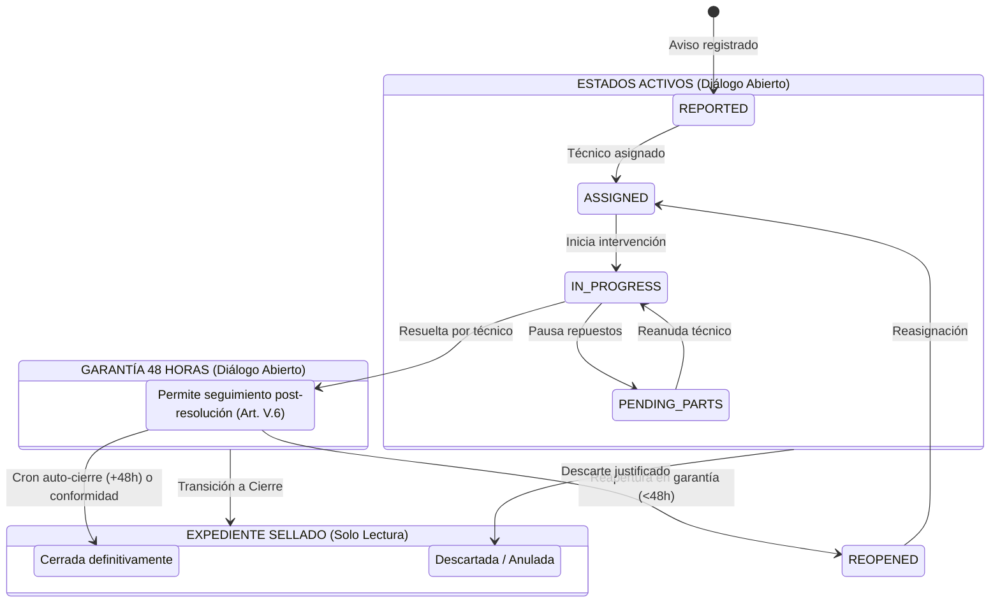

# PLAN TÉCNICO DE IMPLEMENTACIÓN · MÓDULO 10: HILO DE COMENTARIOS BIDIRECCIONAL CON NOTAS INTERNAS CONFIDENCIALES (PLAN.MD)

**Proyecto:** Gestor de Incidencias de Vending (*VendGuard*)  
**Módulo:** `10-incident-comments`  
**Documento:** `specs/10-incident-comments/plan.md`  
**Referencia Funcional:** [`specs/10-incident-comments/spec.md`](spec.md) (y [`specs/functional/incident_comments_spec.md`](../functional/incident_comments_spec.md))  
**Normativa Suprema:** [`constitution.md`](../../constitution.md) (Artículos I al VII)  
**Directrices Operativas:** [`AGENTS.md`](../../AGENTS.md) (SDD, Dogma Vanilla, Dualismo Lingüístico)  
**Sistema de Diseño Visual:** [`docs/design.md`](../../docs/design.md) (Tokens Docker: Azul `#2560ff`, ámbar técnico `#f8b60f`, gris neutro `#e5e7eb`, canvas `#f9fafb`, radio 4px/8px)  

---

## 1. Estructura de Módulos y Ficheros

El diseño arquitectónico sigue estrictamente el patrón MVC / Clean Architecture desacoplado de VendGuard, preservando el **Dogma Vanilla** (PHP 8.2+ OOP nativo con PDO sin ORMs, Vue.js 3 en módulos ES nativos sin bundlers ni npm en runtime).

```text
gestor-incidencias-vending/
├── specs/
│   ├── functional/
│   │   └── incident_comments_spec.md          # Especificación funcional formal aprobada tras QA
│   └── 10-incident-comments/
│       ├── spec.md                            # Especificación funcional del módulo
│       ├── plan.md                            # Este documento técnico de arquitectura
│       └── tasks.md                           # Plan de tareas atómicas secuenciales (siguiente fase)
├── src/
│   ├── Application/
│   │   ├── DTO/
│   │   │   ├── IncidentCommentItemDto.php     # Proyección inmutable de un mensaje individual (segregado/enmascarado)
│   │   │   └── IncidentCommentThreadDto.php   # DTO consolidado del hilo con cabecera, mensajes y metadatos de cursor
│   │   └── Service/
│   │       └── IncidentCommentService.php     # Orquestación de negocio, segregación de roles, filtrado y validaciones
│   ├── Core/
│   │   └── Domain/
│   │       ├── Model/
│   │       │   └── IncidentComment.php        # Entidad inmutable existente (append-only)
│   │       └── Repository/
│   │           └── IncidentRepositoryInterface.php # Métodos extendidos para paginación por cursor y recuentos segregados
│   ├── Infrastructure/
│   │   ├── Repository/
│   │   │   └── PdoIncidentRepository.php      # Implementación PDO con queries optimizadas e indexadas
│   │   └── Storage/
│   │       └── LocalFileUploader.php          # Gestor de subidas con validación binaria finfo y hashes SHA inmutables
│   └── Presentation/
│       ├── Controller/
│       │   ├── LocationPortalController.php   # Endpoints de Sede (filtrado estricto público y enmascaramiento)
│       │   ├── TechnicianController.php       # Endpoints de Técnico (GET y POST con selector de privacidad)
│       │   └── CoordinatorController.php      # Endpoints de Coordinador (inspección total y notas de coordinación)
│       └── Routing/
│           └── AppRouter.php                  # Registro y enrutamiento con middlewares de autenticación RBAC
├── public/
│   └── assets/
│       └── js/
│           ├── api.js                         # Cliente HTTP Vanilla con métodos tipados para comentarios por rol
│           ├── components/
│           │   ├── MachineCard.js             # Insignia interactiva con contador público segregado para Sede
│           │   └── IncidentCommentThreadModal.js # Componente modal reutilizable responsivo Vue 3 ESM
│           └── views/
│               ├── LocationPortalView.js      # Integración del disparador y montaje del modal en Sede
│               ├── TechnicianRouteView.js     # Insignia con contador total y disparador en paradas de ruta
│               └── CoordinatorDashboardView.js # Apertura del modal desde bandeja de triaje
└── tests/
    ├── unit/
    │   ├── IncidentCommentServiceTest.php     # Pruebas unitarias de segregación, enmascaramiento y máquina de estados
    │   ├── IncidentCommentThreadDtoTest.php   # Validación de serialización inmutable de DTOs
    │   └── IncidentCommentThreadModalTest.mjs # Pruebas reactivas frontend ESM (Node.js sin red)
    └── integration/
        ├── LocationCommentsApiTest.php        # Integración HTTP de Sede contra MariaDB real (Art. V.4)
        ├── TechnicianCommentsApiTest.php      # Integración HTTP de Técnico con notas internas y fotos
        ├── CoordinatorCommentsApiTest.php     # Integración HTTP de Coordinador y auditoría en audit_log
        └── IncidentCommentsConstitutionalTest.php # Blindaje constitucional (Art. III, Art. V.4, Art. V.5)
```

---

## 2. Modelo de Datos JSON y Contratos de API REST

Para cumplir con el requerimiento de carga rápida ($< 250\text{ ms}$, RNF-02) y la segregación absoluta de datos en servidor (Art. V.4, RNF-01), se definen contratos específicos y segregados según el perfil del llamante.

### 2.1. Endpoints de Consulta del Hilo (`GET`)

#### A. Responsable de Sede (Portal de Sede)
* **Ruta:** `GET /api/location/incidents/{id}/comments`  
  *(y alias retrocompatible: `GET /api/incidents/{ticket_code}/comments`)*
* **Seguridad:** Middleware `SiteAuthMiddleware` (código de centro validado y matching de sede de la máquina).
* **Parámetros de Consulta (Query Params):**
  * `limit` (opcional, entero, defecto: `50`, máx: `100`).
  * `before_id` (opcional, entero): ID del comentario más antiguo actualmente cargado para paginación retrospectiva ascendente.
* **Comportamiento del Servidor:**
  * **Segregación Estricta:** Filtra forzosamente `is_internal = 0`. No devuelve notas internas ni campo `is_internal`.
  * **Enmascaramiento de Identidad (Art. V.4):** Si el autor es `TECHNICIAN`, el nombre se sustituye en servidor por:  
    `"Servicio Técnico Oficial (Operador #" . sprintf('%02d', $userId) . ")"`
  * Si el autor es `COORDINATOR`, se muestra `"Coordinación Central de Operaciones"`.

```json
{
  "success": true,
  "data": {
    "incident": {
      "id": 142,
      "ticket_code": "TICK-2026-00142",
      "machine_code": "VEN-BCN-001",
      "machine_model": "CoffeMax Pro 3000",
      "location_name": "Hospital del Mar",
      "status": "IN_PROGRESS",
      "status_label": "En Reparación",
      "is_sealed": false,
      "can_comment": true,
      "read_only_reason": null
    },
    "pagination": {
      "total_comments": 4,
      "loaded_count": 4,
      "has_more_before": false,
      "oldest_id": 12,
      "latest_id": 48
    },
    "comments": [
      {
        "id": 12,
        "author_type": "REPORTER",
        "author_name": "Conserjería Principal (Juan Gómez)",
        "comment_text": "La máquina está en la 3ª planta junto a los ascensores B.",
        "photo_url": null,
        "created_at": "2026-10-06 10:15:30",
        "is_own_message": true
      },
      {
        "id": 48,
        "author_type": "TECHNICIAN",
        "author_name": "Servicio Técnico Oficial (Operador #03)",
        "comment_text": "Llegando al edificio. En 10 minutos accedo a conserjería para recoger la llave.",
        "photo_url": null,
        "created_at": "2026-10-06 11:30:12",
        "is_own_message": false
      }
    ]
  }
}
```

#### B. Técnico de Ruta (`GET /api/technician/incidents/{id}/comments`)
* **Seguridad:** Middleware `InternalAuthMiddleware(UserRole::TECHNICIAN)`.
* **Comportamiento del Servidor:**
  * Devuelve la totalidad de los comentarios (`is_internal` tanto 0 como 1).
  * Expone el campo booleano `is_internal`.
  * Muestra la identidad nominal real de los compañeros y coordinadores (`"Carlos Pérez (Técnico)"`).

```json
{
  "success": true,
  "data": {
    "incident": {
      "id": 142,
      "ticket_code": "TICK-2026-00142",
      "machine_code": "VEN-BCN-001",
      "machine_model": "CoffeMax Pro 3000",
      "location_name": "Hospital del Mar",
      "status": "IN_PROGRESS",
      "status_label": "En Reparación",
      "is_sealed": false,
      "can_comment": true,
      "read_only_reason": null
    },
    "pagination": {
      "total_comments": 5,
      "loaded_count": 5,
      "has_more_before": false,
      "oldest_id": 12,
      "latest_id": 49
    },
    "comments": [
      {
        "id": 12,
        "author_type": "REPORTER",
        "author_name": "Conserjería Principal",
        "comment_text": "La máquina está en la 3ª planta junto a los ascensores B.",
        "photo_url": null,
        "is_internal": false,
        "created_at": "2026-10-06 10:15:30",
        "is_own_message": false
      },
      {
        "id": 35,
        "author_type": "TECHNICIAN",
        "author_name": "Carlos Pérez (Técnico)",
        "comment_text": "Ojo: fusible de fuente conmutada recalentado. Posible corto en electroválvula.",
        "photo_url": "/uploads/evidence_f8a92b.jpg",
        "is_internal": true,
        "created_at": "2026-10-06 10:45:00",
        "is_own_message": true
      },
      {
        "id": 48,
        "author_type": "TECHNICIAN",
        "author_name": "Carlos Pérez (Técnico)",
        "comment_text": "Llegando al edificio. En 10 minutos accedo a conserjería para recoger la llave.",
        "photo_url": null,
        "is_internal": false,
        "created_at": "2026-10-06 11:30:12",
        "is_own_message": true
      }
    ]
  }
}
```

#### C. Coordinador de Operaciones (`GET /api/coordinator/incidents/{id}/comments`)
* **Seguridad:** Middleware `InternalAuthMiddleware(UserRole::COORDINATOR)`.
* **Comportamiento del Servidor:** Idéntico al del técnico en cuanto a visibilidad total, auditoría nominal y marcas de confidencialidad interna.

---

### 2.2. Endpoints de Publicación de Mensajes (`POST`)

Para soportar subida atómica de fotografías opcionales sin flujos asíncronos frágiles de dos fases, todos los endpoints aceptan `multipart/form-data` (y `application/json` si no hay archivo adjunto).

#### A. Responsable de Sede (`POST /api/location/incidents/{id}/comments`)
* **Seguridad:** `SiteAuthMiddleware`.
* **Payload Entrada (`multipart/form-data`):**
  * `comment_text`: string (obligatorio, entre 5 y 1.000 caracteres UTF-8).
  * `photo`: archivo binario (opcional, $\le 5\text{ MB}$, JPG/PNG/WebP).
* **Reglas:**
  * Forzado del sistema: `is_internal = 0` (el cliente no puede fijar este valor).
  * `author_type = 'REPORTER'`, `user_id = null`.
  * `author_name`: Derivado del nombre del contacto de la sede o especificado en la sesión.
* **Códigos HTTP:**
  * `201 Created`: Comentario publicado con éxito.
  * `400 Bad Request`: Falta texto o datos requeridos.
  * `403 Forbidden`: Incidencia no pertenece a la sede o expediente sellado en modo solo lectura (`CLOSED`/`CANCELLED` o fuera de ventana de 48h).
  * `413 Payload Too Large`: Fotografía supera 5 MB.
  * `422 Unprocessable Content`: Texto $< 5$ o $> 1.000$ caracteres, o archivo adjunto no es una imagen gráfica válida (*magic bytes* inválidos).

#### B. Técnico de Ruta (`POST /api/technician/incidents/{id}/comments`)
* **Seguridad:** `InternalAuthMiddleware(UserRole::TECHNICIAN)`.
* **Payload Entrada (`multipart/form-data`):**
  * `comment_text`: string (obligatorio, 5 a 1.000 caracteres).
  * `is_internal`: boolean o entero `"1"`/`"0"` (opcional, si se omite toma el valor por defecto de seguridad: `true`).
  * `photo`: archivo binario (opcional, $\le 5\text{ MB}$).
* **Reglas:**
  * `author_type = 'TECHNICIAN'`, `user_id = $authUserId`, `author_name = $authUserName`.
  * Valida que el técnico tenga la incidencia asignada o permiso de intervención.
  * Valida que la incidencia admita comentarios (activa o `RESOLVED` $\le 48\text{ h}$).

#### C. Coordinador de Operaciones (`POST /api/coordinator/incidents/{id}/comments`)
* **Seguridad:** `InternalAuthMiddleware(UserRole::COORDINATOR)`.
* **Payload Entrada (`multipart/form-data` o `application/json`):**
  * `comment_text`: string (5 a 1.000 caracteres).
  * `is_internal`: boolean (por defecto `true`).
  * `photo`: archivo binario (opcional, $\le 5\text{ MB}$).

---

## 3. Algoritmos Clave en Pseudocódigo y Máquinas de Estado

### 3.1. Algoritmo de Segregación Estricta y Enmascaramiento de Identidad (Art. V.4)

Garantiza que la respuesta generada para el Responsable de Sede no contenga ni el menor rastro de datos confidenciales o personales.

```text
ALGORITMO SegregarYEnmascararComentarios(incidencia, listaComentarios, rolUsuario, usuarioAutenticado)
    resultado = ListaVacia()

    PARA CADA c EN listaComentarios HACER:
        SI rolUsuario == "SITE_MANAGER" ENTONCES:
            // 1. Filtrado radical de notas internas: nunca llegan a la respuesta
            SI c.isInternal == VERDADERO ENTONCES:
                CONTINUAR // Ignorar por completo el registro
            FIN SI

            // 2. Enmascaramiento de identidad técnica
            SI c.authorType == "TECHNICIAN" ENTONCES:
                codigoOperador = FormatoNumero(c.userId, 2) // ej: "03"
                nombreAutor = "Servicio Técnico Oficial (Operador #" + codigoOperador + ")"
            SINO SI c.authorType == "COORDINATOR" ENTONCES:
                nombreAutor = "Coordinación Central de Operaciones"
            SINO:
                nombreAutor = c.authorName
            FIN SI

            dto = NUEVO IncidentCommentItemDto(
                id = c.id,
                authorType = c.authorType,
                authorName = nombreAutor,
                commentText = c.commentText,
                photoUrl = c.photoPath,
                createdAt = c.createdAt,
                isInternal = NULO, // No se expone el campo a la sede
                isOwnMessage = (c.authorType == "REPORTER")
            )
            resultado.AGREGAR(dto)

        SINO: // TECHNICIAN o COORDINATOR
            dto = NUEVO IncidentCommentItemDto(
                id = c.id,
                authorType = c.authorType,
                authorName = c.authorName, // Nombre nominal real
                commentText = c.commentText,
                photoUrl = c.photoPath,
                createdAt = c.createdAt,
                isInternal = c.isInternal, // Candado e indicador visible
                isOwnMessage = (c.userId == usuarioAutenticado.id)
            )
            resultado.AGREGAR(dto)
        FIN SI
    FIN PARA

    RETORNAR resultado
FIN ALGORITMO
```

---

### 3.2. Algoritmo de Validación Binaria de Imágenes en Servidor (Art. III y V.5)

Inspecciona el contenido binario del archivo temporal antes de autorizar su almacenamiento, rechazando cualquier intento de inyección maliciosa o archivo falso.

```text
ALGORITMO ValidarYAlmacenarEvidencia(archivoSubido, maxBytes = 5242880)
    SI archivoSubido ES NULO O archivoSubido.error == UPLOAD_ERR_NO_FILE ENTONCES:
        RETORNAR NULO
    FIN SI

    // 1. Verificación de tamaño físico
    SI archivoSubido.size > maxBytes ENTONCES:
        LANZAR InvalidUploadException("FILE_TOO_LARGE", 422)
    FIN SI

    // 2. Inspección estricta de Magic Bytes mediante finfo
    finfo = NUEVO finfo(FILEINFO_MIME_TYPE)
    mimeReal = finfo.file(archivoSubido.tmp_name)

    MAPA_MIME_VALIDOS = {
        "image/jpeg": "jpg",
        "image/png":  "png",
        "image/webp": "webp"
    }

    SI mimeReal NO_ESTA_EN MAPA_MIME_VALIDOS ENTONCES:
        LANZAR InvalidUploadException("INVALID_FILE_TYPE", 422)
    FIN SI

    extension = MAPA_MIME_VALIDOS[mimeReal]

    // 3. Generación de nombre criptográfico inmutable (Art. III)
    hashAleatorio = bin2hex(random_bytes(16)) // 32 caracteres hexadecimales
    nombreArchivo = "comment_" + hashAleatorio + "." + extension
    rutaDestino = "public/uploads/" + nombreArchivo

    // 4. Traslado atómico a disco
    exito = move_uploaded_file(archivoSubido.tmp_name, rutaDestino)
    SI NO exito ENTONCES:
        LANZAR InvalidUploadException("STORAGE_WRITE_ERROR", 500)
    FIN SI

    RETORNAR "/uploads/" + nombreArchivo
FIN ALGORITMO
```

---

### 3.3. Máquina de Estados para Sellado de Conversación y Ciclo de Vida (RF-05)

Determina si una avería admite la incorporación de nuevos mensajes o si debe presentarse sellada en modo estrictamente de solo lectura.



#### Regla de Validación de Sellado en Servidor:
$$\text{PuedeComentar} = (\text{Estado} \in \{\text{REPORTED}, \text{ASSIGNED}, \text{IN\_PROGRESS}, \text{PENDING\_PARTS}, \text{REOPENED}\}) \lor (\text{Estado} = \text{RESOLVED} \land \Delta t_{\text{resolución}} \le 48\text{ horas})$$

Si $\text{PuedeComentar} = \text{FALSO}$, cualquier intento de `POST` es rechazado con error `403 Forbidden` (`CONVERSATION_SEALED`).

---

### 3.4. Algoritmo de Control de Interfaz y Navegación del Modal (RNF-06 y RF-01)

Controla la carga de mensajes, auto-scroll inteligente, retención de borrador ante fallos de conexión y prevención de cierres accidentales.

```text
ALGORITMO InicializarModalConversacion(incidenciaId)
    modal.cargando = VERDADERO
    modal.textoBorrador = ""
    modal.fotoBorrador = NULO
    modal.esFormularioSucio = FALSO

    respuesta = api.obtenerComentarios(incidenciaId, { limit: 50 })
    modal.comentarios = respuesta.data.comments
    modal.infoIncidencia = respuesta.data.incident
    modal.puedeCargarAnteriores = respuesta.data.pagination.has_more_before
    modal.cargando = FALSO

    // Scroll inmediato hacia el final (mensaje más reciente)
    EjecutarEnSiguienteTick(() => {
        visorScroll.scrollTop = visorScroll.scrollHeight
    })
FIN ALGORITMO

ALGORITMO CargarMensajesAnteriores()
    primerMensaje = modal.comentarios[0]
    alturaPrevia = visorScroll.scrollHeight

    respuesta = api.obtenerComentarios(modal.infoIncidencia.id, {
        limit: 50,
        before_id: primerMensaje.id
    })

    modal.comentarios = Concatenar(respuesta.data.comments, modal.comentarios)
    modal.puedeCargarAnteriores = respuesta.data.pagination.has_more_before

    // Preservar exactamente la posición visual relativa previa
    EjecutarEnSiguienteTick(() => {
        diferenciaAltura = visorScroll.scrollHeight - alturaPrevia
        visorScroll.scrollTop = diferenciaAltura
    })
FIN ALGORITMO

ALGORITMO IntentarCerrarModal()
    SI modal.textoBorrador.trim().length > 0 O modal.fotoBorrador != NULO ENTONCES:
        confirmado = MostrarConfirmacion("¿Deseas descartar el mensaje en redacción? Se perderán los datos introducidos.")
        SI NO confirmado ENTONCES:
            RETORNAR // Detener el cierre del modal
        FIN SI
    FIN SI
    modal.abierto = FALSO
FIN ALGORITMO
```

---

## 4. Arquitectura de Eventos y Componentes Frontend Vanilla / Vue 3

### 4.1. Componente Modal Reutilizable: `IncidentCommentThreadModal.js`

Diseñado siguiendo los **Tokens Docker** de `docs/design.md`:
* **Cabecera Fija:**
  * Identificador destacado del ticket: `#TICK-2026-00142` en tipografía monospace semibold.
  * Modelo de máquina y sede.
  * Insignia de estado (`IncidentBadge.js`).
  * Botón de cierre `×` con detección de borrador sucio (*dirty guard*).
* **Cuerpo Central con Scroll Independiente:**
  * Botón superior *"Cargar mensajes anteriores"* si `has_more_before == true`.
  * Estado vacío si no hay mensajes con diseño limpio y amigable (Caso Límite 1).
  * **Bocadillos de Mensaje:**
    * *Comentario Público:* Fondo gris suave `#f3f4f6` (o azul corporativo tenue `#eff6ff` si es mensaje propio), borde de 1px y tipografía Inter 13px.
    * *Nota Interna Confidencial (Taller):* Fondo ámbar técnico `#fef9c3`, borde de 1px `#fde047`, distintivo superior con icono de candado SVG y etiqueta destacada `🔒 Nota Interna de Taller (Confidencial)` en `#854d0e`.
    * Miniatura fotográfica ampliable con clic a vista completa (modal de previsualización `ImagePreview.js`).
    * Marca temporal en formato legible relativo/absoluto (`10:15` o `06/10 10:15`).
* **Pie Fijo / Formulario de Envío:**
  * Si la conversación está sellada (`is_sealed == true`):
    * Recuadro informativo gris de solo lectura: *"Expediente archivado: conversación sellada por auditoría"*.
  * Si `can_comment == false` sin sellado (`read_only_reason == "REOPENED_AWAITING_REASSIGNMENT"`, RF-05.4):
    * Recuadro informativo ámbar tenue de solo lectura, sin formulario: *"Expediente reabierto pendiente de reasignación: el historial se mantiene consultable"*.
  * Si la conversación está abierta (`can_comment == true`):
    * **Selector de Privacidad Reactivo (Solo Técnicos y Coordinadores):**
      * Opción 1: `🔒 Nota Interna de Taller (Confidencial)` [**Preseleccionada por defecto**, RF-03.3].
      * Opción 2: `🌐 Mensaje para Sede (Público)`.
    * **Área de Texto:** `textarea` con `minlength="5"` y `maxlength="1000"`.
    * **Contador de Caracteres Reactivo:** Muestra `995 caracteres restantes` (se tiñe de rojo suave si está fuera del rango permitido).
    * **Botón de Adjuntar Fotografía:** Selector de archivo tipo `input[type=file]` con icono de cámara/clip. Si hay foto seleccionada, muestra miniatura preliminar con botón `×` para retirarla antes del envío.
    * **Botón de Envío:** Bloqueado si el texto es inferior a 5 caracteres o si hay una subida en progreso. Muestra spinner animado durante la llamada de red.

---

### 4.2. Integración en Vistas Existentes

#### A. Portal del Responsable de Sede (`LocationPortalView.js` y `MachineCard.js`)
* En `MachineCard.js`:
  * Se sustituye el botón anterior por una insignia de conversación reactiva con el número exacto de comentarios públicos:
    ```html
    <button class="vg-btn vg-btn-secondary" @click="handleOpenComments">
      💬 Conversación ({{ activeIncident.public_comments_count || 0 }})
    </button>
    ```
  * Al pulsar, emite `open-comments` con el objeto de la avería.
* En `LocationPortalView.js`:
  * Monta `<IncidentCommentThreadModal :incident="selectedIncident" :role="'SITE_MANAGER'" v-model="showCommentsModal" />`.
  * Al recibir el evento de comentario publicado, refresca el listado de máquinas para sincronizar el contador de la tarjeta.

#### B. Vista Móvil del Técnico "Mi Ruta" (`TechnicianRouteView.js`)
* En cada tarjeta de parada de intervención:
  * Insignia interactiva con icono de diálogo y contador de mensajes totales (públicos e internos):
    ```html
    <button class="vg-btn-badge" @click="openCommentsModal(incident)">
      💬 {{ incident.comments_count || 0 }} mensajes
    </button>
    ```
  * Monta `<IncidentCommentThreadModal :incident="selectedIncident" :role="'TECHNICIAN'" v-model="showCommentsModal" />`.

#### C. Bandeja de Triaje del Coordinador (`CoordinatorDashboardView.js`)
* En la fila de cada ticket y dentro del modal de detalle general:
  * Insignia interactiva de acceso directo al hilo de conversación.
  * Monta `<IncidentCommentThreadModal :incident="selectedIncident" :role="'COORDINATOR'" v-model="showCommentsModal" />`.

---

## 5. Decisiones Técnicas Justificadas y Alternativas Descartadas

| Decisión Adoptada | Alternativa Descartada | Justificación Técnica y Constitucional |
| :--- | :--- | :--- |
| **Peticiones REST bajo demanda con paginación por cursor.** | WebSockets o Server-Sent Events (SSE) en tiempo real permanente. | En averías de máquinas de vending, el ritmo de comunicación es asíncrono (minutos u horas). Abrir WebSockets permanentes sobrecargarían servidores y agotarían la batería de los terminales móviles de los técnicos de campo en itinerancia, violando la regla de simplicidad técnica y robustez sin dependencias del Art. IV. |
| **Subida atómica en `multipart/form-data` en el mismo endpoint.** | Subida previa en 2 fases (`POST /api/uploads` temporal + `POST /comments` con `file_id`). | La subida en dos fases genera riesgos de archivos huérfanos sin vincular si el usuario cierra el navegador antes de enviar el texto, complicando la auditoría inmutable (Art. III). Con `multipart/form-data`, la transacción en base de datos y el almacenamiento del archivo ocurren de forma atómica y consistente. |
| **Enmascaramiento y segregación estricta en servidor (Service/DTO).** | Enviar todo el array al cliente y ocultar notas internas con `v-if` en Vue.js. | Violación flagrante del **Artículo V.4 (Privacidad y Segregación de Datos)**. Si las notas internas viajan en el payload JSON, cualquier usuario podría inspeccionar la pestaña *Network* de DevTools y leer información confidencial de taller. El filtrado debe ocurrir antes de serializar el JSON en el backend. |
| **Selector de privacidad con preselección por defecto en "Nota Interna".** | Selector con opción "Público para Sede" preseleccionada por defecto. | Principio de defensa en profundidad y diseño a prueba de fallos (*Fail-Safe Defaults*). Si un técnico escribe un diagnóstico interno apresurado y pulsa enter sin mirar el selector, el mensaje queda protegido en el ámbito interno sin filtrarse jamás al cliente. |
| **Límite de 5 a 1.000 caracteres descriptivos.** | Aceptar comentarios de cualquier longitud sin límite mínimo ni máximo. | Los comentarios de menos de 5 caracteres ("ok", "ya", ".") aportan ruido y degradan la trazabilidad técnica; textos superiores a 1.000 caracteres suelen ser informes o documentos que deben gestionarse en expedientes formales. |

---

## 6. Estrategia de Pruebas Integrales (100% Verde sin Red)

Para mantener la suite de pruebas libre de errores y garantizar la inviolabilidad constitucional (Art. VII), se implementa una matriz integral de pruebas distribuidas en tres capas:

### 6.1. Pruebas Unitarias PHP (Backend)

* **`IncidentCommentServiceTest.php`:**
  * Validación de longitud estricta: rechaza cadenas de $< 5$ o $> 1.000$ caracteres con `InvalidCommentLengthException` (HTTP 422).
  * Regla de sellado: rechaza envíos en tickets `CLOSED` o `CANCELLED` con `ConversationSealedException` (HTTP 403).
  * Regla de garantía: permite envíos en tickets `RESOLVED` con $\le 48\text{ h}$ y los rechaza con $> 48\text{ h}$.
  * Enmascaramiento de Sede: verifica que para `SITE_MANAGER` el autor técnico sea `"Servicio Técnico Oficial (Operador #XX)"` y que ningún mensaje con `is_internal = 1` esté presente en la colección resultante.
  * Visibilidad de Técnico/Coordinador: verifica que las notas internas mantengan `is_internal = true` y los nombres nominales completos.
* **`IncidentCommentThreadDtoTest.php`:**
  * Verifica que la serialización `jsonSerialize()` produzca exactamente la estructura JSON esperada sin campos nulos o fugas de metadatos internos en el perfil de sede.

### 6.2. Pruebas Unitarias Reactivas Frontend (Node.js ESM)

* **`IncidentCommentThreadModalTest.mjs`:**
  * Renderizado condicional: comprueba que las notas internas incluyan la clase visual `is-internal`, el candado SVG y el aviso de confidencialidad.
  * Selector por defecto: verifica que al abrir el modal como técnico, la opción seleccionada inicialmente sea `'INTERNAL'`.
  * Contador dinámico: comprueba que el botón de envío permanezca `disabled` con 4 caracteres y se active automáticamente al teclear el 5º carácter.
  * Dirty state guard: comprueba que al llamar al método de cierre con texto en el borrador, se detenga el cierre y se invoque el diálogo de confirmación.
  * Sellado de interfaz: comprueba que en estado `CLOSED` se oculte el formulario y se renderice el aviso de auditoría de solo lectura.

### 6.3. Pruebas de Integración HTTP contra MariaDB Real

* **`LocationCommentsApiTest.php`:**
  * Petición `GET /api/location/incidents/{id}/comments` contra base de datos con comentarios mixtos: demuestra que las filas de base de datos con `is_internal = 1` son invisibles en la respuesta HTTP.
  * Petición `POST /api/location/incidents/{id}/comments` con foto adjunta válida e inválida (verificando código 201 y 422).
* **`TechnicianCommentsApiTest.php`:**
  * Petición `POST /api/technician/incidents/{id}/comments` con `is_internal = 1` y verificación de persistencia en `incident_comments`.
  * Verificación de que el contador de la parada de ruta devuelva la suma de todos los mensajes.
* **`CoordinatorCommentsApiTest.php`:**
  * Publicación de nota interna de coordinación y verificación inmutable de la traza generada en la tabla `audit_log` con acción `INCIDENT_COMMENT_ADDED`.
* **`IncidentCommentsConstitutionalTest.php`:**
  * **Blindaje Art. III:** Intento de inyección de operaciones de borrado o actualización (demuestra que el repositorio carece de `deleteComment` o `updateComment`).
  * **Blindaje Art. V.4:** Verificación exhaustiva de que ninguna respuesta de sede expone nombres de técnicos ni números de teléfono personales.
  * **Blindaje Art. V.5:** Envío de archivo con extensión `.jpg` pero contenido ejecutable/falso: comprueba que `LocalFileUploader` rechaza la petición con código 422 sin dejar ningún archivo en `public/uploads/`.

---

## 7. Mapeo de Trazabilidad de Requisitos

| Requisito | Descripción | Componente Técnico / Artefacto | Verificación Objetiva |
| :--- | :--- | :--- | :--- |
| **RF-01.1** | Insignias interactivas y contadores segregados en tarjetas. | `MachineCard.js`, `TechnicianRouteView.js`, `CoordinatorDashboardView.js` | Prueba unitaria ESM comprobando el renderizado de la insignia y su valor numérico. |
| **RF-01.2** | Carga inicial de 50 mensajes con auto-scroll inferior. | `IncidentCommentThreadModal.js`, `IncidentCommentService.php` | Test de integración HTTP con `limit=50` y prueba JS verificando `scrollTop`. |
| **RF-01.3** | Paginación retrospectiva ("Cargar mensajes anteriores"). | `IncidentCommentService.php`, `PdoIncidentRepository.php` | Test unitario con parámetro `before_id` devolviendo el bloque anterior sin duplicados. |
| **RF-02.1** | Filtrado absoluto de notas internas ante la Sede (Art. V.4). | `IncidentCommentService::getThread()`, `LocationPortalController.php` | `LocationCommentsApiTest.php` evaluando que cero registros internos salgan en JSON. |
| **RF-02.2** | Enmascaramiento nominal del técnico ante la Sede. | `IncidentCommentItemDto.php`, `IncidentCommentService.php` | Test evaluando que el autor sea `"Servicio Técnico Oficial (Operador #XX)"`. |
| **RF-02.3** | Identidad completa y notas internas visibles para técnicos. | `TechnicianController.php`, `CoordinatorController.php` | Test evaluando que el técnico vea nombres completos y notas ámbar. |
| **RF-02.4** | Distintivo visual ámbar con candado para notas de taller. | `IncidentCommentThreadModal.js` | `IncidentCommentThreadModalTest.mjs` verificando renderizado de `#fef9c3` y candado. |
| **RF-03.1** | Límite estricto de 5 a 1.000 caracteres descriptivos. | `IncidentCommentService.php`, validador frontend en modal | Test unitario PHP y JS verificando bloqueo con 4 y 1.001 caracteres. |
| **RF-03.2** | Sede publica siempre comentario público sin selector. | `IncidentCommentThreadModal.js` (`role === 'SITE_MANAGER'`) | Test JS verificando ausencia del selector en el perfil de sede. |
| **RF-03.3** | Selector preseleccionado en "Nota Interna de Taller" por defecto. | `IncidentCommentThreadModal.js` (`privacyChoice = 'INTERNAL'`) | Test JS verificando valor inicial del selector en técnico y coordinador. |
| **RF-04.1** | Adjunto opcional de fotografía desde móvil o escritorio. | Input file en modal, `LocalFileUploader.php` | Integración HTTP con multipart/form-data. |
| **RF-04.2** | Validación binaria en servidor de tamaño $\le 5\text{ MB}$ y magic bytes. | `LocalFileUploader.php` (`finfo(FILEINFO_MIME_TYPE)`) | Test enviando PDF o archivo $>5\text{ MB}$ esperando HTTP 422. |
| **RF-04.3** | Almacenamiento con hash criptográfico inmutable en disco. | `LocalFileUploader::upload()`, Art. III | Test verificando formato de nombre `/uploads/comment_[a-f0-9]{32}.ext`. |
| **RF-05.1** | Diálogo habilitado en estados operativos activos. | `IncidentCommentService::canAddComment()` | Test PHP evaluando estados `REPORTED`, `ASSIGNED`, `IN_PROGRESS`, `PENDING_PARTS`. |
| **RF-05.2** | Diálogo habilitado en `RESOLVED` durante garantía de 48h. | `IncidentCommentService::isWithinCommentWindow()` | Test PHP evaluando ticket resuelto hace 10h (válido) vs hace 50h (rechazado). |
| **RF-05.3** | Sellado en modo solo lectura en `CLOSED` o `CANCELLED`. | `IncidentCommentService.php`, modal en modo sellado | Test HTTP esperando 403 Forbidden y test JS verificando aviso de sellado. |
| **RF-06.1** | Historial de solo adición (*Append-Only*), prohibido UPDATE. | `PdoIncidentRepository.php`, Art. III | Auditoría de código certificando inexistencia de métodos de modificación. |
| **RF-06.2** | Prohibición absoluta de borrado físico (`DELETE FROM`). | `PdoIncidentRepository.php`, Art. III | Auditoría de código certificando inexistencia de `deleteComment`. |
| **RF-06.3** | Registro inmutable en bitácora `audit_log`. | `IncidentCommentService.php`, `AuditLogger.php` | Test de integración verificando inserción de `INCIDENT_COMMENT_ADDED`. |
| **RF-07.1** | Retención de borrador ante caídas de conexión de red móvil. | Manejo reactivo de errores en modal frontend | Test JS simulando rechazo de red y comprobando que el input conserva su valor. |
| **RNF-01** | Segregación absoluta de datos en servidor (Art. V.4). | Capa de servicio y DTO en backend PHP | `IncidentCommentsConstitutionalTest.php` verde al 100%. |
| **RNF-02** | Carga y renderizado del modal en $< 250\text{ ms}$. | Query indexada `idx_comments_incident`, DTO ligero | Test de rendimiento en suite de integración. |
| **RNF-03** | Ergonomía móvil (*mobile-first*) con una sola mano. | CSS responsivo, padding táctil $\ge 44\text{ px}$ | Verificación visual de estilos y reglas CSS. |
| **RNF-04** | Tokens del sistema de diseño (Docker Design System). | Clases `.vg-*`, variables CSS, radio 4px/8px | Verificación de fidelidad visual en CSS. |
| **RNF-05** | Seguridad en almacenamiento multimedia (Art. V.5). | Nombres hash sin ejecución en disco | Verificación de permisos y hashing en `LocalFileUploader`. |
| **RNF-06** | Prevención de pérdida de datos con guardián de formulario sucio. | `onCloseRequest` con diálogo de confirmación en modal | `IncidentCommentThreadModalTest.mjs` probando tecla Escape con texto. |

---

## 8. Garantía de Dogma Vanilla y Dualismo Lingüístico

* **Dogma Vanilla:**
  * Backend: 100% PHP 8.2+ con tipos estrictos (`declare(strict_types=1)`), objetos de transferencia inmutables (`final readonly class`), consultas preparadas PDO nativas y cero dependencias de Composer añadidas.
  * Frontend: 100% Vanilla JavaScript en módulos ES nativos (`import`/`export`), templates HTML en línea de Vue 3 cargado vía CDN/local sin Node build tooling ni Vite/Webpack en tiempo de ejecución.
* **Dualismo Lingüístico:**
  * Todo el código (nombres de clases, métodos, variables, atributos DTO, rutas REST y nombres de fichero) está escrito estrictamente en **inglés técnico camelCase / PascalCase** (ej: `IncidentCommentService`, `getThread`, `isInternal`, `commentText`).
  * Toda la documentación, comentarios explicativos en código, especificaciones, mensajes de interfaz de usuario y descripciones de error HTTP se redactan íntegramente en **castellano formal**.
