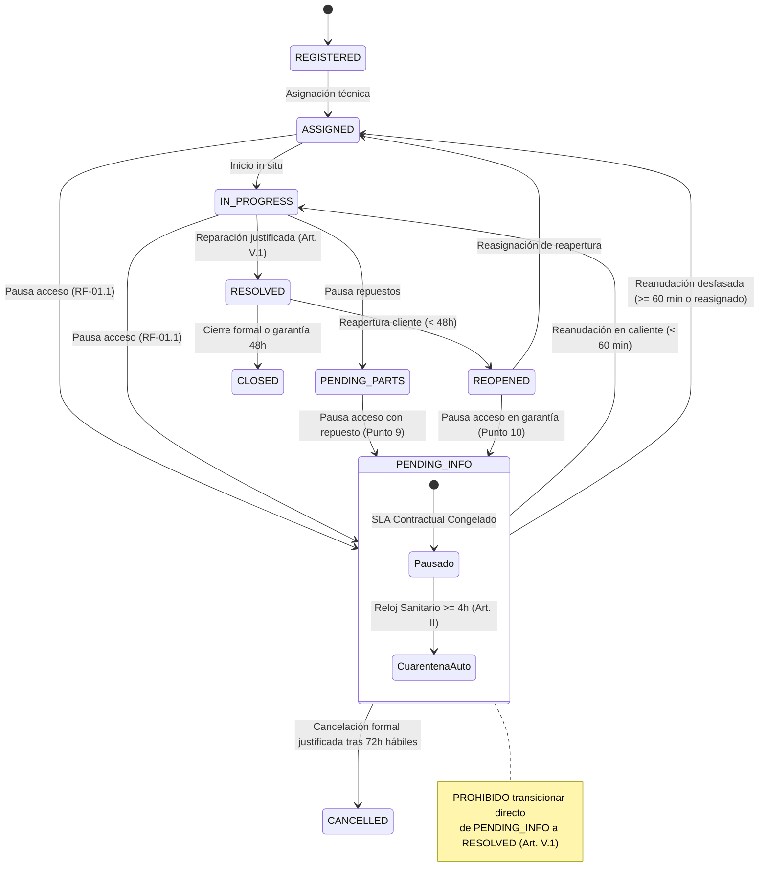

# PLAN TÉCNICO DE IMPLEMENTACIÓN · MÓDULO 11: ESTADO OPERATIVO "PENDIENTE DE INFORMACIÓN" (PENDING_INFO) CON PAUSA DE SLA (PLAN.MD)

**Proyecto:** Gestor de Incidencias de Vending (*VendGuard*)  
**Módulo:** `11-pending-info-sla-pause`  
**Documento:** `specs/11-pending-info-sla-pause/plan.md`  
**Referencia Funcional:** [`specs/11-pending-info-sla-pause/spec.md`](spec.md) (y [`specs/functional/pending_info_sla_pause_spec.md`](../functional/pending_info_sla_pause_spec.md))  
**Normativa Suprema:** [`constitution.md`](../../constitution.md) (Artículos I al VII)  
**Directrices Operativas:** [`AGENTS.md`](../../AGENTS.md) (SDD, Dogma Vanilla, Dualismo Lingüístico)  
**Sistema de Diseño Visual:** [`docs/design.md`](../../docs/design.md) (Tokens Docker: Ámbar técnico `#fef9c3` con texto `#854d0e`, azul corporativo `#2560ff`, radio binario 4px/8px, canvas `#f9fafb`)  

---

## 1. Estructura de Módulos y Ficheros

El diseño arquitectónico preserva rigurosamente el **Dogma Vanilla** (PHP 8.2+ OOP nativo con PDO sin ORMs ni dependencias Composer adicionales; Vue.js 3 estándar en módulos ES nativos sin bundlers ni dependencias npm en runtime).

```text
gestor-incidencias-vending/
├── specs/
│   ├── functional/
│   │   └── pending_info_sla_pause_spec.md       # Especificación funcional formal aprobada tras QA
│   └── 11-pending-info-sla-pause/
│       ├── spec.md                              # Especificación funcional del módulo
│       ├── plan.md                              # Este documento técnico de arquitectura
│       └── tasks.md                             # Plan de tareas atómicas secuenciales (siguiente fase)
├── src/
│   ├── Application/
│   │   ├── DTO/
│   │   │   ├── IncidentPauseRequestDto.php      # DTO inmutable para la solicitud de pausa con causa y motivo
│   │   │   └── IncidentPauseResponseDto.php     # Proyección inmutable del estado de pausa y recálculo de SLA
│   │   └── Service/
│   │       ├── IncidentPauseService.php         # Orquestación de pausas, reanudaciones condicionales y doble reloj
│   │       ├── MetricsCalculationService.php    # Ajuste de MTTR y recuento de brechas con pausas descontadas
│   │       └── CoordinatorIncidentDetailService.php # Desplazamiento comercial de SLA y detección de cuarentena
│   ├── Core/
│   │   └── Domain/
│   │       ├── Model/
│   │       │   ├── Incident.php                 # Entidad de dominio con campos y métodos para PENDING_INFO
│   │       │   └── Machine.php                  # Soporte para estado "Fuera de servicio / Bloqueada por acceso"
│   │       ├── Repository/
│   │       │   └── IncidentRepositoryInterface.php # Métodos extendidos para pausas, reanudaciones y alertas 72h
│   │       └── ValueObject/
│   │           ├── IncidentPauseReasonCategory.php # Enum de causas tipificadas de acceso/información
│   │           └── IncidentStatus.php           # Ampliación del enum con case PENDING_INFO y matriz de transición
│   ├── Infrastructure/
│   │   └── Repository/
│   │       ├── PdoIncidentRepository.php        # Persistencia atómica de transiciones, cálculo de intervalos y 72h
│   │       ├── PdoMachineRepository.php         # Marcado de bloqueo de acceso y verificación de reapertura
│   │       └── PdoMetricsRepository.php         # Queries analíticas SQL descontando total_pending_info_seconds
│   └── Presentation/
│       ├── Controller/
│       │   ├── LocationPortalController.php     # Gancho de reactivación automática al comentar la Sede
│       │   ├── TechnicianController.php         # Endpoints POST pause y resume para el técnico móvil
│       │   └── CoordinatorController.php        # Endpoints POST pause, resume y cancel-inactivity para coordinación
│       └── Routing/
│           └── AppRouter.php                    # Rutas REST registradas con middlewares RBAC
├── public/
│   └── assets/
│       └── js/
│           ├── api.js                           # Métodos HTTP tipados para pause/resume de PENDING_INFO
│           ├── components/
│           │   ├── MachineCard.js               # Banner prominente de sede con botón de llamada a la acción
│           │   ├── PendingInfoPauseModal.js     # Componente modal de pausa con causas tipificadas y >= 20 chars
│           │   └── CoordinatorIncidentDetailModal.js # Visualización de SLA congelado y alerta sanitaria
│           └── views/
│               ├── LocationPortalView.js        # Integración del banner reactivador y apertura de chat
│               ├── TechnicianRouteView.js       # Modal de pausa, botón reanudar y desacoplamiento de parada
│               └── CoordinatorDashboardView.js # Insignia PENDING_INFO, filtro de pausa y alertas de 72h
└── tests/
    ├── unit/
    │   ├── IncidentStatusPendingInfoTest.php    # Pruebas unitarias de la máquina de estados ampliada
    │   ├── IncidentPauseServiceTest.php         # Pruebas unitarias de reactivación condicional y doble reloj
    │   └── PendingInfoPauseModalTest.mjs        # Pruebas reactivas frontend ESM (Node.js sin red)
    └── integration/
        ├── PendingInfoApiTest.php               # Integración HTTP de endpoints contra MariaDB real
        ├── PendingInfoSlaCalculationTest.php    # Verificación de desplazamiento comercial de SLA y MTTR
        └── PendingInfoConstitutionalTest.php    # Blindaje constitucional (Art. II, Art. III, Art. V.1, Art. V.4)
```

---

## 2. Modelo de Datos JSON y Contratos de API REST

Para cumplir con la precisión temporal requerida (RNF-01) y la respuesta ágil en $< 200\text{ ms}$ (RNF-02), los contratos de API se diseñan desacoplados, atómicos y estrictamente validados.

### 2.1. Endpoints de Declaración de Pausa (`POST .../pause-pending-info`)

#### A. Técnico de Campo (`POST /api/technician/incidents/{id}/pause-pending-info`)
* **Seguridad:** Middleware `InternalAuthMiddleware(UserRole::TECHNICIAN)`. Valida que el técnico sea el asignado.
* **Estados de origen válidos:** `ASSIGNED`, `IN_PROGRESS` o directamente `PENDING_PARTS` (Punto 9 QA).
* **Payload de Entrada (`application/json`):**
  ```json
  {
    "reason_category": "BUILDING_CLOSED_NO_ACCESS",
    "reason_text": "El edificio de consultas externas está cerrado por festivo local; conserjería sin personal hasta mañana."
  }
  ```
  * `reason_category`: string enum requerido (`BUILDING_CLOSED_NO_ACCESS`, `MACHINE_LOCATION_NOT_FOUND`, `EXTERNAL_POWER_CUT`, `PENDING_SITE_AUTHORIZATION`).
  * `reason_text`: string requerido con **al menos 20 caracteres descriptivos reales** (Art. V.1).
* **Códigos HTTP:**
  * `200 OK`: Incidencia pausada exitosamente.
  * `400 Bad Request`: Falta categoría o campos obligatorios.
  * `403 Forbidden`: Técnico no asignado o incidencia en estado terminal (`CLOSED`/`CANCELLED`).
  * `422 Unprocessable Content`: `reason_text` con menos de 20 caracteres o categoría no válida.
* **Payload de Salida (`200 OK` JSON):**
  ```json
  {
    "success": true,
    "data": {
      "incident_id": 142,
      "ticket_code": "TICK-2026-00142",
      "status": "PENDING_INFO",
      "status_label": "Pendiente de Información",
      "paused_at": "2026-10-08 10:15:00",
      "reason_category": "BUILDING_CLOSED_NO_ACCESS",
      "reason_category_label": "Edificio cerrado / Sin acceso a instalaciones",
      "reason_text": "El edificio de consultas externas está cerrado por festivo local; conserjería sin personal hasta mañana.",
      "is_sla_paused": true,
      "accumulated_pause_minutes": 0,
      "sla_target_at_original": "2026-10-08 12:15:00"
    },
    "message": "Incidencia pausada correctamente. Reloj contractual de SLA congelado."
  }
  ```

#### B. Coordinador de Operaciones (`POST /api/coordinator/incidents/{id}/pause-pending-info`)
* **Seguridad:** Middleware `InternalAuthMiddleware(UserRole::COORDINATOR)`. Mismo contrato que el técnico, pero autoriza pausar cualquier ticket activo (`ASSIGNED`, `IN_PROGRESS`, `PENDING_PARTS`, `REOPENED`).

---

### 2.2. Endpoints de Reanudación Manual (`POST .../resume-pending-info`)

#### A. Técnico de Campo (`POST /api/technician/incidents/{id}/resume-pending-info`)
* **Seguridad:** `InternalAuthMiddleware(UserRole::TECHNICIAN)`.
* **Comportamiento:** Si lo ejecuta el técnico in situ, la avería transiciona forzosamente a `IN_PROGRESS` (comienza a trabajar en la máquina).
* **Payload de Salida (`200 OK` JSON):**
  ```json
  {
    "success": true,
    "data": {
      "incident_id": 142,
      "ticket_code": "TICK-2026-00142",
      "status": "IN_PROGRESS",
      "status_label": "En curso",
      "resumed_at": "2026-10-08 11:45:00",
      "duration_this_pause_minutes": 90,
      "total_accumulated_pause_minutes": 90,
      "new_sla_target_at": "2026-10-08 13:45:00",
      "sanitary_quarantine_triggered": false
    },
    "message": "Intervención reanudada en curso. Reloj contractual de SLA reactivado con desplazamiento aplicado."
  }
  ```

#### B. Coordinador de Operaciones (`POST /api/coordinator/incidents/{id}/resume-pending-info`)
* **Seguridad:** `InternalAuthMiddleware(UserRole::COORDINATOR)`.
* **Payload de Entrada Opcional (`application/json`):**
  ```json
  {
    "target_status": "ASSIGNED",
    "resume_note": "Recepción confirma por teléfono que ya entregaron la llave al técnico de guardia."
  }
  ```
  * `target_status`: `"ASSIGNED"` (por defecto si el técnico debe desplazarse) o `"IN_PROGRESS"` (si ya está en la máquina).

---

### 2.3. Gancho de Reactivación Automática en Comentarios de Sede

* **Ruta Existente:** `POST /api/location/incidents/{id}/comments` (Módulo 10).
* **Comportamiento Integrado:**
  * Al procesar un comentario público válido ($\ge 5$ caracteres) de la Sede (`REPORTER`), el servicio `IncidentPauseService::handleSiteCommentReactivation()` evalúa el estado actual:
    * Si la avería está en `PENDING_INFO`:
      * Calcula el tiempo transcurrido desde la pausa.
      * Si es **en caliente (< 60 minutos)** y el técnico no ha iniciado otra parada: transiciona a `IN_PROGRESS`.
      * Si han pasado **$\ge 60$ minutos**, inició otra parada o fue reasignada: transiciona a `ASSIGNED`.
      * Desplaza la fecha límite `sla_target_at` en horario comercial y anexa el comentario a la bitácora con idempotencia ante ráfagas (RF-05.3).
* **Payload de Respuesta:** Incluye el bloque `auto_resumed: true` con el nuevo estado asignado.

---

### 2.4. Endpoint de Cancelación por Inactividad de 72h Hábiles (`POST .../cancel-inactivity`)

* **Ruta:** `POST /api/coordinator/incidents/{id}/cancel-inactivity`
* **Seguridad:** Middleware `InternalAuthMiddleware(UserRole::COORDINATOR)`.
* **Payload Entrada (`application/json`):**
  ```json
  {
    "cancellation_reason": "Cierre formal tras 72 horas hábiles de inactividad de sede sin respuesta ni acceso facilitado."
  }
  ```
  * `cancellation_reason`: string obligatorio $\ge 20$ caracteres descriptivos.
* **Comportamiento en Base de Datos (Art. V.1 y Módulo 08):**
  * `incidents.status` pasa a `'CANCELLED'`.
  * `machines.status` pasa a `'BLOCKED_NO_ACCESS'` (la máquina NO vuelve a `'Operativa'`).
  * Reintegros económicos vinculados: se desvinculan del ticket (`refund_requests.incident_id = NULL`), manteniéndose en estado `'PENDING_COORDINATOR'` para liquidación central sin perjudicar al usuario.
* **Respuesta HTTP:** `200 OK` confirmando la cancelación, el bloqueo de máquina y la preservación del reintegro.

---

## 3. Algoritmos Clave en Pseudocódigo y Máquinas de Estado

### 3.1. Algoritmo 1: Máquina de Estados Ampliada con `PENDING_INFO`

Regula las transiciones legales garantizando la prohibición terminante de cierres directos sin intervención (Art. V.1).



#### Matriz de Transiciones Legales (`IncidentStatus::canTransitionTo`):
```text
Desde PENDING_INFO SE PERMITE:
  -> IN_PROGRESS (Reanudación in situ o en caliente)
  -> ASSIGNED    (Reanudación desfasada, por coordinador o tras reasignación)
  -> CANCELLED   (Cancelación formal por inactividad de 72h hábiles)

Hacia PENDING_INFO SE PERMITE DESDE:
  <- ASSIGNED
  <- IN_PROGRESS
  <- PENDING_PARTS
  <- REOPENED
```

---

### 3.2. Algoritmo 2: Reactivación Condicional Inteligente tras Respuesta de Sede

Determina con precisión matemática y física a qué estado debe volver la avería al recibir información del cliente, eliminando ficciones operativas (Puntos 2, 6 y 7 de QA).

```text
ALGORITMO ReactivarCondicionalmente(incidencia, comentarioSede, ahora)
    // 1. Validar que la incidencia esté en pausa
    SI incidencia.status != "PENDING_INFO" ENTONCES:
        RETORNAR // Comentario normal de seguimiento, nada que despausar
    FIN SI

    // 2. Calcular tiempo transcurrido en la pausa actual
    minutosEnPausa = DiferenciaEnMinutos(ahora, incidencia.pending_info_started_at)
    
    // 3. Evaluar contexto del técnico asignado
    tecnicoAsignado = incidencia.assigned_technician_id
    haIniciadoOtraIntervencion = ComprobarSiTecnicoTieneOtraParadaEnCurso(tecnicoAsignado, ahora)
    fueReasignadoEnPausa = incidencia.tecnico_cambiado_durante_pausa // Booleano auditado

    // 4. Regla de Reactivación Inteligente (Puntos 2 y 6 de QA)
    SI minutosEnPausa < 60 Y NO haIniciadoOtraIntervencion Y NO fueReasignadoEnPausa ENTONCES:
        nuevoEstado = "IN_PROGRESS"
        notaAuditoria = "Reactivación automática en caliente tras respuesta de sede (< 60 min)."
    SINO:
        nuevoEstado = "ASSIGNED"
        notaAuditoria = "Reactivación automática a estado Asignada (demora >= 60 min, técnico en otra parada o reasignado). Requiere inicio presencial."
    FIN SI

    // 5. Aplicar desplazamiento comercial de SLA
    nuevoSlaTargetAt = DesplazarSlaHorarioComercial(incidencia.sla_target_at, minutosEnPausa, incidencia.location_id)

    // 6. Persistir atómicamente la transición y auditoría
    incidencia.status = nuevoEstado
    incidencia.total_pending_info_seconds += (minutosEnPausa * 60)
    incidencia.last_pending_info_resumed_at = ahora
    incidencia.pending_info_started_at = NULO
    incidencia.sla_target_at = nuevoSlaTargetAt

    GuardarEnBaseDeDatos(incidencia)
    RegistrarHistorialAuditoria(incidencia.id, "PENDING_INFO", nuevoEstado, notaAuditoria)
    NotificarTecnico(tecnicoAsignado, "Sede ha facilitado información. Avería reactivada.")
FIN ALGORITMO
```

---

### 3.3. Algoritmo 3: Recálculo de SLA en Ventana de Horario Hábil Comercial

Aplica el aplazamiento de la fecha límite respetando los horarios reales de apertura del cliente, impidiendo vencimientos de madrugada (Punto 3 de QA).

```text
ALGORITMO DesplazarSlaHorarioComercial(fechaObjetivoOriginal, minutosPausa, locationId)
    // Parámetros comerciales de sede (por defecto 08:00 a 18:00, lunes a viernes)
    HORA_APERTURA = 8
    HORA_CIERRE = 18
    MINUTOS_JORNADA = (HORA_CIERRE - HORA_APERTURA) * 60 // 600 minutos/día

    fechaCursor = fechaObjetivoOriginal
    minutosPendientesPorSumar = minutosPausa

    MIENTRAS minutosPendientesPorSumar > 0 HACER:
        // Si el cursor cae en fin de semana (sábado/domingo), saltar al lunes a las 08:00
        SI EsFinDeSemana(fechaCursor) ENTONCES:
            fechaCursor = SiguienteLunesHora(fechaCursor, HORA_APERTURA)
        FIN SI

        // Si la hora es anterior a la apertura, situar a las 08:00
        SI fechaCursor.hora < HORA_APERTURA ENTONCES:
            fechaCursor.hora = HORA_APERTURA
            fechaCursor.minuto = 0
        FIN SI

        // Si la hora es posterior al cierre, saltar al día siguiente a las 08:00
        SI fechaCursor.hora >= HORA_CIERRE ENTONCES:
            fechaCursor = SiguienteDiaHabilHora(fechaCursor, HORA_APERTURA)
            CONTINUAR
        FIN SI

        // Minutos disponibles en la jornada actual
        minutosHastaCierreHoy = ((HORA_CIERRE - fechaCursor.hora) * 60) - fechaCursor.minuto

        SI minutosPendientesPorSumar <= minutosHastaCierreHoy ENTONCES:
            fechaCursor = fechaCursor.SumarMinutos(minutosPendientesPorSumar)
            minutosPendientesPorSumar = 0
        SINO:
            minutosPendientesPorSumar -= minutosHastaCierreHoy
            fechaCursor = SiguienteDiaHabilHora(fechaCursor, HORA_APERTURA)
        FIN SI
    FIN MIENTRAS

    RETORNAR fechaCursor
FIN ALGORITMO
```

---

### 3.4. Algoritmo 4: Doble Reloj con Cuarentena Sanitaria Automática (Art. II)

Garantiza la supremacía de la seguridad alimentaria en máquinas de frío independientemente del congelamiento de facturación contractual.

```text
ALGORITMO EvaluarDobleRelojSanitario(incidencia, maquina, ahora)
    // 1. Evaluar si la máquina queda bajo vigilancia sanitaria (RF-03.4, ratificado en
    //    T-PAUSE-26): perecederas PERISHABLE_FOOD y mixtas COMBO con módulo refrigerado.
    //    Las bebidas frías y las tipologías sin producto fresco solo computan reloj contractual.
    SI NOT requiresSanitaryWatch(maquina.machine_type) ENTONCES:
        RETORNAR // Máquina fuera de la vigilancia sanitaria: solo aplica reloj contractual
    FIN SI

    // 2. Reloj Biológico Sanitario: tiempo natural 24/7 continuo desde el reporte inicial de frío
    horasNaturalesSinFrio = DiferenciaHorasNaturales24_7(ahora, incidencia.created_at)

    // 3. Regla Suprema del Artículo II: Límite crítico de 4 horas
    SI horasNaturalesSinFrio >= 4.0 Y maquina.sanitary_status != "QUARANTINE" ENTONCES:
        // Activar Cuarentena Sanitaria Automática
        maquina.sanitary_status = "QUARANTINE"
        ActualizarEstadoSanitarioMaquina(maquina.id, "QUARANTINE")

        // Marcar la incidencia con flag de cuarentena requerida en resolución
        incidencia.sanitary_quarantine_triggered = VERDADERO
        ActualizarIncidencia(incidencia)

        // Registrar en auditoría inmutable
        RegistrarEventoAuditoria("SANITARY_QUARANTINE_AUTO_TRIGGERED", {
            "incident_id": incidencia.id,
            "machine_id": maquina.id,
            "elapsed_natural_hours": horasNaturalesSinFrio,
            "reason": "Ruptura térmica prolongada: superadas 4 horas naturales en PENDING_INFO sin intervención."
        })

        EmitirAlertaCriticaCoordinacion("ALERTA SANITARIA ART. II: Máquina " + maquina.code + " en cuarentena automática.")
    FIN SI
FIN ALGORITMO
```

---

### 3.5. Algoritmo 5: Detección de Inactividad de 72h Hábiles y Cancelación Segura (Art. V.1 y V.2)

```text
ALGORITMO EvaluarInactividad72HorasHabiles(incidencia, ahora)
    SI incidencia.status != "PENDING_INFO" ENTONCES:
        RETORNAR
    FIN SI

    horasHabilesTranscurridas = CalcularHorasHabilesComerciales(incidencia.pending_info_started_at, ahora)

    SI horasHabilesTranscurridas >= 72.0 ENTONCES:
        incidencia.is_prolonged_wait = VERDADERO
        ActualizarBadgeIncidencia(incidencia.id, "En espera prolongada de cliente (> 72h hábiles)")
        NotificarAlertaPrioritariaTriaje(incidencia.id)
    FIN SI
FIN ALGORITMO

ALGORITMO CancelarPorInactividadCoordinador(incidenciaId, motivoCancelacion, coordinadorId)
    // 1. Validar justificación >= 20 caracteres (Art. V.1)
    SI LongitudReal(motivoCancelacion.trim()) < 20 ENTONCES:
        LANZAR ErrorValidacion("El motivo de cancelación debe contener al menos 20 caracteres reales.")
    FIN SI

    incidencia = ObtenerIncidencia(incidenciaId)
    maquina = ObtenerMaquina(incidencia.machine_id)

    INICIAR_TRANSACCION()

    // 2. Cancelar el ticket formalmente
    incidencia.status = "CANCELLED"
    incidencia.cancelled_at = Ahora()
    incidencia.cancellation_reason = motivoCancelacion
    GuardarIncidencia(incidencia)

    // 3. Proteger la máquina: NO vuelve a "Operativa" (Art. V.1)
    maquina.is_active = FALSO
    maquina.operational_status = "BLOCKED_NO_ACCESS"
    maquina.notes = Concatenar(maquina.notes, " [Bloqueada por falta de acceso tras ticket " + incidencia.ticket_code + "]")
    GuardarMaquina(maquina)

    // 4. Proteger reintegros económicos vinculados (Módulo 08)
    reintegro = BuscarReintegroPorIncidencia(incidencia.id)
    SI reintegro != NULO ENTONCES:
        reintegro.incident_id = NULO // Desvincular de la avería técnica
        reintegro.status = "PENDING_COORDINATOR" // Mantener para pago central Bizum/IBAN
        GuardarReintegro(reintegro)
        RegistrarAuditoriaReintegro(reintegro.id, "Reintegro desvinculado de avería cancelada por inactividad; mantenido para custodia central.")
    FIN SI

    RegistrarHistorialAuditoria(incidencia.id, "PENDING_INFO", "CANCELLED", motivoCancelacion)
    CONFIRMAR_TRANSACCION()
FIN ALGORITMO
```

---

## 4. Arquitectura de Eventos y Componentes Frontend Vanilla / Vue 3

### 4.1. Componente Modal Reutilizable: `PendingInfoPauseModal.js`

* **Ubicación:** `public/assets/js/components/PendingInfoPauseModal.js`.
* **Props:** `isOpen` (boolean), `incident` (Object), `role` (string: `'TECHNICIAN'` o `'COORDINATOR'`).
* **Emits:** `close`, `paused`.
* **Diseño y Maquetación (Tokens Docker de `docs/design.md`):**
  * Fondo sombreado `rgba(15, 23, 42, 0.6)`.
  * Contenedor con borde de 8px (`--radius-card`), cabecera ámbar suave con icono `⏸️`.
  * **Selector de Causas Tipificadas (Botones táctiles $\ge 44\text{ px}$):**
    * `BUILDING_CLOSED_NO_ACCESS`: *"Edificio cerrado / Sin acceso a instalaciones"*
    * `MACHINE_LOCATION_NOT_FOUND`: *"Máquina no localizada en la planta indicada"*
    * `EXTERNAL_POWER_CUT`: *"Corte eléctrico ajeno a la máquina"*
    * `PENDING_SITE_AUTHORIZATION`: *"Falta de autorización de seguridad / Llave"*
  * **Área de Texto de Justificación:** `textarea` con `minlength="20"`, `maxlength="500"`.
  * **Contador Reactivo Dinámico:** Muestra *"Faltan X caracteres"* en rojo suave si $< 20$, y se tiñe de verde una vez alcanzado el mínimo legal (Art. V.1).
  * **Botón de Confirmar Pausa:** Deshabilitado hasta que haya causa seleccionada y el texto alcance $\ge 20$ caracteres.
  * **Guardián de Borrador Sucio (RNF-06):** Intercepta tecla `Escape` y clics en el backdrop, solicitando confirmación si hay texto escrito antes de cerrar.

---

### 4.2. Integración en el Portal del Responsable de Sede (`LocationPortalView.js` y `MachineCard.js`)

* En `MachineCard.js`:
  * Si `activeIncident.status === 'PENDING_INFO'`:
    * La tarjeta de la máquina se enmarca con borde ámbar `#fde047`.
    * Renderiza un **Banner Prominente de Llamada a la Acción**:
      ```html
      <div class="vg-pending-info-banner" style="background: #fef9c3; border: 1px solid #fde047; padding: 10px; border-radius: 4px;">
        <div style="font-weight: 700; color: #854d0e; font-size: 13px;">⏸️ Intervención en Pausa: El técnico necesita tu ayuda</div>
        <div style="font-size: 12px; color: #713f12; margin: 4px 0;">Causa: {{ activeIncident.pending_info_reason_category_label }}</div>
        <p style="font-size: 11px; color: #713f12; margin: 0 0 8px 0;">"{{ activeIncident.pending_info_reason_text }}"</p>
        <button class="vg-btn vg-btn-primary" style="width: 100%; font-size: 12px;" @click="$emit('open-comments', machine)">
          💬 Aportar información / Responder al técnico
        </button>
      </div>
      ```
* Al pulsar el botón, abre el modal de conversación del Módulo 10 (`IncidentCommentThreadModal.js`); al publicar un comentario de $\ge 5$ caracteres, se dispara la reactivación automática sin recargas manuales.

---

### 4.3. Integración en la Vista Móvil del Técnico "Mi Ruta" (`TechnicianRouteView.js`)

* **Parada en `PENDING_INFO`:**
  * La tarjeta de parada muestra la insignia destacada `⏸️ En espera de sede (Pausada hace X min)`.
  * **Desacoplamiento de Ruta (RF-05.5):** La parada no bloquea el flujo; el botón *"Iniciar intervención"* de la siguiente parada programada permanece completamente operativo.
  * **Acción *"Reanudar intervención"*:** Botón visible en la tarjeta que abre un diálogo de confirmación y llama a `POST .../resume-pending-info`, volviendo a `IN_PROGRESS` si el técnico vuelve a estar in situ.

---

### 4.4. Integración en la Bandeja de Triaje del Coordinador (`CoordinatorDashboardView.js`)

* **Insignia y Filtro:** Filtro rápido por estado `PENDING_INFO` con badge `#fef9c3`.
* **Reloj Congelado:** En la columna de SLA, se muestra el icono `⏸️` con el texto *"Pausado (+X min desc.)"*.
* **Alerta de 72h:** Si acumula $> 72\text{ h}$ hábiles, la fila destaca con borde rojo y botón de acción directa *"Cancelar por inactividad de sede"*.

---

## 5. Decisiones Técnicas Justificadas y Alternativas Descartadas

| Decisión Adoptada | Alternativa Descartada | Justificación Técnica y Constitucional |
| :--- | :--- | :--- |
| **Doble Reloj (Contractual congelado vs. Biológico 24/7 continuo).** | Reloj único pausado para todo o prohibición de pausar en frío. | Armoniza la equidad contractual con la **Supremacía Sanitaria del Artículo II**. Congelar la facturación protege a la empresa operadora de multas injustas por puertas cerradas; mantener el reloj biológico garantiza que a las 4 horas la máquina entre en cuarentena y los alimentos se desechen antes de abrir al público. |
| **Desplazamiento de SLA en horario hábil de la sede (08:00 a 18:00).** | Desplazamiento ciego en minutos naturales 24/7. | Un cliente que reporta un viernes y cierra a las 18:00 no puede recibir un SLA aplazado que venza un sábado a las 03:00 AM. Computar en horario hábil refleja la realidad contractual y comercial de los contratos de vending con empresas y centros oficiales. |
| **Reactivación condicional inteligente (< 60 min a `IN_PROGRESS` vs. $\ge 60$ min a `ASSIGNED`).** | Reanudar siempre a `IN_PROGRESS` o siempre a `ASSIGNED`. | Evita ficciones operativas. Si la sede responde dos días después, situar al técnico en `IN_PROGRESS` significaría que el sistema afirma que está reparando la máquina en ese instante (quizás estando en otra ciudad o fuera de turno). Devolver a `ASSIGNED` le exige pulsar "Iniciar" al llegar. |
| **Máquina en "Fuera de servicio / Bloqueada por acceso" tras cancelación de 72h.** | Restablecer la máquina a "Operativa" en verde. | Violación flagrante del **Artículo V.1 (Cierre obligatoriamente justificado)**. Si la máquina tenía un fallo mecánico o eléctrico reportado y nunca se pudo acceder a repararla, ponerla en verde engañaría a los usuarios del edificio. Debe quedar inoperativa hasta que confirmen acceso. |
| **Desvinculación protectora de reintegros económicos (Módulo 08).** | Cancelar la devolución de dinero si se cancela la avería técnica. | El consumidor que perdió su dinero en la máquina no tiene la culpa de que el conserje no haya abierto la puerta al técnico. Cancelar su dinero violaría el principio de equidad del Módulo 08. El reintegro debe pasar a liquidación central por transferencia Bizum/IBAN. |

---

## 6. Estrategia de Pruebas Integrales (100% Verde sin Red)

### 6.1. Pruebas Unitarias PHP (Backend)

* **`IncidentStatusPendingInfoTest.php`:**
  * Verifica transiciones válidas hacia `PENDING_INFO` desde `ASSIGNED`, `IN_PROGRESS`, `PENDING_PARTS` y `REOPENED`.
  * Verifica transiciones de salida permitidas (`IN_PROGRESS`, `ASSIGNED`, `CANCELLED`).
  * Verifica que esté terminantemente prohibida la transición directa `PENDING_INFO` $\rightarrow$ `RESOLVED`.
  * Comprueba que `isActive()` devuelva `true` y `isTerminal()` devuelva `false`.
* **`IncidentPauseServiceTest.php`:**
  * Prueba de justificación: rechaza causas vacías o textos $< 20$ caracteres reales.
  * Prueba de reactivación condicional: respuesta de sede a los 20 min reactiva a `IN_PROGRESS`; respuesta a los 90 min o con ticket reasignado reactiva a `ASSIGNED`.
  * Prueba de desplazamiento de SLA comercial: verifica que los minutos de pausa aplacen `sla_target_at` saltando fines de semana y noches.
* **`MetricsCalculationServiceTest.php`:**
  * Verifica que el cálculo de MTTR reste exactamente `total_pending_info_seconds` del tiempo transcurrido entre creación y resolución.

### 6.2. Pruebas Unitarias Reactivas Frontend (Node.js ESM)

* **`PendingInfoPauseModalTest.mjs`:**
  * Renderizado de las 4 causas tipificadas.
  * Contador reactivo de caracteres: botón deshabilitado con 19 caracteres y habilitado con 20.
  * Detección de formulario sucio (*dirty state guard*) ante pulsación de `Escape`.
* **`LocationPortalViewTest.mjs`:**
  * Renderizado del banner ámbar informativo con causa y texto del técnico.
  * Verificación del evento de llamada a la acción para abrir la conversación.
* **`TechnicianRouteViewTest.mjs`:**
  * Insignia `⏸️ En espera de sede` en parada pausada.
  * Verificación de que la siguiente parada no queda bloqueada y puede iniciarse.

### 6.3. Pruebas de Integración HTTP contra MariaDB Real

* **`PendingInfoApiTest.php`:**
  * `POST /api/technician/incidents/{id}/pause-pending-info` persiste estado, timestamps y causa en base de datos real.
  * `POST /api/location/incidents/{id}/comments` con texto $\ge 5$ caracteres ejecuta la reactivación automática atómica e idéntica ante mensajes en ráfaga.
  * `POST /api/coordinator/incidents/{id}/cancel-inactivity` cancela tras 72h hábiles, transiciona la máquina a `BLOCKED_NO_ACCESS` y desvincula el reintegro económico.
* **`PendingInfoConstitutionalTest.php`:**
  * **Blindaje Art. II:** En máquina de perecederos, simula 4 horas naturales de reloj biológico y verifica que `updateSanitaryStatus` active `QUARANTINE` y el formulario de resolución bloquee el cierre sin declaración sanitaria.
  * **Blindaje Art. III:** Historial inmutable en `incident_history` sin sobreescrituras ni sentencias `DELETE FROM`.
  * **Blindaje Art. V.4:** Petición pública `GET /api/qr/scan/{code}` verifica que el ciudadano solo recibe *"En proceso de atención técnica"*, sin causas internas de bloqueo de puerta ni etiquetas de pausa.

---

## 7. Mapeo de Trazabilidad de Requisitos

| Requisito | Descripción | Componente Técnico / Artefacto | Verificación Objetiva |
| :--- | :--- | :--- | :--- |
| **RF-01.1** | Pausa permitida desde `ASSIGNED`, `IN_PROGRESS`, `PENDING_PARTS`, `REOPENED`. | `IncidentStatus.php`, `IncidentPauseService.php` | Test unitario evaluando la matriz de transiciones legales. |
| **RF-01.2** | Exigencia obligatoria de causas tipificadas (4 opciones). | `IncidentPauseReasonCategory.php`, DTO de pausa | Test validando rechazo ante categorías ausentes o inválidas. |
| **RF-01.3** | Justificación obligatoria $\ge 20$ caracteres reales (Art. V.1). | Validador en `IncidentPauseService.php` y modal | Test PHP y JS verificando bloqueo con 19 caracteres. |
| **RF-01.4** | Auditoría inmutable de pausa en `incident_history` (Art. III). | `PdoIncidentRepository::recordPauseEvent()` | Test de integración verificando inserción en tabla de historial. |
| **RF-02.1** | Reactivación condicional inteligente (< 60 min vs $\ge 60$ min). | `IncidentPauseService::handleSiteCommentReactivation()` | Test evaluando retorno a `IN_PROGRESS` a los 20 min y a `ASSIGNED` a los 90 min. |
| **RF-02.2** | Reanudación manual para técnico y coordinador. | Controladores de Técnico y Coordinador | Test HTTP ejecutando `POST .../resume-pending-info`. |
| **RF-02.3** | Reanudación in situ transiciona a `IN_PROGRESS`. | `TechnicianController::resumePendingInfo()` | Test verificando estado resultante `IN_PROGRESS`. |
| **RF-03.1** | Descuento exacto de intervalos de pausa en MTTR. | `PdoMetricsRepository.php` | Test evaluando MTTR restando `total_pending_info_seconds`. |
| **RF-03.2** | Reloj contractual visualmente congelado (`⏸️ SLA pausado`). | `CoordinatorIncidentDetailModal.js` | Test JS comprobando renderizado de insignia de pausa. |
| **RF-03.3** | Desplazamiento de `sla_target_at` en horario comercial de sede. | `IncidentPauseService::shiftSlaTargetInBusinessHours()` | Test calculando salto de fin de semana y noches. |
| **RF-03.4** | Reloj Sanitario Biológico continuo 24/7 en las máquinas bajo vigilancia sanitaria —perecederas `PERISHABLE_FOOD` y mixtas `COMBO` (Art. II, ratificado en T-PAUSE-26). | `IncidentPauseService::evaluateSanitaryBiologicalClock()` | Test simulando 4 horas naturales continuas. |
| **RF-03.5** | Cuarentena automática a las 4h y bloqueo en resolución (Art. II). | `PdoPreventiveSettingsRepository`, validador resolución | Test verificando modo `QUARANTINE` y rechazo de resolución sin checklist. |
| **RF-04.1** | Pausas múltiples acumulativas en un mismo ticket. | `PdoIncidentRepository.php` | Test acumulando dos pausas sucesivas en `total_pending_info_seconds`. |
| **RF-04.2** | Detección de inactividad de 72 horas hábiles comerciales. | `IncidentPauseService::isProlongedInactivity()` | Test calculando 72h hábiles de 08:00 a 18:00. |
| **RF-04.3** | Cancelación justificada supervisada por Coordinador ($\ge 20$ chars). | `CoordinatorController::cancelInactivity()` | Test validando cancelación formal con motivo obligatorio. |
| **RF-04.4** | Máquina pasa a "Fuera de servicio / Bloqueada" (Art. V.1). | `PdoMachineRepository::markAsBlockedNoAccess()` | Test verificando que la máquina NO vuelve a "Operativa". |
| **RF-04.5** | Reintegros económicos desvinculados y protegidos (Módulo 08). | `PdoRefundRepository.php` | Test verificando preservación de reintegro en custodia central. |
| **RF-04.6** | Prevención de duplicados con confirmación de acceso (Art. V.2). | Validador de creación de incidencias | Test bloqueando reporte sin marcar confirmación de acceso. |
| **RF-05.1** | Banner ámbar destacado en tarjeta de máquina de sede. | `MachineCard.js` | Test JS evaluando renderizado del banner y causa del bloqueo. |
| **RF-05.2** | Llamada a la acción hacia el modal de comentarios en 1 clic. | `MachineCard.js`, `LocationPortalView.js` | Test JS comprobando emisión de evento `open-comments`. |
| **RF-05.3** | Idempotencia ante ráfagas de comentarios de sede. | `IncidentPauseService.php` | Test enviando 3 comentarios en 2 segundos sin fallos de estado. |
| **RF-05.4** | Sellado en solo lectura tras cancelación de 72h (Art. III). | `LocationPortalController.php` | Test verificando rechazo de comentarios en tickets cancelados. |
| **RF-05.5** | Despriorización de parada en ruta técnica sin bloqueos. | `TechnicianRouteView.js` | Test verificando avance a la siguiente parada de la ruta. |
| **RF-06.1** | Estado neutral en QR ciudadano sin causas internas (Art. V.4). | `QrScanController.php` | Test verificando respuesta *"En proceso de atención técnica"*. |
| **RF-06.2** | Prohibición absoluta de resolver directo desde `PENDING_INFO`. | `IncidentStatus::canTransitionTo()` | Test intentando `PENDING_INFO` $\rightarrow$ `RESOLVED` esperando excepción. |
| **RF-06.3** | Reasignación técnica conserva el estado `PENDING_INFO`. | `CoordinatorController::assignTechnician()` | Test reasignando técnico verificando que la pausa se mantiene. |
| **RNF-01** | Precisión de segundos en base de datos y minutos en UI. | Tipos enteros y formateadores | Test evaluando marcas temporales exactas. |
| **RNF-02** | Transición de pausa en $< 200\text{ ms}$. | Queries optimizadas con índices | Test de rendimiento en suite de integración. |
| **RNF-03** | Ergonomía móvil con una mano ($\ge 44\text{ px}$). | CSS y layout de `PendingInfoPauseModal.js` | Verificación de estilos y dimensiones táctiles. |
| **RNF-04** | Tokens visuales consolidados (`#fef9c3` / `#854d0e`). | Clases `.vg-*` y variables CSS | Verificación de contraste accesible WCAG AA. |
| **RNF-05** | Inviolabilidad histórica *append-only* (Art. III). | Repositorios PDO | Auditoría certificando ausencia de borrado de historial. |
| **RNF-06** | Guardián de borrador sucio ante `Escape` o clic exterior. | `PendingInfoPauseModal.js` | Test JS simulando pulsación de `Escape` con texto. |

---

## 8. Garantía de Dogma Vanilla y Dualismo Lingüístico

* **Dogma Vanilla:**
  * Backend: 100% PHP 8.2+ con tipos estrictos (`declare(strict_types=1)`), DTOs inmutables (`final readonly class`), consultas preparadas PDO nativas y cero librerías externas agregadas.
  * Frontend: 100% Vanilla JavaScript en módulos ES nativos (`import`/`export`), templates HTML en línea de Vue 3 cargado en runtime sin npm, sin bundlers ni compiladores intermedios.
* **Dualismo Lingüístico:**
  * Todo el código técnico (nombres de clases, métodos, atributos, variables, enums, endpoints REST y claves JSON) está escrito estrictamente en **inglés técnico camelCase / PascalCase** (ej. `IncidentPauseService`, `pausePendingInfo`, `reasonCategory`, `slaTargetAt`).
  * Toda la documentación, comentarios explicativos en código, especificaciones funcionales, textos de interfaz para el usuario y mensajes de error HTTP se redactan íntegramente en **castellano formal**.
