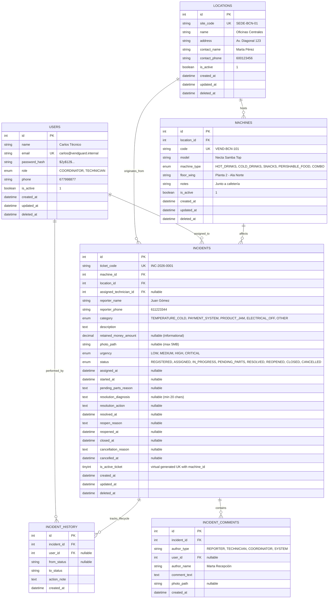

# ESPECIFICACIÓN TÉCNICA · MODELO DE BASE DE DATOS (MariaDB)
**Proyecto:** Gestor de Incidencias de Vending (*VendGuard*)  
**Documento:** `specs/technical/database_schema.md`  
**Motor:** MariaDB 10.5+ / MySQL 8.0+ (Motor InnoDB)  
**Codificación:** `utf8mb4_unicode_ci`  
**Metodología:** SDD (Specification-Driven Development)  

---

## 1. Resumen y Propósito

Este documento formaliza el esquema relacional de base de datos para el MVP de **VendGuard**, cumpliendo con:
1. **Artículo III de la Constitución:** Prohibición absoluta de borrado físico (`DELETE FROM`). Todas las tablas principales implementan borrado lógico mediante la columna `deleted_at TIMESTAMP NULL`.
2. **Artículo V de la Constitución & EARS 2.1:** Restricción de unicidad estricta para garantizar que **ninguna máquina pueda tener más de una incidencia activa de forma simultánea**.
3. **Artículo II de la Constitución & EARS 3.2:** Integridad en tipos de máquina y categorías de fallo para el control estricto de la cadena de frío.
4. **Nomenclatura (`AGENTS.md`):** Tablas, columnas, índices y restricciones en **inglés técnico**, manteniendo la documentación explicativa en español.

---

## 2. Diagrama Entidad-Relación (Mermaid ERD)



---

## 3. Diccionario de Datos Detallado

### 3.1 Tabla: `locations` (Sedes de Clientes)
Almacena los centros de trabajo donde están ubicadas las máquinas de vending.

| Campo | Tipo | Nulo | Por Defecto | Descripción |
| :--- | :--- | :--- | :--- | :--- |
| `id` | `INT UNSIGNED` | NO | `AUTO_INCREMENT` | Identificador primario |
| `site_code` | `VARCHAR(32)` | NO | - | Código alfanumérico único de acceso (ej: `SEDE-BCN-01`) |
| `name` | `VARCHAR(150)` | NO | - | Nombre descriptivo de la empresa/edificio |
| `address` | `VARCHAR(255)` | NO | - | Dirección física completa |
| `contact_name` | `VARCHAR(100)` | SÍ | `NULL` | Persona de contacto en el centro |
| `contact_phone` | `VARCHAR(30)` | SÍ | `NULL` | Teléfono de contacto |
| `is_active` | `TINYINT(1)` | NO | `1` | Estado operativo de la sede (1: activa, 0: inactiva) |
| `created_at` | `TIMESTAMP` | NO | `CURRENT_TIMESTAMP` | Fecha de creación del registro |
| `updated_at` | `TIMESTAMP` | NO | `CURRENT_TIMESTAMP ON UPDATE` | Fecha de última modificación |
| `deleted_at` | `TIMESTAMP` | SÍ | `NULL` | Borrado lógico (*Soft Delete*) |

* **Índices:**
  * `PRIMARY KEY (id)`
  * `UNIQUE KEY uq_locations_site_code (site_code)`
  * `INDEX idx_locations_active (is_active, deleted_at)`

---

### 3.2 Tabla: `machines` (Parque de Máquinas)
Almacena las unidades físicas dispensadoras instaladas en las sedes.

| Campo | Tipo | Nulo | Por Defecto | Descripción |
| :--- | :--- | :--- | :--- | :--- |
| `id` | `INT UNSIGNED` | NO | `AUTO_INCREMENT` | Identificador primario |
| `location_id` | `INT UNSIGNED` | NO | - | FK a `locations.id` |
| `code` | `VARCHAR(32)` | NO | - | Código rotulado visible en la máquina (ej: `VEND-BCN-101`) |
| `model` | `VARCHAR(100)` | NO | - | Marca y modelo técnico (ej: `Necta Samba Top`) |
| `machine_type` | `ENUM(...)` | NO | - | `HOT_DRINKS`, `COLD_DRINKS`, `SNACKS`, `PERISHABLE_FOOD`, `COMBO` |
| `floor_wing` | `VARCHAR(100)` | NO | - | Ubicación interna (ej: `Planta 2 - Pasillo Cafetería`) |
| `notes` | `TEXT` | SÍ | `NULL` | Instrucciones de acceso técnico |
| `is_active` | `TINYINT(1)` | NO | `1` | Estado físico del activo (1: operativa, 0: retirada) |
| `created_at` | `TIMESTAMP` | NO | `CURRENT_TIMESTAMP` | Fecha de alta |
| `updated_at` | `TIMESTAMP` | NO | `CURRENT_TIMESTAMP ON UPDATE` | Fecha de actualización |
| `deleted_at` | `TIMESTAMP` | SÍ | `NULL` | Borrado lógico (*Soft Delete*) |

* **Índices:**
  * `PRIMARY KEY (id)`
  * `UNIQUE KEY uq_machines_code (code)`
  * `INDEX idx_machines_location (location_id)`
  * `INDEX idx_machines_type (machine_type)`

---

### 3.3 Tabla: `users` (Personal Interno)
Almacena a los coordinadores y técnicos de campo de la empresa de mantenimiento.

| Campo | Tipo | Nulo | Por Defecto | Descripción |
| :--- | :--- | :--- | :--- | :--- |
| `id` | `INT UNSIGNED` | NO | `AUTO_INCREMENT` | Identificador primario |
| `name` | `VARCHAR(100)` | NO | - | Nombre completo del técnico/coordinador |
| `email` | `VARCHAR(150)` | NO | - | Correo corporativo único para login |
| `password_hash`| `VARCHAR(255)` | NO | - | Hash criptográfico seguro (Bcrypt / Argon2ID) |
| `role` | `ENUM(...)` | NO | - | `COORDINATOR`, `TECHNICIAN` |
| `phone` | `VARCHAR(30)` | SÍ | `NULL` | Teléfono corporativo |
| `is_active` | `TINYINT(1)` | NO | `1` | Usuario habilitado (1) o bloqueado (0) |
| `created_at` | `TIMESTAMP` | NO | `CURRENT_TIMESTAMP` | Fecha de alta |
| `updated_at` | `TIMESTAMP` | NO | `CURRENT_TIMESTAMP ON UPDATE` | Fecha de actualización |
| `deleted_at` | `TIMESTAMP` | SÍ | `NULL` | Borrado lógico (*Soft Delete*) |

* **Índices:**
  * `PRIMARY KEY (id)`
  * `UNIQUE KEY uq_users_email (email)`
  * `INDEX idx_users_role (role, is_active)`

---

### 3.4 Tabla: `incidents` (Núcleo Operativo del Sistema)
Almacena todas las incidencias de avería y su ciclo de vida completo.

| Campo | Tipo | Nulo | Por Defecto | Descripción |
| :--- | :--- | :--- | :--- | :--- |
| `id` | `INT UNSIGNED` | NO | `AUTO_INCREMENT` | Identificador primario |
| `ticket_code` | `VARCHAR(32)` | NO | - | Código visual único legible (ej: `INC-2026-0001`) |
| `machine_id` | `INT UNSIGNED` | NO | - | FK a `machines.id` |
| `location_id` | `INT UNSIGNED` | NO | - | FK a `locations.id` (desnormalizado para consultas ágiles) |
| `assigned_technician_id` | `INT UNSIGNED` | SÍ | `NULL` | FK a `users.id` (técnico asignado activo) |
| `reporter_name` | `VARCHAR(100)` | SÍ | `NULL` | Nombre de la persona que introdujo el aviso |
| `reporter_phone`| `VARCHAR(30)` | SÍ | `NULL` | Teléfono de contacto directo para el técnico |
| `category` | `ENUM(...)` | NO | - | `TEMPERATURE_COLD`, `PAYMENT_SYSTEM`, `PRODUCT_JAM`, `ELECTRICAL_OFF`, `OTHER` |
| `description` | `TEXT` | NO | - | Descripción de los síntomas observados |
| `retained_money_amount` | `DECIMAL(10,2)` | SÍ | `NULL` | Importe tragado en € (dato puramente informativo) |
| `photo_path` | `VARCHAR(255)` | SÍ | `NULL` | Ruta relativa al archivo de imagen adjunto (máx 5 MB) |
| `urgency` | `ENUM(...)` | NO | - | `LOW`, `MEDIUM`, `HIGH`, `CRITICAL` |
| `status` | `ENUM(...)` | NO | `'REGISTERED'` | `REGISTERED`, `ASSIGNED`, `IN_PROGRESS`, `PENDING_PARTS`, `RESOLVED`, `REOPENED`, `CLOSED`, `CANCELLED` |
| `assigned_at` | `TIMESTAMP` | SÍ | `NULL` | Fecha/hora en que el coordinador asignó técnico |
| `started_at` | `TIMESTAMP` | SÍ | `NULL` | Fecha/hora en que el técnico inició intervención in situ |
| `pending_parts_reason` | `TEXT` | SÍ | `NULL` | Nota justificativa si el técnico pausa por recambio |
| `resolution_diagnosis` | `TEXT` | SÍ | `NULL` | Diagnóstico real del fallo (**mínimo 20 caracteres**) |
| `resolution_action` | `TEXT` | SÍ | `NULL` | Acción técnica correctora ejecutada |
| `resolved_at` | `TIMESTAMP` | SÍ | `NULL` | Fecha/hora en que se marcó resuelta (inicia SLA de 48h) |
| `reopen_reason` | `TEXT` | SÍ | `NULL` | Motivo de reapertura del cliente si persiste el fallo |
| `reopened_at` | `TIMESTAMP` | SÍ | `NULL` | Fecha/hora de la reapertura |
| `closed_at` | `TIMESTAMP` | SÍ | `NULL` | Fecha/hora de archivo definitivo (tras 48h sin réplica) |
| `cancellation_reason` | `TEXT` | SÍ | `NULL` | Motivo obligatorio de descarte si es falsa alarma |
| `cancelled_at`| `TIMESTAMP` | SÍ | `NULL` | Fecha/hora de anulación lógica |
| `is_active_ticket` | `TINYINT` | SÍ | *(Virtual)* | Columna generada: `1` si el ticket está activo, `NULL` si `CLOSED`/`CANCELLED` |
| `created_at` | `TIMESTAMP` | NO | `CURRENT_TIMESTAMP` | Fecha de creación del ticket |
| `updated_at` | `TIMESTAMP` | NO | `CURRENT_TIMESTAMP ON UPDATE` | Fecha de actualización |
| `deleted_at` | `TIMESTAMP` | SÍ | `NULL` | Borrado lógico (*Soft Delete*) |

* **Garantía Constitucional contra Duplicados (Artículo V & EARS 2.1):**
  * La columna virtual generada:
    ```sql
    `is_active_ticket` TINYINT GENERATED ALWAYS AS (
        IF(`status` IN ('CLOSED', 'CANCELLED'), NULL, 1)
    ) VIRTUAL
    ```
  * Enlazada al índice único compuesto:
    ```sql
    UNIQUE KEY `uq_machine_active_ticket` (`machine_id`, `is_active_ticket`)
    ```
  * **Comportamiento en MariaDB:** En SQL, `NULL != NULL`, lo que permite que una máquina tenga cientos de incidencias pasadas cerradas o canceladas, pero **bloquea físicamente a nivel de motor de base de datos que exista más de una fila con valor `1` para la misma máquina**. Esto previene condiciones de carrera (*race conditions*) imposibles de burlar.

---

### 3.5 Tabla: `incident_history` (Trazabilidad y Auditoría Inmutable)
Registra cada cambio de estado, quién lo ejecutó y cuándo, dando cumplimiento al Artículo III de la Constitución.

| Campo | Tipo | Nulo | Por Defecto | Descripción |
| :--- | :--- | :--- | :--- | :--- |
| `id` | `INT UNSIGNED` | NO | `AUTO_INCREMENT` | Identificador primario |
| `incident_id` | `INT UNSIGNED` | NO | - | FK a `incidents.id` |
| `user_id` | `INT UNSIGNED` | SÍ | `NULL` | FK a `users.id` (`NULL` si fue el informador o el sistema) |
| `from_status` | `VARCHAR(32)` | SÍ | `NULL` | Estado anterior |
| `to_status` | `VARCHAR(32)` | NO | - | Nuevo estado alcanzado |
| `action_note` | `TEXT` | SÍ | `NULL` | Comentario explicativo de la transición |
| `created_at` | `TIMESTAMP` | NO | `CURRENT_TIMESTAMP` | Marca temporal inmutable |

* **Índices:**
  * `PRIMARY KEY (id)`
  * `INDEX idx_history_incident (incident_id, created_at)`

---

### 3.6 Tabla: `incident_comments` (Bitácora de Comunicación y Evidencias)
Permite anexar comentarios, fotos adicionales o mensajes de seguimiento a una incidencia abierta sin crear duplicados (EARS 2.2).

| Campo | Tipo | Nulo | Por Defecto | Descripción |
| :--- | :--- | :--- | :--- | :--- |
| `id` | `INT UNSIGNED` | NO | `AUTO_INCREMENT` | Identificador primario |
| `incident_id` | `INT UNSIGNED` | NO | - | FK a `incidents.id` |
| `author_type` | `ENUM(...)` | NO | - | `'REPORTER'`, `'TECHNICIAN'`, `'COORDINATOR'`, `'SYSTEM'` |
| `user_id` | `INT UNSIGNED` | SÍ | `NULL` | FK a `users.id` (si es usuario interno) |
| `author_name` | `VARCHAR(100)` | NO | - | Nombre visible de quien redacta |
| `comment_text`| `TEXT` | NO | - | Contenido del mensaje o evidencia aportada |
| `photo_path` | `VARCHAR(255)` | SÍ | `NULL` | Evidencia gráfica adicional (máx 5 MB) |
| `is_internal` | `TINYINT(1)` | NO | `0` | Si es `1`, solo visible para técnicos y coordinadores |
| `created_at` | `TIMESTAMP` | NO | `CURRENT_TIMESTAMP` | Fecha de publicación |

* **Índices:**
  * `PRIMARY KEY (id)`
  * `INDEX idx_comments_incident (incident_id, created_at)`

---

## 4. Script DDL Completo en SQL (Listo para Ejecución)

```sql
-- =============================================================================
-- VENDGUARD: DDL DE BASE DE DATOS (MariaDB / MySQL 8.0+)
-- Creado en estricto cumplimiento de constitution.md y mvp_functional_spec.md
-- =============================================================================

CREATE DATABASE IF NOT EXISTS `vendguard_db`
  CHARACTER SET utf8mb4
  COLLATE utf8mb4_unicode_ci;

USE `vendguard_db`;

SET FOREIGN_KEY_CHECKS = 0;
DROP TABLE IF EXISTS `incident_comments`;
DROP TABLE IF EXISTS `incident_history`;
DROP TABLE IF EXISTS `incidents`;
DROP TABLE IF EXISTS `machines`;
DROP TABLE IF EXISTS `locations`;
DROP TABLE IF EXISTS `users`;
SET FOREIGN_KEY_CHECKS = 1;

-- -----------------------------------------------------------------------------
-- 1. TABLA: locations
-- -----------------------------------------------------------------------------
CREATE TABLE `locations` (
  `id` INT UNSIGNED NOT NULL AUTO_INCREMENT,
  `site_code` VARCHAR(32) NOT NULL,
  `name` VARCHAR(150) NOT NULL,
  `address` VARCHAR(255) NOT NULL,
  `contact_name` VARCHAR(100) NULL,
  `contact_phone` VARCHAR(30) NULL,
  `is_active` TINYINT(1) NOT NULL DEFAULT 1,
  `created_at` TIMESTAMP NOT NULL DEFAULT CURRENT_TIMESTAMP,
  `updated_at` TIMESTAMP NOT NULL DEFAULT CURRENT_TIMESTAMP ON UPDATE CURRENT_TIMESTAMP,
  `deleted_at` TIMESTAMP NULL DEFAULT NULL,
  PRIMARY KEY (`id`),
  UNIQUE KEY `uq_locations_site_code` (`site_code`),
  INDEX `idx_locations_active` (`is_active`, `deleted_at`)
) ENGINE=InnoDB DEFAULT CHARSET=utf8mb4 COLLATE=utf8mb4_unicode_ci;

-- -----------------------------------------------------------------------------
-- 2. TABLA: machines
-- -----------------------------------------------------------------------------
CREATE TABLE `machines` (
  `id` INT UNSIGNED NOT NULL AUTO_INCREMENT,
  `location_id` INT UNSIGNED NOT NULL,
  `code` VARCHAR(32) NOT NULL,
  `model` VARCHAR(100) NOT NULL,
  `machine_type` ENUM('HOT_DRINKS', 'COLD_DRINKS', 'SNACKS', 'PERISHABLE_FOOD', 'COMBO') NOT NULL,
  `floor_wing` VARCHAR(100) NOT NULL,
  `notes` TEXT NULL,
  `is_active` TINYINT(1) NOT NULL DEFAULT 1,
  `created_at` TIMESTAMP NOT NULL DEFAULT CURRENT_TIMESTAMP,
  `updated_at` TIMESTAMP NOT NULL DEFAULT CURRENT_TIMESTAMP ON UPDATE CURRENT_TIMESTAMP,
  `deleted_at` TIMESTAMP NULL DEFAULT NULL,
  PRIMARY KEY (`id`),
  UNIQUE KEY `uq_machines_code` (`code`),
  INDEX `idx_machines_location` (`location_id`),
  INDEX `idx_machines_type` (`machine_type`),
  CONSTRAINT `fk_machines_location` FOREIGN KEY (`location_id`)
    REFERENCES `locations` (`id`) ON DELETE RESTRICT ON UPDATE CASCADE
) ENGINE=InnoDB DEFAULT CHARSET=utf8mb4 COLLATE=utf8mb4_unicode_ci;

-- -----------------------------------------------------------------------------
-- 3. TABLA: users
-- -----------------------------------------------------------------------------
CREATE TABLE `users` (
  `id` INT UNSIGNED NOT NULL AUTO_INCREMENT,
  `name` VARCHAR(100) NOT NULL,
  `email` VARCHAR(150) NOT NULL,
  `password_hash` VARCHAR(255) NOT NULL,
  `role` ENUM('COORDINATOR', 'TECHNICIAN') NOT NULL,
  `phone` VARCHAR(30) NULL,
  `is_active` TINYINT(1) NOT NULL DEFAULT 1,
  `created_at` TIMESTAMP NOT NULL DEFAULT CURRENT_TIMESTAMP,
  `updated_at` TIMESTAMP NOT NULL DEFAULT CURRENT_TIMESTAMP ON UPDATE CURRENT_TIMESTAMP,
  `deleted_at` TIMESTAMP NULL DEFAULT NULL,
  PRIMARY KEY (`id`),
  UNIQUE KEY `uq_users_email` (`email`),
  INDEX `idx_users_role` (`role`, `is_active`)
) ENGINE=InnoDB DEFAULT CHARSET=utf8mb4 COLLATE=utf8mb4_unicode_ci;

-- -----------------------------------------------------------------------------
-- 4. TABLA: incidents
-- -----------------------------------------------------------------------------
CREATE TABLE `incidents` (
  `id` INT UNSIGNED NOT NULL AUTO_INCREMENT,
  `ticket_code` VARCHAR(32) NOT NULL,
  `machine_id` INT UNSIGNED NOT NULL,
  `location_id` INT UNSIGNED NOT NULL,
  `assigned_technician_id` INT UNSIGNED NULL DEFAULT NULL,
  `reporter_name` VARCHAR(100) NULL,
  `reporter_phone` VARCHAR(30) NULL,
  `category` ENUM('TEMPERATURE_COLD', 'PAYMENT_SYSTEM', 'PRODUCT_JAM', 'ELECTRICAL_OFF', 'OTHER') NOT NULL,
  `description` TEXT NOT NULL,
  `retained_money_amount` DECIMAL(10,2) NULL DEFAULT NULL,
  `photo_path` VARCHAR(255) NULL DEFAULT NULL,
  `urgency` ENUM('LOW', 'MEDIUM', 'HIGH', 'CRITICAL') NOT NULL,
  `status` ENUM('REGISTERED', 'ASSIGNED', 'IN_PROGRESS', 'PENDING_PARTS', 'RESOLVED', 'REOPENED', 'CLOSED', 'CANCELLED') NOT NULL DEFAULT 'REGISTERED',
  `assigned_at` TIMESTAMP NULL DEFAULT NULL,
  `started_at` TIMESTAMP NULL DEFAULT NULL,
  `pending_parts_reason` TEXT NULL DEFAULT NULL,
  `resolution_diagnosis` TEXT NULL DEFAULT NULL,
  `resolution_action` TEXT NULL DEFAULT NULL,
  `resolved_at` TIMESTAMP NULL DEFAULT NULL,
  `reopen_reason` TEXT NULL DEFAULT NULL,
  `reopened_at` TIMESTAMP NULL DEFAULT NULL,
  `closed_at` TIMESTAMP NULL DEFAULT NULL,
  `cancellation_reason` TEXT NULL DEFAULT NULL,
  `cancelled_at` TIMESTAMP NULL DEFAULT NULL,
  -- Columna virtual para blindar a nivel de motor de BD la regla constitucional de duplicados:
  `is_active_ticket` TINYINT GENERATED ALWAYS AS (
    IF(`status` IN ('CLOSED', 'CANCELLED'), NULL, 1)
  ) VIRTUAL,
  `created_at` TIMESTAMP NOT NULL DEFAULT CURRENT_TIMESTAMP,
  `updated_at` TIMESTAMP NOT NULL DEFAULT CURRENT_TIMESTAMP ON UPDATE CURRENT_TIMESTAMP,
  `deleted_at` TIMESTAMP NULL DEFAULT NULL,
  PRIMARY KEY (`id`),
  UNIQUE KEY `uq_incidents_ticket_code` (`ticket_code`),
  -- Índice único condicional: garantiza 1 solo ticket activo por máquina a la vez:
  UNIQUE KEY `uq_machine_active_ticket` (`machine_id`, `is_active_ticket`),
  INDEX `idx_incidents_location` (`location_id`),
  INDEX `idx_incidents_technician` (`assigned_technician_id`),
  INDEX `idx_incidents_status_urgency` (`status`, `urgency`),
  INDEX `idx_incidents_created_at` (`created_at`),
  CONSTRAINT `fk_incidents_machine` FOREIGN KEY (`machine_id`)
    REFERENCES `machines` (`id`) ON DELETE RESTRICT ON UPDATE CASCADE,
  CONSTRAINT `fk_incidents_location` FOREIGN KEY (`location_id`)
    REFERENCES `locations` (`id`) ON DELETE RESTRICT ON UPDATE CASCADE,
  CONSTRAINT `fk_incidents_technician` FOREIGN KEY (`assigned_technician_id`)
    REFERENCES `users` (`id`) ON DELETE RESTRICT ON UPDATE CASCADE
) ENGINE=InnoDB DEFAULT CHARSET=utf8mb4 COLLATE=utf8mb4_unicode_ci;

-- -----------------------------------------------------------------------------
-- 5. TABLA: incident_history
-- -----------------------------------------------------------------------------
CREATE TABLE `incident_history` (
  `id` INT UNSIGNED NOT NULL AUTO_INCREMENT,
  `incident_id` INT UNSIGNED NOT NULL,
  `user_id` INT UNSIGNED NULL DEFAULT NULL,
  `from_status` VARCHAR(32) NULL,
  `to_status` VARCHAR(32) NOT NULL,
  `action_note` TEXT NULL,
  `created_at` TIMESTAMP NOT NULL DEFAULT CURRENT_TIMESTAMP,
  PRIMARY KEY (`id`),
  INDEX `idx_history_incident` (`incident_id`, `created_at`),
  CONSTRAINT `fk_history_incident` FOREIGN KEY (`incident_id`)
    REFERENCES `incidents` (`id`) ON DELETE CASCADE ON UPDATE CASCADE,
  CONSTRAINT `fk_history_user` FOREIGN KEY (`user_id`)
    REFERENCES `users` (`id`) ON DELETE SET NULL ON UPDATE CASCADE
) ENGINE=InnoDB DEFAULT CHARSET=utf8mb4 COLLATE=utf8mb4_unicode_ci;

-- -----------------------------------------------------------------------------
-- 6. TABLA: incident_comments
-- -----------------------------------------------------------------------------
CREATE TABLE `incident_comments` (
  `id` INT UNSIGNED NOT NULL AUTO_INCREMENT,
  `incident_id` INT UNSIGNED NOT NULL,
  `author_type` ENUM('REPORTER', 'TECHNICIAN', 'COORDINATOR', 'SYSTEM') NOT NULL,
  `user_id` INT UNSIGNED NULL DEFAULT NULL,
  `author_name` VARCHAR(100) NOT NULL,
  `comment_text` TEXT NOT NULL,
  `photo_path` VARCHAR(255) NULL DEFAULT NULL,
  `is_internal` TINYINT(1) NOT NULL DEFAULT 0,
  `created_at` TIMESTAMP NOT NULL DEFAULT CURRENT_TIMESTAMP,
  PRIMARY KEY (`id`),
  INDEX `idx_comments_incident` (`incident_id`, `created_at`),
  CONSTRAINT `fk_comments_incident` FOREIGN KEY (`incident_id`)
    REFERENCES `incidents` (`id`) ON DELETE CASCADE ON UPDATE CASCADE,
  CONSTRAINT `fk_comments_user` FOREIGN KEY (`user_id`)
    REFERENCES `users` (`id`) ON DELETE SET NULL ON UPDATE CASCADE
) ENGINE=InnoDB DEFAULT CHARSET=utf8mb4 COLLATE=utf8mb4_unicode_ci;
```

---

## 5. Datos Semilla Iniciales (Seed Data para Pruebas)

```sql
-- Inserción de sedes iniciales
INSERT INTO `locations` (`site_code`, `name`, `address`, `contact_name`, `contact_phone`) VALUES
('SEDE-BCN-01', 'Hospital del Mar - Edificio Central', 'Passeig Marítim 25, Barcelona', 'Laura Sanitaria', '600111222'),
('SEDE-BCN-02', 'Torre Glòries - Planta 4 Oficinas', 'Avinguda Diagonal 211, Barcelona', 'Marc Recepción', '600333444');

-- Inserción de parque de máquinas de prueba
INSERT INTO `machines` (`location_id`, `code`, `model`, `machine_type`, `floor_wing`, `notes`) VALUES
(1, 'VEND-0101', 'Sanden Vendo G-Drink', 'PERISHABLE_FOOD', 'Planta Baja - Urgencias', 'Máquina de sándwiches y lácteos frescos'),
(1, 'VEND-0102', 'Bianchi Gaia Espresso', 'HOT_DRINKS', 'Planta 1 - Sala Médica', 'Café en grano y bebidas calientes'),
(2, 'VEND-0201', 'Necta Samba Combo', 'COMBO', 'Planta 4 - Office Este', 'Snacks y refrescos variados');

-- Inserción de usuarios iniciales (Contraseña de prueba: 'Password123!')
-- Hash Bcrypt de coste 12 para 'Password123!': $2y$12$eA8b..placeholder...
INSERT INTO `users` (`name`, `email`, `password_hash`, `role`, `phone`) VALUES
('Sara Coordinadora', 'coordinacion@vendguard.internal', '$2y$12$LQv3c1yqBWVHxkd0LHAkCOYz6TtxMQJqhN8/Lew.87QW5B6O0I/5i', 'COORDINATOR', '677000111'),
('Jordi Técnico Ruta BCN', 'jordi.ruta@vendguard.internal', '$2y$12$LQv3c1yqBWVHxkd0LHAkCOYz6TtxMQJqhN8/Lew.87QW5B6O0I/5i', 'TECHNICIAN', '677222333');
```
