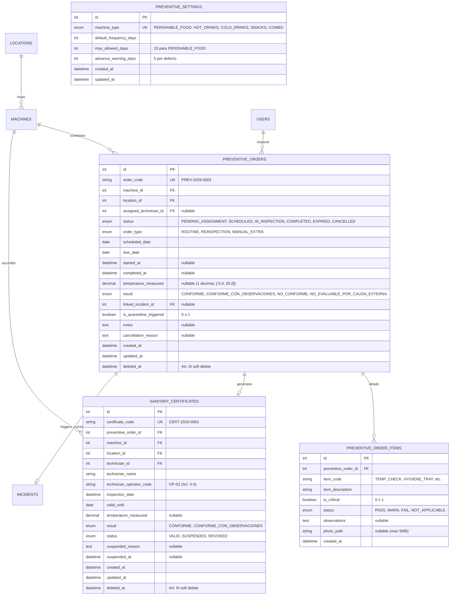
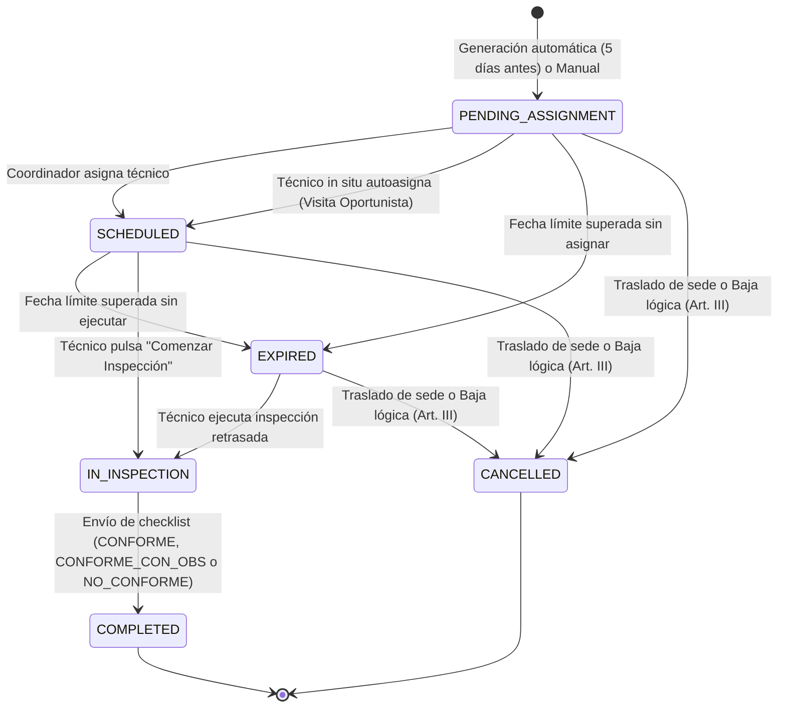
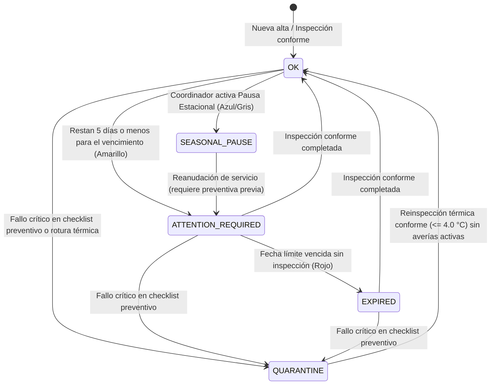

# ESPECIFICACIÓN TÉCNICA · CONTRATOS DE API Y MODELO DE DATOS
# MANTENIMIENTO PREVENTIVO Y CHECKLISTS SANITARIOS (M1)

**Proyecto:** Gestor de Incidencias de Vending (*VendGuard*)  
**Módulo:** `05-preventive-maintenance`  
**Documento:** `specs/technical/preventive_maintenance_contracts.md`  
**Referencia Funcional:** [`specs/functional/preventive_maintenance_spec.md`](../functional/preventive_maintenance_spec.md) (RF-PREV-01 a RF-PREV-08)  
**Protocolo:** HTTP/1.1 · JSON (`application/json; charset=utf-8`) y vistas optimizadas para impresión A4 (`@media print`)  
**Metodología:** SDD (Specification-Driven Development) · Contratos API-First  
**Conformidad Constitucional:**  
* **Artículo I:** Especificación como única fuente de verdad técnica y rechazo a mocks simulados.  
* **Artículo II:** Prioridad sanitaria absoluta y blindaje de perecederos (tope innegociable de 15 días, cuarentena inmediata ante $> 4.0\text{ }^\circ\text{C}$).  
* **Artículo III:** Cero borrado físico destructivo (`DELETE FROM`). Cancelación y bajas puramente lógicas (`status = 'CANCELLED'`).  
* **Artículo IV:** PHP 8+ POO puro tipado con PDO; Vue.js 3 Composition API sin bloatware ni dependencias accesorias.  
* **Artículo V:** Cierre documentado (diagnóstico y solución $\ge 20$ chars, Art. V.1), unicidad de ticket activo sin duplicidades (Art. V.2) y privacidad del personal técnico (Código de Operador Técnico, Art. V.4).  
* **Artículo VI:** Delimitación sagrada del alcance (sin sensores IoT/MDB continuos ni pedidos automáticos de químicos).  

---

## 1. Principios Arquitectónicos y Coexistencia Operativa

### 1.1 Coexistencia Limpia con Mantenimiento Correctivo
El módulo opera mediante una separación estricta de dominios:
* **Dominio Preventivo (`preventive_orders`):** Gestiona la periodicidad higiénica, inspecciones programadas, checklists normativos y certificados de desinfección.
* **Dominio Correctivo (`incidents`):** Gestiona las averías técnicas y reparaciones mecánicas/térmicas.
* **Puente Constitucional de Coexistencia (Art. V.1 y Art. V.2):**
  * Si durante la inspección preventiva se detecta un fallo y la máquina **NO** tiene una incidencia activa: se crea una nueva incidencia vinculada (`preventive_order_id`), asignada al mismo técnico. Si la causa es rotura térmica, la urgencia es `CRITICAL`.
  * Si la máquina **YA TIENE** una incidencia correctiva activa: para no vulnerar el Art. V.2 (unicidad de ticket activo), **NO se crea un nuevo ticket**. Los hallazgos y fotos se insertan como un nuevo apunte en la bitácora (`incident_comments`), y si se constata rotura de frío, la urgencia de la incidencia activa se eleva automáticamente a `CRITICAL`.
  * Para cerrar la avería que provocó la cuarentena, el técnico debe registrar obligatoriamente diagnóstico ($\ge 20$ chars) y solución técnica ($\ge 20$ chars) conforme al Art. V.1, lo cual desencadena la **Reinspección Sanitaria Inmediata**.

### 1.2 Privacidad de Datos del Inspector (Art. V.4)
Los responsables de sede y clientes externos nunca tienen visibilidad de DNI privados ni números telefónicos particulares de los técnicos. Los certificados oficiales y reportes públicos referencian únicamente al técnico mediante su nombre profesional y su **Código de Operador Técnico Oficial** (ej: `OP-02`), persistido en la columna `users.operator_code`.

### 1.3 Validación Térmica Estricta Anti-Errata
Las lecturas de temperatura de sonda para máquinas de frío se validan tanto en el frontend reactivo como en el backend en PHP con regla estricta:
$$\text{temperatura} \in [-5.0\text{ }^\circ\text{C},\text{ }+25.0\text{ }^\circ\text{C}],\quad \text{con 1 decimal exacto}$$
Cualquier valor fuera de dicho margen físico es rechazado con error `422 Unprocessable Entity` (`INVALID_TEMPERATURE_RANGE`), previniendo errores de tipeo como `40` en lugar de `4.0`.

---

## 2. Diagrama Entidad-Relación y Ciclo de Estados

### 2.1 Modelo Entidad-Relación (Mermaid ERD)



### 2.2 Diagrama de Estados de la Orden Preventiva



### 2.3 Semáforo Sanitario de Máquina (`machines.sanitary_status`)



---

## 3. Esquema DDL y Migración SQL (`005_preventive_maintenance.sql`)

```sql
-- ==============================================================================
-- MIGRACIÓN 005: MANTENIMIENTO PREVENTIVO Y CHECKLISTS SANITARIOS (M1)
-- Proyecto: VendGuard
-- Metodología: SDD · Cumplimiento Art. I, II, III, IV, V, VI
-- ==============================================================================

-- 1. Ampliación de tabla USERS: Código de Operador Técnico Oficial (Art. V.4)
ALTER TABLE `users`
ADD COLUMN `operator_code` VARCHAR(20) NULL UNIQUE AFTER `role`;

-- Actualizar códigos para técnicos preexistentes
UPDATE `users` SET `operator_code` = CONCAT('OP-', LPAD(id, 2, '0')) WHERE `role` = 'TECHNICIAN' AND `operator_code` IS NULL;

-- 2. Ampliación de tabla MACHINES: Semáforo higiénico y pausas estacionales
ALTER TABLE `machines`
ADD COLUMN `sanitary_status` ENUM('OK', 'ATTENTION_REQUIRED', 'EXPIRED', 'QUARANTINE', 'SEASONAL_PAUSE') NOT NULL DEFAULT 'OK' AFTER `is_active`,
ADD COLUMN `sanitary_frequency_days` INT UNSIGNED NULL AFTER `sanitary_status`,
ADD COLUMN `last_sanitary_inspection_at` DATETIME NULL AFTER `sanitary_frequency_days`,
ADD COLUMN `next_sanitary_inspection_due` DATE NULL AFTER `last_sanitary_inspection_at`,
ADD COLUMN `is_seasonal_pause` TINYINT(1) NOT NULL DEFAULT 0 AFTER `next_sanitary_inspection_due`,
ADD COLUMN `seasonal_pause_reason` TEXT NULL AFTER `is_seasonal_pause`,
ADD COLUMN `seasonal_pause_until` DATE NULL AFTER `seasonal_pause_reason`,
ADD INDEX `idx_machines_sanitary_status` (`sanitary_status`),
ADD INDEX `idx_machines_sanitary_due` (`next_sanitary_inspection_due`);

-- 3. Ampliación de tabla INCIDENTS: Vínculo con Orden Preventiva
ALTER TABLE `incidents`
ADD COLUMN `preventive_order_id` INT UNSIGNED NULL AFTER `machine_type_snapshot`,
ADD CONSTRAINT `fk_incidents_preventive_order` FOREIGN KEY (`preventive_order_id`) REFERENCES `preventive_orders` (`id`) ON DELETE RESTRICT;

-- 4. Tabla de Configuración de Frecuencias Sanitarias por Tipología (Art. II)
CREATE TABLE `preventive_settings` (
    `id` INT UNSIGNED AUTO_INCREMENT PRIMARY KEY,
    `machine_type` ENUM('PERISHABLE_FOOD', 'HOT_DRINKS', 'COLD_DRINKS', 'SNACKS', 'COMBO') NOT NULL UNIQUE,
    `default_frequency_days` INT UNSIGNED NOT NULL,
    `max_allowed_days` INT UNSIGNED NOT NULL,
    `advance_warning_days` INT UNSIGNED NOT NULL DEFAULT 5,
    `created_at` DATETIME NOT NULL DEFAULT CURRENT_TIMESTAMP,
    `updated_at` DATETIME NOT NULL DEFAULT CURRENT_TIMESTAMP ON UPDATE CURRENT_TIMESTAMP,
    CONSTRAINT `chk_perishable_max_15_days` CHECK (
        (`machine_type` != 'PERISHABLE_FOOD') OR (`max_allowed_days` <= 15 AND `default_frequency_days` <= 15)
    )
) ENGINE=InnoDB DEFAULT CHARSET=utf8mb4 COLLATE=utf8mb4_unicode_ci;

-- Semillas normativas por defecto
INSERT INTO `preventive_settings` (`machine_type`, `default_frequency_days`, `max_allowed_days`, `advance_warning_days`) VALUES
('PERISHABLE_FOOD', 15, 15, 5),
('HOT_DRINKS',       30, 60, 5),
('COLD_DRINKS',      45, 90, 5),
('SNACKS',           60, 90, 5),
('COMBO',            15, 45, 5);

-- 5. Tabla Principal de Órdenes de Mantenimiento Preventivo (Art. III)
CREATE TABLE `preventive_orders` (
    `id` INT UNSIGNED AUTO_INCREMENT PRIMARY KEY,
    `order_code` VARCHAR(30) NOT NULL UNIQUE,
    `machine_id` INT UNSIGNED NOT NULL,
    `location_id` INT UNSIGNED NOT NULL,
    `assigned_technician_id` INT UNSIGNED NULL,
    `status` ENUM('PENDING_ASSIGNMENT', 'SCHEDULED', 'IN_INSPECTION', 'COMPLETED', 'EXPIRED', 'CANCELLED') NOT NULL DEFAULT 'PENDING_ASSIGNMENT',
    `order_type` ENUM('ROUTINE', 'REINSPECTION', 'MANUAL_EXTRA') NOT NULL DEFAULT 'ROUTINE',
    `scheduled_date` DATE NOT NULL,
    `due_date` DATE NOT NULL,
    `started_at` DATETIME NULL,
    `completed_at` DATETIME NULL,
    `temperature_measured` DECIMAL(3,1) NULL,
    `result` ENUM('CONFORME', 'CONFORME_CON_OBSERVACIONES', 'NO_CONFORME', 'NO_EVALUABLE_POR_CAUSA_EXTERNA') NULL,
    `linked_incident_id` INT UNSIGNED NULL,
    `is_quarantine_triggered` TINYINT(1) NOT NULL DEFAULT 0,
    `notes` TEXT NULL,
    `cancellation_reason` TEXT NULL,
    `created_at` DATETIME NOT NULL DEFAULT CURRENT_TIMESTAMP,
    `updated_at` DATETIME NOT NULL DEFAULT CURRENT_TIMESTAMP ON UPDATE CURRENT_TIMESTAMP,
    `deleted_at` DATETIME NULL,
    CONSTRAINT `fk_preventive_orders_machine` FOREIGN KEY (`machine_id`) REFERENCES `machines` (`id`) ON DELETE RESTRICT,
    CONSTRAINT `fk_preventive_orders_location` FOREIGN KEY (`location_id`) REFERENCES `locations` (`id`) ON DELETE RESTRICT,
    CONSTRAINT `fk_preventive_orders_technician` FOREIGN KEY (`assigned_technician_id`) REFERENCES `users` (`id`) ON DELETE RESTRICT,
    CONSTRAINT `fk_preventive_orders_incident` FOREIGN KEY (`linked_incident_id`) REFERENCES `incidents` (`id`) ON DELETE RESTRICT,
    CONSTRAINT `chk_preventive_temperature_range` CHECK (
        `temperature_measured` IS NULL OR (`temperature_measured` >= -5.0 AND `temperature_measured` <= 25.0)
    ),
    INDEX `idx_prev_orders_status_due` (`status`, `due_date`),
    INDEX `idx_prev_orders_machine` (`machine_id`),
    INDEX `idx_prev_orders_technician` (`assigned_technician_id`)
) ENGINE=InnoDB DEFAULT CHARSET=utf8mb4 COLLATE=utf8mb4_unicode_ci;

-- 6. Tabla de Respuestas a Ítems de Checklist Normativo
CREATE TABLE `preventive_order_items` (
    `id` INT UNSIGNED AUTO_INCREMENT PRIMARY KEY,
    `preventive_order_id` INT UNSIGNED NOT NULL,
    `item_code` VARCHAR(50) NOT NULL,
    `item_description` VARCHAR(255) NOT NULL,
    `is_critical` TINYINT(1) NOT NULL DEFAULT 0,
    `status` ENUM('PASS', 'WARN', 'FAIL', 'NOT_APPLICABLE') NOT NULL,
    `observations` TEXT NULL,
    `photo_path` VARCHAR(255) NULL,
    `created_at` DATETIME NOT NULL DEFAULT CURRENT_TIMESTAMP,
    CONSTRAINT `fk_order_items_preventive_order` FOREIGN KEY (`preventive_order_id`) REFERENCES `preventive_orders` (`id`) ON DELETE RESTRICT,
    INDEX `idx_order_items_order_critical` (`preventive_order_id`, `is_critical`)
) ENGINE=InnoDB DEFAULT CHARSET=utf8mb4 COLLATE=utf8mb4_unicode_ci;

-- 7. Tabla de Certificados Oficiales de Inspección Sanitaria (Art. V.4)
CREATE TABLE `sanitary_certificates` (
    `id` INT UNSIGNED AUTO_INCREMENT PRIMARY KEY,
    `certificate_code` VARCHAR(40) NOT NULL UNIQUE,
    `preventive_order_id` INT UNSIGNED NOT NULL,
    `machine_id` INT UNSIGNED NOT NULL,
    `location_id` INT UNSIGNED NOT NULL,
    `technician_id` INT UNSIGNED NOT NULL,
    `technician_name` VARCHAR(150) NOT NULL,
    `technician_operator_code` VARCHAR(30) NOT NULL,
    `inspection_date` DATETIME NOT NULL,
    `valid_until` DATE NOT NULL,
    `temperature_measured` DECIMAL(3,1) NULL,
    `result` ENUM('CONFORME', 'CONFORME_CON_OBSERVACIONES') NOT NULL,
    `status` ENUM('VALID', 'SUSPENDED', 'REVOKED') NOT NULL DEFAULT 'VALID',
    `suspended_reason` TEXT NULL,
    `suspended_at` DATETIME NULL,
    `created_at` DATETIME NOT NULL DEFAULT CURRENT_TIMESTAMP,
    `updated_at` DATETIME NOT NULL DEFAULT CURRENT_TIMESTAMP ON UPDATE CURRENT_TIMESTAMP,
    `deleted_at` DATETIME NULL,
    CONSTRAINT `fk_certificates_preventive_order` FOREIGN KEY (`preventive_order_id`) REFERENCES `preventive_orders` (`id`) ON DELETE RESTRICT,
    CONSTRAINT `fk_certificates_machine` FOREIGN KEY (`machine_id`) REFERENCES `machines` (`id`) ON DELETE RESTRICT,
    CONSTRAINT `fk_certificates_location` FOREIGN KEY (`location_id`) REFERENCES `locations` (`id`) ON DELETE RESTRICT,
    CONSTRAINT `fk_certificates_technician` FOREIGN KEY (`technician_id`) REFERENCES `users` (`id`) ON DELETE RESTRICT,
    INDEX `idx_certificates_machine_status` (`machine_id`, `status`),
    INDEX `idx_certificates_location` (`location_id`)
) ENGINE=InnoDB DEFAULT CHARSET=utf8mb4 COLLATE=utf8mb4_unicode_ci;

-- 8. Extensión del Enum de Auditoría (`audit_log`)
ALTER TABLE `audit_log`
MODIFY COLUMN `entity_type` ENUM('TICKET', 'MACHINE', 'LOCATION', 'USER', 'PREVENTIVE_ORDER', 'SANITARY_CERTIFICATE') NOT NULL;
```

---

## 4. Catálogo Global de Endpoints

### 4.1 Endpoints para Coordinador del Servicio (`InternalAuthMiddleware(COORDINATOR)`)

| Método | Endpoint | Propósito |
| :--- | :--- | :--- |
| `GET` | `/api/coordinator/preventive/dashboard` | Métricas generales, conteo de semáforos, órdenes próximas y cuarentenas activas |
| `GET` | `/api/coordinator/preventive/orders` | Listado con filtros (`status`, `location_id`, `machine_id`, `technician_id`, `search`, `page`) |
| `POST` | `/api/coordinator/preventive/orders` | Creación manual o extraordinaria de una orden preventiva |
| `POST` | `/api/coordinator/preventive/generate-due` | Ejecutor de generación anticipada automática (máquinas a $\le 5$ días de vencer) |
| `PATCH`| `/api/coordinator/preventive/orders/{id}/assign` | Asignación o reasignación manual de la orden a un técnico de ruta |
| `PATCH`| `/api/coordinator/preventive/orders/{id}/cancel` | Cancelación lógica de orden (por traslado o baja, con motivo justificado, Art. III) |
| `GET` | `/api/coordinator/preventive/settings` | Consulta de frecuencias estándar y topes por tipología |
| `PATCH`| `/api/coordinator/preventive/settings` | Modificación de frecuencias estándar (blindaje: perecederos no supera 15 días, Art. II) |
| `PATCH`| `/api/coordinator/machines/{id}/preventive-config` | Configuración individual de frecuencia o activación/desactivación de Pausa Estacional |

### 4.2 Endpoints para Técnico de Campo (`InternalAuthMiddleware(TECHNICIAN)`)

| Método | Endpoint | Propósito |
| :--- | :--- | :--- |
| `GET` | `/api/technician/preventive/route` | Órdenes programadas del técnico + preventivos pendientes en sedes de su ruta actual |
| `POST`| `/api/technician/preventive/orders/{id}/claim` | **Visita Oportunista:** Autoasignación inmediata de una orden pendiente in situ |
| `GET` | `/api/technician/preventive/orders/{id}/checklist` | Plantilla normativa de checklist según tipología y datos de la máquina |
| `POST`| `/api/technician/preventive/orders/{id}/start` | Inicio de inspección in situ (transición a `EN_INSPECCION`) |
| `POST`| `/api/technician/preventive/orders/{id}/complete` | Remisión y evaluación del checklist, temperatura, dictamen, correctivos y cuarentenas |
| `POST`| `/api/technician/preventive/orders/{id}/reinspect` | Checklist de reinspección tras subsanación de avería de frío ($\le 4.0\text{ }^\circ\text{C}$) |

### 4.3 Endpoints para Responsable de Sede (`SiteAuthMiddleware`)

> **Autenticación (2026-10-08):** `Bearer <site_token>` emitido por `POST /api/auth/site-login` con código de sede y clave de centro; la cabecera `X-Site-Code` queda retirada como vía de autenticación (hallazgo S-4).

| Método | Endpoint | Propósito |
| :--- | :--- | :--- |
| `GET` | `/api/site/sanitary-status` | Semáforo sanitario de cada máquina del centro, última desinfección y última temperatura |
| `GET` | `/api/site/certificates/machine/{code}` | Visualización y descarga del Certificado Sanitario Oficial individual (Art. V.4) |
| `GET` | `/api/site/certificates/global` | Certificado Global Consolidado de Sede (dictamen `CONDICIONADO` si alguna falla) |

### 4.4 Extensión del Endpoint Público de Escaneo QR (`GET /api/qr/scan/{code}`)

| Método | Endpoint | Propósito |
| :--- | :--- | :--- |
| `GET` | `/api/qr/scan/{code}` | Retorna `status_mode = 'SANITARY_QUARANTINE'` o `'SEASONAL_PAUSE'` bloqueando compras y avisos |

---

## 5. Especificación Detallada de Contratos de API

---

### 5.1 Coordinación · Panel de Mando Preventivo
#### `GET /api/coordinator/preventive/dashboard`
* **Cabeceras:** `Authorization: Bearer <coord_token>`, `Accept: application/json`
* **Respuesta Exitosa (`200 OK`):**
```json
{
  "success": true,
  "data": {
    "summary": {
      "total_machines": 142,
      "status_green": 118,
      "status_yellow": 14,
      "status_red": 6,
      "status_quarantine": 2,
      "status_seasonal_pause": 2,
      "compliance_rate_percent": 83.1
    },
    "urgent_actions": {
      "quarantine_machines": [
        {
          "machine_id": 14,
          "machine_code": "VEND-BCN-101",
          "model": "Sanden Vendo G-Drink",
          "location_name": "Hospital del Mar",
          "floor_wing": "Planta Baja - Urgencias",
          "quarantine_reason": "Rotura de frío: 6.2 °C (> 4.0 °C)",
          "active_incident_code": "INC-2026-0045",
          "since": "2026-09-27T10:30:00Z"
        }
      ],
      "expired_orders_count": 6,
      "due_soon_orders_count": 14
    }
  }
}
```

---

### 5.2 Coordinación · Generación Anticipada Automática
#### `POST /api/coordinator/preventive/generate-due`
* **Cabeceras:** `Authorization: Bearer <coord_token>`, `Content-Type: application/json`
* **Body:**
```json
{
  "horizon_days": 5
}
```
* **Respuesta Exitosa (`200 OK`):**
```json
{
  "success": true,
  "data": {
    "orders_generated_count": 8,
    "machines_evaluated_count": 142,
    "generated_orders": [
      {
        "order_code": "PREV-2026-0089",
        "machine_code": "VEND-BCN-102",
        "location_name": "Hospital del Mar",
        "due_date": "2026-10-02",
        "status": "PENDING_ASSIGNMENT"
      }
    ]
  },
  "message": "Se han generado 8 órdenes de inspección preventiva para máquinas próximas a vencer."
}
```

---

### 5.3 Coordinación · Asignación de Orden
#### `PATCH /api/coordinator/preventive/orders/{id}/assign`
* **Cabeceras:** `Authorization: Bearer <coord_token>`, `Content-Type: application/json`
* **Campo `reassignment_reason` (EARS 2.6):** obligatorio (≥ 10 caracteres reales, umbral multibyte) **si y sólo si** la orden ya tenía técnico responsable y el `technician_id` recibido es distinto; exento en la asignación inicial y en la reprogramación de fecha que conserva al mismo técnico. El motivo se incorpora al evento `ASSIGN_PREVENTIVE_ORDER` de `audit_log` (append-only, Art. III): **sin cambios de esquema**.
* **Errores de validación:** `422 MISSING_REASSIGNMENT_REASON` si falta en una reasignación y `422 REASSIGNMENT_REASON_TOO_SHORT` si no alcanza el umbral (mismo vocabulario que RF-07.3).
* **Body:**
```json
{
  "technician_id": 3,
  "scheduled_date": "2026-09-29"
}
```
* **Respuesta Exitosa (`200 OK`):**
```json
{
  "success": true,
  "data": {
    "order_id": 89,
    "order_code": "PREV-2026-0089",
    "status": "SCHEDULED",
    "technician": {
      "id": 3,
      "name": "Carlos Técnico",
      "operator_code": "OP-03"
    },
    "scheduled_date": "2026-09-29"
  },
  "message": "Orden preventiva asignada correctamente."
}
```

---

### 5.4 Coordinación · Configuración de Frecuencias y Pausa Estacional
#### `PATCH /api/coordinator/machines/{id}/preventive-config`
* **Cabeceras:** `Authorization: Bearer <coord_token>`, `Content-Type: application/json`
* **Body (Ejemplo A: Pausa Estacional):**
```json
{
  "is_seasonal_pause": true,
  "seasonal_pause_reason": "Cierre del centro por periodo vacacional de verano",
  "seasonal_pause_until": "2026-09-01"
}
```
* **Body (Ejemplo B: Cambio de Frecuencia con Rechazo Constitucional Art. II):**
```json
{
  "sanitary_frequency_days": 20
}
```
* **Respuesta de Error en Ejemplo B (`422 Unprocessable Entity`):**
```json
{
  "success": false,
  "error": {
    "code": "PERISHABLE_FREQUENCY_LIMIT_EXCEEDED",
    "message": "Por imperativo del Artículo II de la Constitución (Seguridad Alimentaria), las máquinas dispensadoras de alimentos perecederos no pueden superar los 15 días naturales entre inspecciones sanitarias.",
    "details": {
      "machine_type": "PERISHABLE_FOOD",
      "attempted_days": 20,
      "maximum_allowed_days": 15
    }
  }
}
```

---

### 5.5 Técnico · Visita Oportunista (Claim In Situ)
#### `POST /api/technician/preventive/orders/{id}/claim`
Invocado por el técnico cuando está en una sede reparando o reponiendo y detecta que hay un preventivo pendiente de asignación en esa misma sede (EARS 2.3).

* **Cabeceras:** `Authorization: Bearer <tech_token>`, `Accept: application/json`
* **Respuesta Exitosa (`200 OK`):**
```json
{
  "success": true,
  "data": {
    "order_id": 89,
    "order_code": "PREV-2026-0089",
    "status": "SCHEDULED",
    "assigned_technician_id": 3,
    "claimed_at": "2026-09-27T11:15:00Z",
    "machine": {
      "code": "VEND-BCN-102",
      "model": "Sanden Vendo G-Drink",
      "floor_wing": "Planta Baja - Urgencias"
    }
  },
  "message": "Orden preventiva autoasignada con éxito (Visita Oportunista)."
}
```
* **Respuesta de Error (`409 Conflict` - Ya asignada o cancelada):**
```json
{
  "success": false,
  "error": {
    "code": "ORDER_ALREADY_ASSIGNED",
    "message": "La orden preventiva ya fue asignada previamente a otro técnico o ha cambiado de estado."
  }
}
```

---

### 5.6 Técnico · Consulta de Checklist Normativo
#### `GET /api/technician/preventive/orders/{id}/checklist`
* **Cabeceras:** `Authorization: Bearer <tech_token>`, `Accept: application/json`
* **Respuesta Exitosa (`200 OK`):**
```json
{
  "success": true,
  "data": {
    "order_id": 89,
    "order_code": "PREV-2026-0089",
    "machine": {
      "id": 14,
      "code": "VEND-BCN-101",
      "model": "Sanden Vendo G-Drink",
      "machine_type": "PERISHABLE_FOOD",
      "is_perishable": true,
      "requires_temperature": true,
      "temperature_limits": {
        "max_valid_celsius": 4.0,
        "absolute_min_celsius": -5.0,
        "absolute_max_celsius": 25.0
      }
    },
    "location": {
      "name": "Hospital del Mar",
      "floor_wing": "Planta Baja - Urgencias"
    },
    "checklist_items": [
      {
        "item_code": "TEMP_PROBE",
        "title": "Medición de Temperatura de Sonda Estabilizada",
        "description": "Introducir termómetro calibrado en bandeja central refrigerada",
        "is_critical": true,
        "input_type": "TEMPERATURE_DECIMAL",
        "unit": "°C"
      },
      {
        "item_code": "SEALS_GASKET",
        "title": "Hermetismo y Estado de Gomas Magnéticas",
        "description": "Comprobar ausencia de holguras o fisuras en cierre de puerta",
        "is_critical": false,
        "input_type": "STATUS_CHOICE"
      },
      {
        "item_code": "EVAPORATOR_FROST",
        "title": "Evaporador y Circulación de Aire",
        "description": "Comprobar ausencia de escarcha o bloqueo de ventilación",
        "is_critical": true,
        "input_type": "STATUS_CHOICE"
      },
      {
        "item_code": "DISINFECTION_TRAYS",
        "title": "Desinfección de Bandejas y Cajón de Dispensación",
        "description": "Limpieza bactericida con producto apto para contacto alimentario",
        "is_critical": true,
        "input_type": "STATUS_CHOICE"
      },
      {
        "item_code": "EXPIRATION_DATES",
        "title": "Control de Fechas de Caducidad",
        "description": "Verificar ausencia de productos perecederos caducados en espirales",
        "is_critical": true,
        "input_type": "STATUS_CHOICE"
      },
      {
        "item_code": "ELECTRICAL_SAFETY",
        "title": "Seguridad Eléctrica y Toma de Tierra",
        "description": "Comprobar cable de red, enchufe y continuidad de tierra",
        "is_critical": true,
        "input_type": "STATUS_CHOICE"
      }
    ]
  }
}
```

---

### 5.7 Técnico · Remisión y Evaluación del Checklist
#### `POST /api/technician/preventive/orders/{id}/complete`
* **Cabeceras:** `Authorization: Bearer <tech_token>`, `Content-Type: application/json`

#### Caso A: Inspección Conforme (`200 OK`)
```json
{
  "temperature_measured": 3.4,
  "items": [
    { "item_code": "TEMP_PROBE", "status": "PASS", "observations": "Estabilizada en 3.4 °C" },
    { "item_code": "SEALS_GASKET", "status": "PASS", "observations": null },
    { "item_code": "EVAPORATOR_FROST", "status": "PASS", "observations": null },
    { "item_code": "DISINFECTION_TRAYS", "status": "PASS", "observations": "Desinfectado con Saniveg" },
    { "item_code": "EXPIRATION_DATES", "status": "PASS", "observations": "Revisadas fechas correctas" },
    { "item_code": "ELECTRICAL_SAFETY", "status": "PASS", "observations": null }
  ],
  "general_notes": "Máquina higienizada y conforme para servicio de alimentos."
}
```
* **Respuesta Exitosa (`200 OK`):**
```json
{
  "success": true,
  "data": {
    "order_id": 89,
    "order_code": "PREV-2026-0089",
    "result": "CONFORME",
    "status": "COMPLETED",
    "is_quarantine_triggered": false,
    "temperature_measured": 3.4,
    "next_sanitary_inspection_due": "2026-10-12",
    "certificate": {
      "certificate_code": "CERT-2026-0142",
      "valid_until": "2026-10-12",
      "technician_operator_code": "OP-03"
    },
    "machine_sanitary_status": "OK"
  },
  "message": "Inspección conforme. Certificado sanitario emitido correctamente."
}
```

---

#### Caso B: Rotura de Frío · Activación de Cuarentena y Apertura de Correctivo (Art. II y V.1)
* **Request Body:**
```json
{
  "temperature_measured": 6.8,
  "items": [
    { "item_code": "TEMP_PROBE", "status": "FAIL", "observations": "Temperatura elevada: 6.8 °C (> 4.0 °C)" },
    { "item_code": "SEALS_GASKET", "status": "WARN", "observations": "Goma inferior suelta" },
    { "item_code": "EVAPORATOR_FROST", "status": "FAIL", "observations": "Bloque de hielo en evaporador" },
    { "item_code": "DISINFECTION_TRAYS", "status": "PASS", "observations": "Desinfección realizada" },
    { "item_code": "EXPIRATION_DATES", "status": "FAIL", "observations": "Retirados 12 sándwiches por pérdida de frío" },
    { "item_code": "ELECTRICAL_SAFETY", "status": "PASS", "observations": null }
  ],
  "general_notes": "Fallo en compresor. Evaporador con escarcha severa."
}
```
* **Respuesta (`200 OK` - Cuarentena Inmediata y Correctivo Abierto):**
```json
{
  "success": true,
  "data": {
    "order_id": 89,
    "order_code": "PREV-2026-0089",
    "result": "NO_CONFORME",
    "status": "COMPLETED",
    "is_quarantine_triggered": true,
    "temperature_measured": 6.8,
    "machine_sanitary_status": "QUARANTINE",
    "corrective_action": {
      "mode": "CREATED_NEW_INCIDENT",
      "ticket_code": "INC-2026-0091",
      "category": "TEMPERATURE_COLD",
      "urgency": "CRITICAL",
      "status": "IN_PROGRESS",
      "assigned_to": "OP-03"
    }
  },
  "message": "ALERTA SANITARIA (Art. II): Máquina puesta en cuarentena y bloqueada en código QR. Incidencia correctiva CRÍTICA abierta automáticamente."
}
```

---

#### Caso C: Rotura de Frío con Incidencia Activa Preexistente (Cumplimiento Art. V.2)
Si la máquina ya tenía un ticket activo (ej: `INC-2026-0080` por monedero atascado):
* **Respuesta (`200 OK` - Comentario en Bitácora y Elevación a CRITICAL):**
```json
{
  "success": true,
  "data": {
    "order_id": 89,
    "order_code": "PREV-2026-0089",
    "result": "NO_CONFORME",
    "status": "COMPLETED",
    "is_quarantine_triggered": true,
    "temperature_measured": 6.8,
    "machine_sanitary_status": "QUARANTINE",
    "corrective_action": {
      "mode": "APPENDED_TO_EXISTING_INCIDENT",
      "ticket_code": "INC-2026-0080",
      "note": "Añadida evidencia en bitácora sin duplicar ticket (Art. V.2). Urgencia elevada a CRÍTICA por rotura de frío.",
      "previous_urgency": "MEDIUM",
      "new_urgency": "CRITICAL"
    }
  },
  "message": "ALERTA SANITARIA (Art. II): Máquina en cuarentena. Incidencia existente actualizada y elevada a CRÍTICA (Art. V.2)."
}
```

---

### 5.8 Técnico · Reinspección tras Subsanación de Cuarentena (Art. V.1)
#### `POST /api/technician/preventive/orders/{id}/reinspect`
Invocado tras resolver el correctivo (diagnóstico y acción $\ge 20$ caracteres).
* **Cabeceras:** `Authorization: Bearer <tech_token>`, `Content-Type: application/json`
* **Body:**
```json
{
  "temperature_measured": 3.1,
  "reinspection_notes": "Sustituido termostato y desescarchado completo. Temperatura estabilizada."
}
```
* **Respuesta Exitosa (`200 OK`):**
```json
{
  "success": true,
  "data": {
    "order_id": 90,
    "order_code": "PREV-2026-0090",
    "order_type": "REINSPECTION",
    "result": "CONFORME",
    "temperature_measured": 3.1,
    "machine_sanitary_status": "OK",
    "qr_unblocked": true,
    "certificate": {
      "certificate_code": "CERT-2026-0145",
      "valid_until": "2026-10-12"
    }
  },
  "message": "Reinspección superada satisfactoriamente. Cuarentena levantada y máquina en servicio."
}
```

---

### 5.9 Responsable de Sede · Estado Sanitario y Semáforos
#### `GET /api/site/sanitary-status`
* **Cabeceras:** `Authorization: Bearer <site_token>`, `Accept: application/json`
* **Respuesta Exitosa (`200 OK`):**
```json
{
  "success": true,
  "data": {
    "location": {
      "site_code": "SEDE-BCN-01",
      "name": "Hospital del Mar - Edificio Central",
      "address": "Passeig Marítim 25, Barcelona"
    },
    "global_status": "CONDICIONADO",
    "has_quarantine_or_expired": true,
    "machines": [
      {
        "code": "VEND-BCN-101",
        "model": "Sanden Vendo G-Drink",
        "floor_wing": "Planta Baja - Urgencias",
        "machine_type": "PERISHABLE_FOOD",
        "semaphore": "QUARANTINE",
        "last_inspection_date": "2026-09-27T10:30:00Z",
        "last_temperature_celsius": 6.8,
        "valid_until": null,
        "certificate_status": "SUSPENDED",
        "notice": "En cuarentena por revisión térmica. No apta para consumo."
      },
      {
        "code": "VEND-BCN-102",
        "model": "Necta Krea Touch",
        "floor_wing": "Planta 1 - Sala Médica",
        "machine_type": "HOT_DRINKS",
        "semaphore": "GREEN",
        "last_inspection_date": "2026-09-20T09:00:00Z",
        "last_temperature_celsius": null,
        "valid_until": "2026-10-20",
        "certificate_status": "VALID",
        "notice": null
      }
    ]
  }
}
```

---

### 5.10 Responsable de Sede · Certificado Sanitario Oficial Individual
#### `GET /api/site/certificates/machine/{code}`
* **Cabeceras:** `Authorization: Bearer <site_token>`, `Accept: application/json` (o `Accept: text/html` para vista A4 imprimible)
* **Respuesta JSON (`200 OK`):**
```json
{
  "success": true,
  "data": {
    "certificate_code": "CERT-2026-0142",
    "status": "VALID",
    "machine": {
      "code": "VEND-BCN-102",
      "model": "Necta Krea Touch",
      "serial_number": "SN-77889900",
      "machine_type": "HOT_DRINKS"
    },
    "location": {
      "name": "Hospital del Mar - Edificio Central",
      "address": "Passeig Marítim 25, Barcelona"
    },
    "inspector": {
      "name": "Carlos Técnico",
      "operator_code": "OP-03"
    },
    "inspection_date": "2026-09-20T09:00:00Z",
    "valid_until": "2026-10-20",
    "temperature_measured": null,
    "result": "CONFORME",
    "inspected_items": [
      { "item": "Caldera y Circuito Hidráulico", "status": "CONFORME" },
      { "item": "Desinfección de Batidores y Boquillas", "status": "CONFORME" },
      { "item": "Filtro de Purificación de Agua", "status": "CONFORME (Vigente)" },
      { "item": "Bandeja y Boya de Residuos", "status": "CONFORME" }
    ],
    "verification_url": "https://vendguard.internal/verify/CERT-2026-0142"
  }
}
```

---

### 5.11 Responsable de Sede · Certificado Global Consolidado de Sede
#### `GET /api/site/certificates/global`
* **Cabeceras:** `Authorization: Bearer <site_token>`, `Accept: application/json`
* **Respuesta JSON (`200 OK`):**
```json
{
  "success": true,
  "data": {
    "global_certificate_code": "SEDE-BCN-01-SAN-2026-09",
    "location": {
      "site_code": "SEDE-BCN-01",
      "name": "Hospital del Mar - Edificio Central",
      "address": "Passeig Marítim 25, Barcelona"
    },
    "issue_date": "2026-09-27T17:15:00Z",
    "global_verdict": "CONDICIONADO",
    "verdict_explanation": "El centro dispone de 1 máquina en cuarentena sanitaria (VEND-BCN-101) sujeta a subsanación técnica obligatoria.",
    "machines_breakdown": [
      {
        "code": "VEND-BCN-101",
        "machine_type": "PERISHABLE_FOOD",
        "floor_wing": "Planta Baja - Urgencias",
        "verdict": "NO_CONFORME",
        "quarantine": true,
        "detail": "Rotura térmica (6.8 °C). Expediente INC-2026-0091."
      },
      {
        "code": "VEND-BCN-102",
        "machine_type": "HOT_DRINKS",
        "floor_wing": "Planta 1 - Sala Médica",
        "verdict": "CONFORME",
        "quarantine": false,
        "detail": "Inspección vigente hasta 2026-10-20."
      }
    ]
  }
}
```

---

### 5.12 Escaneo QR Público · Modo Cuarentena y Pausa Estacional
#### `GET /api/qr/scan/{code}`

#### Caso A: Máquina en Cuarentena Sanitaria (`200 OK` - Bloqueo Público Total)
```json
{
  "success": true,
  "data": {
    "status_mode": "SANITARY_QUARANTINE",
    "machine": {
      "id": 14,
      "code": "VEND-BCN-101",
      "model": "Sanden Vendo G-Drink",
      "machine_type": "PERISHABLE_FOOD",
      "floor_wing": "Planta Baja - Urgencias",
      "is_perishable": true
    },
    "location": {
      "name": "Hospital del Mar - Edificio Central"
    },
    "alert": {
      "title": "MÁQUINA FUERA DE SERVICIO POR CONTROL HIGIÉNICO-SANITARIO",
      "message": "Por imperativo del Artículo II de la Constitución (Seguridad Alimentaria), queda prohibida la adquisición y consumo de productos de esta unidad.",
      "severity": "CRITICAL_DANGER",
      "thermal_risk_label": "Riesgo térmico: máquina en cuarentena preventiva"
    },
    "can_report": false,
    "active_incident": {
      "ticket_code": "INC-2026-0091",
      "status_label": "Intervención técnica prioritaria en curso"
    }
  }
}
```

* **`alert.thermal_risk_label` (T-PAUSE-29, RF-03.5.1, Art. II):** distintivo literal de riesgo térmico
  que el aviso público publica siempre que la máquina está en cuarentena. Es el mismo texto que la
  tarjeta de la máquina pinta en el portal de sede (ver §3.1 de
  [`api_contracts.md`](./api_contracts.md)), declarado una sola vez por canal pero anclado por pruebas
  al literal exacto de la especificación para que una divergencia de copy rompa la batería.
* **Blindaje de la pausa interna en el canal ciudadano (RF-06.1, Art. V.4):** el modo cuarentena sirve
  `active_incident` con **sólo** `ticket_code` y `status_label` neutral, incluso cuando el expediente
  está en `PENDING_INFO` con su espera abierta: ni `paused_at`, ni la causa tipificada, ni la
  justificación de la pausa, ni el acumulador de segundos viajan al ciudadano (certificado en
  `tests/integration/QrSanitaryQuarantineIntegrationTest.php`, aserciones 1.14 a 1.18).

#### Caso B: Máquina en Pausa Estacional (`200 OK`)
```json
{
  "success": true,
  "data": {
    "status_mode": "SEASONAL_PAUSE",
    "machine": {
      "code": "VEND-BCN-105",
      "model": "Sanden Vendo G-Drink",
      "machine_type": "PERISHABLE_FOOD"
    },
    "location": {
      "name": "Colegio Mayor Universitario"
    },
    "alert": {
      "title": "DISPOSITIVO EN PAUSA ESTACIONAL PROGRAMADA",
      "message": "Esta máquina se encuentra vacía de productos perecederos por periodo vacacional. Reanudará el servicio tras revisión sanitaria previa.",
      "severity": "INFO"
    },
    "can_report": false
  }
}
```

---

## 6. Matriz Exhaustiva de Códigos de Error

| Código de Error (`code`) | HTTP Status | Causa de Negocio / Guardián | Mensaje en Español |
| :--- | :--- | :--- | :--- |
| `INVALID_TEMPERATURE_RANGE` | `422` | La temperatura excede el rango físico `[-5.0, 25.0]` o no tiene 1 decimal | "La temperatura debe ser un número con un decimal comprendido estrictamente entre -5.0 °C y 25.0 °C." |
| `PERISHABLE_FREQUENCY_LIMIT_EXCEEDED` | `422` | Intento de fijar frecuencia $> 15$ días en perecederos (Art. II) | "Por imperativo del Artículo II de la Constitución (Seguridad Alimentaria), las máquinas de perecederos no pueden superar los 15 días entre revisiones." |
| `CHECKLIST_INCOMPLETE` | `422` | Faltan ítems obligatorios o temperatura requerida | "Debe cumplimentar todos los puntos obligatorios del checklist y la temperatura antes de finalizar la inspección." |
| `ORDER_NOT_FOUND` | `404` | La orden preventiva solicitada no existe | "La orden de inspección preventiva especificada no existe." |
| `ORDER_ALREADY_ASSIGNED` | `409` | Intento de claim in situ de una orden que ya no está en `PENDING_ASSIGNMENT` | "La orden preventiva ya se encuentra asignada o ha cambiado de estado." |
| `ORDER_NOT_IN_INSPECTION` | `409` | Intento de enviar checklist sobre orden no iniciada | "La orden preventiva debe ser iniciada previamente ('EN_INSPECCION') para remitir el checklist." |
| `REINSPECTION_TEMPERATURE_TOO_HIGH` | `422` | La reinspección térmica de perecederos arroja $> 4.0\text{ }^\circ\text{C}$ | "No es posible levantar la cuarentena: la temperatura medida excede el límite máximo reglamentario de 4.0 °C." |
| `CANNOT_GENERATE_CERTIFICATE_NOT_CONFORM` | `400` | Intento de emitir certificado individual de máquina en cuarentena o vencida | "No se puede emitir el Certificado Sanitario de Aptitud para una máquina en estado de cuarentena sanitaria o con inspección vencida." |
| `SEASONAL_PAUSE_REQUIRES_REASON` | `422` | Activación de pausa estacional sin consignar motivo | "Debe justificar documentalmente el motivo de la pausa estacional y la fecha estimada de reanudación." |
| `RESOLVE_INCIDENT_JUSTIFICATION_TOO_SHORT` | `422` | Diagnóstico o solución $< 20$ chars al cerrar correctivo vinculado (Art. V.1) | "El diagnóstico y la solución técnica deben contener al menos 20 caracteres independientes cada uno (Art. V.1)." |

---

## 7. Pruebas de Aceptación Automatizadas (Gherkin / EARS)

```gherkin
Feature: Mantenimiento Preventivo y Checklists Sanitarios Periódicos (M1)

  Scenario: Bloqueo constitucional al configurar más de 15 días en perecederos (Art. II)
    Given una máquina de tipo "PERISHABLE_FOOD" activa en catálogo
    When el coordinador intenta fijar su frecuencia preventiva en 20 días
    Then la petición es rechazada con código HTTP 422
    And el error retornado es "PERISHABLE_FREQUENCY_LIMIT_EXCEEDED"

  Scenario: Visita oportunista exitosa de técnico in situ
    Given una orden preventiva en estado "PENDING_ASSIGNMENT" para una máquina de la sede "SEDE-BCN-01"
    And un técnico autenticado que está físicamente en la sede "SEDE-BCN-01"
    When el técnico ejecuta "POST /api/technician/preventive/orders/{id}/claim"
    Then la orden transiciona a "SCHEDULED"
    And la orden queda asignada al técnico autenticado
    And la acción queda registrada en "audit_log"

  Scenario: Detección de temperatura elevada activa cuarentena y correctivo (Art. II y Art. V.1)
    Given una orden preventiva "IN_INSPECTION" en una máquina "PERISHABLE_FOOD" sin incidencias activas
    When el técnico envía el checklist con temperatura de 5.2 °C
    Then el dictamen de la orden es "NO_CONFORME"
    And la máquina pasa de inmediato a estado "QUARANTINE"
    And el escaneo público QR responde con "status_mode": "SANITARY_QUARANTINE"
    And se crea automáticamente una incidencia correctiva vinculada con urgencia "CRITICAL"
    And la incidencia queda asignada al mismo técnico inspector

  Scenario: No duplicidad ante incidencia activa preexistente (Art. V.2)
    Given una máquina con una incidencia técnica activa previa "INC-2026-0010"
    When el técnico remite una inspección preventiva "NO_CONFORME" por rotura térmica
    Then NO se crea una segunda incidencia correctiva en la base de datos
    And se añade un comentario formal a la bitácora de "INC-2026-0010"
    And la urgencia de "INC-2026-0010" se eleva a "CRITICAL"

  Scenario: Reinspección tras subsanación levanta cuarentena (Art. V.1)
    Given una máquina en cuarentena sanitaria por avería térmica
    When el técnico resuelve la avería con diagnóstico y solución de más de 20 caracteres cada uno
    And ejecuta la reinspección sanitaria registrando 3.2 °C
    Then la reinspección es evaluada como "CONFORME"
    And la máquina regresa a estado "OK"
    And el bloqueo público del código QR se desactiva
    And se emite un nuevo certificado sanitario válido
```

---

## 8. Criterios de Finalización de Contratos (Definition of Done)

* [x] El 100% de los endpoints descritos en `specs/functional/preventive_maintenance_spec.md` (RF-PREV-01 a RF-PREV-08) tienen contratos REST unívocos con tipos, esquemas JSON y ejemplos.
* [x] El esquema relacional DDL (`005_preventive_maintenance.sql`) incluye todas las tablas, columnas, claves foráneas, restricciones `CHECK` y ampliaciones a `machines`, `users`, `incidents` y `audit_log`.
* [x] Se respeta rigurosamente el **Artículo II** (máximo 15 días en perecederos, rango físico `[-5.0, 25.0]`, cuarentena inmediata en QR ante $> 4.0\text{ }^\circ\text{C}$).
* [x] Se garantiza el **Artículo III** (cero borrado físico, cancelaciones lógicas `status = 'CANCELLED'`).
* [x] Se garantiza el **Artículo V.1** (cierre justificado de averías vinculadas con $\ge 20$ chars en diagnóstico y solución).
* [x] Se garantiza el **Artículo V.2** (cero duplicados de tickets activos: apunte a bitácora y elevación a `CRITICAL`).
* [x] Se garantiza el **Artículo V.4** (ocultación de DNI y teléfono personal en certificados, uso de `operator_code`).
* [x] Se respeta el **Dualismo Lingüístico** (código, DDL, DTOs y pruebas en inglés; mensajes, UI y certificados en español).
