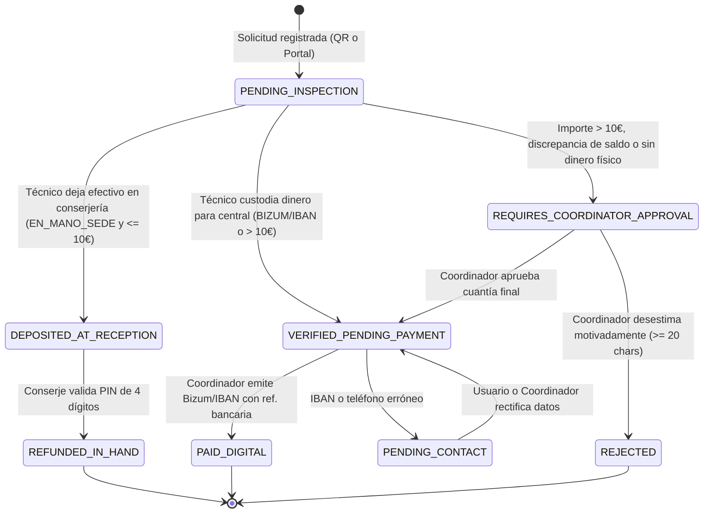
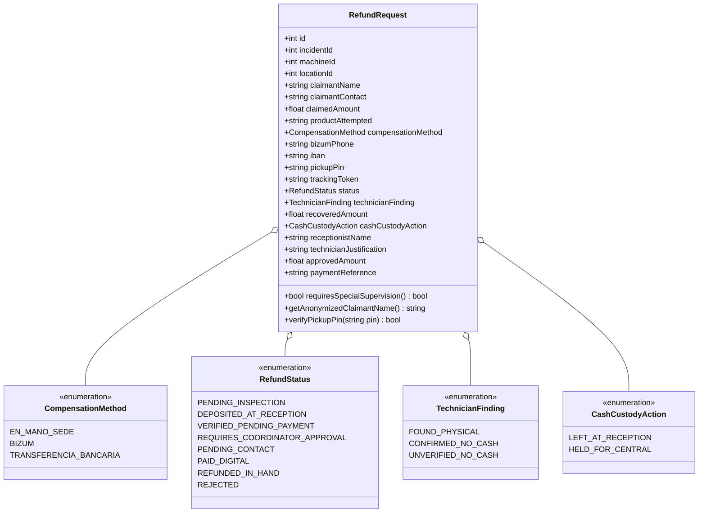

# ESPECIFICACIÓN TÉCNICA · CONTRATOS DE API Y MODELO DE DATOS
# GESTIÓN DE REINTEGROS E IMPORTE RETENIDO / DINERO TRAGADO (MÓDULO M5)

**Proyecto:** Gestor de Incidencias de Vending (*VendGuard*)  
**Módulo:** `08-refunds` (Opción E: Atención al Consumidor y Gestión Económica)  
**Documento:** `specs/technical/refunds_contracts.md`  
**Referencia Funcional:** [`specs/functional/refunds_spec.md`](../functional/refunds_spec.md) (RF-REF-01 a RF-REF-10, RNF-REF-01 a RNF-REF-05)  
**Protocolo:** HTTP/1.1 · JSON (`application/json; charset=utf-8`)  
**Metodología:** SDD (Specification-Driven Development) · Contratos API-First  
**Conformidad Constitucional:**  
* **Artículo I:** La Especificación es la Única Fuente de Verdad. Ninguna línea de código de producción sin contrato previo; cero código simulado (sin mocks en rutas de producción; tests de integración 100% autónomos en local).
* **Artículo II:** Seguridad Alimentaria y Prioridad Sanitaria Absoluta. El trámite y la gestión económica del reintegro son independientes de la máquina física; una incidencia crítica de frío mantiene su prioridad y resolución sin quedar condicionada al reembolso financiero.
* **Artículo III:** Inviolabilidad de Datos e Histórico. Prohibición terminante de borrado físico (`DELETE FROM`). Bajas puramente lógicas (`is_active = 0`, `deleted_at`). Todo cambio de estado contable y entrega se audita inmutablemente en `audit_log`.
* **Artículo IV:** Minimalismo Tecnológico y Cero Bloatware. 
  * Backend en PHP 8.2+ Vanilla POO tipado con PDO nativo; validación sintáctica de IBAN mediante algoritmo estándar de Módulo 97 en PHP puro (cero dependencias Composer en runtime).
  * Frontend en Vue.js 3 estándar en ES Modules puros (`vue.esm-browser.prod.js`), consumiendo directamente la API REST con `fetch()`.
* **Artículo V:** Integridad Inviolable de Reglas de Negocio.
  * Cierre justificado: El dictamen de saldo no exime de registrar diagnóstico y acción correctiva de $\ge 20$ caracteres para la avería mecánica (Art. V.1).
  * Privacidad y Segregación de Datos (Art. V.4): Ocultación total de IBAN y teléfonos privados a Técnicos de Campo y Responsables de Sede. Nombres anonimizados en conserjería (ej. *"Laura S."*) y verificación de entrega presencial obligatoria mediante PIN de 4 dígitos.
  * Ventana de Reapertura (Art. V.6): Expedientes cerrados en una primera intervención permanecen inmutables; si hay nueva retención de saldo en una recaída en 48h, se genera un expediente aditivo nuevo.
* **Artículo VI:** Delimitación Sagrada del Alcance. Exclusión formal de pasarelas de pago telemáticas automáticas (Redsys / PSD2 / Bizum API); el sistema gestiona la autorización y el registro del código de justificante bancario emitido por los canales habituales del operador.

---

## 1. Principios Arquitectónicos y Algoritmos de Verificación

### 1.1 Ciclo de Vida Desacoplado (Incidencia Técnica vs. Reintegro Económico)
El expediente de reintegro (`refund_requests`) mantiene una máquina de estados desacoplada del ciclo de vida del ticket de avería (`incidents`). La máquina dispensadora puede volver a servicio activo (`RESOLVED` / `CLOSED`) sin esperar la confirmación de la transferencia bancaria o la recogida física del usuario:



### 1.2 Algoritmo Nativo de Validación de IBAN (Módulo 97 en PHP Puro)
Para cumplir con el **Dogma Vanilla (Art. IV)** sin librerías externas, la validación del IBAN se realiza aplicando la norma ISO 13616 / ISO 7064 (MOD 97-10):

```text
ALGORITMO ValidarIban(ibanString):
    1. Limpiar espacios y guiones: iban = strtoupper(regex_replace('/[^A-Z0-9]/', '', ibanString))
    2. Comprobar longitud mínima y máxima (entre 15 y 34 caracteres; España ES = 24 caracteres).
    3. Reordenar los 4 primeros caracteres al final: reordered = substring(iban, 4) + substring(iban, 0, 4)
    4. Reemplazar cada letra A-Z por su valor numérico (A=10, B=11, ..., Z=35):
       numericString = reemplazarLetrasPorDigitos(reordered)
    5. Calcular el módulo 97 sobre numericString usando aritmética de números grandes (bcmod o algoritmo de bloques por trozos):
       resto = modularArithmeticMod97(numericString)
    6. Retornar (resto == 1)
```

### 1.3 Verificación Presencial con PIN Secreto de 4 Dígitos
Para evitar entregas erróneas o accesos indebidos en conserjería:
* Al crearse la solicitud presencial por QR, se genera un PIN aleatorio `random_int(1000, 9999)` y un token de seguimiento `bin2hex(random_bytes(32))`.
* El conserje ve el expediente en estado `DEPOSITED_AT_RECEPTION` con nombre anonimizado (ej. *"Marc R. · 3,00 €"*).
* Para liberar el dinero, el conserje introduce el PIN facilitado presencialmente por el usuario. El sistema valida `hash_equals()` en tiempo constante y transiciona a `REFUNDED_IN_HAND`.
* **Freno antifuerza (RF-REF-02).** `hash_equals()` protege el secreto frente a fugas por temporización, pero no frente al volumen: contra este endpoint se toleraron 3000 PIN incorrectos en 1,02 segundos, y con 10.000 combinaciones eso hace el espacio entero alcanzable en menos de cuatro minutos. Por tanto:
  1. Cada intento fallido incrementa `refund_requests.pickup_attempts`.
  2. El quinto intento bloquea el expediente 15 minutos (`refund_requests.pickup_locked_until`) y responde **`423 PICKUP_PIN_LOCKED`** con `details.locked_until` y `details.failed_attempts`.
  3. Mientras el bloqueo esté vigente, incluso el PIN correcto responde 423 y el efectivo **no** se entrega. El bloqueo se comprueba **antes** de comparar el secreto, para que un expediente bloqueado no sirva de oráculo.
  4. El bloqueo es **por expediente**, nunca por sede: un dusting no puede congelar el mostrador entero.
  5. El bloqueo expira solo (un bloqueo permanente sería denegación de servicio contra el usuario que quiere su dinero) y la entrega correcta reinicia el contador a cero.
  6. `pickup_attempts` y `pickup_locked_until` **no** se proyectan en la vista restringida ni en ningún DTO de salida: cuántas combinaciones quedan es tan sensible como el PIN.
  7. El intento fallido se audita como `REFUND_PICKUP_PIN_REJECTED` **sin el PIN introducido** (Art. V.4).

---

## 2. Modificaciones al Esquema de Base de Datos (DDL)

```sql
-- Migración DDL: 008_refund_management.sql

-- 0. Extensión del Enum de Auditoría (RNF-REF-01 / Art. III.3)
-- Migración DDL: 009_refund_audit_entity.sql
-- `REFUND_REQUEST` y `UNCLAIMED_CASH_FINDING` son obligatorios y no cosméticos:
-- `refund_requests.id` e `incidents.id` son espacios de identificadores
-- distintos, por lo que auditar un reintegro como `TICKET` apuntaría en
-- silencio a una avería ajena y destruiría la trazabilidad del dinero.
ALTER TABLE `audit_log`
MODIFY COLUMN `entity_type` ENUM(
    'TICKET', 'MACHINE', 'LOCATION', 'USER',
    'PREVENTIVE_ORDER', 'SANITARY_CERTIFICATE',
    'REFUND_REQUEST', 'UNCLAIMED_CASH_FINDING'
) NOT NULL;

-- 1. Ampliación de tabla LOCATIONS: indicador de conserjería / recepción física
ALTER TABLE `locations`
ADD COLUMN `has_physical_reception` TINYINT(1) NOT NULL DEFAULT 1 AFTER `longitude`;

-- 2. Tabla principal de Expedientes de Reintegro e Importe Retenido
CREATE TABLE IF NOT EXISTS `refund_requests` (
    `id` INT UNSIGNED AUTO_INCREMENT PRIMARY KEY,
    `incident_id` INT UNSIGNED NOT NULL,
    `machine_id` INT UNSIGNED NOT NULL,
    `location_id` INT UNSIGNED NOT NULL,
    `claimant_name` VARCHAR(100) NOT NULL,
    `claimant_contact` VARCHAR(100) NOT NULL,
    `claimed_amount` DECIMAL(6, 2) NOT NULL,
    `product_attempted` VARCHAR(100) NULL,
    `compensation_method` ENUM('EN_MANO_SEDE', 'BIZUM', 'TRANSFERENCIA_BANCARIA') NOT NULL,
    `bizum_phone` VARCHAR(15) NULL,
    `iban` VARCHAR(34) NULL,
    `pickup_pin` VARCHAR(4) NULL,
    `tracking_token` VARCHAR(64) NOT NULL UNIQUE,
    `status` ENUM(
        'PENDING_INSPECTION',
        'DEPOSITED_AT_RECEPTION',
        'VERIFIED_PENDING_PAYMENT',
        'REQUIRES_COORDINATOR_APPROVAL',
        'PENDING_CONTACT',
        'PAID_DIGITAL',
        'REFUNDED_IN_HAND',
        'REJECTED'
    ) NOT NULL DEFAULT 'PENDING_INSPECTION',
    `technician_finding` ENUM('FOUND_PHYSICAL', 'CONFIRMED_NO_CASH', 'UNVERIFIED_NO_CASH') NULL,
    `recovered_amount` DECIMAL(6, 2) NULL,
    `cash_custody_action` ENUM('LEFT_AT_RECEPTION', 'HELD_FOR_CENTRAL') NULL,
    `receptionist_name` VARCHAR(100) NULL,
    `technician_justification` TEXT NULL,
    `technician_inspected_at` DATETIME NULL,
    `technician_id` INT UNSIGNED NULL,
    `coordinator_decision` ENUM('APPROVED', 'REJECTED') NULL,
    `approved_amount` DECIMAL(6, 2) NULL,
    `coordinator_justification` TEXT NULL,
    `coordinator_id` INT UNSIGNED NULL,
    `payment_reference` VARCHAR(100) NULL,
    `paid_at` DATETIME NULL,
    `hand_delivered_at` DATETIME NULL,
    `is_active` TINYINT(1) NOT NULL DEFAULT 1,
    `created_at` DATETIME NOT NULL DEFAULT CURRENT_TIMESTAMP,
    `updated_at` DATETIME NOT NULL DEFAULT CURRENT_TIMESTAMP ON UPDATE CURRENT_TIMESTAMP,
    `deleted_at` DATETIME NULL,

    CONSTRAINT `fk_refund_incident` FOREIGN KEY (`incident_id`) REFERENCES `incidents` (`id`) ON UPDATE CASCADE ON DELETE RESTRICT,
    CONSTRAINT `fk_refund_machine` FOREIGN KEY (`machine_id`) REFERENCES `machines` (`id`) ON UPDATE CASCADE ON DELETE RESTRICT,
    CONSTRAINT `fk_refund_location` FOREIGN KEY (`location_id`) REFERENCES `locations` (`id`) ON UPDATE CASCADE ON DELETE RESTRICT,
    CONSTRAINT `fk_refund_technician` FOREIGN KEY (`technician_id`) REFERENCES `users` (`id`) ON UPDATE CASCADE ON DELETE SET NULL,
    CONSTRAINT `fk_refund_coordinator` FOREIGN KEY (`coordinator_id`) REFERENCES `users` (`id`) ON UPDATE CASCADE ON DELETE SET NULL,

    INDEX `idx_refund_status_location` (`status`, `location_id`),
    INDEX `idx_refund_incident` (`incident_id`),
    INDEX `idx_refund_tracking_token` (`tracking_token`),
    INDEX `idx_refund_created_at` (`created_at`)
) ENGINE=InnoDB DEFAULT CHARSET=utf8mb4 COLLATE=utf8mb4_unicode_ci;

-- 3. Tabla para Registro de Monedas Atascadas Recuperadas de Oficio (Sin Reclamación Previa)
CREATE TABLE IF NOT EXISTS `unclaimed_cash_findings` (
    `id` INT UNSIGNED AUTO_INCREMENT PRIMARY KEY,
    `incident_id` INT UNSIGNED NOT NULL,
    `machine_id` INT UNSIGNED NOT NULL,
    `technician_id` INT UNSIGNED NOT NULL,
    `amount` DECIMAL(6, 2) NOT NULL,
    `notes` TEXT NULL,
    `created_at` DATETIME NOT NULL DEFAULT CURRENT_TIMESTAMP,

    CONSTRAINT `fk_unclaimed_incident` FOREIGN KEY (`incident_id`) REFERENCES `incidents` (`id`) ON UPDATE CASCADE ON DELETE RESTRICT,
    CONSTRAINT `fk_unclaimed_machine` FOREIGN KEY (`machine_id`) REFERENCES `machines` (`id`) ON UPDATE CASCADE ON DELETE RESTRICT,
    CONSTRAINT `fk_unclaimed_technician` FOREIGN KEY (`technician_id`) REFERENCES `users` (`id`) ON UPDATE CASCADE ON DELETE RESTRICT,

    INDEX `idx_unclaimed_incident` (`incident_id`),
    INDEX `idx_unclaimed_created_at` (`created_at`)
) ENGINE=InnoDB DEFAULT CHARSET=utf8mb4 COLLATE=utf8mb4_unicode_ci;

-- Freno antifuerza del PIN de recogida (migración 013_refund_pickup_pin_lockout.sql)
-- Sin esto, 10.000 combinaciones y 0,34 ms por intento hacen el espacio entero
-- alcanzable en menos de cuatro minutos (RF-REF-02).
ALTER TABLE `refund_requests`
    ADD COLUMN `pickup_attempts` TINYINT UNSIGNED NOT NULL DEFAULT 0 AFTER `pickup_pin`,
    ADD COLUMN `pickup_locked_until` DATETIME NULL AFTER `pickup_attempts`;

-- Importes íntegros y verificables (migración 011_refund_amount_integrity.sql)
-- DECIMAL(6,2) saturaba en silencio (999999,00 -> 9999.99) porque el servidor
-- corre sin STRICT_TRANS_TABLES, y `paid_amount` sencillamente no existía.
ALTER TABLE `refund_requests`
    ADD COLUMN `paid_amount` DECIMAL(10,2) NULL AFTER `payment_reference`,
    MODIFY COLUMN `claimed_amount` DECIMAL(10,2) NOT NULL,
    MODIFY COLUMN `recovered_amount` DECIMAL(10,2) NULL,
    MODIFY COLUMN `approved_amount` DECIMAL(10,2) NULL;

ALTER TABLE `unclaimed_cash_findings`
    MODIFY COLUMN `amount` DECIMAL(10,2) NOT NULL;
```

---

## 3. Modelo de Dominio y Entidades



---

## 4. Catálogo de Endpoints REST (HTTP Contracts)

### 4.1 Endpoints Públicos (Consumidor Final y QR)

#### 4.1.1 Ampliación del Reporte Ciudadano QR: `POST /api/qr/report`
Permite añadir la reclamación de reintegro en el mismo envío del reporte público de avería.

* **Método:** `POST`
* **Ruta:** `/api/qr/report`
* **Autenticación:** Pública (sin token).
* **Campos añadidos opcionales en el cuerpo JSON:**
```json
{
  "machine_code": "VEND-0101",
  "category": "PAYMENT_FAILURE",
  "description": "Metí una moneda de 2 euros y se quedó atascada sin dar producto.",
  "contact_name": "Laura Sanitaria",
  "contact_phone": "600111222",
  "refund_requested": true,
  "claimed_amount": 2.00,
  "compensation_method": "BIZUM",
  "bizum_phone": "600111222",
  "iban": null,
  "product_attempted": "Café con leche carril 2"
}
```

**Respuesta Exitosa (`201 Created`):**
```json
{
  "success": true,
  "message": "Incidencia y solicitud de reintegro registradas correctamente.",
  "data": {
    "incident_id": 101,
    "incident_code": "INC-2026-00101",
    "status": "OPEN",
    "refund": {
      "id": 1,
      "claimed_amount": 2.00,
      "compensation_method": "BIZUM",
      "status": "PENDING_INSPECTION",
      "pickup_pin": null,
      "tracking_token": "a1b2c3d4e5f6789012345678abcdef0123456789abcdef0123456789abcdef01",
      "tracking_url": "/?track=a1b2c3d4e5f6789012345678abcdef0123456789abcdef0123456789abcdef01"
    }
  }
}
```

*Nota:* Si el método fuera `EN_MANO_SEDE`, `pickup_pin` retornaría un string de 4 dígitos (ej. `"4821"`).

**Respuesta cuando la avería se fusiona con otra abierta (`200 OK`):** mismo cuerpo, con la clave `merged: true` y el `incident_id` de la avería superviviente. La fusión de averías ya estaba especificada; el reintegro viaja con ella.

*Reclamación duplicada (`409 Conflict`, RF-REF-11):* la unidad protegida es **(avería, consumidor)**. Si ese consumidor ya tiene un expediente **vivo** sobre esa avería, la API no abre un segundo y devuelve el token del que ya existe, para que el usuario recupere su caso en lugar de pagar dos veces:
```json
{
  "success": false,
  "error": {
    "code": "DUPLICATE_REFUND_CLAIM",
    "message": "Ya existe una reclamación viva de esta persona sobre esta avería. Consulte el expediente que ya abrió.",
    "details": {
      "existing_refund_id": 41,
      "existing_tracking_token": "a1b2c3d4e5f6789012345678abcdef0123456789abcdef0123456789abcdef01"
    }
  }
}
```
Un expediente ya terminal (`PAID_DIGITAL`, `REFUNDED_IN_HAND`, `REJECTED`) **no** bloquea una reclamación nueva: el derecho a reclamar se reabre cuando el anterior se desestimó.

---

#### 4.1.2 Consulta Pública de Seguimiento: `GET /api/public/refunds/track`
Permite al solicitante anónimo conocer el estado en vivo de su reintegro mediante el token seguro.

* **Método:** `GET`
* **Ruta:** `/api/public/refunds/track?token={tracking_token}`
* **Autenticación:** Pública (basada en token URL).

**Respuesta Exitosa (`200 OK`):**
```json
{
  "success": true,
  "data": {
    "claimed_amount": 2.00,
    "product_attempted": "Café con leche carril 2",
    "compensation_method": "EN_MANO_SEDE",
    "status": "DEPOSITED_AT_RECEPTION",
    "status_label": "Efectivo depositado en conserjería",
    "status_description": "El técnico ha depositado su dinero en la recepción del centro. Puede pasar a recogerlo facilitando su PIN de 4 dígitos.",
    "pickup_pin": "4821",
    "can_rectify_data": false,
    "machine_code": "VEND-0101",
    "location_name": "Hospital del Mar - Edificio Central",
    "created_at": "2026-10-01T10:15:00+02:00",
    "updated_at": "2026-10-01T11:45:00+02:00"
  }
}
```

---

#### 4.1.3 Rectificación de Datos por el Solicitante: `PATCH /api/public/refunds/track`
Permite actualizar el teléfono de Bizum o IBAN cuando el expediente está en `PENDING_CONTACT`.

* **Método:** `PATCH`
* **Ruta:** `/api/public/refunds/track?token={tracking_token}`
* **Autenticación:** Pública (basada en token URL).
* **Cuerpo de la Petición:**
```json
{
  "bizum_phone": "600999888",
  "iban": null
}
```

**Respuesta Exitosa (`200 OK`):**
```json
{
  "success": true,
  "message": "Datos de pago actualizados correctamente. El coordinador reanudará la tramitación de su reintegro.",
  "data": {
    "status": "VERIFIED_PENDING_PAYMENT"
  }
}
```

---

### 4.2 Endpoints del Técnico de Campo (`TECHNICIAN`)

#### 4.2.1 Consulta de Reintegros Asociados: `GET /api/technician/incidents/{id}/refund`
Permite al técnico conocer si la máquina a intervenir tiene solicitudes de dinero retenido asociadas.

* **Método:** `GET`
* **Ruta:** `/api/technician/incidents/{id}/refund`
* **Autenticación:** Obligatoria (`Bearer <token_tecnico>`).
* **Roles:** `TECHNICIAN`.

**Respuesta Exitosa (`200 OK`):**
```json
{
  "success": true,
  "data": {
    "has_refund_requests": true,
    "total_requests": 1,
    "total_claimed_amount": 2.00,
    "requests": [
      {
        "id": 1,
        "claimed_amount": 2.00,
        "product_attempted": "Café con leche carril 2",
        "compensation_method": "EN_MANO_SEDE",
        "status": "PENDING_INSPECTION",
        "custody_instruction": "Si recupera el dinero, deposítelo en un sobre en la recepción del centro."
      }
    ]
  }
}
```
*Garantía Constitucional (Art. V.4):* El JSON omite explícitamente `iban`, `bizum_phone` y teléfonos privados.

---

#### 4.2.2 Ampliación de Resolución Técnica: `POST /api/technician/incidents/{id}/resolve`
El formulario de resolución móvil existente incorpora el bloque obligatorio de inspección económica cuando existe una reclamación activa (y opcional para hallazgos de oficio).

* **Campos añadidos en el payload:**
```json
{
  "diagnosis": "Moneda de 2 euros atascada en el embudo del selector mecánico.",
  "solution": "Desatasco de selector, limpieza de canaleta y prueba de monedas satisfactoria.",
  "replaced_parts_declared": false,
  "refund_inspection": {
    "finding": "FOUND_PHYSICAL",
    "recovered_amount": 2.00,
    "cash_custody_action": "LEFT_AT_RECEPTION",
    "receptionist_name": "Laura Sanitaria (Conserjería Planta Baja)",
    "justification": null
  },
  "unclaimed_cash_found": null
}
```

**Respuesta Exitosa (`200 OK`):**
```json
{
  "success": true,
  "message": "Incidencia resuelta y dictamen de efectivo registrado correctamente.",
  "data": {
    "incident_id": 101,
    "status": "RESOLVED",
    "refund_status": "DEPOSITED_AT_RECEPTION"
  }
}
```

---

### 4.3 Endpoints del Responsable de Sede (`LOCATION_MANAGER`)

#### 4.3.1 Consulta de Reintegros de la Sede: `GET /api/location/refunds`
Permite a conserjería consultar los reembolsos de su edificio con nombres anonimizados y estado.

* **Método:** `GET`
* **Ruta:** `/api/location/refunds`
* **Autenticación:** Obligatoria (`Bearer <token_sede>` o cabecera `X-Site-Code`).
* **Roles:** `LOCATION_MANAGER`.

**Respuesta Exitosa (`200 OK`):**
```json
{
  "success": true,
  "data": {
    "total": 1,
    "refunds": [
      {
        "id": 1,
        "incident_code": "INC-2026-00101",
        "machine_code": "VEND-0101",
        "claimant_name_anon": "Laura S.",
        "claimed_amount": 2.00,
        "compensation_method": "EN_MANO_SEDE",
        "status": "DEPOSITED_AT_RECEPTION",
        "ready_for_pickup": true,
        "created_at": "2026-10-01T10:15:00+02:00"
      }
    ]
  }
}
```
*Garantía Constitucional (Art. V.4):* Cero exposición de datos bancarios o teléfonos privados.

---

#### 4.3.2 Validación de PIN y Entrega en Mano: `POST /api/location/refunds/{id}/deliver`
El conserje valida el PIN facilitado por el usuario para entregar el dinero en mano.

* **Método:** `POST`
* **Ruta:** `/api/location/refunds/{id}/deliver`
* **Autenticación:** Obligatoria (`LOCATION_MANAGER`).
* **Cuerpo:**
```json
{
  "pickup_pin": "4821"
}
```

**Respuesta Exitosa (`200 OK`):**
```json
{
  "success": true,
  "message": "PIN verificado con éxito. Entrega presencial registrada correctamente.",
  "data": {
    "id": 1,
    "status": "REFUNDED_IN_HAND",
    "hand_delivered_at": "2026-10-01T13:00:00+02:00"
  }
}
```

*Bloqueo antifuerza (`423 Locked`, RF-REF-02):* el quinto PIN incorrecto bloquea el expediente 15 minutos. La respuesta dice **cuándo** se libera el dinero, y ni el PIN introducido ni el almacenado aparecen en ella:
```json
{
  "success": false,
  "error": {
    "code": "PICKUP_PIN_LOCKED",
    "message": "El PIN de recogida está bloqueado por intentos incorrectos. Inténtelo de nuevo en 15 minutos o solicite un nuevo PIN en el punto de atención.",
    "details": {
      "failed_attempts": 5,
      "locked_until": "2026-10-02T13:15:00+02:00"
    }
  }
}
```
Un PIN correcto presentado durante el bloqueo responde igualmente `423` y **no** entrega el efectivo.

*Error de validación (`422 Unprocessable Entity`):*
```json
{
  "success": false,
  "error_code": "INVALID_PICKUP_PIN",
  "message": "El PIN de recogida introducido no coincide con el expediente de reintegro."
}
```

---

### 4.4 Endpoints de Coordinación y Finanzas (`COORDINATOR`)

#### 4.4.1 Bandeja Global de Reintegros: `GET /api/coordinator/refunds`
Listado filtrado y paginado de expedientes con vista completa.

* **Método:** `GET`
* **Ruta:** `/api/coordinator/refunds`
* **Autenticación:** Obligatoria (`COORDINATOR`).
* **Parámetros Query:** `status`, `location_id`, `machine_id`, `requires_approval_only`.

**Respuesta Exitosa (`200 OK`):**
```json
{
  "success": true,
  "data": {
    "total": 1,
    "items": [
      {
        "id": 1,
        "incident_id": 101,
        "machine_code": "VEND-0101",
        "location_name": "Hospital del Mar - Edificio Central",
        "claimant_name": "Laura Sanitaria",
        "claimant_contact": "600111222",
        "claimed_amount": 2.00,
        "compensation_method": "BIZUM",
        "bizum_phone": "600111222",
        "status": "VERIFIED_PENDING_PAYMENT",
        "technician_finding": "FOUND_PHYSICAL",
        "recovered_amount": 2.00,
        "cash_custody_action": "HELD_FOR_CENTRAL",
        "requires_special_supervision": false,
        "created_at": "2026-10-01T10:15:00+02:00"
      }
    ]
  }
}
```

---

#### 4.4.2 Autorización / Doble Visto Bueno: `POST /api/coordinator/refunds/{id}/approve`
Aprueba formalmente la cuantía final a devolver ante importes $> 10,00\ \text{€}$ o discrepancias.

* **Método:** `POST`
* **Ruta:** `/api/coordinator/refunds/{id}/approve`
* **Cuerpo:**
```json
{
  "approved_amount": 15.00,
  "notes": "Comprobado registro de ventas y corte de stock; se autoriza la devolución íntegra."
}
```

---

#### 4.4.3 Registro de Liquidación Digital (Bizum / Transferencia): `POST /api/coordinator/refunds/{id}/pay`
Registra la emisión efectiva del reembolso con su identificador de justificante bancario.

* **Método:** `POST`
* **Ruta:** `/api/coordinator/refunds/{id}/pay`
* **Cuerpo:**
```json
{
  "payment_reference": "BIZUM-20261001-998822",
  "paid_amount": 15.00
}
```

**Respuesta Exitosa (`200 OK`):**
```json
{
  "success": true,
  "message": "Pago digital registrado con éxito. Expediente de reintegro liquidado.",
  "data": {
    "id": 1,
    "status": "PAID_DIGITAL",
    "payment_reference": "BIZUM-20261001-998822",
    "paid_amount": 15.00,
    "approved_amount": 15.00,
    "paid_at": "2026-10-01T15:30:00+02:00"
  }
}
```

Si se omite `paid_amount`, se liquida el techo del expediente: `min(importe aprobado, 50,00 €)`, o el reclamado si nunca hubo visto bueno formal.

*Techo de liquidación (RF-REF-03, RF-REF-07):* `paid_amount` debe ser mayor que 0 y no puede superar `min(importe aprobado ?? reclamado, 50,00 €)`; superarlo responde `422 INVALID_REFUND_AMOUNT`. El importe que devuelve la respuesta es el **persistido** en `refund_requests.paid_amount`: la API nunca afirma una cifra distinta de la almacenada.

---

#### 4.4.4 Desestimación Motivada: `POST /api/coordinator/refunds/{id}/reject`
Desestima una reclamación con justificación obligatoria ($\ge 20$ caracteres).

* **Método:** `POST`
* **Ruta:** `/api/coordinator/refunds/{id}/reject`
* **Cuerpo:**
```json
{
  "rejection_reason": "Inspección técnica sin monedas atascadas y máquina operando con normalidad según auditoría de ventas."
}
```

---

## 5. Catálogo de Errores Normalizados

| Código HTTP | Error Code | Mensaje en Castellano (Dualismo Lingüístico) | Causa Detallada |
| :--- | :--- | :--- | :--- |
| `401 Unauthorized` | `UNAUTHORIZED` | *"Token de autenticación ausente o inválido."* | Cabecera Bearer ausente o expirada. |
| `403 Forbidden` | `FORBIDDEN` | *"No dispone de permisos para gestionar o consultar datos financieros de reintegros."* | Intento de acceso a IBAN o autorización por rol no cualificado (Art. V.4). |
| `404 Not Found` | `REFUND_NOT_FOUND` | *"El expediente de reintegro especificado no existe o fue archivado."* | ID o token de seguimiento inexistente. |
| `409 Conflict` | `INVALID_REFUND_STATE_TRANSITION` | *"La acción solicitada no es válida para el estado actual del expediente."* | Ej. intentar pagar un expediente que ya fue rechazado o entregado en mano. |
| `422 Unprocessable` | `INVALID_REFUND_AMOUNT` | *"El importe reclamado debe ser mayor a 0,00 € y no puede exceder el límite máximo de 50,00 €."* | Violación del rango de importes (RF-REF-03). |
| `422 Unprocessable` | `INVALID_IBAN_FORMAT` | *"El código de cuenta bancaria (IBAN) introducido no es válido conforme al algoritmo oficial Módulo 97."* | Fallo en la verificación sintáctica o checksum del IBAN. |
| `422 Unprocessable` | `INVALID_BIZUM_PHONE` | *"El número de teléfono para Bizum debe contener exactamente 9 dígitos numéricos."* | Formato incorrecto de teléfono móvil. |
| `422 Unprocessable` | `INVALID_PICKUP_PIN` | *"El PIN de recogida introducido no coincide con el expediente de reintegro."* | Fallo en la verificación de entrega presencial en conserjería. |
| `422 Unprocessable` | `RECEPTION_DELIVERY_NOT_ALLOWED` | *"No se permite el depósito en conserjería para importes superiores a 10,00 € o con método de compensación digital."* | Intento indebido de marcar `LEFT_AT_RECEPTION` para BIZUM/IBAN o $> 10\ \text{€}$. |
| `422 Unprocessable` | `JUSTIFICATION_TOO_SHORT` | *"La justificación técnica o de rechazo debe contener un mínimo de 20 caracteres descriptivos."* | Cumplimiento del Art. V.1 de la Constitución. |
| `422 Unprocessable` | `INVALID_RECOVERED_AMOUNT` | *"El importe de efectivo recuperado no concuerda con las reclamaciones de esta avería. Si se trata de dinero sobrante, regístrelo como efectivo no reclamado."* | Recuperado por encima de lo reclamado, o hallazgo de efectivo no reclamado por encima del tope de 50,00 € (RF-REF-03, RF-REF-04). |
| `409 Conflict` | `DUPLICATE_REFUND_CLAIM` | *"Ya existe una reclamación viva de esta persona sobre esta avería. Consulte el expediente que ya abrió."* | Segundo escaneo del mismo QR por el mismo consumidor. La respuesta incluye `details.existing_refund_id` y `details.existing_tracking_token` (RF-REF-11). |
| `423 Locked` | `PICKUP_PIN_LOCKED` | *"El PIN de recogida está bloqueado por intentos incorrectos. Inténtelo de nuevo en 15 minutos o solicite un nuevo PIN en el punto de atención."* | Quinto intento fallido de PIN; el bloqueo expira solo (RF-REF-02). |

---

## 6. Estrategia de Pruebas Autónomas y Coexistencia (Art. I y IV)

Para garantizar la ejecución 100% autónoma en local (`php tests/run_all.php`):
1. **Pruebas Unitarias de Validación:** Algoritmo nativo de Módulo 97 para IBAN (válidos, erróneos y con checksum falso) sin llamadas de red.
2. **Pruebas de Integración con MariaDB Real:**
   - Flujo QR público completo: registro con generación de PIN y token de seguimiento.
   - Flujo móvil de técnico: resolución con dictamen `FOUND_PHYSICAL` y custodia forzada `HELD_FOR_CENTRAL` si $> 10\ \text{€}$.
   - Flujo de conserjería: validación de PIN de 4 dígitos y rechazo de PIN incorrecto.
   - Flujo de Coordinación: doble visto bueno para $> 10\ \text{€}$ y pago digital con referencia bancaria.
3. **Blindaje Constitucional de Segregación (Art. V.4):**
   - La suite `SiteManagerRefundDataSegregationTest.php` certifica que el rol `LOCATION_MANAGER` y el rol `TECHNICIAN` reciben `403 Forbidden` al intentar acceder a los endpoints administrativos y que las respuestas JSON de conserjería nunca proyectan las columnas `iban` ni `bizum_phone`.
   - Certificación de inmutabilidad: verificación de que `refund_requests` no admite sentencias `DELETE FROM` (Art. III).
