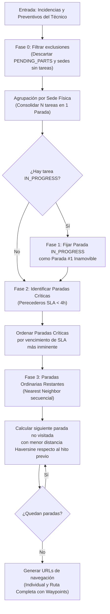
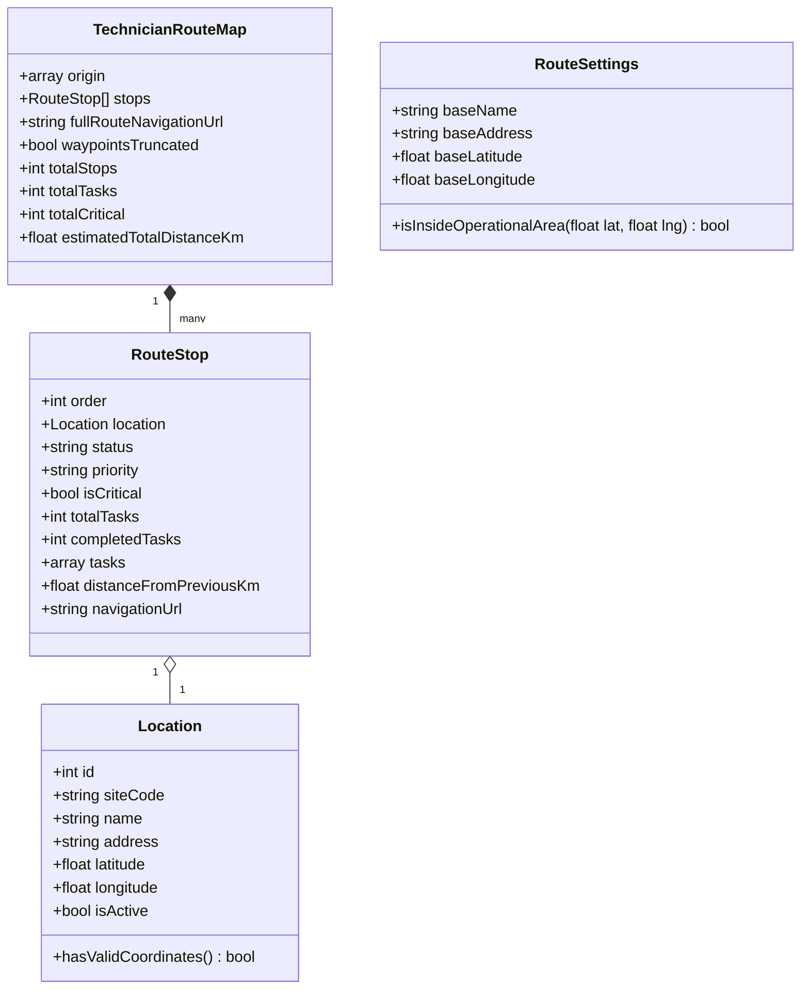

# ESPECIFICACIÓN TÉCNICA · CONTRATOS DE API Y MODELO DE DATOS
# LOGÍSTICA DE CAMPO: MAPA INTERACTIVO DE RUTAS Y GEORREFERENCIACIÓN (MÓDULO M4)

**Proyecto:** Gestor de Incidencias de Vending (*VendGuard*)  
**Módulo:** `07-field-logistics-map` (Opción D: Logística de Campo)  
**Documento:** `specs/technical/route_map_contracts.md`  
**Referencia Funcional:** [`specs/functional/route_map_spec.md`](../functional/route_map_spec.md) (RF-MAP-01 a RF-MAP-10, RNF-MAP-01 a RNF-MAP-06)  
**Protocolo:** HTTP/1.1 · JSON (`application/json; charset=utf-8`)  
**Metodología:** SDD (Specification-Driven Development) · Contratos API-First  
**Conformidad Constitucional:**  
* **Artículo I:** La Especificación es la Única Fuente de Verdad. Ninguna línea de código de producción sin contrato previo; cero código simulado (sin mocks en rutas de producción; tests unitarios y de integración 100% autónomos en local).
* **Artículo II:** Seguridad Alimentaria y Prioridad Sanitaria Absoluta. Toda parada con al menos una incidencia crítica de perecederos (SLA < 4.0h) hereda la máxima prioridad y se sitúa en los primeros puestos de la secuencia de ruta antes de cualquier optimización geográfica.
* **Artículo III:** Inviolabilidad de Datos e Histórico. Las coordenadas geográficas se almacenan en las sedes maestras sin eliminar registros pasados (`soft delete` con `deleted_at`).
* **Artículo IV:** Minimalismo Tecnológico y Cero Bloatware. 
  * Backend en PHP 8.2+ Vanilla orientado a objetos puro, tipado estricto (`declare(strict_types=1);`), persistencia nativa con PDO y cálculo geodésico con fórmula de Haversine nativa.
  * Frontend en Vue.js 3 estándar en ES Modules puros (`vue.esm-browser.prod.js`), con renderizado cartográfico ligero estándar en cliente sin dependencias pesadas ni compiladores en runtime.
* **Artículo V:** Integridad Inviolable de Reglas de Negocio.
  * Privacidad y Segregación de Datos (Art. V.4): Bloqueo total de endpoints cartográficos y de rutas para el rol `LOCATION_MANAGER`. Cero rastreo continuo personal o laboral de smartphones de técnicos; únicamente se mapean sedes físicas fijas con tickets asignados.
* **Artículo VI:** Delimitación Sagrada del Alcance. Exclusión formal de telemetría por satélite de vehículos en tiempo real, algoritmos de tráfico pesado o gestores de flotas complejos.

---

## 1. Principios Arquitectónicos y Algoritmos Geodésicos

### 1.1 Algoritmo de Secuenciación Híbrida de Ruta (RF-MAP-05)
Para garantizar la combinación óptima entre el cumplimiento sanitario innegociable (**Constitución Art. II**) y la minimización del trayecto de campo (**RNF-MAP-01**), el servicio de ruta aplica una secuenciación determinista en 4 fases sucesivas:



### 1.2 Cálculo de Distancia Geodésica (Fórmula de Haversine)
El cálculo de distancia entre dos coordenadas $(\text{lat}_1, \text{lon}_1)$ y $(\text{lat}_2, \text{lon}_2)$ se calcula en PHP puro con una precisión nanométrica utilizando el radio medio terrestre ($R = 6371.0 \text{ km}$):

$$\Delta\text{lat} = \text{radians}(\text{lat}_2 - \text{lat}_1)$$
$$\Delta\text{lon} = \text{radians}(\text{lon}_2 - \text{lon}_1)$$
$$a = \sin^2\left(\frac{\Delta\text{lat}}{2}\right) + \cos(\text{radians}(\text{lat}_1)) \cdot \cos(\text{radians}(\text{lat}_2)) \cdot \sin^2\left(\frac{\Delta\text{lon}}{2}\right)$$
$$c = 2 \cdot \text{atan2}\left(\sqrt{a}, \sqrt{1-a}\right)$$
$$d = R \cdot c$$

*Tiempo de ejecución estimado:* $< 0.005 \text{ ms}$ por cálculo de arista. Para una jornada típica de hasta 30 paradas, el algoritmo completo ejecuta menos de 450 evaluaciones de Haversine, completando el cálculo en menos de $2 \text{ ms}$ (muy por debajo del límite de $50 \text{ ms}$ exigido por **RNF-MAP-01**).

### 1.3 Generación de Enlaces Universales de Navegación (Google Maps)
En cumplimiento de **RF-MAP-08** y **RNF-MAP-03**, el sistema genera enlaces que funcionan universalmente en Android (apertura de Google Maps nativo), iOS (Google Maps / navegador Safari) y Desktop (Google Maps Web en nueva pestaña):

1. **Navegación individual hacia una parada:**
   ```text
   https://www.google.com/maps/dir/?api=1&destination={latitude},{longitude}&travelmode=driving
   ```
2. **Ruta completa concatenada con puntos de paso (Waypoints):**
   ```text
   https://www.google.com/maps/dir/?api=1&origin={origin_lat},{origin_lng}&destination={dest_lat},{dest_lng}&waypoints={wp1_lat},{wp1_lng}%7C{wp2_lat},{wp2_lng}...&travelmode=driving
   ```
   *Nota de límites:* Si el total de paradas supera el límite de 10 puntos (origen + 8 waypoints + destino), el enlace incorpora las paradas prioritarias hasta el límite y el backend incluye el flag `waypoints_truncated: true` junto con el mensaje explicativo.

---

## 2. Modificaciones al Esquema de Base de Datos (DDL)

### 2.1 Ampliación de la Tabla `locations`
Se agregan las columnas `latitude` y `longitude` con tipo numérico exacto y validación de rango territorial.

```sql
-- Migración DDL: 007_field_logistics_map.sql

ALTER TABLE `locations`
ADD COLUMN `latitude` DECIMAL(10, 7) NOT NULL DEFAULT 41.3850640 AFTER `address`,
ADD COLUMN `longitude` DECIMAL(11, 7) NOT NULL DEFAULT 2.1734035 AFTER `latitude`;

-- Índice compuesto para consultas de proximidad y acotación espacial
CREATE INDEX `idx_locations_lat_lng` ON `locations` (`latitude`, `longitude`, `is_active`);
```

### 2.2 Tabla de Configuración Logística (`route_settings`)
Almacena los parámetros globales de la Base Central Operativa de salida y la tolerancia territorial del parque.

```sql
CREATE TABLE IF NOT EXISTS `route_settings` (
    `id` INT UNSIGNED AUTO_INCREMENT PRIMARY KEY,
    `base_name` VARCHAR(100) NOT NULL DEFAULT 'Base Central VendGuard',
    `base_address` VARCHAR(255) NOT NULL DEFAULT 'Carrer de la Marina 100, 08018 Barcelona',
    `base_latitude` DECIMAL(10, 7) NOT NULL DEFAULT 41.3935000,
    `base_longitude` DECIMAL(11, 7) NOT NULL DEFAULT 2.1890000,
    `operational_radius_km` INT UNSIGNED NOT NULL DEFAULT 100,
    `min_latitude` DECIMAL(10, 7) NOT NULL DEFAULT 27.0000000,
    `max_latitude` DECIMAL(10, 7) NOT NULL DEFAULT 44.5000000,
    `min_longitude` DECIMAL(11, 7) NOT NULL DEFAULT -18.5000000,
    `max_longitude` DECIMAL(11, 7) NOT NULL DEFAULT 5.0000000,
    `created_at` DATETIME NOT NULL DEFAULT CURRENT_TIMESTAMP,
    `updated_at` DATETIME NOT NULL DEFAULT CURRENT_TIMESTAMP ON UPDATE CURRENT_TIMESTAMP
) ENGINE=InnoDB DEFAULT CHARSET=utf8mb4 COLLATE=utf8mb4_unicode_ci;

-- Fila semilla única de configuración operativa
INSERT INTO `route_settings` (`id`, `base_name`, `base_address`, `base_latitude`, `base_longitude`)
VALUES (1, 'Base Central VendGuard Barcelona', 'Carrer de la Marina 100, 08018 Barcelona', 41.3935000, 2.1890000)
ON DUPLICATE KEY UPDATE `base_name` = VALUES(`base_name`);
```

### 2.3 Semillas de Coordenadas para Sedes Preexistentes (Idempotencia y Tests Autónomos)
Para cumplir con la autonomía estricta de las pruebas locales (**Constitución Art. I y IV**):

```sql
-- Actualización de coordenadas reales para sedes estándar de VendGuard en Barcelona
UPDATE `locations` 
SET `latitude` = 41.3853120, `longitude` = 2.1932450 
WHERE `site_code` = 'SEDE-BCN-01'; -- Hospital del Mar

UPDATE `locations` 
SET `latitude` = 41.4036290, `longitude` = 2.1895120 
WHERE `site_code` = 'SEDE-BCN-02'; -- Torre Glòries
```

---

## 3. Modelo de Dominio y Entidades



---

## 4. Catálogo de Endpoints REST (HTTP Contracts)

### 4.1 Endpoints del Técnico (`TECHNICIAN`)

#### 4.1.1 `GET /api/technician/route/map`
Obtiene la ruta optimizada del técnico autenticado para la jornada actual, consolidada por sedes físicas y ordenada según el algoritmo de prioridad constitucional y proximidad geográfica.

* **Método:** `GET`
* **Ruta:** `/api/technician/route/map`
* **Autenticación:** Obligatoria (`Authorization: Bearer <token_tecnico>`).
* **Roles Autorizados:** `TECHNICIAN` (403 Forbidden para cualquier otro rol).
* **Parámetros Query:**
  * `origin_lat` *(opcional, float)*: Latitud actual del dispositivo obtenida vía GPS del navegador.
  * `origin_lng` *(opcional, float)*: Longitud actual del dispositivo obtenida vía GPS del navegador.
* **Comportamiento:** Si los parámetros de origen no se suministran, son inválidos o están fuera de rango, el backend utiliza de forma transparente las coordenadas de la **Base Central**.

**Respuesta Exitosa (`200 OK`):**
```json
{
  "success": true,
  "data": {
    "origin": {
      "source": "GPS",
      "latitude": 41.3887901,
      "longitude": 2.1589920,
      "address": "Ubicación actual del técnico (GPS móvil)"
    },
    "stops": [
      {
        "order": 1,
        "location": {
          "id": 1,
          "site_code": "SEDE-BCN-01",
          "name": "Hospital del Mar - Edificio Central",
          "address": "Passeig Marítim 25, Barcelona",
          "latitude": 41.3853120,
          "longitude": 2.1932450
        },
        "status": "IN_PROGRESS",
        "priority": "CRITICAL",
        "is_critical": true,
        "total_tasks": 2,
        "completed_tasks": 0,
        "tasks": [
          {
            "type": "CORRECTIVE",
            "id": 101,
            "machine_id": 1,
            "machine_code": "VEND-0101",
            "machine_type": "PERISHABLE_FOOD",
            "floor_location": "Planta Baja - Urgencias",
            "status": "IN_PROGRESS",
            "urgency": "CRITICAL",
            "is_critical": true,
            "sla_due_at": "2026-09-30T14:30:00+02:00"
          },
          {
            "type": "PREVENTIVE",
            "id": 501,
            "machine_id": 2,
            "machine_code": "VEND-0102",
            "machine_type": "HOT_DRINKS",
            "floor_location": "Planta 1 - Sala Médicos",
            "status": "ASSIGNED",
            "urgency": "MEDIUM",
            "is_critical": false,
            "sla_due_at": null
          }
        ],
        "distance_from_previous_km": 2.85,
        "navigation_url": "https://www.google.com/maps/dir/?api=1&destination=41.385312,2.193245&travelmode=driving"
      },
      {
        "order": 2,
        "location": {
          "id": 2,
          "site_code": "SEDE-BCN-02",
          "name": "Torre Glòries - Planta 4 Oficinas",
          "address": "Avinguda Diagonal 211, Barcelona",
          "latitude": 41.4036290,
          "longitude": 2.1895120
        },
        "status": "PENDING",
        "priority": "ORDINARY",
        "is_critical": false,
        "total_tasks": 1,
        "completed_tasks": 0,
        "tasks": [
          {
            "type": "CORRECTIVE",
            "id": 105,
            "machine_id": 4,
            "machine_code": "VEND-0201",
            "machine_type": "SNACKS",
            "floor_location": "Planta 4 - Comedor",
            "status": "ASSIGNED",
            "urgency": "MEDIUM",
            "is_critical": false,
            "sla_due_at": "2026-10-01T10:00:00+02:00"
          }
        ],
        "distance_from_previous_km": 2.05,
        "navigation_url": "https://www.google.com/maps/dir/?api=1&destination=41.403629,2.189512&travelmode=driving"
      }
    ],
    "full_route_navigation_url": "https://www.google.com/maps/dir/?api=1&origin=41.3887901,2.158992&destination=41.403629,2.189512&waypoints=41.385312,2.193245&travelmode=driving",
    "waypoints_truncated": false,
    "summary": {
      "total_stops": 2,
      "total_tasks": 3,
      "total_critical": 1,
      "estimated_total_distance_km": 4.90
    }
  }
}
```

---

### 4.2 Endpoints de Coordinación (`COORDINATOR`)

#### 4.2.1 `GET /api/coordinator/map/active-incidents`
Obtiene la totalidad de las sedes con intervenciones activas (correctivas y preventivas) para la representación cartográfica global de supervisión territorial y triaje.

* **Método:** `GET`
* **Ruta:** `/api/coordinator/map/active-incidents`
* **Autenticación:** Obligatoria (`Authorization: Bearer <token_coordinador>`).
* **Roles Autorizados:** `COORDINATOR` (403 Forbidden para otros roles).
* **Parámetros Query (Filtros opcionales):**
  * `technician_id` *(opcional, int)*: Filtra por técnico asignado.
  * `unassigned_only` *(opcional, bool)*: `1` para mostrar únicamente sedes con averías sin asignar.
  * `is_critical_only` *(opcional, bool)*: `1` para mostrar únicamente sedes con riesgo de cadena de frío.

**Respuesta Exitosa (`200 OK`):**
```json
{
  "success": true,
  "data": {
    "total_locations": 2,
    "total_active_tasks": 3,
    "locations": [
      {
        "location_id": 1,
        "site_code": "SEDE-BCN-01",
        "name": "Hospital del Mar - Edificio Central",
        "address": "Passeig Marítim 25, Barcelona",
        "latitude": 41.3853120,
        "longitude": 2.1932450,
        "max_urgency": "CRITICAL",
        "has_perishable_risk": true,
        "total_incidents": 1,
        "total_preventives": 1,
        "assigned_technicians": [
          {
            "id": 2,
            "name": "Jordi Técnico",
            "operator_code": "OP-02"
          }
        ],
        "is_multi_technician": false,
        "has_unassigned": false,
        "incidents_summary": [
          {
            "id": 101,
            "machine_code": "VEND-0101",
            "status": "IN_PROGRESS",
            "urgency": "CRITICAL",
            "assigned_technician_name": "Jordi Técnico"
          }
        ]
      },
      {
        "location_id": 2,
        "site_code": "SEDE-BCN-02",
        "name": "Torre Glòries - Planta 4 Oficinas",
        "address": "Avinguda Diagonal 211, Barcelona",
        "latitude": 41.4036290,
        "longitude": 2.1895120,
        "max_urgency": "HIGH",
        "has_perishable_risk": false,
        "total_incidents": 2,
        "total_preventives": 0,
        "assigned_technicians": [
          { "id": 2, "name": "Jordi Técnico", "operator_code": "OP-02" },
          { "id": 3, "name": "Marta Técnica", "operator_code": "OP-03" }
        ],
        "is_multi_technician": true,
        "has_unassigned": false,
        "incidents_summary": [
          {
            "id": 105,
            "machine_code": "VEND-0201",
            "status": "ASSIGNED",
            "urgency": "HIGH",
            "assigned_technician_name": "Jordi Técnico"
          },
          {
            "id": 106,
            "machine_code": "VEND-0202",
            "status": "ASSIGNED",
            "urgency": "MEDIUM",
            "assigned_technician_name": "Marta Técnica"
          }
        ]
      }
    ]
  }
}
```

---

#### 4.2.2 `GET /api/coordinator/route/settings`
Obtiene la configuración actual de la Base Central Operativa de la empresa.

* **Método:** `GET`
* **Ruta:** `/api/coordinator/route/settings`
* **Autenticación:** Obligatoria (`Authorization: Bearer <token_coordinador>`).
* **Roles Autorizados:** `COORDINATOR`.

**Respuesta Exitosa (`200 OK`):**
```json
{
  "success": true,
  "data": {
    "base_name": "Base Central VendGuard Barcelona",
    "base_address": "Carrer de la Marina 100, 08018 Barcelona",
    "base_latitude": 41.3935000,
    "base_longitude": 2.1890000,
    "operational_radius_km": 100,
    "updated_at": "2026-09-30T09:00:00+02:00"
  }
}
```

---

#### 4.2.3 `PUT /api/coordinator/route/settings`
Actualiza los parámetros y posición geográfica de la Base Central.

* **Método:** `PUT`
* **Ruta:** `/api/coordinator/route/settings`
* **Autenticación:** Obligatoria (`Authorization: Bearer <token_coordinador>`).
* **Roles Autorizados:** `COORDINATOR`.
* **Cuerpo de la Petición (`application/json`):**
```json
{
  "base_name": "Taller y Base Central VendGuard",
  "base_address": "Carrer dels Almogàvers 120, 08018 Barcelona",
  "base_latitude": 41.3972000,
  "base_longitude": 2.1883000,
  "operational_radius_km": 80
}
```

**Respuesta Exitosa (`200 OK`):**
```json
{
  "success": true,
  "message": "Configuración de ruta y Base Central actualizada correctamente.",
  "data": {
    "base_name": "Taller y Base Central VendGuard",
    "base_address": "Carrer dels Almogàvers 120, 08018 Barcelona",
    "base_latitude": 41.3972000,
    "base_longitude": 2.1883000,
    "operational_radius_km": 80
  }
}
```

---

#### 4.2.4 Actualización de Contrato Existente: CRUD de Sedes
Se actualizan los contratos existentes de creación y edición de Sedes en `POST /api/coordinator/locations` y `PUT /api/coordinator/locations/{id}` para incorporar con carácter estrictamente obligatorio las coordenadas geográficas:

* **Campos añadidos obligatorios:**
  * `latitude` *(float, obligatorio)*: Rango $[-90.0, 90.0]$ y acotado territorialmente a $[27.0, 44.5]$.
  * `longitude` *(float, obligatorio)*: Rango $[-180.0, 180.0]$ y acotado territorialmente a $[-18.5, 5.0]$.
* **Errores de validación (`422 Unprocessable Entity`):**
  * `INVALID_COORDINATES`: Si faltan las coordenadas o no son numéricas.
  * `COORDINATES_OUT_OF_BOUNDS`: Si las coordenadas están fuera del marco geográfico de operaciones.

---

## 5. Catálogo de Errores Normalizados

| Código HTTP | Error Code | Mensaje en Castellano (Dualismo Lingüístico) | Causa Detallada |
| :--- | :--- | :--- | :--- |
| `401 Unauthorized` | `UNAUTHORIZED` | *"Token de autenticación ausente o inválido."* | Falta cabecera Bearer o expirada. |
| `403 Forbidden` | `FORBIDDEN` | *"No dispone de permisos para acceder a las funciones cartográficas o de rutas."* | El usuario no tiene rol `TECHNICIAN` o `COORDINATOR` (ej. `LOCATION_MANAGER`, Art. V.4). |
| `404 Not Found` | `LOCATION_NOT_FOUND` | *"La sede especificada no existe o se encuentra inactiva."* | ID de sede inexistente en base de datos. |
| `422 Unprocessable` | `INVALID_COORDINATES` | *"Las coordenadas geográficas (latitud y longitud) son obligatorias y deben ser numéricas."* | Formato incorrecto o nulo de latitud/longitud. |
| `422 Unprocessable` | `COORDINATES_OUT_OF_BOUNDS` | *"Las coordenadas especificadas se encuentran fuera del territorio geográfico operativo permitido."* | Coordenadas fuera de la península o islas `(0,0)`. |
| `422 Unprocessable` | `INVALID_ORIGIN_COORDINATES` | *"Las coordenadas de origen proporcionadas no son válidas."* | Parámetros query corruptos en la consulta del técnico. |
| `500 Internal Error` | `DATABASE_ERROR` | *"Se produjo un error al procesar los datos de georreferenciación."* | Fallo interno en la ejecución de la consulta PDO. |

---

## 6. Estrategia de Pruebas Autónomas y Coexistencia (Art. I y IV)

Para cumplir incondicionalmente con la **autonomía de la suite de pruebas locales (`php tests/run_all.php`)**:

1. **Cero Dependencia de Red en Tests de Integración:**
   - Todas las sedes de prueba (`SEDE-BCN-01`, `SEDE-BCN-02`) incorporan coordenadas físicas reales en `SeedRunner.php`.
   - Los tests de API de ruta del técnico (`TechnicianRouteMapApiTest.php`) y del coordinador (`CoordinatorRouteMapApiTest.php`) ejecutan el algoritmo contra MariaDB real comprobando:
     - Detección de parada `#1` para averías en `IN_PROGRESS`.
     - Priorización absoluta de paradas con máquinas perecederas (`CRITICAL`) sobre ordinarias.
     - Ordenación correcta por proximidad de paradas ordinarias sucesivas.
     - Exclusión de paradas que únicamente tengan incidencias en `PENDING_PARTS`.
     - Manejo de fallback a Base Central cuando no se pasan parámetros de GPS.
     - Generación correcta de enlaces universales de Google Maps.
2. **Blindaje Constitucional de Segregación (Art. V.4):**
   - La suite `SiteManagerRouteDataSegregationTest.php` certifica que el rol `LOCATION_MANAGER` recibe `403 Forbidden` al invocar `/api/technician/route/map`, `/api/coordinator/map/active-incidents` o `/api/coordinator/route/settings`.

---

## 7. Contrato del Controlador de Zoom y Paneo Compartido (`MapZoomPan.js`)

Controlador único (sin dependencias, Dogma Vanilla) que consumen **ambas** superficies cartográficas: la pestaña de mapa territorial del coordinador y el modal de mapa de ruta del técnico. El host aporta su ventana Mercator encajada mediante `getBaseWindow()` y sus límites mediante `getMinScale()` / `getMaxScale()`.

### 7.1 `focusOn(nx, ny)`: Encuadre de un punto de interés (RF-MAP-07, RF-MAP-09)

```js
focusOn(pointX, pointY)
```

Lleva la vista al punto indicado, **`(pointX, pointY)` expresados en unidades normalizadas de la VENTANA EFECTIVA** (`[0,1]`, es decir la salida de `projectToWindow` sobre la ventana vigente, dividida por 100), acercando la escala hasta un factor **×2 sobre el encaje**.

> **Por qué no se acepta directamente la posición en unidades de ventana encajada:** la elección adaptativa de tesela mantiene constante el NÚMERO de teselas mientras sube el nivel, de modo que `sideTiles` NO se reduce con la escala y una posición "porcentual dentro de la ventana actual" no equivale a una posición en unidades de la ventana base. El controlador des-proyecta con la escala vigente antes de tocar la vista: `base = centro + (punto - 0.5) / escala`.

| Regla | Comportamiento |
|---|---|
| Escala objetivo | `clamp(max(escala_actual, 2), minScale, maxScale)` |
| Des-proyección | `groundX/Y = centro + (punto - 0.5) / escala_actual`, calculado ANTES de mutar la vista. |
| Idempotencia | Si la escala actual ya es `>= 2`, NO se acerca más: sólo recentra. Como la proyección se recalcula en cada pulsación sobre el marcador ya reenquadrado, pulsar dos veces deja centro y escala idénticos (salvo ruido de coma flotante). |
| Encuadre | El centro de la vista pasa a ser el punto des-proyectado (con `clampCenter` a la escala destino), de modo que el marcador queda en el centro geométrico del lienzo. NO delega en `zoomToPoint`, cuyo acceso temprano para escala invariable impediría recentrar. |
| Sin ventana base | Si `getBaseWindow()` devuelve `null` (mapa sin datos) no muta la vista. |
| Ancla inválida | La posición des-proyectada se acota a `[0.02, 0.98]` y los valores no finitos caen a `0.5`, para que un dato corrupto no desplace la vista a un punto imposible. |

**Aporte de coordenadas por host (proyección SIN recortar):**

- **Territorial:** el `viewBox` del overlay es `0 0 100 62` y `sitePosition()` devuelve el eje Y recortado por banda. El host DEBE usar la proyección cruda (`siteWindowPosition(site)`) y dividir entre 100.
- **Ruta del técnico:** el overlay es `viewBox="0 0 100 100"` sin recorte, luego `markerFor(stop)` sirve directamente dividido entre 100.

### 7.3 `clampCenter(value, scale)`: límite de paneo con margen acotado

Por encima de la escala de encaje la vista puede salirse de la ventana encajada como máximo `CONTENT_OVERSCAN` (= 0,5) de la **semiventana visible** (`1 / (2 × escala)`), lo que garantiza que **al menos el 75 % del lienzo** muestra contenido real. Ese margen acotado es lo que permite que `focusOn()` centric de verdad una sede pegada al borde del territorio, en lugar de dejarla a media pantalla.

| Regla | Comportamiento |
|---|---|
| `escala <= 1` | Sin límite: roaming libre (a escala de encaje o inferior se ve todo el territorio). |
| `escala > 1` | `centro ∈ [-margen, 1 + margen]` con `margen = 0.5 / (2 × escala)`. |
| Centro no finito | Cae a `0.5`. |

### 7.4 Requisito de no robo de gesto

`handlePointerDown(event)` DEBE ignorar el gesto cuando `event.target` corresponde a la interfaz cartográfica interna (botones de zoom/reencuadre, marcadores con `role="button"`, enlace de atribución). Tomar la pulsación suprimiría los eventos de ratón compatibles y la captura de puntero redirigiría el `click` derivado al lienzo, dejando los controles muertos. El comportamiento por defecto del navegador sólo se cancela cuando el gesto es realmente un arrastre.
