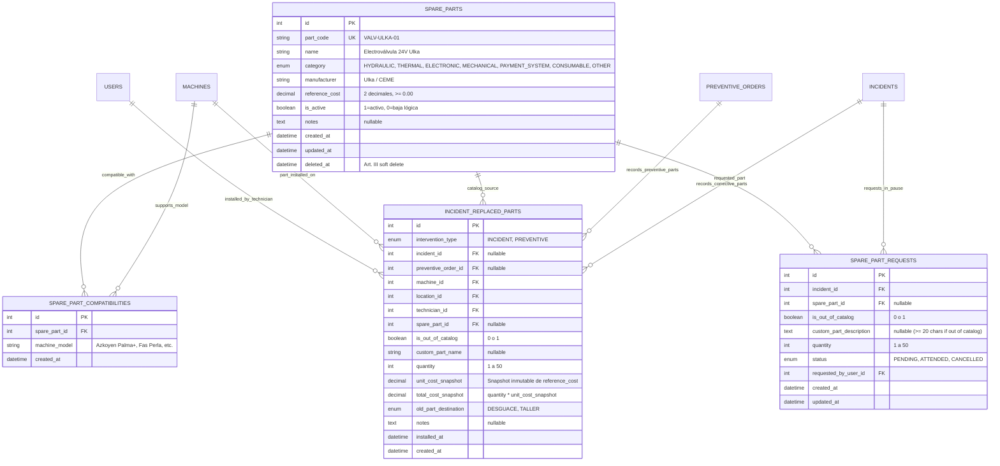
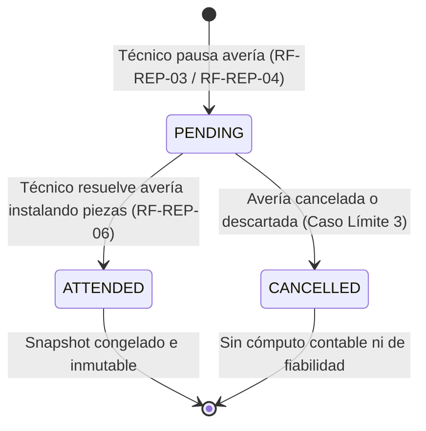

# ESPECIFICACIÓN TÉCNICA · CONTRATOS DE API Y MODELO DE DATOS
# CATÁLOGO DE REPUESTOS Y TRAZABILIDAD DE PIEZAS EN INTERVENCIÓN (MÓDULO M2)

**Proyecto:** Gestor de Incidencias de Vending (*VendGuard*)  
**Módulo:** `06-spare-parts` (Opción B: Control Operativo y Taller)  
**Documento:** `specs/technical/spare_parts_contracts.md`  
**Referencia Funcional:** [`specs/functional/spare_parts_spec.md`](../functional/spare_parts_spec.md) (RF-REP-01 a RF-REP-10)  
**Protocolo:** HTTP/1.1 · JSON (`application/json; charset=utf-8`) y exportaciones planas CSV (`text/csv; charset=utf-8`)  
**Metodología:** SDD (Specification-Driven Development) · Contratos API-First  
**Conformidad Constitucional:**  
* **Artículo I:** La Especificación es la Única Fuente de Verdad. Ninguna implementación sin contrato previo; cero código simulado (sin mocks en flujos reales).
* **Artículo II:** Principio de Precaución y Prioridad Sanitaria. La sustitución de piezas térmicas o de frío en máquinas en cuarentena preventiva no levanta automáticamente la cuarentena sin certificado sanitario conforme (RF-REP-07).
* **Artículo III:** Inviolabilidad de Datos e Histórico. Prohibición terminante de borrado físico (`DELETE FROM`). Bajas puramente lógicas (`is_active = 0`, `deleted_at`). Snapshots inmutables de coste en el instante de la resolución (`unit_cost_snapshot`).
* **Artículo IV:** Minimalismo Tecnológico y Cero Bloatware. Backend en PHP 8.2+ POO puro tipado con PDO; Frontend en Vue.js 3 Composition API nativo sin librerías externas accesorias.
* **Artículo V:** Integridad Inviolable de Reglas de Negocio.
  * Cierre justificado: La sustitución física de piezas complementa obligatoriamente el diagnóstico y acción técnica de $\ge 20$ caracteres (Art. V.1).
  * Privacidad y Segregación de Datos (Art. V.4): Ocultación total de repuestos, códigos, destinos y costes económicos para el rol de Responsable de Sede.
  * Ventana de Reapertura (Art. V.6): Congelación inmutable del consumo de piezas del primer cierre en reaperturas dentro de las 48h; las nuevas piezas se computan como registros aditivos.
* **Artículo VI:** Delimitación Sagrada del Alcance. Clasificación cerrada de destino (`DESGUACE` o `TALLER`) sin submódulos complejos de gestión de almacén, órdenes de compra automáticas ni albaranes de custodia física.

---

## 1. Principios Arquitectónicos y Modelo de Snapshot

### 1.1 El Patrón Snapshot Inmutable de Coste
Para cumplir con el **Artículo III (Inviolabilidad de Datos)** y los principios contables de auditoría técnica:
* En el catálogo maestro (`spare_parts`), cada pieza posee un `reference_cost` (precio orientativo actual en euros con 2 decimales).
* Cuando una avería correctiva o una orden preventiva se resuelve o completa, el sistema **captura y congela** el coste unitario en la tabla `incident_replaced_parts` en la columna `unit_cost_snapshot`.
* Si en el futuro el Coordinador actualiza el `reference_cost` de una pieza en el catálogo maestro (por ejemplo, por inflación de 25.00 € a 32.50 €), las intervenciones pasadas **no sufren recálculo**, garantizando la inmutabilidad histórica del balance de gastos.

### 1.2 Coexistencia con Correctivo (Incidencias) y Preventivo (Órdenes M05)
* **Correctivo:** 
  * Pausa técnica (`PENDING_PARTS`): Se sustituye el texto libre por la tabla `spare_part_requests`, exigiendo selección de piezas del catálogo compatibles o justificación $\ge 20$ chars de pieza fuera de catálogo.
  * Resolución (`RESOLVED`): Se declara obligatoriamente si hubo sustitución (`replaced_parts_declared: bool`). Si es afirmativo, se insertan los consumos en `incident_replaced_parts`.
* **Preventivo:** 
  * En preventivos no existe estado de pausa por repuesto (las inspecciones rutinarias no se pausan por repuestos).
  * Al completar (`completeInspection`), el técnico puede declarar consumos de piezas en la misma tabla `incident_replaced_parts` asociando `preventive_order_id`.

### 1.3 Segregación Estricta de Datos (Constitución Art. V.4)
Los endpoints expuestos al rol `LOCATION_MANAGER` (o accesibles desde el portal de sede) omiten en su proyección SQL y serialización JSON cualquier referencia a:
* Piezas solicitadas (`pending_parts_reason`, `spare_part_requests`).
* Piezas sustituidas (`incident_replaced_parts`).
* Costes monetarios unitarios o totales.

---

## 2. Diagrama Entidad-Relación y Ciclo de Estados

### 2.1 Modelo Entidad-Relación (Mermaid ERD)



### 2.2 Ciclo de Vida de Solicitud de Repuesto (State Diagram)



---

## 3. Modelo de Datos Relacional (DDL MariaDB 10.4+ / MySQL 8.0+)

### 3.1 Migración DDL: `006_spare_parts_catalog_and_traceability.sql`

```sql
-- =============================================================================
-- VendGuard Módulo M2: Catálogo de Repuestos y Trazabilidad de Piezas
-- Migración DDL: 006_spare_parts_catalog_and_traceability.sql
-- =============================================================================

-- 1. Tabla de Catálogo Maestro de Repuestos (Art. III: soft delete con deleted_at)
CREATE TABLE IF NOT EXISTS `spare_parts` (
    `id` INT UNSIGNED AUTO_INCREMENT PRIMARY KEY,
    `part_code` VARCHAR(50) NOT NULL,
    `name` VARCHAR(150) NOT NULL,
    `category` ENUM(
        'HYDRAULIC',
        'THERMAL',
        'ELECTRONIC',
        'MECHANICAL',
        'PAYMENT_SYSTEM',
        'CONSUMABLE',
        'OTHER'
    ) NOT NULL DEFAULT 'OTHER',
    `manufacturer` VARCHAR(100) NOT NULL,
    `reference_cost` DECIMAL(10,2) NOT NULL DEFAULT 0.00,
    `is_active` TINYINT(1) NOT NULL DEFAULT 1,
    `notes` TEXT NULL DEFAULT NULL,
    `created_at` DATETIME NOT NULL DEFAULT CURRENT_TIMESTAMP,
    `updated_at` DATETIME NOT NULL DEFAULT CURRENT_TIMESTAMP ON UPDATE CURRENT_TIMESTAMP,
    `deleted_at` DATETIME NULL DEFAULT NULL,
    UNIQUE KEY `uq_spare_parts_part_code` (`part_code`),
    INDEX `idx_spare_parts_active_cat` (`is_active`, `category`),
    INDEX `idx_spare_parts_name` (`name`)
) ENGINE=InnoDB DEFAULT CHARSET=utf8mb4 COLLATE=utf8mb4_unicode_ci;

-- 2. Tabla de Compatibilidad Repuesto - Modelo de Máquina (RF-REP-01)
CREATE TABLE IF NOT EXISTS `spare_part_compatibilities` (
    `id` INT UNSIGNED AUTO_INCREMENT PRIMARY KEY,
    `spare_part_id` INT UNSIGNED NOT NULL,
    `machine_model` VARCHAR(100) NOT NULL,
    `created_at` DATETIME NOT NULL DEFAULT CURRENT_TIMESTAMP,
    UNIQUE KEY `uq_part_model` (`spare_part_id`, `machine_model`),
    INDEX `idx_part_compat_model` (`machine_model`),
    CONSTRAINT `fk_compat_spare_part` FOREIGN KEY (`spare_part_id`)
        REFERENCES `spare_parts` (`id`) ON DELETE CASCADE ON UPDATE CASCADE
) ENGINE=InnoDB DEFAULT CHARSET=utf8mb4 COLLATE=utf8mb4_unicode_ci;

-- 3. Tabla de Solicitudes de Repuesto en Pausa Técnica (RF-REP-03, RF-REP-04)
CREATE TABLE IF NOT EXISTS `spare_part_requests` (
    `id` INT UNSIGNED AUTO_INCREMENT PRIMARY KEY,
    `incident_id` INT UNSIGNED NOT NULL,
    `spare_part_id` INT UNSIGNED NULL DEFAULT NULL,
    `is_out_of_catalog` TINYINT(1) NOT NULL DEFAULT 0,
    `custom_part_description` TEXT NULL DEFAULT NULL,
    `quantity` INT UNSIGNED NOT NULL DEFAULT 1,
    `status` ENUM('PENDING', 'ATTENDED', 'CANCELLED') NOT NULL DEFAULT 'PENDING',
    `requested_by_user_id` INT UNSIGNED NOT NULL,
    `created_at` DATETIME NOT NULL DEFAULT CURRENT_TIMESTAMP,
    `updated_at` DATETIME NOT NULL DEFAULT CURRENT_TIMESTAMP ON UPDATE CURRENT_TIMESTAMP,
    INDEX `idx_requests_incident` (`incident_id`),
    INDEX `idx_requests_status` (`status`),
    INDEX `idx_requests_part` (`spare_part_id`),
    CONSTRAINT `fk_requests_incident` FOREIGN KEY (`incident_id`)
        REFERENCES `incidents` (`id`) ON DELETE RESTRICT ON UPDATE CASCADE,
    CONSTRAINT `fk_requests_spare_part` FOREIGN KEY (`spare_part_id`)
        REFERENCES `spare_parts` (`id`) ON DELETE RESTRICT ON UPDATE CASCADE,
    CONSTRAINT `fk_requests_user` FOREIGN KEY (`requested_by_user_id`)
        REFERENCES `users` (`id`) ON DELETE RESTRICT ON UPDATE CASCADE
) ENGINE=InnoDB DEFAULT CHARSET=utf8mb4 COLLATE=utf8mb4_unicode_ci;

-- 4. Tabla de Consumo y Trazabilidad de Piezas Sustituidas (RF-REP-06, RF-REP-07)
CREATE TABLE IF NOT EXISTS `incident_replaced_parts` (
    `id` INT UNSIGNED AUTO_INCREMENT PRIMARY KEY,
    `intervention_type` ENUM('INCIDENT', 'PREVENTIVE') NOT NULL,
    `incident_id` INT UNSIGNED NULL DEFAULT NULL,
    `preventive_order_id` INT UNSIGNED NULL DEFAULT NULL,
    `machine_id` INT UNSIGNED NOT NULL,
    `location_id` INT UNSIGNED NOT NULL,
    `technician_id` INT UNSIGNED NOT NULL,
    `spare_part_id` INT UNSIGNED NULL DEFAULT NULL,
    `is_out_of_catalog` TINYINT(1) NOT NULL DEFAULT 0,
    `custom_part_name` VARCHAR(255) NULL DEFAULT NULL,
    `quantity` INT UNSIGNED NOT NULL DEFAULT 1,
    `unit_cost_snapshot` DECIMAL(10,2) NOT NULL DEFAULT 0.00,
    `total_cost_snapshot` DECIMAL(10,2) GENERATED ALWAYS AS (`quantity` * `unit_cost_snapshot`) STORED,
    `old_part_destination` ENUM('DESGUACE', 'TALLER') NOT NULL,
    `notes` TEXT NULL DEFAULT NULL,
    `installed_at` DATETIME NOT NULL DEFAULT CURRENT_TIMESTAMP,
    `created_at` DATETIME NOT NULL DEFAULT CURRENT_TIMESTAMP,
    INDEX `idx_replaced_machine_part_date` (`machine_id`, `spare_part_id`, `installed_at`),
    INDEX `idx_replaced_incident` (`incident_id`),
    INDEX `idx_replaced_preventive` (`preventive_order_id`),
    INDEX `idx_replaced_location_date` (`location_id`, `installed_at`),
    INDEX `idx_replaced_technician` (`technician_id`),
    CONSTRAINT `fk_replaced_incident` FOREIGN KEY (`incident_id`)
        REFERENCES `incidents` (`id`) ON DELETE RESTRICT ON UPDATE CASCADE,
    CONSTRAINT `fk_replaced_preventive` FOREIGN KEY (`preventive_order_id`)
        REFERENCES `preventive_orders` (`id`) ON DELETE RESTRICT ON UPDATE CASCADE,
    CONSTRAINT `fk_replaced_machine` FOREIGN KEY (`machine_id`)
        REFERENCES `machines` (`id`) ON DELETE RESTRICT ON UPDATE CASCADE,
    CONSTRAINT `fk_replaced_location` FOREIGN KEY (`location_id`)
        REFERENCES `locations` (`id`) ON DELETE RESTRICT ON UPDATE CASCADE,
    CONSTRAINT `fk_replaced_technician` FOREIGN KEY (`technician_id`)
        REFERENCES `users` (`id`) ON DELETE RESTRICT ON UPDATE CASCADE,
    CONSTRAINT `fk_replaced_spare_part` FOREIGN KEY (`spare_part_id`)
        REFERENCES `spare_parts` (`id`) ON DELETE RESTRICT ON UPDATE CASCADE
) ENGINE=InnoDB DEFAULT CHARSET=utf8mb4 COLLATE=utf8mb4_unicode_ci;
```

---

## 4. Tipos de Dominio, Enums y DTOs (PHP 8.2+)

### 4.1 Enums de Dominio

```php
declare(strict_types=1);

namespace VendGuard\Core\Domain\Model;

enum SparePartCategory: string
{
    case HYDRAULIC      = 'HYDRAULIC';      // Bombas, electroválvulas, calderas, racores
    case THERMAL        = 'THERMAL';        // Sondas NTC, termostatos, compresores, ventiladores
    case ELECTRONIC     = 'ELECTRONIC';     // Placas CPU, fuentes de alimentación, displays
    case MECHANICAL     = 'MECHANICAL';     // Grupos de café, motores extractores, engranajes
    case PAYMENT_SYSTEM = 'PAYMENT_SYSTEM'; // Monederos, billeteros, lectores cashless
    case CONSUMABLE     = 'CONSUMABLE';     // Filtros, tubos teflón, juntas tóricas, descalcificadores
    case OTHER          = 'OTHER';          // Muelles, cerrajería, carcasas
}

enum OldPartDestination: string
{
    case DESGUACE = 'DESGUACE'; // Desecho definitivo para reciclaje
    case TALLER   = 'TALLER';   // Recuperación para reacondicionamiento en taller técnico
}

enum SparePartRequestStatus: string
{
    case PENDING   = 'PENDING';
    case ATTENDED  = 'ATTENDED';
    case CANCELLED = 'CANCELLED';
}

enum InterventionType: string
{
    case INCIDENT   = 'INCIDENT';
    case PREVENTIVE = 'PREVENTIVE';
}
```

### 4.2 DTOs de Entrada y Salida

```php
declare(strict_types=1);

namespace VendGuard\Core\Application\DTO;

/**
 * Representa una línea de repuesto instalada al resolver o completar intervención.
 */
final class ReplacedPartItemDTO
{
    public function __construct(
        public readonly ?int $sparePartId,
        public readonly bool $isOutOfCatalog,
        public readonly ?string $customPartName,
        public readonly int $quantity,
        public readonly string $oldPartDestination, // 'DESGUACE' | 'TALLER'
        public readonly ?string $notes = null
    ) {
        if ($quantity < 1 || $quantity > 50) {
            throw new \InvalidArgumentException('La cantidad debe estar entre 1 y 50 unidades.');
        }
        if ($isOutOfCatalog && ($customPartName === null || mb_strlen(trim($customPartName)) < 3)) {
            throw new \InvalidArgumentException('El nombre de la pieza fuera de catálogo es obligatorio (mínimo 3 caracteres).');
        }
        if (!$isOutOfCatalog && ($sparePartId === null || $sparePartId <= 0)) {
            throw new \InvalidArgumentException('Debe especificar un ID de repuesto válido del catálogo.');
        }
        if (!in_array($oldPartDestination, ['DESGUACE', 'TALLER'], true)) {
            throw new \InvalidArgumentException('El destino debe ser DESGUACE o TALLER.');
        }
    }
}
```

---

## 5. Especificación de Endpoints de API (Contratos HTTP)

### 5.1 Catálogo Maestro de Repuestos (Coordinación)

#### `GET /api/coordinator/spare-parts`
Obtiene la lista paginada y filtrada del catálogo de repuestos.
* **Seguridad:** Requiere JWT o sesión de `COORDINATOR`.
* **Query Parameters:**
  * `search` (string, opcional): Búsqueda por código o nombre de pieza.
  * `category` (string, opcional): Uno de `SparePartCategory`.
  * `machine_model` (string, opcional): Filtrar piezas compatibles con este modelo de máquina.
  * `is_active` (int, opcional): `1` para activos, `0` para inactivos (por defecto: todos para el coordinador).

* **Respuesta Exitosa (200 OK):**
```json
[
  {
    "id": 1,
    "part_code": "VALV-ULKA-01",
    "name": "Electroválvula 24V Ulka",
    "category": "HYDRAULIC",
    "category_label": "Hidráulica",
    "manufacturer": "Ulka",
    "reference_cost": 28.50,
    "is_active": true,
    "compatible_models": ["Azkoyen Palma B", "Azkoyen Palma+", "Fas Perla"],
    "total_installed_units": 14,
    "created_at": "2026-09-01 10:00:00"
  },
  {
    "id": 2,
    "part_code": "SOND-NTC-02",
    "name": "Sonda Térmica NTC Frío 10k",
    "category": "THERMAL",
    "category_label": "Térmico y Refrigeración",
    "manufacturer": "Carel",
    "reference_cost": 15.20,
    "is_active": true,
    "compatible_models": ["Fas Fast 900", "Sanden Vendo G-Drink"],
    "total_installed_units": 6,
    "created_at": "2026-09-01 10:00:00"
  }
]
```

---

#### `POST /api/coordinator/spare-parts`
Crea una nueva pieza en el catálogo maestro y asigna sus modelos de máquina compatibles.
* **Seguridad:** `COORDINATOR`.
* **Cuerpo de Solicitud (JSON):**
```json
{
  "part_code": "PRES-VALV-03",
  "name": "Válvula de Seguridad de Presión 12 Bar",
  "category": "HYDRAULIC",
  "manufacturer": "CEME",
  "reference_cost": 19.80,
  "notes": "Válvula para grupos de presión de café espresso",
  "compatible_models": ["Azkoyen Palma B", "Azkoyen Palma+"]
}
```

* **Validaciones:**
  * `part_code`: String obligatorio, 3 a 50 caracteres alfanuméricos/guiones, único en base de datos.
  * `name`: String obligatorio, 3 a 150 caracteres.
  * `category`: Valor válido del enum `SparePartCategory`.
  * `manufacturer`: String obligatorio, 2 a 100 caracteres.
  * `reference_cost`: Decimal $\ge 0.00$ con un máximo de 2 decimales.
  * `compatible_models`: Array de strings no vacío; cada modelo debe tener al menos 2 caracteres.

* **Respuestas:**
  * `201 Created`: Devuelve el objeto del repuesto creado con su ID y modelos asociados.
  * `422 Unprocessable Entity`: Error de validación o formato.
  * `409 Conflict`: `SPARE_PART_CODE_EXISTS` ("Ya existe un repuesto registrado con el código PRES-VALV-03").

---

#### `PUT /api/coordinator/spare-parts/{id}`
Actualiza los datos maestros, coste de referencia y modelos compatibles de una pieza.
* **Seguridad:** `COORDINATOR`.
* **Cuerpo de Solicitud (JSON):**
```json
{
  "name": "Válvula de Seguridad de Presión 12 Bar Reforzada",
  "category": "HYDRAULIC",
  "manufacturer": "CEME",
  "reference_cost": 22.50,
  "notes": "Actualización de fabricante y referencia reforzada",
  "compatible_models": ["Azkoyen Palma B", "Azkoyen Palma+", "Bianchi BVM 952"]
}
```
* **Respuestas:**
  * `200 OK`: Repuesto actualizado. Los registros de averías pasadas mantienen su `unit_cost_snapshot` intacto.
  * `404 Not Found`: Repuesto no encontrado.

---

#### `PATCH /api/coordinator/spare-parts/{id}/status`
Realiza la baja lógica (`is_active = 0`) o reactivación de una pieza sin borrado físico (Art. III).
* **Seguridad:** `COORDINATOR`.
* **Cuerpo de Solicitud (JSON):**
```json
{
  "is_active": false
}
```
* **Respuesta Exitosa (200 OK):**
```json
{
  "id": 3,
  "part_code": "PRES-VALV-03",
  "is_active": false,
  "message": "El repuesto ha sido desactivado del catálogo con éxito."
}
```

---

#### `GET /api/coordinator/spare-parts/models`
Devuelve la lista única de modelos de máquinas actualmente existentes en el parque (columna `machines.model`) para facilitar el autocompletado en el formulario de piezas compatibles.
* **Seguridad:** `COORDINATOR`.
* **Respuesta Exitosa (200 OK):**
```json
[
  "Azkoyen Palma B",
  "Azkoyen Palma+",
  "Bianchi BVM 952",
  "Fas Fast 900",
  "Fas Perla",
  "Necta Krea Touch",
  "Sanden Vendo G-Drink"
]
```

---

### 5.2 Solicitudes y Catálogo en Movilidad (Técnico de Ruta)

#### `GET /api/technician/spare-parts/catalog`
Devuelve las piezas activas del catálogo compatibles con una máquina dada, preparadas para carga rápida móvil ($< 250\text{ ms}$, RNF-REP-02).
* **Seguridad:** `TECHNICIAN`.
* **Query Parameters:**
  * `machine_id` (int, obligatorio): ID de la máquina intervenida.
  * `incident_id` (int, opcional): Si se proporciona y la incidencia está en `PENDING_PARTS`, se incluye en la respuesta la pieza que fue solicitada originalmente, aunque dicha pieza haya sido desactivada posteriormente (Caso Límite 4).

* **Respuesta Exitosa (200 OK):**
```json
{
  "machine": {
    "id": 14,
    "code": "MAQ-MAD-001",
    "model": "Azkoyen Palma+"
  },
  "compatible_parts": [
    {
      "id": 1,
      "part_code": "VALV-ULKA-01",
      "name": "Electroválvula 24V Ulka",
      "category": "HYDRAULIC",
      "manufacturer": "Ulka",
      "reference_cost": 28.50,
      "is_active": true
    },
    {
      "id": 5,
      "part_code": "MOT-ESP-05",
      "name": "Motor Extractor de Espiral 24V",
      "category": "MECHANICAL",
      "manufacturer": "Azkoyen",
      "reference_cost": 34.00,
      "is_active": true
    }
  ]
}
```

---

#### `PATCH /api/technician/incidents/{id}/pause`
Pausa temporalmente una incidencia por repuestos pendientes (RF-REP-03 / RF-REP-04). Reemplaza el texto libre no normalizado por solicitud estructurada.
* **Seguridad:** `TECHNICIAN` asignado a la incidencia.
* **Cuerpo de Solicitud (JSON):**
```json
{
  "requested_parts": [
    {
      "spare_part_id": 1,
      "quantity": 1
    }
  ],
  "is_out_of_catalog": false,
  "custom_part_description": null
}
```
*Si la pieza no figura en el catálogo maestro:*
```json
{
  "requested_parts": [],
  "is_out_of_catalog": true,
  "custom_part_description": "Sensor de caída infrarrojo especial de tercera generación para canal 4"
}
```

* **Validaciones:**
  * Si `is_out_of_catalog === false`: `requested_parts` debe contener al menos 1 elemento. Cada elemento debe tener `spare_part_id` entero positivo compatible con el modelo de la máquina, y `quantity` entero entre 1 y 50.
  * Si `is_out_of_catalog === true`: `custom_part_description` debe tener al menos 20 caracteres sin contar espacios sobrantes.
  * La incidencia debe encontrarse en estado `IN_PROGRESS`.

* **Respuestas:**
  * `200 OK`: Transición a `PENDING_PARTS` ejecutada.
  * `422 Unprocessable Entity`: 
    * `MISSING_PARTS_REQUEST`: "Debe seleccionar al menos un repuesto compatible o activar la opción de pieza fuera de catálogo."
    * `INVALID_OUT_OF_CATALOG_JUSTIFICATION`: "La justificación de pieza fuera de catálogo debe tener al menos 20 caracteres."
    * `INCOMPATIBLE_SPARE_PART`: "El repuesto con ID 8 no es compatible con el modelo Azkoyen Palma+ de esta máquina."

---

#### `POST /api/technician/incidents/{id}/resolve`
Resuelve la incidencia correctiva incorporando el registro obligatorio de sustitución de componentes y congelación de coste (RF-REP-05, RF-REP-06).
* **Seguridad:** `TECHNICIAN` asignado.
* **Cuerpo de Solicitud (JSON):**
```json
{
  "resolution_diagnosis": "Rotura de membrana interna en electroválvula de entrada provocando fugas de agua",
  "resolution_action": "Sustitución completa de electroválvula por repuesto original y prueba de estanqueidad a 2.5 bar",
  "replaced_parts_declared": true,
  "replaced_parts": [
    {
      "spare_part_id": 1,
      "is_out_of_catalog": false,
      "custom_part_name": null,
      "quantity": 1,
      "old_part_destination": "TALLER",
      "notes": "Bobina eléctrica intacta, enviada a taller para posible reacondicionamiento"
    }
  ]
}
```
*Si no se sustituyeron componentes:*
```json
{
  "resolution_diagnosis": "Obstrucción por calcificación en racor de salida sin rotura mecánica",
  "resolution_action": "Descalcificación manual in situ, limpieza del conducto y purga del circuito hidráulico",
  "replaced_parts_declared": false,
  "replaced_parts": []
}
```

* **Comportamiento en Backend:**
  1. Valida diagnóstico y acción $\ge 20$ caracteres (Constitución Art. V.1).
  2. Si `replaced_parts_declared === true`, valida que `replaced_parts` tenga $\ge 1$ elementos.
  3. Para cada repuesto catalogado:
     - Obtiene el `reference_cost` actual de `spare_parts`.
     - Inserta en `incident_replaced_parts` fijando `unit_cost_snapshot = reference_cost`.
     - Si la pieza es fuera de catálogo, fija `unit_cost_snapshot = 0.00`.
  4. Actualiza solicitudes pendientes en `spare_part_requests` a `status = 'ATTENDED'`.
  5. Transiciona incidencia a `RESOLVED` y registra en `incident_history` y `audit_log`.

* **Respuesta Exitosa (200 OK):**
```json
{
  "id": 105,
  "ticket_code": "TICK-2026-00105",
  "status": "RESOLVED",
  "resolved_at": "2026-09-28 14:30:00",
  "replaced_parts_count": 1,
  "total_parts_cost": 28.50
}
```

---

#### `POST /api/technician/preventive/orders/{id}/complete`
Extensión del endpoint de completar inspección preventiva del Módulo 05 para registrar piezas sustituidas sistemáticamente (RF-REP-07).
* **Seguridad:** `TECHNICIAN` asignado.
* **Cuerpo de Solicitud Adicional:**
Acepta el cuerpo existente de checklist normativo e incorpora los campos:
```json
{
  "temperature_measured": 3.4,
  "items": [ ... ],
  "notes": "Revisión higiénica completada satisfactoriamente",
  "replaced_parts_declared": true,
  "replaced_parts": [
    {
      "spare_part_id": 9,
      "is_out_of_catalog": false,
      "custom_part_name": null,
      "quantity": 2,
      "old_part_destination": "DESGUACE",
      "notes": "Cambio periódico preventivo de juntas de teflón del grupo de infusión"
    }
  ]
}
```

---

### 5.3 Cuadro Analítico y Alertas de Fiabilidad (Coordinación)

#### `GET /api/coordinator/spare-parts/analytics`
Genera las métricas consolidadas de consumo, costes por sede y modelo, y detección de fallos recurrentes (RF-REP-08).
* **Seguridad:** `COORDINATOR`.
* **Query Parameters:**
  * `period_days` (int, opcional, por defecto `90`): Ventana temporal en días.
  * `machine_id` (int, opcional): Filtrar por una máquina específica.
  * `location_id` (int, opcional): Filtrar por una sede específica.

* **Respuesta Exitosa (200 OK):**
```json
{
  "period_days": 90,
  "total_parts_replaced": 48,
  "total_parts_cost": 1284.50,
  "top_replaced_parts": [
    {
      "part_code": "VALV-ULKA-01",
      "name": "Electroválvula 24V Ulka",
      "category": "HYDRAULIC",
      "units_installed": 18,
      "accumulated_cost": 513.00,
      "destinations": {
        "DESGUACE": 12,
        "TALLER": 6
      }
    },
    {
      "part_code": "SOND-NTC-02",
      "name": "Sonda Térmica NTC Frío 10k",
      "category": "THERMAL",
      "units_installed": 10,
      "accumulated_cost": 152.00,
      "destinations": {
        "DESGUACE": 8,
        "TALLER": 2
      }
    }
  ],
  "costs_by_machine_model": [
    {
      "model": "Azkoyen Palma+",
      "machines_count": 8,
      "units_replaced": 24,
      "total_cost": 680.00
    },
    {
      "model": "Fas Fast 900",
      "machines_count": 5,
      "units_replaced": 14,
      "total_cost": 394.50
    }
  ],
  "costs_by_location": [
    {
      "location_id": 3,
      "location_name": "Hospital Universitario La Paz",
      "units_replaced": 19,
      "total_cost": 542.00
    }
  ],
  "chronic_failure_alerts": [
    {
      "machine_id": 7,
      "machine_code": "MAQ-HOSP-002",
      "machine_model": "Fas Fast 900",
      "location_name": "Hospital Universitario La Paz",
      "part_code": "SOND-NTC-02",
      "part_name": "Sonda Térmica NTC Frío 10k",
      "replacements_in_period": 4,
      "threshold": 3,
      "first_replacement_at": "2026-07-10 11:20:00",
      "last_replacement_at": "2026-09-24 09:15:00",
      "warning_message": "Componente con Fallo Recurrente / Prematuro (4 sustituciones en 76 días)"
    }
  ]
}
```

---

#### `GET /api/coordinator/spare-parts/export`
Genera la descarga inmediata de consumos de piezas en formato plano CSV (RF-REP-09).
* **Seguridad:** `COORDINATOR`.
* **Encabezados HTTP de Respuesta:**
  * `Content-Type: text/csv; charset=utf-8`
  * `Content-Disposition: attachment; filename="repuestos_intervenciones_YYYYMMDD_HHMM.csv"`
* **Estructura de Cabeceras CSV:**
```csv
Fecha,Codigo_Intervencion,Tipo_Intervencion,Codigo_Maquina,Modelo_Maquina,Sede,Codigo_Pieza,Nombre_Pieza,Categoria,Unidades,Coste_Unitario_EUR,Coste_Total_EUR,Destino_Retirado,Codigo_Tecnico,Notas
2026-09-28 14:30:00,TICK-2026-00105,INCIDENT,MAQ-MAD-001,Azkoyen Palma+,Oficinas Centrales Repsol,VALV-ULKA-01,Electroválvula 24V Ulka,HYDRAULIC,1,28.50,28.50,TALLER,OP-02,"Bobina eléctrica intacta"
```

---

#### `GET /api/coordinator/spare-parts/requests/pending-review`
Obtiene las averías que han requerido piezas fuera de catálogo o que tienen solicitudes pendientes de revisión.
* **Seguridad:** `COORDINATOR`.
* **Respuesta Exitosa (200 OK):**
```json
[
  {
    "incident_id": 108,
    "ticket_code": "TICK-2026-00108",
    "machine_code": "MAQ-UNIV-004",
    "machine_model": "Sanden Vendo G-Drink",
    "location_name": "Universidad Politécnica - Edificio A",
    "technician_name": "Carlos Rodríguez",
    "custom_part_description": "Sensor de caída infrarrojo especial de tercera generación para canal 4",
    "requested_at": "2026-09-28 11:15:00",
    "incident_status": "PENDING_PARTS"
  }
]
```

---

## 6. Catálogo de Errores Técnicos

| Código de Error | HTTP Status | Mensaje en Español | Causa Disparadora |
| :--- | :---: | :--- | :--- |
| `SPARE_PART_NOT_FOUND` | 404 | No se encontró el repuesto solicitado en el catálogo. | ID de repuesto inexistente o no disponible. |
| `SPARE_PART_CODE_EXISTS` | 409 | Ya existe un repuesto en el catálogo con el código indicado. | Intento de alta con código `part_code` duplicado. |
| `INVALID_SPARE_PART_PAYLOAD` | 422 | Los datos proporcionados para el repuesto son incompletos o erróneos. | Fallo de validación en campos obligatorios o formato numérico. |
| `MISSING_PARTS_REQUEST` | 422 | Debe seleccionar al menos un repuesto compatible o activar pieza fuera de catálogo. | Intento de pausa a `PENDING_PARTS` sin piezas seleccionadas. |
| `INVALID_OUT_OF_CATALOG_JUSTIFICATION` | 422 | La justificación de pieza fuera de catálogo debe tener al menos 20 caracteres. | Descripción técnica en solicitud excepcional inferior a 20 chars. |
| `INCOMPATIBLE_SPARE_PART` | 422 | El repuesto seleccionado no es compatible con el modelo de esta máquina. | Pieza seleccionada no figura en `spare_part_compatibilities` para el modelo. |
| `INVALID_PART_QUANTITY` | 422 | La cantidad de unidades debe ser un número entero entre 1 y 50. | Cantidad negativa, nula o superior al límite anti-errata. |
| `INVALID_PART_DESTINATION` | 422 | El destino del componente retirado debe ser DESGUACE o TALLER. | Valor de `old_part_destination` distinto al enum establecido. |
| `PARTS_RECORD_REQUIRED` | 422 | Debe indicar si la intervención conllevó sustitución física de componentes. | Falta el campo obligatorio `replaced_parts_declared` en resolución. |
| `EMPTY_REPLACED_PARTS_LIST` | 422 | Ha indicado que se sustituyeron componentes pero no ha registrado ninguna pieza. | `replaced_parts_declared` es true pero la lista de piezas está vacía. |
| `SITE_PARTS_DATA_FORBIDDEN` | 403 | El rol de Responsable de Sede no tiene acceso a datos internos de repuestos o costes. | Intento de acceso a piezas o costes por usuarios de sede (Art. V.4). |

---

## 7. Consultas SQL Optimizadas e Invariantes de Negocio

### 7.1 Detección de Averías Recurrentes por Pieza y Máquina (RF-REP-08)
La consulta agrupa las sustituciones del mismo `spare_part_id` en una misma `machine_id` en los últimos 90 días naturales, filtrando aquellas con conteo $> 3$:

```sql
SELECT 
    irp.machine_id,
    m.code AS machine_code,
    m.model AS machine_model,
    l.name AS location_name,
    irp.spare_part_id,
    sp.part_code,
    sp.name AS part_name,
    COUNT(irp.id) AS replacements_in_period,
    MIN(irp.installed_at) AS first_replacement_at,
    MAX(irp.installed_at) AS last_replacement_at
FROM `incident_replaced_parts` irp
INNER JOIN `machines` m ON irp.machine_id = m.id
INNER JOIN `locations` l ON irp.location_id = l.id
INNER JOIN `spare_parts` sp ON irp.spare_part_id = sp.id
WHERE irp.installed_at >= DATE_SUB(NOW(), INTERVAL 90 DAY)
  AND irp.spare_part_id IS NOT NULL
GROUP BY irp.machine_id, irp.spare_part_id
HAVING COUNT(irp.id) > 3
ORDER BY replacements_in_period DESC;
```

### 7.2 Invariante del Snapshot de Coste (RF-REP-06 / Art. III)
Al insertar en `incident_replaced_parts`, el valor de `unit_cost_snapshot` se obtiene mediante una subconsulta segura al coste vigente en `spare_parts`, independizando la fila de futuras actualizaciones del catálogo:

```sql
INSERT INTO `incident_replaced_parts` (
    `intervention_type`,
    `incident_id`,
    `machine_id`,
    `location_id`,
    `technician_id`,
    `spare_part_id`,
    `is_out_of_catalog`,
    `custom_part_name`,
    `quantity`,
    `unit_cost_snapshot`,
    `old_part_destination`,
    `notes`,
    `installed_at`
)
SELECT 
    :intervention_type,
    :incident_id,
    :machine_id,
    :location_id,
    :technician_id,
    sp.id,
    0,
    NULL,
    :quantity,
    sp.reference_cost, -- Snapshot inmutable congelado
    :old_part_destination,
    :notes,
    NOW()
FROM `spare_parts` sp
WHERE sp.id = :spare_part_id;
```

---

## 8. Verificación de Seguridad y Privacidad (Constitución Art. V.4)

Para garantizar el cumplimiento inviolable del **Artículo V.4**:
1. En `src/Presentation/Controller/LocationPortalController.php`, la respuesta de `getIncidentDetails` y `getMyIncidents` realiza una proyección estricta de columnas donde `pending_parts_reason`, tablas de piezas y costes no son seleccionadas ni enviadas en el payload JSON.
2. Cualquier intento de inyección o consumo de endpoints `/api/coordinator/spare-parts/*` o `/api/technician/spare-parts/*` por parte de un usuario con sesión de sede es rechazado en capa de middleware con `403 Forbidden` (`SITE_PARTS_DATA_FORBIDDEN`).
